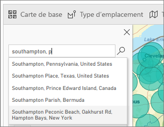
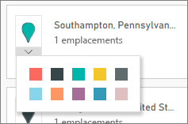
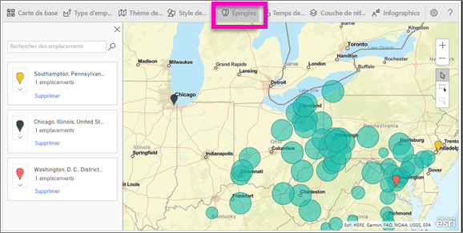
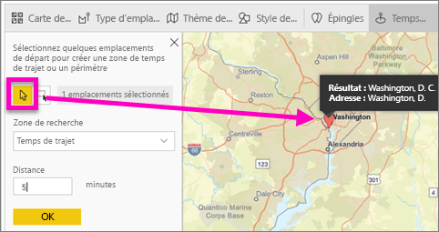
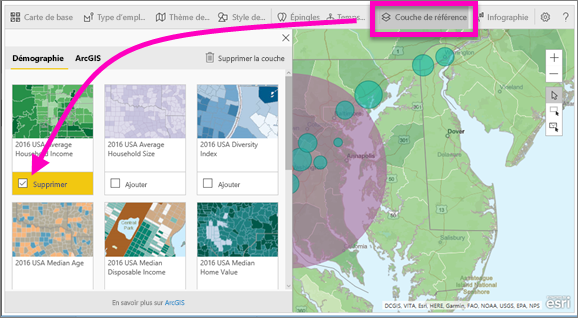
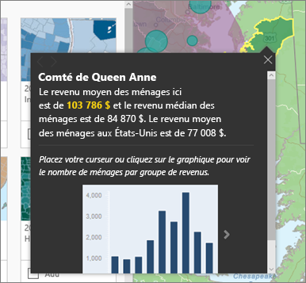

# Cartes ArcGIS dans Power BI Desktop par Esri

[!INCLUDE [power-bi-visuals-desktop-banner](../includes/power-bi-visuals-desktop-banner.md)]

Ce tutoriel est écrit du point de vue d’une personne qui crée une carte ArcGIS. Une fois que le créateur partage une carte ArcGIS avec un collègue, ce dernier peut afficher et exploiter la carte, mais pas enregistrer de modifications. Pour en savoir plus sur l’affichage d’une carte ArcGIS, consultez [Interaction avec des cartes ArcGIS](power-bi-visualizations-arcgis.md).

L’association des cartes ArcGIS et de Power BI porte la cartographie au-delà de la simple présentation de points sur une carte, pour accéder à un nouveau niveau. Faites votre choix parmi des cartes de base, des types d’emplacement, des thèmes, des styles de symboles et des couches de référence pour créer des visualisations de cartes informatives exceptionnelles. L’association des couches de données faisant autorité sur une carte avec l’analyse spatiale permet une compréhension approfondie des données dans votre visualisation.

 Vous ne pouvez pas créer de cartes ArcGIS sur un appareil mobile, mais ce dernier vous permet de les afficher et les utiliser. Consultez [Interaction avec des cartes ArcGIS](power-bi-visualizations-arcgis.md).

> [!TIP]
> SIG (ou GIS pour Geographic Information System en anglais) signifie système d’informations géographiques.

L’exemple ci-dessous utilise une zone de dessin gris foncé pour afficher les ventes régionales en tant que carte thermique par rapport à une couche démographique du revenu disponible médian 2016. Comme vous le découvrirez en poursuivant votre lecture, l’utilisation d’ArcGIS Maps offre une fonctionnalité de cartographie améliorée pratiquement sans limites, des données démographiques et des visualisations de carte encore plus attrayantes pour développer vos scénarios.

> [!TIP]
> Visitez la page d’[ESRI sur Power BI](https://www.esri.com/powerbi) pour découvrir de nombreux exemples et consulter des témoignages. Puis consultez la [page de prise en main d’ArcGIS Maps d’ESRI pour Power BI](https://doc.arcgis.com/en/maps-for-powerbi/get-started/about-maps-for-power-bi.htm).

## Consentement de l’utilisateur
ArcGIS Maps for Power BI est fourni par Esri (www.esri.com). L’utilisation d’ArcGIS Maps pour Power BI est soumise aux conditions générales et à la politique de confidentialité d’Esri. Les utilisateurs Power BI désireux d’utiliser les visuels d’ArcGIS Maps pour Power BI doivent valider la boîte de dialogue de consentement.

**Ressources**

[Conditions générales](https://go.microsoft.com/fwlink/?LinkID=826322)

[Politique de confidentialité](https://go.microsoft.com/fwlink/?LinkID=826323)

[Page du produit ArcGIS Maps pour Power BI](https://www.esri.com/powerbi)

 

### Activer la carte ArcGIS ***dans Power BI Desktop (app.powerbi.com)***
Ce tutoriel utilise le [fichier .PBIX de l’exemple Analyse de la vente au détail](http://download.microsoft.com/download/9/6/D/96DDC2FF-2568-491D-AAFA-AFDD6F763AE3/Retail%20Analysis%20Sample%20PBIX.pbix
). Pour activer **ArcGIS Maps pour Power BI** :

1. Dans la section supérieure gauche de la barre de menus, sélectionnez **Fichier** \> **Ouvrir**.
   
2. Recherchez le **fichier PBIX de l’exemple Analyse de la vente au détail** enregistré sur votre machine locale.

1. Ouvrez l’**Exemple Analyse de la vente au détail** dans la vue Rapport .

1. Sélectionner  pour ajouter une nouvelle page.

   
3. Sélectionnez l’icône ArcGIS Maps pour Power BI dans le volet Visualisations.
   
    
4. Power BI ajoute un modèle ArcGIS Maps vide au canevas de rapport.
   
   

 

## Créer un visuel de carte ArcGIS
Regardez Will créer différentes visualisations de carte ArcGIS, puis suivez les étapes ci-dessous pour essayer par vous-même avec le [fichier .PBIX de l’exemple Analyse de la vente au détail](../sample-datasets.md).
   > [!NOTE]
   > Cette vidéo utilise une version antérieure de Power BI Desktop.
   > 
   > 
<iframe width="560" height="315" src="https://www.youtube.com/embed/EKVvOZmxg9s" frameborder="0" allowfullscreen></iframe>

1. À partir du volet **Champs**, faites glisser un champ de données vers les compartiments **Emplacement** et/ou **Latitude** et **Longitude**. Dans cet exemple, utilisez **Store > City (Magasin > Ville)** .
   
   > [!NOTE]
   > ArcGIS Maps pour Power BI détecte automatiquement si les champs que vous sélectionnez s’affichent mieux en tant que forme ou point sur une carte. Vous pouvez ajuster la valeur par défaut dans les paramètres (voir ci-dessous).
   > 
   > 
   
    

3. À partir du volet **Champs**, faites glisser une mesure vers le compartiment **Taille** pour ajuster le mode d’affichage des données. Dans l’exemple, utilisez **Sales > Last Year Sales (Ventes > Ventes de l’année dernière)** .
   
    

## Paramètres et mise en forme des cartes ArcGIS
Pour accéder aux fonctionnalités de mise en forme d’**ArcGIS Maps pour Power BI**:

1. Accédez à des fonctionnalités supplémentaires en sélectionnant les points de suspension (...) en haut à droite de la visualisation, puis en choisissant **Modifier**.
   
   
   
   Les fonctionnalités disponibles s’affichent dans la partie supérieure de la visualisation. Chaque fonctionnalité, lorsque vous la sélectionnez, ouvre un volet Office qui fournit des options détaillées. 
   
   
   
   > [!NOTE]
   > Pour plus d’informations sur les paramètres et fonctionnalités, consultez la section **Documentation détaillée** ci-dessous.
   > 
   > 

 

## Documentation détaillée
**Esri** fournit une [documentation complète](https://go.microsoft.com/fwlink/?LinkID=828772) sur l’ensemble des fonctionnalités d’**ArcGIS Maps pour Power BI**.

## Vue d’ensemble des fonctionnalités
### Cartes de base
Quatre cartes de base sont fournies : Dark Gray Canvas, Light Gray Canvas, OpenStreetMap et Streets.  Streets est la carte de base standard d’ArcGIS.

Pour appliquer une carte de base, sélectionnez-la dans le volet Office.

### Type d’emplacement
ArgGIS Maps pour Power BI détecte automatiquement la meilleure façon d’afficher des données sur la carte. Il sélectionne Points ou Boundaries (Limites). Les options de type d’emplacement vous permettent d’ajuster finement ces sélections.

L’option **Boundaries** (Limites) fonctionne uniquement si vos données contiennent des valeurs géographiques standard. Esri détermine automatiquement la forme à afficher sur la carte. Les valeurs géographiques standard incluent les pays, les provinces, les codes postaux, etc. Toutefois, comme pour le géocodage, il se peut que Power BI ne détecte pas le champ qui doit constituer une limite par défaut, ou qu’il n’y ait pas de limite pour vos données.  

### Thème de carte
Quatre thèmes de carte sont fournis. Les thèmes Location Only (Emplacement uniquement) et Size (Taille) sont automatiquement sélectionnés en fonction des champs que vous liez à l’emplacement et ajoutés au compartiment **Size (Taille)** dans le volet Champs Power BI. Nous utilisons actuellement **Taille** : nous allons donc passer à **Carte thermique**, mais n’oubliez pas de désactiver **Carte thermique** avant de passer à l’étape suivante.  

<table>
<tr><th>Thème</th><th>Description</th>
<tr>
<td>Location Only (Emplacement uniquement)</td>
<td>Trace des points de données ou des limites continues sur la carte, en fonction des paramètres de Location Type (Type d’emplacement).</td>
</tr>
<tr>
<td>Heat Map (Carte thermique)</td>
<td>Trace une représentation des données sous forme d’intensité sur la carte.</td>
</tr>
<tr>
<td>Size (Taille)</td>
<td>Trace des points de données sur la carte, dont la dimension varie selon la valeur figurant dans le compartiment de taille du volet Champs.</td>
</tr>
<tr>
<td>Clustering</td>
<td>Trace le nombre de points de données dans des régions sur la carte. </td>
</tr>
</table>

### Symbol style (Style de symbole)
Les styles de symbole permettent d’affiner la présentation des données sur la carte. Ils sont sensibles au contexte et varient selon le type d’emplacement et le thème de carte sélectionné. L’exemple ci-dessous montre Type de carte défini sur **Taille** et plusieurs ajustements apportés à la transparence, au style et à la taille. 

### Épingles
Attirez l’attention sur certains points de votre carte en ajoutant des épingles.  

1. Sélectionnez l’onglet **Pins** (Épingles).
2. Tapez des mots clés (adresses, lieux et points d’intérêt) dans la zone de recherche, puis sélectionnez une des options disponibles dans la liste déroulante. Un symbole apparaît sur la carte qui effectue automatiquement un zoom sur l’emplacement. Les résultats de la recherche sont enregistrés en tant que cartes d’emplacement dans le volet des épingles. Vous pouvez enregistrer jusqu’à 10 cartes d’emplacement.
   
   
3. Power BI ajoute une épingle sur cet emplacement et vous pouvez modifier sa couleur.
   
   
4. Ajoutez et supprimez des épingles.
   
   

### Temps de trajet
Le volet Drive time (Temps de trajet) vous permet de sélectionner un emplacement et de déterminer quelles autres caractéristiques de carte sont dans le rayon ou le temps de trajet spécifié.  
    

1. Sélectionnez l’onglet **Drive time (Temps de trajet)** et choisissez l’outil de sélection unique ou multiple. Sélection unique de l’épingle pour Washington D.C.

   
   
   > [!TIP]
   > Il est plus facile de sélectionner un emplacement si vous effectuez un zoom sur la carte (à l’aide de l’icône +).
   > 
   > 
2. Supposons que vous partez à Washington D.C. pendant quelques jours et que vous souhaitez déterminer les magasins qui sont situés à une distance raisonnable. Définissez la zone de recherche sur **Radius (Rayon)** et Distance sur **50** miles, puis sélectionnez OK.    
   
    

3. Le rayon apparaît en violet. Sélectionnez un emplacement pour en afficher les détails. Si vous le souhaitez, mettez en forme le rayon en modifiant sa couleur et son contour.
   
    

### Couche de référence
#### Reference layer (Couche de référence) - Demographics (Démographie)
ArcGIS Maps pour Power BI fournit une série de couches démographiques qui aident à contextualiser les données de Power BI.

1. Sélectionnez l’onglet **Reference layer** (Couche de référence), puis choisissez **Demographics** (Démographie).
2. Chaque couche répertoriée est associée à une case à cocher. Pour ajouter une couche à la carte, cochez-la.  Dans cet exemple, nous avons ajouté le revenu familial moyen. 
   
    
3. Chaque couche est également interactive. Tout comme vous pouvez pointer sur une bulle pour en afficher les détails, vous pouvez cliquer sur une zone grisée de la carte pour en afficher les détails. 
   
    

#### Reference layer (Couche de référence) - ArcGIS
ArcGIS Online permet aux entreprises de publier des cartes web publiques. De plus, Esri fournit un ensemble organisé de cartes web via Living Atlas. Sous l’onglet ArcGIS, vous pouvez rechercher tous les cartes web publiques ou des cartes Living Atlas, et les ajouter à la carte en tant que couches de référence.

1. Sélectionnez l’onglet **Reference layer** (Couche de référence), puis choisissez **ArcGIS**.
2. Entrez des termes de recherche, puis sélectionnez une couche de carte. Dans cet exemple, nous avons choisi les circonscriptions électorales des États-Unis.
   
    
3. Pour afficher les détails, sélectionnez une zone grisée pour ouvrir la boîte de dialogue *Select from reference layer* (Sélectionner dans la couche de référence) : servez-vous de l’outil de sélection de couche de référence pour sélectionner des limites ou des objets sur la couche de référence.

 

## Sélection de points de données
ArcGIS Maps for Power BI autorise cinq modes de sélection pour vous aider à sélectionner vos données avec précision et rapidité.

Changez le mode de sélection en plaçant le curseur sur l’icône de l’outil de sélection montrée dans l’image ci-dessous. Cette action va développer la barre masquée de façon à montrer des outils supplémentaires :

Chaque outil a un seul rôle qui vous permet de sélectionner vos données : 

 Sélectionne des points de données individuels.

 Dessine un rectangle sur la carte, et sélectionne les points de données qu’il contient.

 Autorise l’utilisation de limites ou de polygones dans les couches de référence pour sélectionner des points de données.

 Vous permet de sélectionner des données en utilisant une couche tampon.

 Vous permet de sélectionner des points de données similaires les uns aux autres.

> [!NOTE]
> Il n’est pas possible de sélectionner plus de 250 points de données à la fois.
> 
> 

 

## Obtention d’aide
**Esri** fournit une [documentation complète](https://go.microsoft.com/fwlink/?LinkID=828772) sur l’ensemble des fonctionnalités d’**ArcGIS Maps pour Power BI**.

Vous pouvez poser des questions, accéder aux informations les plus récentes, signaler des problèmes et trouver des réponses sur le [fil de discussion de la communauté Power BI consacré à **ArcGIS Maps pour Power BI**](https://go.microsoft.com/fwlink/?LinkID=828771).

Si vous avez des suggestions d’amélioration, ajoutez-les à la [liste d’idées concernant Power BI](https://ideas.powerbi.com).

 

## Gestion de l’utilisation d’ArcGIS Maps pour Power BI au sein de votre organisation
Power BI permet aux utilisateurs, administrateurs clients et administrateurs informatiques de gérer l’utilisation d’ArcGIS Maps pour Power BI. Vous trouverez ci-dessous les étapes que chaque rôle peut suivre pour gérer l’utilisation d’ArcGis Maps. 

### Options pour l’utilisateur
Dans Power BI Desktop, les utilisateurs peuvent cesser d’utiliser ArcGIS Maps pour Power BI en le désactivant sous l’onglet Sécurité, dans **Fichier** > **Options et paramètres**, puis en sélectionnant **Options** > **Sécurité**. Une fois désactivé, ArcGIS Maps n’est plus chargé par défaut.

### Options pour l’administrateur du locataire
Dans PowerBI.com, les administrateurs de locataire peuvent empêcher tous les utilisateurs du locataire d’utiliser ArcGIS Maps pour Power BI en désactivant l’option dans **Paramètres** > **Portail d’administration** > **Paramètres du client**. Dans ce cas, Power BI n’affiche plus l’icône ArcGIS Maps pour Power BI dans le volet Visualisations.

### Options pour l’administrateur informatique
Power BI Desktop prend en charge l’utilisation d’une **stratégie de groupe** pour désactiver ArcGIS Maps pour Power BI sur les ordinateurs déployés dans une organisation.

<table>
<tr><th>Attribut</th><th>Valeur</th>
</tr>
<tr>
<td>key</td>
<td>Software\Policies\Microsoft\Power BI Desktop&lt;/td&gt;
</tr>
<tr>
<td>valueName</td>
<td>EnableArcGISMaps</td>
</tr>
</table>

La valeur 1 (décimale) active ArcGIS Maps pour Power BI.

La valeur 0 (décimale) désactive ArcGIS Maps pour Power BI.

## Considérations et limitations
ArcGIS Maps pour Power BI est disponible dans les applications et services suivants :

<table>
<tr><th>Service/application</th><th>Disponibilité</th></tr>
<tr>
<td>Power BI Desktop</td>
<td>Oui</td>
</tr>
<tr>
<td>Service Power BI (PowerBI.com)</td>
<td>Oui</td>
</tr>
<tr>
<td>Applications mobiles Power BI</td>
<td>Oui</td>
</tr>
<tr>
<td>Publication Power BI sur le web</td>
<td>Non</td>
</tr>
<tr>
<td>Power BI Embedded</td>
<td>Non</td>
</tr>
<tr>
<td>Incorporation au service Power BI (PowerBI.com)</td>
<td>Non</td>
</tr>
</table>

Dans les services ou applications où ArcGIS Maps pour Power BI n’est pas disponible, la visualisation affiche un visuel vide avec le logo Power BI.

Lors du géocodage des adresses, seules les 1500 premières adresses sont géocodées. Le géocodage des pays ou noms de lieux n’est pas soumis à la limite de 1500 adresses.

 

**Comment fonctionne ArcGIS Maps for Power BI ?**
ArcGIS Maps for Power BI est fourni par Esri (www.esri.com). L’utilisation d’ArcGIS Maps for Power BI est soumise aux [conditions générales](https://go.microsoft.com/fwlink/?LinkID=8263222) et à la [politique de confidentialité](https://go.microsoft.com/fwlink/?LinkID=826323) d’Esri. Les utilisateurs Power BI désireux d’utiliser les visuels d’ArcGIS Maps for Power BI doivent confirmer leur acceptation dans la boîte de dialogue de consentement (voir Consentement de l’utilisateur pour plus de détails).  L’utilisation d’ArcGIS Maps for Power BI est soumise aux conditions générales et à la politique de confidentialité d’Esri, auxquelles vous pouvez accéder à partir des liens dans la boîte de dialogue de consentement. Chaque utilisateur doit donner son consentement avant d’utiliser ArcGIS Maps for Power BI pour la première fois. Une fois que l’utilisateur accepte le consentement, les données liées au visuel sont envoyées aux services d’Esri au moins pour le géocodage, c’est-à-dire la transformation des informations de localisation en latitude et longitude qui peuvent être représentées sur une carte. Prenez en compte que toutes les données liées à la visualisation des données peuvent être envoyées aux services d’Esri. Esri fournit des services comme les cartes de base, l’analytique spatiale, le géocodage, etc. Le visuel ArcGIS Maps for Power BI interagit avec ces services à l’aide d’une connexion SSL protégée par un certificat fourni et géré par Esri. Des informations supplémentaires sur ArcGIS Maps for Power BI peuvent être obtenues dans la [page de produit ArcGIS Maps for Power BI](https://www.esri.com/powerbi) d’Esri.

Quand un utilisateur s’inscrit à un abonnement Plus offert par Esri via ArcGIS Maps for Power BI, il entre dans une relation directe avec Esri. Power BI n’envoie pas à Esri d’informations personnelles sur l’utilisateur. L’utilisateur se connecte à une application AAD fournie par Esri avec sa propre identité AAD et l’approuve. De cette façon, l’utilisateur partage ses informations personnelles directement avec Esri. Dès que l’utilisateur ajoute du contenu Plus à un visuel ArcGIS Maps for Power BI, les autres utilisateurs Power BI doivent également avoir un abonnement Plus d’Esri pour pouvoir afficher ou modifier ce contenu. 

Pour des questions techniques détaillées sur le fonctionnement d’ArcGIS Maps for Power BI d’Esri, contactez Esri via leur site de support.

**L’utilisation d’ArcGIS Maps pour Power BI a-t-elle un coût ?**

ArcGIS Maps pour Power BI est disponible gratuitement pour tous les utilisateurs de Power BI. Il s’agit d’un composant fourni par **Esri**, dont l’utilisation est régie par les conditions générales et la politique de confidentialité établies par **Esri** comme indiqué précédemment dans cet article.

**J’obtiens un message d’erreur dans Power BI Desktop indiquant que mon cache est saturé**

Il s’agit d’un bogue qui est en cours de résolution.  En attendant, pour effacer le cache, essayez de supprimer des fichiers à cet emplacement : C:\Users\\AppData\Local\Microsoft\Power BI Desktop\CEF, puis redémarrez Power BI.

**ArcGIS Maps pour Power BI prend-il en charge les Shapefiles d’Esri ?**

ArcGIS Maps pour Power BI détecte automatiquement les limites standards telles que les pays/régions, les départements/provinces et les codes postaux. Si vous devez fournir vos propres formes, vous le pouvez à l’aide de [Shape Maps pour Power BI Desktop (version préliminaire)](desktop-shape-map.md).

**Puis-je afficher mes cartes ArcGIS hors connexion ?**

Non, Power BI nécessite une connexion au réseau pour afficher les cartes.

**Puis-je me connecter à mon compte ArcGIS Online à partir de Power BI ?**

Pas encore. [Votez pour cette idée](https://ideas.powerbi.com/forums/265200-power-bi-ideas/suggestions/9154765-arcgis-geodatabases) afin de recevoir un message électronique lorsque nous commencerons à travailler sur cette fonctionnalité.  

## Étapes suivantes
[Interaction avec une carte ArcGIS qui a été partagée avec vous](power-bi-visualizations-arcgis.md)

[Billet de blog annonçant la disponibilité de ArcGIS Maps pour Power BI](https://powerbi.microsoft.com/blog/announcing-arcgis-maps-for-power-bi-by-esri-preview/)

D’autres questions ? [Essayez d’interroger la communauté Power BI](http://community.powerbi.com/)

