# Créer des cartes ArcGIS dans Power BI Desktop

[!INCLUDE[consumer-appliesto-nyyn](../includes/consumer-appliesto-nyyn.md)]

[!INCLUDE [power-bi-visuals-desktop-banner](../includes/power-bi-visuals-desktop-banner.md)]

Ce tutoriel est écrit du point de vue d’une personne qui crée une carte ArcGIS Maps for Power BI. Quand le *concepteur* partage une carte ArcGIS Maps for Power BI avec un collègue, ce dernier peut afficher la carte et interagir avec elle, mais il ne peut pas enregistrer de modifications. Pour en savoir plus sur l’affichage d’une carte ArcGIS, consultez [Interaction avec des cartes ArcGIS Maps for Power BI](power-bi-visualizations-arcgis.md).

> [!NOTE]
> Pour que vous puissiez partager votre rapport avec un collègue Power BI, il faut que vous disposiez tous deux de licences individuelles Power BI Pro ou que le rapport soit enregistré dans une capacité Premium.

L’association des cartes ArcGIS et de Power BI porte la cartographie au-delà de la simple présentation de points sur une carte, pour accéder à un nouveau niveau. Faites votre choix parmi des cartes de base, des types d’emplacement, des thèmes, des styles de symboles et des couches de référence pour créer des visualisations de cartes informatives exceptionnelles. L’association des couches de données faisant autorité sur une carte avec l’analyse spatiale permet une compréhension approfondie des données dans votre visualisation.

 Vous ne pouvez pas créer de cartes ArcGIS Maps for Power BI sur un appareil mobile, mais vous pouvez les afficher et interagir avec elles. Consultez [Interaction avec des cartes ArcGIS](power-bi-visualizations-arcgis.md).

> [!NOTE]
> Les cartes ArcGIS pour Power BI ne sont pas disponibles actuellement pour Power BI Report Server.

> [!TIP]
> SIG (ou GIS pour Geographic Information System en anglais) signifie système d’informations géographiques.

L’exemple ci-dessous utilise une zone de dessin gris foncé pour afficher les ventes régionales en tant que carte thermique par rapport à une couche démographique du revenu disponible médian 2016. Comme vous le découvrirez en poursuivant votre lecture, l’utilisation d’ArcGIS Maps for Power BI offre des possibilités de cartographie avancée presque illimitées, des données démographiques complètes et des visualisations de carte encore plus attrayantes pour transmettre votre message.

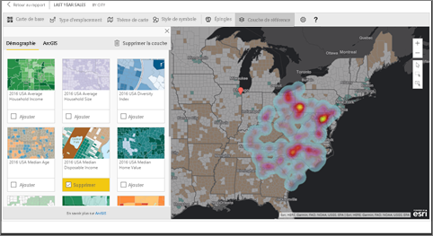

> [!TIP]
> Consultez la [page d’Esri sur ArcGIS Maps for Power BI](https://www.esri.com/powerbi) pour découvrir de nombreux exemples et lire des témoignages. Consultez ensuite la [page d’Esri pour bien démarrer avec ArcGIS Maps for Power BI](https://doc.arcgis.com/en/maps-for-powerbi/get-started/about-maps-for-power-bi.htm).

## Consentement de l’utilisateur
ArcGIS Maps for Power BI est fourni par Esri (https://www.esri.com). L’utilisation d’ArcGIS Maps pour Power BI est soumise aux conditions générales et à la politique de confidentialité d’Esri. Les utilisateurs Power BI désireux d’utiliser les visuels d’ArcGIS Maps pour Power BI doivent valider la boîte de dialogue de consentement.

**Ressources**

[Conditions générales](https://go.microsoft.com/fwlink/?LinkID=826322)

[Politique de confidentialité](https://go.microsoft.com/fwlink/?LinkID=826323)

[Page du produit ArcGIS Maps pour Power BI](https://www.esri.com/powerbi)

## Prérequis

Ce tutoriel utilise Power BI Desktop et le fichier PBIX de l’[exemple Analyse de la vente au détail](https://download.microsoft.com/download/9/6/D/96DDC2FF-2568-491D-AAFA-AFDD6F763AE3/Retail%20Analysis%20Sample%20PBIX.pbix). Il est également possible de créer des cartes ArcGIS Maps for Power BI à l’aide du service Power BI. 

1. Dans la section supérieure gauche de la barre de menus, sélectionnez **Fichier** \> **Ouvrir**
   
2. Recherchez le **fichier PBIX de l’exemple Analyse de la vente au détail** enregistré sur votre machine locale.

1. Ouvrez l’**Exemple Analyse de la vente au détail** dans la vue Rapport .

1. Sélectionner  pour ajouter une nouvelle page.

   
## Créer une visualisation de carte ArcGIS Maps for Power BI

Regardez Will créer différentes visualisations, puis suivez les étapes ci-dessous pour essayer par vous-même avec le [fichier .PBIX de l’exemple Analyse de la vente au détail](../create-reports/sample-datasets.md).
    

   > [!NOTE]
   > Cette vidéo utilise une version antérieure de Power BI Desktop.
   > 

> [!VIDEO https://www.youtube.com/embed/EKVvOZmxg9s]

1. Sélectionnez l’icône ArcGIS Maps pour Power BI dans le volet Visualisations.
   
    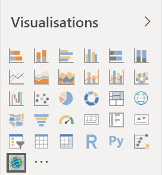    

2. Power BI ajoute un modèle vide au canevas de rapport. Dans le cadre de ce tutoriel, vous utilisez la version gratuite.
   
   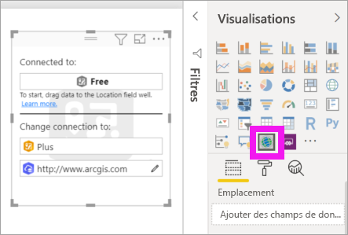

3. À partir du volet **Champs**, faites glisser un champ de données vers les compartiments **Emplacement** et/ou **Latitude** et **Longitude**. Dans cet exemple, utilisez **Store > City** (Magasin > Ville).
   
   > [!NOTE]
   > ArcGIS Maps pour Power BI détecte automatiquement si les champs que vous sélectionnez s’affichent mieux en tant que forme ou point sur une carte. Vous pouvez ajuster la valeur par défaut dans les paramètres (voir ci-dessous).
   > 
   > 
   
    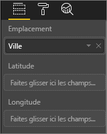

4. À partir du volet **Champs**, faites glisser une mesure vers le compartiment **Taille** pour ajuster le mode d’affichage des données. Dans cet exemple, utilisez **Sales > Last Year Sales** (Ventes > Ventes de l’année dernière).
   
    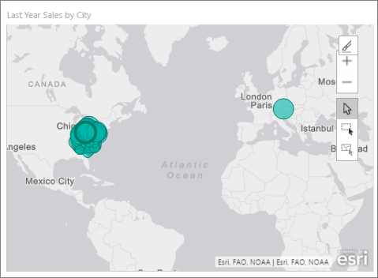

Vous avez créé votre première carte ArcGIS Maps for Power BI. À présent, nous allons affiner et mettre en forme notre carte en utilisant des cartes de base, des types d’emplacement, des thèmes et bien d’autres options.

## Paramètres et mise en forme des cartes ArcGIS Maps for Power BI
Pour accéder aux fonctionnalités de mise en forme d’**ArcGIS Maps pour Power BI**:

1. Accédez à des fonctionnalités supplémentaires en sélectionnant **Autres actions** (...) en haut à droite de la visualisation, puis en choisissant **Modifier**.
   
   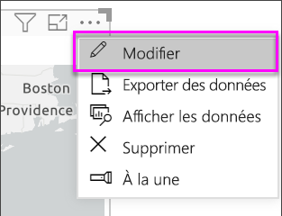
   
   La visualisation est développée et les fonctionnalités disponibles s’affichent dans sa partie supérieure. Chaque fonctionnalité, lorsque vous la sélectionnez, ouvre un volet Office qui fournit des options détaillées. 
   
   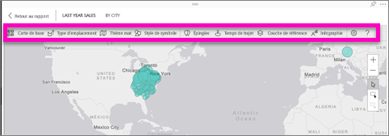
   

> [!TIP]
> **Esri** fournit une [documentation complète](https://go.microsoft.com/fwlink/?LinkID=828772) sur l’ensemble des fonctionnalités d’**ArcGIS Maps pour Power BI**.

### Cartes de base
Quatre cartes de base sont fournies : Dark Gray Canvas, Light Gray Canvas, OpenStreetMap et Streets.  *Streets* est la carte de base standard d’ArcGIS.

Pour appliquer une carte de base, sélectionnez-la dans le volet des tâches.

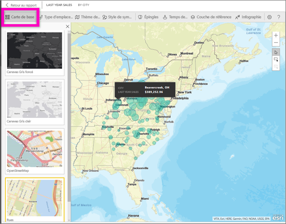

### Type d’emplacement
ArcGIS Maps for Power BI détecte automatiquement la meilleure façon de représenter les données sur la carte : avec des points ou des limites. Les options Location type (Type d’emplacement) vous permettent de régler ces sélections avec précision.

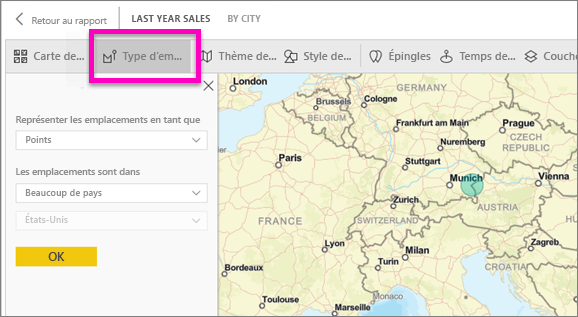

L’option **Boundaries** (Limites) fonctionne uniquement si vos données contiennent des valeurs géographiques standard. ArcGIS Maps for Power BI détermine automatiquement la forme à afficher sur la carte. Les valeurs géographiques standard incluent les pays, les provinces, les codes postaux, etc. Toutefois, comme pour le géocodage, il se peut que Power BI ne détecte pas un champ devant constituer une limite par défaut, ou qu’il ne trouve pas de limite pour vos données.  

### Thème de carte
Quatre thèmes de carte sont fournis. Power BI sélectionne automatiquement les thèmes **Location only** (Emplacement uniquement) ou **Size** (Taille) en fonction du ou des champs que vous avez ajoutés dans les compartiments **Location** (Emplacement) et **Size** (Taille). Par défaut, notre carte utilise le thème **Size**, car nous avons ajouté des champs dans les deux compartiments. Essayez les autres thèmes, puis réappliquez le thème **Size** avant de passer à l’étape suivante.  

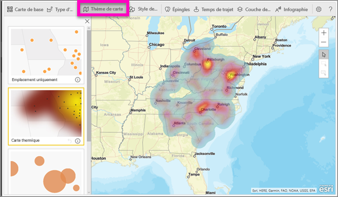

<table>
<tr><th>Thème</th><th>Description</th>
<tr>
<td>Emplacement uniquement</td>
<td>Trace des points de données ou des limites continues sur la carte en fonction du champ que vous avez ajouté dans le compartiment Location (Emplacement).</td>
</tr>
<tr>
<td>Carte thermique</td>
<td>Trace les données en représentant leur intensité sur la carte. Les zones où l’activité ou la valeur est plus élevée sont représentées avec des couleurs plus foncées et lumineuses. </td>
</tr>
<tr>
<td>Taille</td>
<td>Trace des points de données sur la carte en fonction du champ que vous avez ajouté dans le compartiment Size (Taille).</td>
</tr>
<tr>
<td>Clustering</td>
<td>Les points dans le rayon de cluster spécifié sont regroupés en un seul symbole qui représente le nombre de points dans cette zone de la carte. </td>
</tr>
</table>

### Style de symbole
Les styles de symbole vous permettent de représenter les données sur la carte avec plus de précision. Ils sont dépendants du contexte et changent en fonction du type d’emplacement et du thème de carte sélectionnés. L’exemple ci-dessous montre un thème de carte défini sur **Size** et plusieurs ajustements du style de symbole apportés à la transparence, au style et à la taille. 

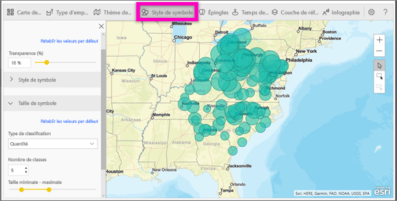

### Épingles
Attirez l’attention sur certains points de votre carte en ajoutant des épingles.  

1. Sélectionnez l’onglet **Pins** (Épingles).
2. Tapez des mots clés (adresses, lieux et points d’intérêt) dans la zone de recherche, puis sélectionnez une des options disponibles dans la liste déroulante. Un symbole apparaît sur la carte qui effectue automatiquement un zoom sur l’emplacement. Les résultats de la recherche sont enregistrés en tant que cartes d’emplacement dans le volet des épingles. Vous pouvez enregistrer jusqu’à 10 cartes d’emplacement.
   
   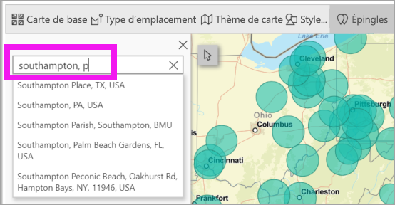
3. Power BI ajoute une épingle sur cet emplacement et vous pouvez modifier sa couleur.
   
   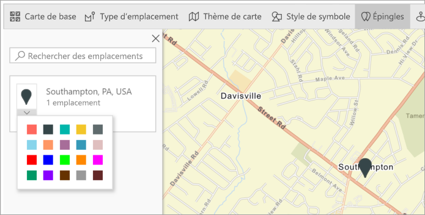
4. Ajoutez et supprimez des épingles.
   
   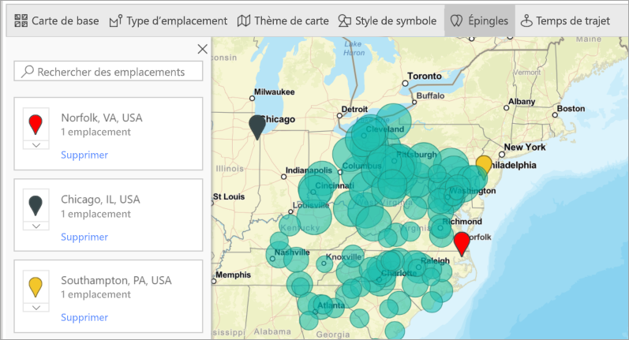

### Temps de trajet
Le volet Drive time (Temps de trajet) vous permet de sélectionner un emplacement et de déterminer quelles autres caractéristiques de carte sont dans le rayon ou le temps de trajet spécifié. Cet exemple représente des données dans un rayon de 50 km autour de Washington D.C.  Effectuez les étapes ci-dessous pour créer votre propre couche de temps de trajet. 
    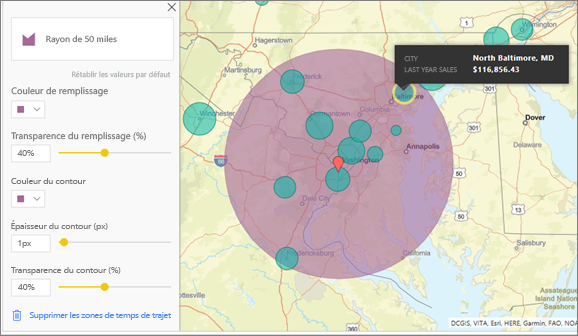

1. Sélectionnez l’outil de sélection simple et choisissez une épingle ou une bulle. Dans cet exemple, nous avons sélectionné une épingle pour l’aéroport Charlotte Douglas

   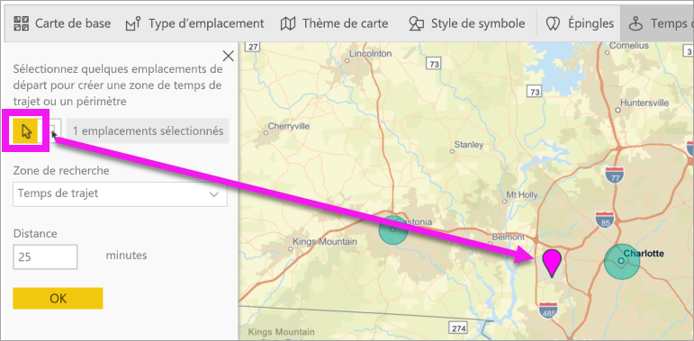
   
   > [!TIP]
   > La sélection d’un emplacement sera plus facile si vous agrandissez d’abord la carte. Vous pouvez faire un zoom en utilisant l’icône + ou la molette de la souris.
   > 
   > 
2. Imaginons que vous prenez l’avion à destination de l’aéroport Charlotte Douglas, pour un séjour de quelques jours, et que vous voulez savoir quels magasins de votre chaîne se trouvent à une distance raisonnable en voiture. Changez la valeur de Search area (Zone de recherche) sur **Drive time** (Temps de trajet) et la valeur Distance sur **25** minutes. Sélectionnez OK.    
   
    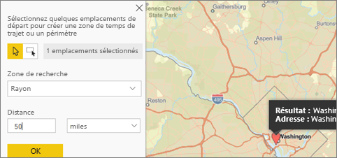

    

3. Il apparaît que deux magasins se trouvent en deçà d’un temps de trajet de 25 minutes. Le rayon apparaît en violet. Sélectionnez un emplacement pour en afficher les détails. Si vous le souhaitez, mettez en forme le rayon en modifiant sa couleur et son contour.
   
    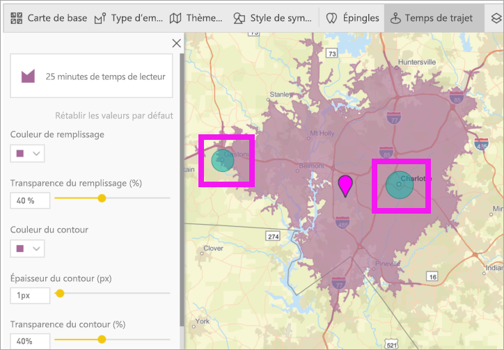

### Couche de référence
#### Reference layer (Couche de référence) - Demographics (Démographie)
ArcGIS Maps pour Power BI fournit une série de couches démographiques qui aident à contextualiser les données de Power BI.

1. Sélectionnez l’onglet **Reference layer** (Couche de référence), puis choisissez **Demographics** (Démographie).
2. Chaque couche répertoriée est associée à une case à cocher. Pour ajouter une couche à la carte, cochez-la.  Dans cet exemple, nous avons ajouté le revenu familial moyen. 
   
    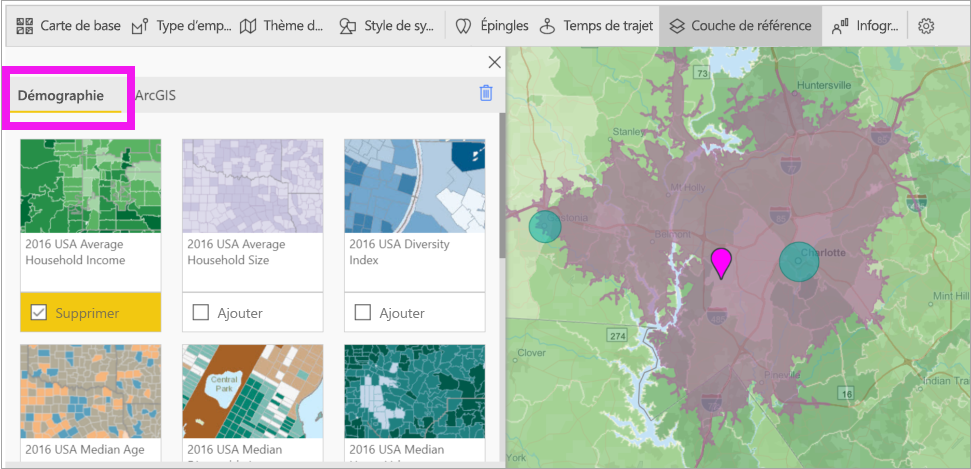
3. Chaque couche est également interactive. Pointez sur une bulle pour afficher les détails. Cliquez sur une zone ombrée pour afficher les détails sous la forme de graphiques. Ici, nous avons sélectionné le code postal 28227, ce qui nous donne deux graphiques à afficher.
   
    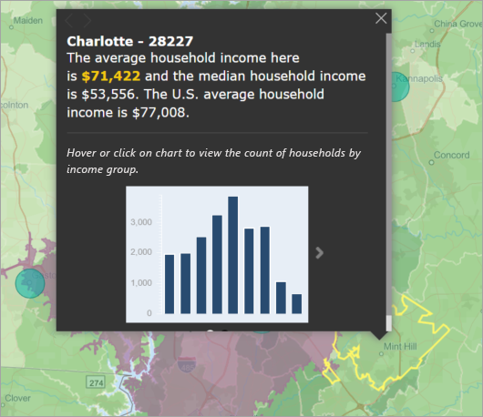

#### Reference layer (Couche de référence) - ArcGIS
ArcGIS Online permet aux entreprises de publier des cartes web publiques. De plus, Esri fournit un ensemble organisé de cartes web via Living Atlas. Sous l’onglet ArcGIS, vous pouvez rechercher tous les cartes web publiques ou des cartes Living Atlas, et les ajouter à la carte en tant que couches de référence.

1. Sélectionnez l’onglet **Reference layer** (Couche de référence), puis choisissez **ArcGIS**.
2. Entrez des termes de recherche, puis sélectionnez une couche de carte. Dans cet exemple, nous avons choisi les circonscriptions électorales des États-Unis.
   
    
3. Pour afficher les détails, sélectionnez une zone grisée pour ouvrir la boîte de dialogue *Select from reference layer* (Sélectionner dans la couche de référence) : servez-vous de l’outil de sélection de couche de référence pour sélectionner des limites ou des objets sur la couche de référence.

 

## Sélection de points de données
ArcGIS Maps for Power BI autorise cinq modes de sélection pour vous aider à sélectionner vos données avec précision et rapidité.

Changez le mode de sélection en plaçant le curseur sur l’icône de l’outil de sélection montrée dans l’image ci-dessous. Cette action développe la barre masquée pour présenter des outils supplémentaires :

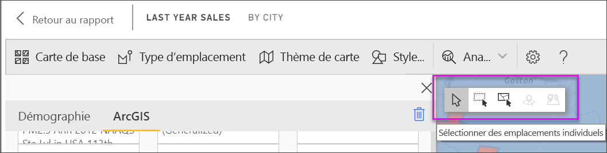

Chaque outil a un seul rôle qui vous permet de sélectionner vos données : 

 Sélectionne des points de données individuels.

 Dessine un rectangle sur la carte, et sélectionne les points de données qu’il contient.

 Autorise l’utilisation de limites ou de polygones dans les couches de référence pour sélectionner des points de données.

 Vous permet de sélectionner des données en utilisant une couche tampon.

 Vous permet de sélectionner des points de données similaires les uns aux autres.

> [!NOTE]
> Il n’est pas possible de sélectionner plus de 250 points de données à la fois.
> 
> 

 

## Obtention d’aide
**Esri** fournit une [documentation complète](https://go.microsoft.com/fwlink/?LinkID=828772) sur l’ensemble des fonctionnalités d’**ArcGIS Maps pour Power BI**.

Vous pouvez poser des questions, accéder aux informations les plus récentes, signaler des problèmes et trouver des réponses sur le [fil de discussion de la communauté Power BI consacré à **ArcGIS Maps pour Power BI**](https://go.microsoft.com/fwlink/?LinkID=828771).

Si vous avez des suggestions d’amélioration, ajoutez-les à la [liste d’idées concernant Power BI](https://ideas.powerbi.com).

 

## Gestion de l’utilisation d’ArcGIS Maps pour Power BI au sein de votre organisation
Power BI permet aux concepteurs, administrateurs de locataires et administrateurs informatiques de gérer l’utilisation d’ArcGIS Maps for Power BI. Les étapes réalisables par chaque rôle sont décrites ci-après. 

### Options pour les concepteurs
Dans Power BI Desktop, les concepteurs peuvent désactiver ArcGIS Maps for Power BI sous l’onglet Sécurité. Sélectionnez **Fichier** > **Options et paramètres**, puis sélectionnez **Options** > **Sécurité**. Une fois désactivé, ArcGIS Maps n’est plus chargé par défaut.

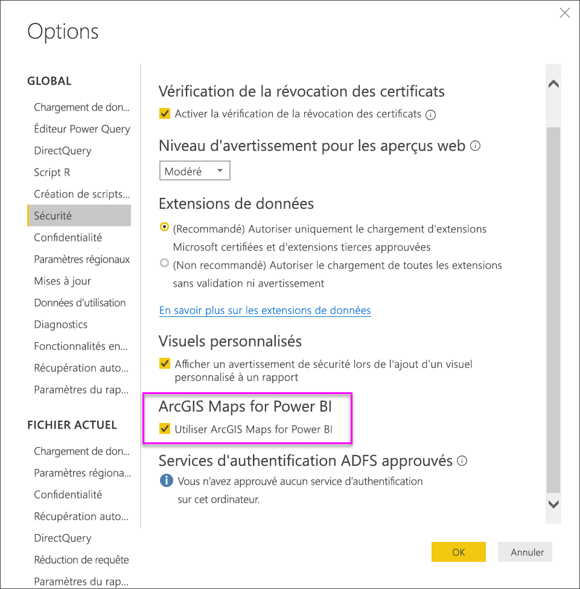

### Options pour l’administrateur du locataire
Dans PowerBI.com, les administrateurs de locataires peuvent désactiver ArcGIS Maps for Power BI pour tous les utilisateurs. Sélectionnez **Paramètres** > **Portail d’administration** > **Paramètres du client**. Après la désactivation d’ArcGIS Maps for Power BI, Power BI n’affiche plus l’icône correspondante dans le volet Visualisations.

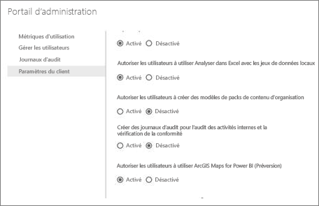

### Options pour l’administrateur informatique
Power BI Desktop prend en charge l’utilisation d’une **stratégie de groupe** pour désactiver ArcGIS Maps pour Power BI sur les ordinateurs déployés dans une organisation.

<table>
<tr><th>Attribut</th><th>Valeur</th>
</tr>
<tr>
<td>key</td>
<td>Software\Policies\Microsoft\Power BI Desktop</td>
</tr>
<tr>
<td>valueName</td>
<td>EnableArcGISMaps</td>
</tr>
</table>

La valeur 1 (décimale) active ArcGIS Maps pour Power BI.

La valeur 0 (décimale) désactive ArcGIS Maps pour Power BI.

## Considérations et limitations
ArcGIS Maps pour Power BI est disponible dans les applications et services suivants :

<table>
<tr><th>Service/application</th><th>Disponibilité</th></tr>
<tr>
<td>Power BI Desktop</td>
<td>Oui</td>
</tr>
<tr>
<td>Service Power BI (app.powerbi.com)</td>
<td>Oui</td>
</tr>
<tr>
<td>Applications mobiles Power BI</td>
<td>Oui</td>
</tr>
<tr>
<td>Publication Power BI sur le web</td>
<td>Non</td>
</tr>
<tr>
<td>Power BI Embedded</td>
<td>Non</td>
</tr>
<tr>
<td>Incorporation au service Power BI (PowerBI.com)</td>
<td>Non</td>
</tr>
</table>

Dans les services ou applications où ArcGIS Maps pour Power BI n’est pas disponible, la visualisation affiche un visuel vide avec le logo Power BI.

Lors du géocodage des adresses, seules les 1500 premières adresses sont géocodées. Le géocodage des pays ou noms de lieux n’est pas soumis à la limite de 1 500 adresses.

 

**Comment fonctionne ArcGIS Maps for Power BI ?**
ArcGIS Maps for Power BI est fourni par Esri (https://www.esri.com). L’utilisation d’ArcGIS Maps for Power BI est soumise aux [conditions générales](https://go.microsoft.com/fwlink/?LinkID=8263222) et à la [politique de confidentialité](https://go.microsoft.com/fwlink/?LinkID=826323) d’Esri. Les utilisateurs Power BI désireux d’utiliser les visuels d’ArcGIS Maps for Power BI doivent confirmer leur acceptation dans la boîte de dialogue de consentement (voir Consentement de l’utilisateur pour plus de détails).  L’utilisation d’ArcGIS Maps for Power BI est soumise aux conditions générales et à la politique de confidentialité d’Esri, auxquelles vous pouvez accéder à partir des liens dans la boîte de dialogue de consentement. Chaque utilisateur doit donner son consentement avant d’utiliser ArcGIS Maps for Power BI pour la première fois. Une fois que l’utilisateur accepte le consentement, les données liées au visuel sont envoyées aux services d’Esri au moins pour le géocodage, c’est-à-dire la transformation des informations de localisation en latitude et longitude qui peuvent être représentées sur une carte. Prenez en compte que toutes les données liées à la visualisation des données peuvent être envoyées aux services d’Esri. Esri fournit des services comme les cartes de base, l’analytique spatiale, le géocodage, etc. Le visuel ArcGIS Maps for Power BI interagit avec ces services à l’aide d’une connexion SSL protégée par un certificat fourni et géré par Esri. Des informations supplémentaires sur ArcGIS Maps for Power BI peuvent être obtenues dans la [page de produit ArcGIS Maps for Power BI](https://www.esri.com/powerbi) d’Esri.

Quand un utilisateur s’inscrit à un abonnement Plus offert par Esri via ArcGIS Maps for Power BI, il entre dans une relation directe avec Esri. Power BI n’envoie pas à Esri d’informations personnelles sur l’utilisateur. L’utilisateur se connecte à une application AAD fournie par Esri avec sa propre identité AAD et l’approuve. De cette façon, l’utilisateur partage ses informations personnelles directement avec Esri. Dès que l’utilisateur ajoute du contenu Plus à un visuel ArcGIS Maps for Power BI, les autres utilisateurs Power BI doivent également avoir un abonnement Plus d’Esri pour pouvoir afficher ou modifier ce contenu. 

Pour des questions techniques détaillées sur le fonctionnement d’ArcGIS Maps for Power BI d’Esri, contactez Esri via leur site de support.

**Quelles sont les données envoyées à Esri ?**
Découvrez quelles données sont transférées vers Esri en consultant leur [site de documentation](https://doc.arcgis.com/en/maps-for-powerbi/get-started/data-transfer.htm).

**L’utilisation d’ArcGIS Maps pour Power BI a-t-elle un coût ?**

ArcGIS Maps for Power BI est fourni par **Esri** sans coût supplémentaire. Pour l’utiliser, vous devez accepter le contrat de l’utilisateur.  

**J’obtiens un message d’erreur dans Power BI Desktop indiquant que mon cache est saturé**

Il s’agit d’un bogue qui est en cours de résolution.  En attendant, pour effacer le cache, essayez de supprimer des fichiers à cet emplacement : C:\Users\\AppData\Local\Microsoft\Power BI Desktop\CEF, puis redémarrez Power BI.

**ArcGIS Maps pour Power BI prend-il en charge les Shapefiles d’Esri ?**

ArcGIS Maps pour Power BI détecte automatiquement les limites standards telles que les pays/régions, les départements/provinces et les codes postaux. Si vous devez fournir vos propres formes, vous pouvez le faire à l’aide de [Shape Maps for Power BI Desktop](desktop-shape-map.md).

**Puis-je afficher mes cartes ArcGIS hors connexion ?**

Non, Power BI nécessite une connexion au réseau pour afficher les cartes.

**Puis-je me connecter à mon compte ArcGIS Online à partir de Power BI ?**

Pas encore. [Votez pour cette idée](https://ideas.powerbi.com/forums/265200-power-bi-ideas/suggestions/9154765-arcgis-geodatabases) afin de recevoir un message électronique lorsque nous commencerons à travailler sur cette fonctionnalité.  

## Étapes suivantes
[Interaction avec une carte ArcGIS qui a été partagée avec vous](power-bi-visualizations-arcgis.md)

[Billet de blog annonçant la disponibilité de ArcGIS Maps pour Power BI](https://powerbi.microsoft.com/blog/announcing-arcgis-maps-for-power-bi-by-esri-preview/)

D’autres questions ? [Essayez d’interroger la communauté Power BI](https://community.powerbi.com/)

