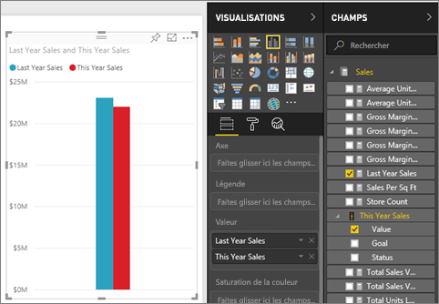
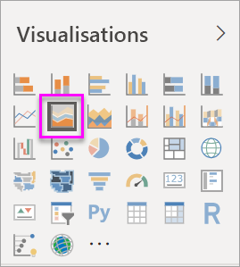
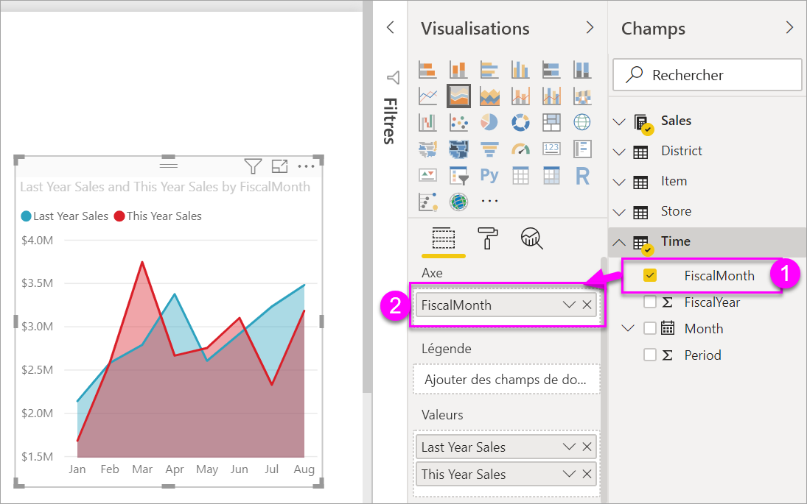

# Graphique en aires simple

[!INCLUDE [power-bi-visuals-desktop-banner](../includes/power-bi-visuals-desktop-banner.md)]

Le graphique en aires simple (également appelé graphique en aires empilées) est basé sur le graphique en courbes. La zone entre l’axe et la ligne est remplie avec des couleurs indiquant le volume. 

Les graphiques en aires mettent en évidence l’ampleur du changement dans le temps et peuvent être utilisés pour attirer l’attention sur la tendance évolutive d’une valeur totale. Par exemple, les données qui représentent des profits dans le temps peuvent être tracées dans un graphique en aires pour mettre l’accent sur le profit total.

## Utilisation d’un graphique en aires simple
Les graphiques en aires simples sont conseillés pour :

* afficher et comparer la tendance évolutive des volumes d’une série chronologique ; 
* des séries individuelles représentant un ensemble dénombrable physiquement.

### Conditions préalables
Ce tutoriel utilise le [fichier PBIX de l’exemple Analyse de la vente au détail](http://download.microsoft.com/download/9/6/D/96DDC2FF-2568-491D-AAFA-AFDD6F763AE3/Retail%20Analysis%20Sample%20PBIX.pbix).

1. Dans la section supérieure gauche de la barre de menus, sélectionnez **Fichier** > **Ouvrir**.
   
2. Rechercher votre copie du **fichier PBIX de l’exemple Analyse de la vente au détail**

1. Ouvrez le **fichier PBIX de l’exemple Analyse de la vente au détail** dans la vue Rapport .

1. Sélectionner  pour ajouter une nouvelle page.

## Créer un graphique en aires simple
 

1. Ces étapes vous aideront à créer un graphique en aires qui affiche les ventes de l’année actuelle et celles de l’année dernière mois par mois.
   
   a. Dans le volet Champs, sélectionnez **Sales (Ventes) \> Last Year Sales (Ventes de l’année dernière)** et **This Year Sales > Value (Ventes de cette année > Valeur)** .

   

   b.  Convertissez le graphique en graphique en aires de base en sélectionnant l’icône Graphique en aires dans le volet Visualisations.

   
   
   c.  Sélectionnez **Time \> FiscalMonth** (Période > Mois fiscal) pour l’ajouter à **Axe**.   
   
   
   d.  Pour afficher le graphique par mois, sélectionnez les points de suspension (dans le coin supérieur droit de l’élément visuel) et choisissez **Trier par mois**. Pour modifier l’ordre de tri, sélectionnez les points de suspension à nouveau et sélectionnez **Tri croissant** ou **Tri décroissant**.

## Mise en surbrillance et filtrage croisé
Pour plus d’informations sur le volet Filtres, consultez [Ajouter un filtre à un rapport](../power-bi-report-add-filter.md).

Pour mettre en surbrillance une zone particulière de votre graphique, sélectionnez cette zone ou sa bordure supérieure.  Contrairement à d’autres types de visualisation, s’il existe d’autres visualisations sur la même page, la mise en surbrillance d’un graphiques en aires de base n’effectue pas de filtrage croisé des autres visualisations de la page de rapport. Toutefois, les graphiques en aires sont une cible pour le filtrage croisé déclenché par d’autres visualisations sur la page du rapport. 

1. Essayez en sélectionnant votre graphique en aires, puis en le copiant dans la page de rapport **New Store Analysis** (Ctrl+C et Ctrl+V).
2. Sélectionnez l’une des aires ombrées du graphique en aires, puis sélectionnez l’autre aire ombrée. Vous pouvez constater que cela n’a aucun impact sur les autres visualisations de la page.
1. Sélectionnez maintenant un élément. Notez l’impact sur le graphique en aires : il fait l’objet d’un filtrage croisé.

     

Pour plus d’informations, consultez [Interactions avec un élément visuel dans les rapports](../service-reports-visual-interactions.md).

## Considérations et résolution des problèmes   
* [Rendre les rapports plus accessibles aux personnes handicapées](../desktop-accessibility.md)
* Les graphiques en aires simples ne sont pas adaptés pour comparer des valeurs en raison de l’occlusion sur les aires empilées. Power BI utilise la transparence pour indiquer le chevauchement des aires. Toutefois, il fonctionne bien uniquement avec deux ou trois aires différentes. Quand vous devez comparer la tendance de plus de trois valeurs, utilisez plutôt des graphiques en courbes. Pour comparer le volume de plus de trois valeurs, utilisez plutôt un graphique de compartimentage (treemap).

## Étape suivante
[Rapports dans Power BI](power-bi-visualization-card.md)  

