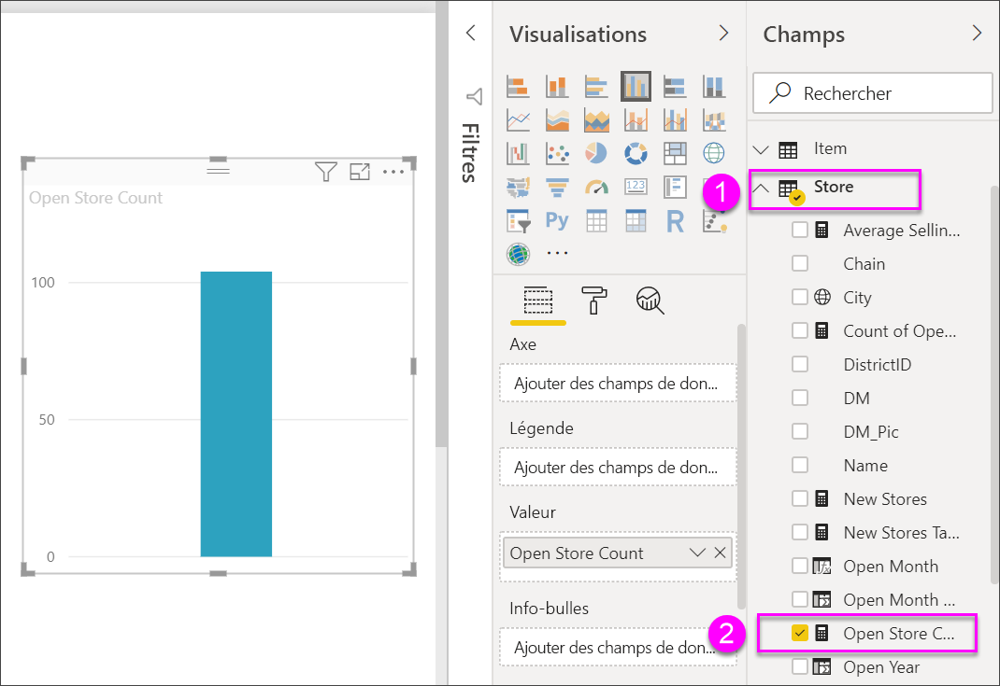
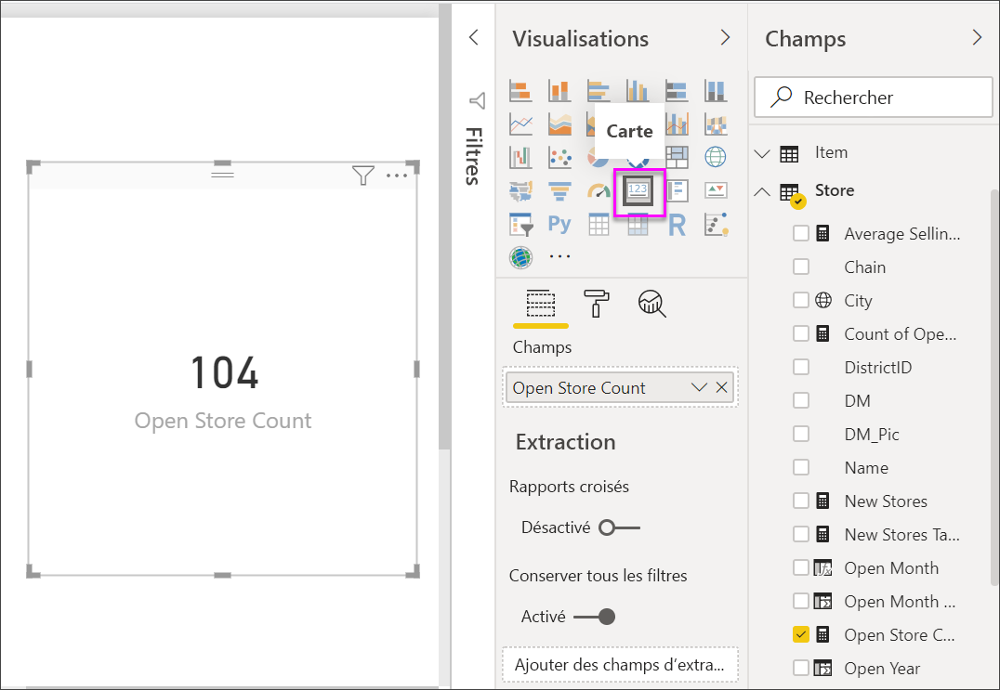
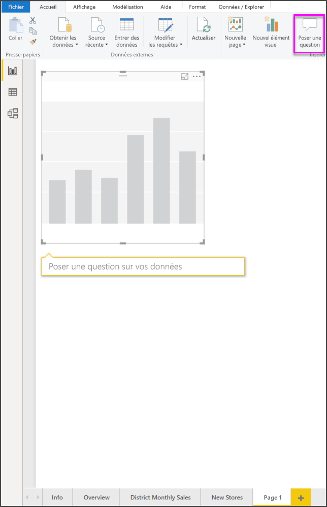
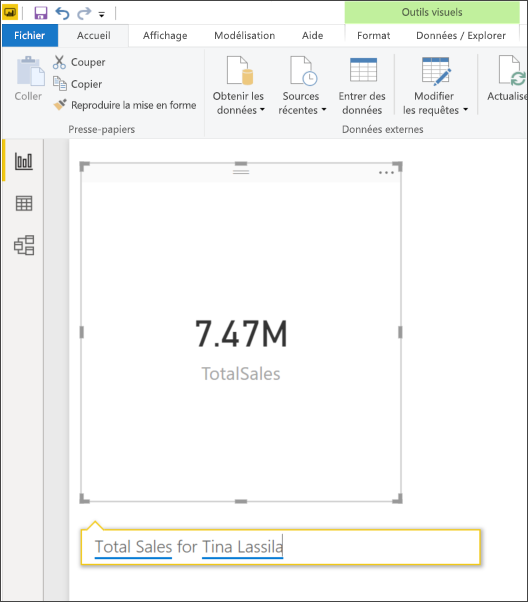
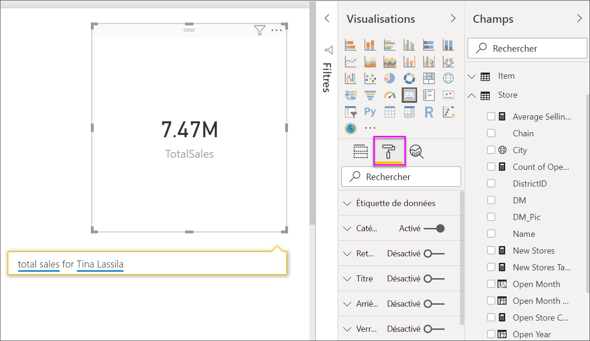
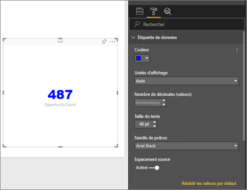
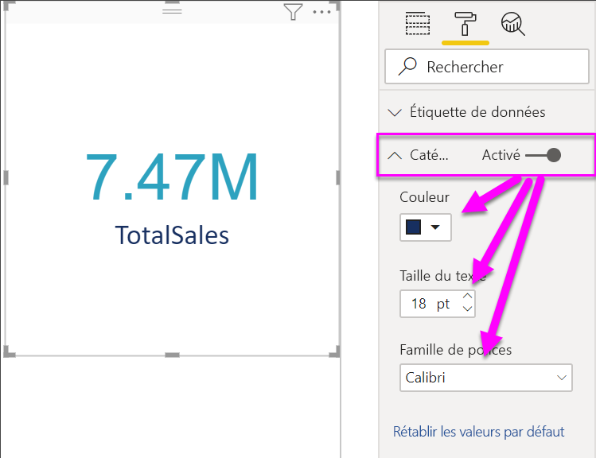
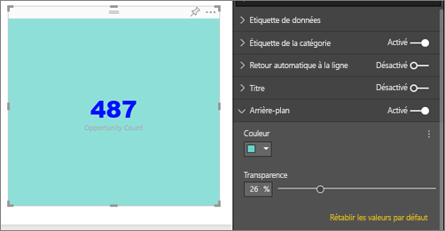

# Visualisations de carte

[!INCLUDE [power-bi-visuals-desktop-banner](../includes/power-bi-visuals-desktop-banner.md)]

Vous pouvez parfois vouloir suivre un nombre unique dans votre tableau de bord ou rapport Power BI pour l’importance qu’il représente, qu’il s’agisse du total des ventes, de la part de marché d’une année sur l’autre ou du nombre total d’opportunités. Ce type de visualisation est appelé *carte*. Avec la plupart des visualisations Power BI natives, des cartes peuvent être créées à l’aide de l’éditeur de rapport ou dans Questions et réponses.

## Prérequis

Ce tutoriel utilise le [fichier PBIX de l’exemple Analyse de la vente au détail](https://download.microsoft.com/download/9/6/D/96DDC2FF-2568-491D-AAFA-AFDD6F763AE3/Retail%20Analysis%20Sample%20PBIX.pbix).

1. Dans la section supérieure gauche de la barre de menus, sélectionnez **Fichier** \> **Ouvrir**.
   
2. Rechercher votre copie du **fichier PBIX de l’exemple Analyse de la vente au détail**

1. Ouvrez le **fichier PBIX de l’exemple Analyse de la vente au détail** dans la vue Rapport .

1. Sélectionner  pour ajouter une nouvelle page.

## Option 1 : Créer une carte à l’aide de l’éditeur de rapport

La première méthode pour créer une carte est d’utiliser l’éditeur de rapport dans Power BI Desktop.

1. Démarrez sur une page de rapport vierge, puis sélectionnez le champ **Store (Magasin)** \> **Open store count (Nombre de magasins ouverts)** .

    Power BI crée un histogramme à partir d’un seul nombre.

   

2. Dans le volet Visualisations, sélectionnez l’icône de carte.

   

Vous avez maintenant créé une carte avec l’éditeur de rapport. Voici la seconde option pour créer une carte avec la zone de question de Questions et réponses.

## Option 2 : Créer une carte à partir de la zone de question Questions et réponses
La zone de question de Questions et réponses est une autre option qui vous permet de créer une carte. La zone de question de Questions et réponses est disponible dans la vue Rapport de Power BI Desktop.

1. Démarrer sur une page de rapport vide

1. En haut de votre fenêtre, sélectionnez l’icône **Poser une question**. 

    Power BI crée une carte et une zone pour votre question. 

   

2. Par exemple, tapez « Total Sales for Tina » (Ventes totales pour Tina) dans la zone de question.

    Celle-ci vous propose des suggestions et des nouvelles formulations, puis affiche le nombre total.  

   

   

Vous avez maintenant créé une carte avec la zone de question de Questions et réponses. Vous trouverez ci-dessous les étapes de mise en forme de votre carte selon vos besoins spécifiques.

## Mettre en forme une carte
Vous disposez de nombreuses options pour modifier des étiquettes, du texte, la couleur et bien plus encore. La meilleure façon d’apprendre consiste à créer une carte et d’explorer le volet Mise en forme. Voici quelques-unes des options de mise en forme disponibles. 

Le volet de mise en forme est disponible quand vous interagissez avec la carte dans un rapport. 

1. Commencez par sélectionner l’icône représentant un rouleau à peinture pour ouvrir le volet de mise en forme. 

    

2. Avec la carte sélectionnée, développez **Étiquette de données** et changez la famille, la taille et la couleur de la police. Si vous aviez des milliers de magasins, vous pouvez utiliser **Unités d’affichage** pour afficher le nombre de magasins par milliers et contrôler les places des décimales. Par exemple, 125 800 au lieu de 125 832,00.

    

3.  Développez **Étiquette de catégorie** et modifier la couleur et la taille.

    

4. Développez **Arrière-plan** et déplacez le curseur sur On.  Maintenant, vous pouvez modifier la couleur et la transparence de l’arrière-plan.

    

5. Continuez à explorer les options de mise en forme jusqu'à ce que votre carte soit exactement comment vous le souhaitez. 

## Considérations et résolution des problèmes
Si vous ne voyez pas de zone de question, contactez l’administrateur système ou du locataire.    

## Étapes suivantes
[Graphiques en entonnoir dans Power BI](power-bi-visualization-combo-chart.md)

[Types de visualisation dans Power BI](power-bi-visualization-types-for-reports-and-q-and-a.md)
