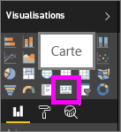
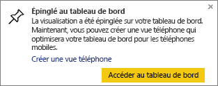
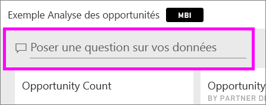
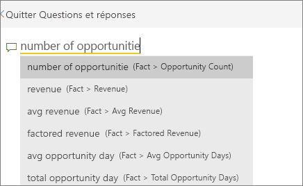
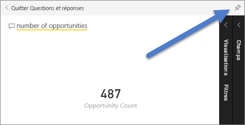
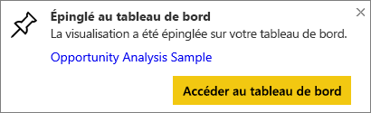
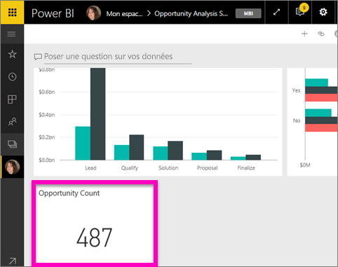
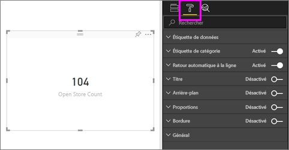
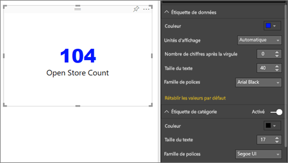
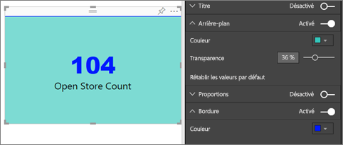

# Visualisations de carte
Vous pouvez parfois vouloir suivre un nombre unique dans votre tableau de bord ou rapport Power BI pour l’importance qu’il représente, qu’il s’agisse du total des ventes, de la part de marché d’une année sur l’autre ou du nombre total d’opportunités. Ce type de visualisation est appelé *carte*. Avec la plupart des visualisations Power BI natives, des cartes peuvent être créées à l’aide de l’éditeur de rapport ou dans Questions et réponses.

## Créer une carte à l’aide de l’éditeur de rapport
Ces instructions s’appliquent à l’exemple Analyse de la vente au détail. Pour effectuer la procédure, [téléchargez l’exemple](../sample-datasets.md) pour le service Power BI (app.powerbi.com) ou Power BI Desktop.   

1. Démarrez sur une [page de rapport vierge](../power-bi-report-add-page.md), puis sélectionnez le champ **Store (Magasin)** \> **Open store count (Nombre de magasins ouverts)**. Si vous utilisez le service Power BI, vous devez ouvrir le rapport en [mode Édition](../service-interact-with-a-report-in-editing-view.md).

    Power BI crée un histogramme à partir d’un seul nombre.

   
2. Dans le volet Visualisations, sélectionnez l’icône Carte.

   
6. Pointez le curseur sur la carte, puis sélectionnez l’icône en forme d’épingle  pour ajouter la visualisation au tableau de bord.

   
7. Épinglez la vignette à un tableau de bord existant ou à un nouveau tableau de bord.

   * Tableau de bord existant : sélectionnez le nom du tableau de bord dans la liste déroulante.
   * Nouveau tableau de bord : tapez le nom du nouveau tableau de bord.
8. Sélectionnez **Épingler**.

   Un message de réussite (dans l’angle supérieur droit) vous indique que la visualisation a été ajoutée, sous forme de vignette, à votre tableau de bord.

   
9. Sélectionnez **Accéder au tableau de bord**. Ici, vous pouvez [modifier et déplacer](../service-dashboard-edit-tile.md) la visualisation épinglée.

## Créer une carte à partir de la zone de question Questions et réponses
La zone de question Questions et réponses est le moyen le plus simple de créer une carte. Elle est disponible dans le service Power BI (app.powerbi.com) à partir d’un tableau de bord ou rapport. Les étapes ci-dessous décrivent la création d’une carte à partir d’un tableau de bord dans le service Power BI. Si vous souhaitez créer une carte à l’aide de Questions et réponses dans Power BI Desktop, [suivez ces instructions](https://powerbi.microsoft.com/en-us/blog/power-bi-desktop-december-feature-summary/#QandA) pour accéder à la préversion de Questions et réponses pour les rapports Power BI Desktop.

1. Créez un [tableau de bord](../consumer/end-user-dashboards.md) et [obtenez des données](../service-get-data.md). Cet exemple utilise l’[exemple Analyse des opportunités](../sample-opportunity-analysis.md).

1. En haut de votre tableau de bord, commencez à taper ce que vous voulez savoir sur vos données dans la zone de question. 

   

>**Conseil** : à partir d’un rapport Power BI, en [mode Édition](../consumer/end-user-reading-view.md), sélectionnez **Poser une question** dans la barre de menus supérieure. Dans un rapport Power BI Desktop, recherchez un espace vide et double-cliquez pour ouvrir une zone de question.

3. Par exemple, tapez « nombre d’opportunités » dans la zone de question.

   

   Celle-ci vous propose des suggestions et des nouvelles formulations, puis affiche le nombre total.  
4. Sélectionnez l’icône d’épingle  dans l’angle supérieur droit pour ajouter la carte à un tableau de bord.

   
5. Épinglez la carte, sous forme de vignette, à un tableau de bord existant ou nouveau.

   * Tableau de bord existant : sélectionnez le nom du tableau de bord dans la liste déroulante. Votre choix est limité aux tableaux de bord figurant à l’intérieur de l’espace de travail actuel.
   * Nouveau tableau de bord : tapez le nom du nouveau tableau de bord pour ajouter celui-ci à votre espace de travail actuel.
6. Sélectionnez **Épingler**.

   Un message de réussite (dans l’angle supérieur droit) vous indique que la visualisation a été ajoutée, sous forme de vignette, à votre tableau de bord.  

   
7. Sélectionnez **Accéder au tableau de bord** pour voir la nouvelle vignette. Vous pouvez [renommer, redimensionner et repositionner la vignette, et y ajouter également un lien hypertexte](../service-dashboard-edit-tile.md) depuis votre tableau de bord.

   

## Considérations et résolution des problèmes
- Si vous ne voyez pas de zone de question, contactez l’administrateur système ou du locataire.    
- Si vous utilisez Power BI Desktop et que le fait de double-cliquer sur un espace vide dans un rapport n’ouvre pas Questions et réponses, vous devez peut-être l’activer.  Sélectionnez **Fichier > Options et paramètres > Options > Fonctionnalités en préversion** et redémarrez Power BI Desktop.

## Mettre en forme une carte
Vous disposez de nombreuses options pour modifier des étiquettes, du texte, la couleur et bien plus encore. La meilleure façon d’apprendre consiste à créer une carte et d’explorer le volet Mise en forme. Voici quelques-unes des options de mise en forme disponibles. 

1. Commencez par sélectionner l’icône en forme de pinceau pour ouvrir le volet Mise en forme. 

    
2. Développez **Étiquette de données** et changer la famille, la taille et la couleur de la police. Si vous aviez des milliers de magasins, vous pouvez utiliser **Unités d’affichage** pour afficher le nombre de magasins par milliers et contrôler les places des décimales. Par exemple, 125 800 au lieu de 125 832,00.

3.  Développez **Étiquette de catégorie** et modifier la couleur et la taille.

    

4. Développez **Arrière-plan** et déplacez le curseur sur On.  Maintenant, vous pouvez modifier la couleur et la transparence de l’arrière-plan.

    

5. Continuez à explorer les options de mise en forme jusqu'à ce que votre carte soit exactement comment vous le souhaitez. 

    

## Étapes suivantes
[Vignettes d’un tableau de bord dans Power BI](../consumer/end-user-tiles.md)

[Tableaux de bord dans Power BI](../consumer/end-user-dashboards.md)

[Power BI – Concepts de base](../consumer/end-user-basic-concepts.md)

D’autres questions ? [Posez vos questions à la communauté Power BI](http://community.powerbi.com/)
