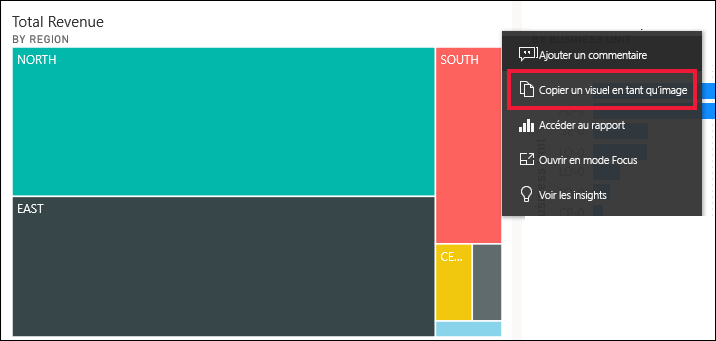
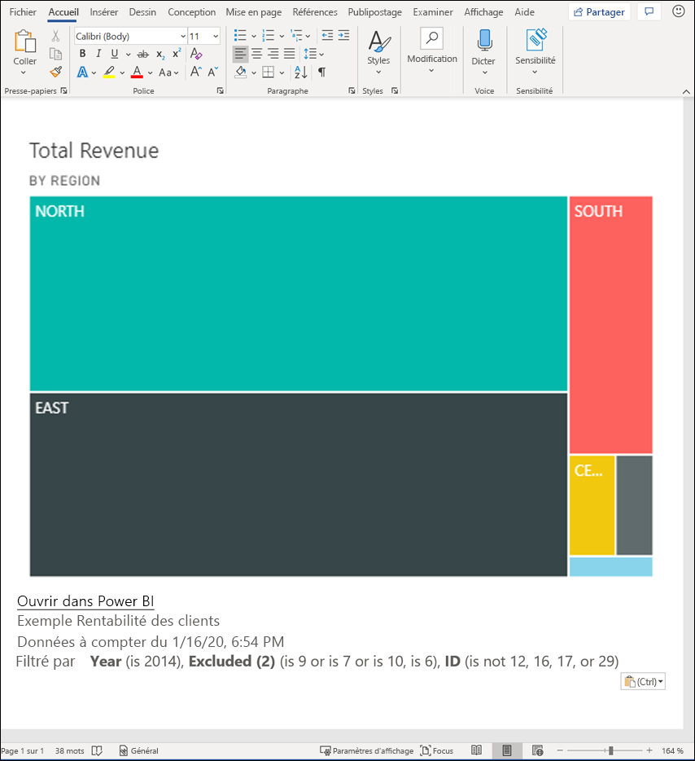
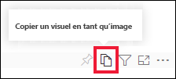
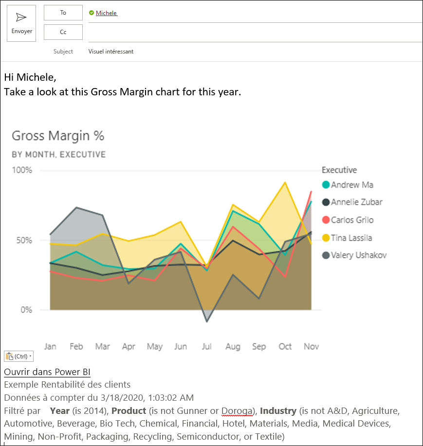
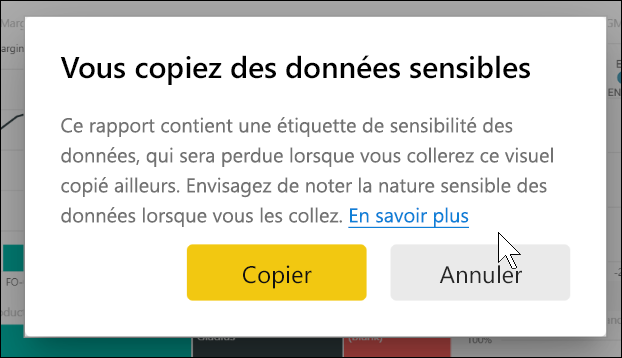
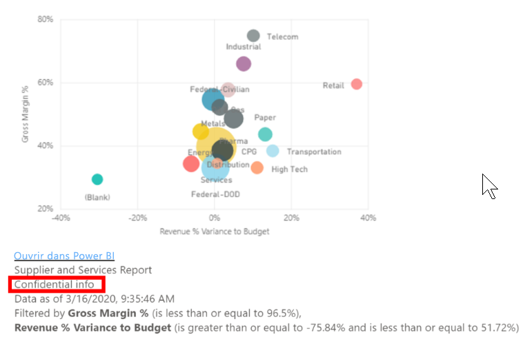
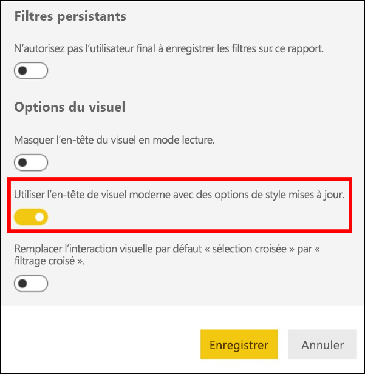
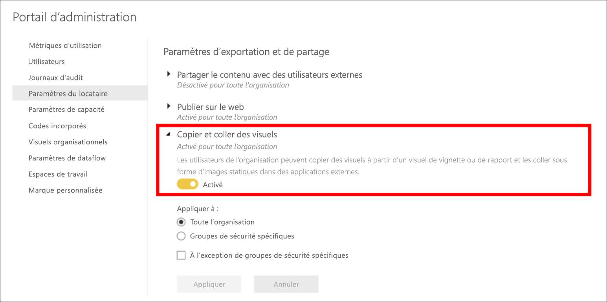
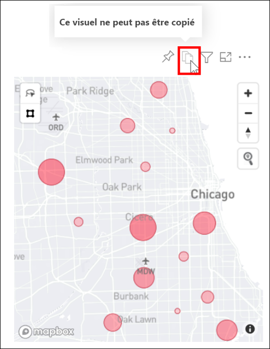

# Copier et coller une visualisation de rapport

[!INCLUDE[consumer-appliesto-yyyn](../includes/consumer-appliesto-yyyn.md)]

Cet article présente deux méthodes différentes pour copier et coller un visuel. 
* Copier un visuel dans un rapport et le coller dans une autre page de rapport (nécessite des autorisations de modification du rapport)

* Copier une image d’un visuel à partir de Power BI dans le Presse-papiers et la coller dans d’autres applications

## Copier et coller dans le même rapport
Les visuels dans les rapports Power BI peuvent être copiés d’une page du rapport vers la même page ou une page différente du même rapport. 

La copie et le collage d’une visualisation nécessitent des autorisations de modification du rapport. Dans le service Power BI, vous devez donc ouvrir le rapport en [Mode Édition](../consumer/end-user-reading-view.md). 

Les visualisations sur des *tableaux de bord* ne peuvent pas être copiées et collées dans des rapports Power BI ou d’autres tableaux de bord.

1. Ouvrez un rapport qui a au moins une visualisation.  

2. Sélectionnez la visualisation et utilisez **Ctrl+C** pour copier et **Ctrl+V** pour coller.      

   

## Copier un visuel en tant qu’image dans le Presse-papiers

Avez-vous déjà voulu partager une image d’un rapport ou d’un tableau de bord Power BI ? Vous pouvez maintenant copier le visuel et le coller dans toute autre application qui prend en charge le collage. 

Lorsque vous copiez une image statique d’un visuel, vous obtenez une copie du visuel avec les métadonnées. Cela comprend :
* un lien pour retourner au rapport Power BI ou au tableau de bord
* le titre du rapport ou du tableau de bord
* un message précisant que l’image contient des informations confidentielles
* l’horodatage de la dernière mise à jour
* les filtres appliqués au visuel

### Copie à partir d’une vignette de tableau de bord

1. Accédez au tableau de bord à partir duquel vous souhaitez effectuer la copie.

2. Dans l’angle supérieur droit du visuel, sélectionnez **Plus d’options (...)** , puis choisissez **Copier le visuel comme une image**. 

    

3. Quand la boîte de dialogue **Votre visuel est prêt à être copié** s’affiche, sélectionnez **Copier dans le Presse-papiers**.

    

4. Lorsque votre visuel est prêt, collez-le dans une autre application à l’aide de **Ctrl + V** ou cliquez avec le bouton droit > Coller. Dans la capture d’écran ci-dessous, nous avons collé le visuel dans Microsoft Word. 

    

### Copie à partir d’un visuel de rapport 

1. Accédez au rapport à partir duquel vous voulez effectuer la copie.

2. Dans l’angle supérieur droit du visuel, sélectionnez l’icône **Copier le visuel comme une image**. 

    

3. Quand la boîte de dialogue **Votre visuel est prêt à être copié** s’affiche, sélectionnez **Copier dans le Presse-papiers**.

    

4. Lorsque votre visuel est prêt, collez-le dans une autre application à l’aide de **Ctrl + V** ou cliquez avec le bouton droit > Coller. Dans la capture d’écran ci-dessous, nous avons collé le visuel dans un message électronique.

    

5. Si le rapport comporte une étiquette de sensibilité des données, un avertissement s’affiche lorsque vous sélectionnez l’icône de copie.  

    

    Une étiquette de sensibilité sera ajoutée aux métadonnées sous le visuel collé. 

    

### Gérer l’utilisation de la copie d’un visuel comme une image
Si vous êtes propriétaire du contenu ou si vous êtes un administrateur du locataire, vous pouvez contrôler si un visuel peut être copié en tant qu’image à partir d’un rapport ou d’un tableau de bord.

#### Désactiver la copie en tant qu’image pour un visuel spécifique
Si vous ne souhaitez pas que les utilisateurs puissent copier un visuel spécifique, vous pouvez supprimer l’icône de copie de ce visuel.
1. Ouvrez le volet de mise en forme en sélectionnant l’icône en forme de rouleau. 

1. Ouvrez la carte **Mise en forme du visuel**.
1. Faites défiler jusqu’à **En-tête du visuel**, développez la carte, puis désactivez l’**icône de copie**.

    

1. Si vous ne trouvez pas le paramètre **En-tête du visuel**, activez l’option d’en-tête visuel moderne sous **Paramètres du rapport**. 

    

1. Enregistrez les changements. Repartagez et republiez le visuel si nécessaire.

#### Désactiver la copie en tant qu’image pour un groupe d’utilisateurs

Si vous êtes le propriétaire du contenu ou un administrateur du locataire, vous pouvez contrôler qui peut copier des visuels. Ce paramètre désactive la *copie du visuel comme image* pour tout le contenu auquel l’utilisateur accède dans le client Power BI.
  
1. Accédez au portail d’administration.

1. Sous **Paramètres du client**, sélectionnez **Paramètres d’exportation et de partage**. 

    

1. Désactivez **Copier et coller des visuels** pour vos groupes d’utilisateurs sélectionnés. 

1. Enregistrez les modifications. Les groupes spécifiés ne pourront alors pas utiliser l’option **Copier le visuel comme une image** dans Power BI. 
  

## Considérations et résolution des problèmes

   

Q : Pourquoi l’icône de copie est-elle désactivée sur un visuel ?    
R : Nous prenons actuellement en charge les visuels Power BI natifs et les visuels certifiés. Certains visuels sont pris en charge de façon limitée, notamment : 
- ESRI et autres visuels de carte 
- Visuels Python 
- Visuels R 
- PowerApps 
- Visuels personnalisés non certifiés. Pour que votre visuel personnalisé soit pris en charge, consultez [Comment certifier votre visuel personnalisé ?](../developer/visuals/power-bi-custom-visuals-certified.md). 

Q : Pourquoi mon visuel n’est-il pas correctement collé ?    
R : Il existe certaines limitations concernant la copie d’un visuel en tant qu’image, notamment : 
- Pour des visuels personnalisés 
    - Visuels avec thèmes et couleurs appliqués 
    - Mise à l’échelle des vignettes lors du collage 
    - Visuels personnalisés avec des animations 
- Contraintes de copie 
    - Impossible de copier une vignette de tableau de bord récemment épinglée 
    - Impossible de rediriger les utilisateurs vers le contenu avec des filtres OData et des états rémanents, par exemple des signets personnels 
- Les applications avec une prise en charge limitée pour le collage de contenu HTML à partir du Presse-papiers risquent de ne pas afficher tout ce qui a été copié à partir du visuel 

## Étapes suivantes
En savoir plus sur les [visualisations dans les rapports Power BI](power-bi-report-visualizations.md)

D’autres questions ? [Posez vos questions à la communauté Power BI](https://community.powerbi.com/)

