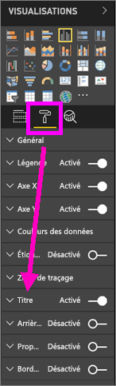
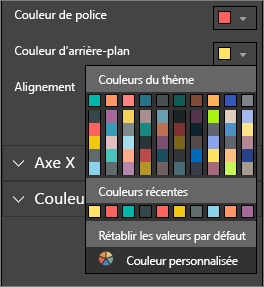
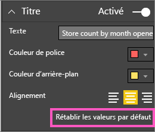
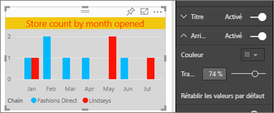
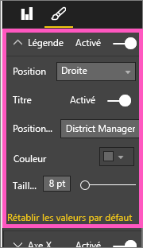
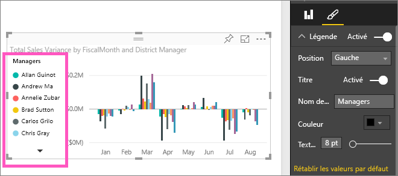

# Personnaliser le titre, la légende et l’arrière-plan d’une visualisation

Ce tutoriel présente quelques façons de personnaliser vos visualisations. Il existe autant d’options permettant de personnaliser vos visualisations. La meilleure façon de les découvrir toutes consiste à Explorer le volet **Mise en forme** (sélectionnez l’icône rouleau de peinture). Pour vous aider à commencer, cet article explique comment personnaliser le titre, la légende et l’arrière-plan d’une visualisation.

Vous ne pouvez pas personnaliser toutes les visualisations. Consultez le [la liste complète](#visualization-types-that-you-can-customize) des visualisations pour plus d’informations.

Avancez à 4:50 dans la vidéo pour une démonstration de la façon de personnaliser les visualisations :

<iframe width="560" height="315" src="https://www.youtube.com/embed/IkJda4O7oGs" frameborder="0" allowfullscreen></iframe>

Maintenant, suivez les instructions ci-dessous pour essayer par vous-même avec vos propres données.

## Conditions préalables

- Service Power BI ou Power BI Desktop

- Exemple de rapport Analyse de la vente au détail

## Personnaliser les titres des visualisations dans les rapports

Pour suivre la procédure, connectez-vous au [service Power BI](https://app.powerbi.com), puis ouvrez le rapport [Exemple Analyse de la vente au détail](../sample-datasets.md) dans la vie [Modifier le rapport](../service-interact-with-a-report-in-editing-view.md).

> [!NOTE]
> Quand vous épinglez une visualisation à un tableau de bord, elle prend la forme d’une vignette de tableau de bord. Vous pouvez également personnaliser les vignettes proprement dites [en modifiant leurs titres et sous-titres, en leur ajoutant des liens hypertexte et en les redimensionnant](../service-dashboard-edit-tile.md).

1. Accédez à la page **New Stores** du rapport **Exemple Analyse de la vente**.

1. Sélectionnez l’histogramme groupé **Open Store Count by Open Month and Chain**.

1. Dans le volet **Visualisations**, sélectionnez l’icône représentant un rouleau pour afficher les options de mise en forme.

1. Sélectionnez **Titre** pour développer cette section.

   

1. Déplacez le curseur **Titre** sur **Activé**.

   

1. Pour modifier le titre, tapez *Store count by month opened **(Nombre d’ouvertures de magasins pas mois) dans le champ**Texte du titre*.

1. Changez la **Couleur de police** en orange et la **Couleur d’arrière-plan** en jaune.

    1. Sélectionnez la flèche déroulante et choisissez une couleur dans **Couleurs du thème**, **Couleurs récentes** ou **Couleur personnalisée**.

        

    1. Sélectionnez la flèche déroulante pour fermer la fenêtre des couleurs.

       Enregistrez les modifications que vous avez apportées.

       Si vous avez besoin d’annuler toutes les modifications, vous pouvez revenir aux couleurs par défaut en sélectionnant **Rétablir les valeurs par défaut** dans la fenêtre des couleurs.

1. Augmentez la taille du texte à **12 pt**.

1. Vous allez effectuer une dernière personnalisation : aligner le titre du graphique au centre de la visualisation.

    

À ce stade du tutoriel, le titre de votre histogramme groupé doit ressembler à ceci :

Enregistrez les modifications que vous avez apportées, puis passez à la section suivante.

Si vous devez annuler toutes les modifications, sélectionnez **Rétablir les valeurs par défaut** en bas du volet de personnalisation **Titre**.

## Personnaliser les arrière-plans des visualisations

En reprenant le même histogramme groupé, développez les options **Arrière-plan**.

1. Déplacez le curseur **Arrière-plan** sur **Activé**.

1. Sélectionnez la liste déroulante et choisissez une couleur grise.

1. Changez la **Transparence** à **74 %** .

À ce stade du tutoriel, l’arrière-plan de votre histogramme groupé doit ressembler à ceci :

Enregistrez les modifications que vous avez apportées, puis passez à la section suivante.

Si vous devez annuler toutes les modifications, sélectionnez **Rétablir les valeurs par défaut** en bas du volet de personnalisation **Arrière-plan**.

## Personnaliser les légendes des visualisations

1. Ouvrez la page de rapport **Présentation** et sélectionnez le graphique **Total Sales Variance par FiscalMonth et directeur régional** (Variance du nombre de ventes totales par MoisFiscal et directeur régional).

1. Dans l’onglet **Visualisation**, sélectionnez l’icône en forme de rouleau pour ouvrir le volet Mise en forme.

1. Développez les options de **Légende** :

      

1. Déplacez le curseur **Légende** sur **Activé**.

1. Déplacez la légende à gauche de la visualisation.

1. Ajoutez un titre de légende en basculant le **Titre** sur **Activé**.

1. Entrez *Gestionnaires* dans le champ **Nom de la légende**.

À ce stade du tutoriel, la légende de votre histogramme groupé doit ressembler à ceci :

Enregistrez les modifications que vous avez apportées, puis passez à la section suivante.

Si vous devez annuler toutes les modifications, sélectionnez **Rétablir les valeurs par défaut** en bas du volet de personnalisation **Légende**.

## Types de visualisations que vous pouvez personnaliser

Voici une liste des visualisations et des options de personnalisation respectivement disponibles :

| Visualisation | Titre | Arrière-plan | Légende |
|:--- |:--- |:--- |:--- |
| Zone | oui | oui |oui |
| Barres | oui | oui |oui |
| Carte | oui | oui |n/a |
| Carte à plusieurs lignes | oui | oui | n/a |
| Colonne | oui | oui | oui |
| Combiné | oui | oui | oui |
| Graphique en anneau | oui | oui | oui |
| Carte choroplèthe | oui | oui | oui |
| Entonnoir | oui | oui | n/a |
| Jauge | oui | oui | n/a |
| KPI | oui | oui | n/a |
| Ligne | oui | oui | oui |
| Carte | oui | oui | oui |
| Matrice | oui | oui | n/a |
| Secteurs | oui | oui | oui |
| Nuage de points | oui | oui | oui |
| Segment | oui | oui | n/a |
| Table | oui | oui | n/a |
| Zone de texte | non | oui | n/a |
| Treemap | oui | oui | oui |
| Cascade | oui | oui | oui |

## Étapes suivantes

- [Personnaliser les propriétés des axes X et Y](power-bi-visualization-customize-x-axis-and-y-axis.md)

- [Prise en main de la mise en forme des couleurs et des propriétés d’axe](service-getting-started-with-color-formatting-and-axis-properties.md)

- [Concepts de base pour les consommateurs du service Power BI](../consumer/end-user-basic-concepts.md)

D’autres questions ? [Posez vos questions à la communauté Power BI](http://community.powerbi.com/)
