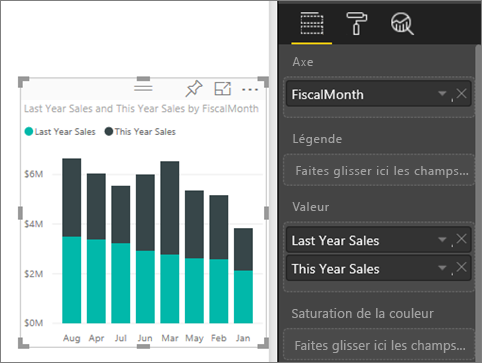
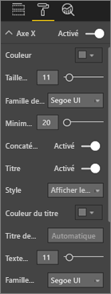
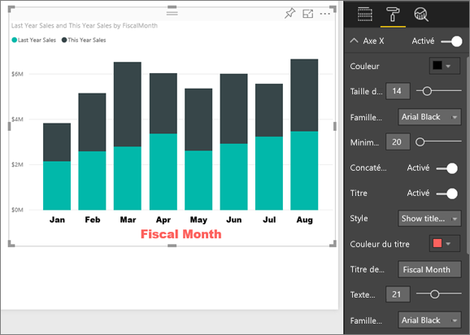
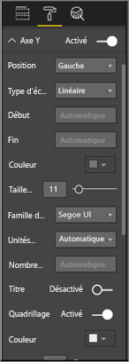
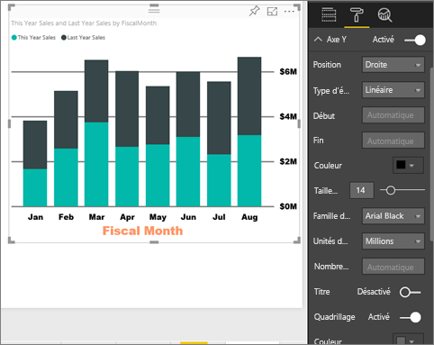
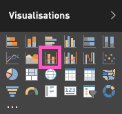
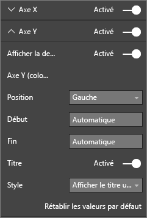

# Personnaliser les propriétés des axes X et Y

Dans ce didacticiel, vous allez découvrir de nombreuses façons de personnaliser les axes X et Y de vos visuels. Certains visuels ne comportent aucun axe. Par exemple, les graphiques en secteurs, n’ont pas d’axes. Et les options de personnalisation varient d’un visuel à un autre. Comme il y a trop d’options pour les couvrir dans un seul article, nous allons examiner certaines des personnalisations d’axes les plus utilisées et vous aidez à vous familiariser avec l’utilisation de l’onglet **Mise en forme** visuelle dans le canevas de rapport Power BI.  

> [!NOTE]
> Cette page s’applique à la fois au service Power BI et à Power BI Desktop. Ces personnalisations sont disponibles quand l’icône **Mise en forme** (représentant un rouleau ) est sélectionnée, ainsi que dans Power BI Desktop.

Regardez comment Amanda personnalise ses axes X et Y. Elle montre les différentes façons de contrôler la concaténation quand elle monte ou descend dans la hiérarchie.

<iframe width="560" height="315" src="https://www.youtube.com/embed/9DeAKM4SNJM" frameborder="0" allowfullscreen></iframe>

## Conditions préalables

- Le service Power BI

- Exemple de rapport Analyse de la vente au détail

## Personnaliser les axes X et Y des visualisations dans les rapports

Pour suivre la procédure, connectez-vous au [service Power BI](https://app.powerbi.com), puis ouvrez le rapport [Exemple Analyse de la vente au détail](../sample-datasets.md) dans la vie [Modifier le rapport](../service-interact-with-a-report-in-editing-view.md).

### Créer une visualisation d’histogramme empilé

Avant de pouvoir personnaliser la visualisation, vous devez la générer.

1. Dans le service Power BI, développez **Mon espace de travail**.

1. Faites défiler vers le bas et sélectionnez **Exemple Analyse de la vente au détail** dans la liste des **jeux de données**.

1. Dans le volet **Visualisations**, sélectionnez l’icône d’histogramme empilé.

    

1. Pour définir les valeurs de l’axe X, dans le volet **Champs**, sélectionnez **Temps** > **MoisFiscal**.

1. Pour définir les valeurs de l’axe Y, dans le volet **Champs**, sélectionnez **Sales (Ventes)**  > **Last Year Sales (Ventes de l’année dernière)** et **Sales (Ventes)**  > **This Year Sales (Ventes de cette année)**  > **Value (Valeur)** .

    

### Personnaliser l’axe X

Vous pouvez désormais personnaliser votre axe X.

1. Dans le volet **Visualisations**, sélectionnez **Mise en forme** (icône représentant un rouleau ) pour afficher les options de personnalisation.

1. Développez les options de l’axe X.

   

1. Déplacez le curseur **Axe X** sur **Activé**.

    

    Vous souhaitez peut-être désactiver l’axe X pour gagner de l’espace pour des données supplémentaires.

1. Mettez en forme la police, la taille et la couleur du texte :

    - **Couleur** : Sélectionnez noir

    - **Taille du texte** : Entrez *14*

    - **Famille de polices** : Sélectionnez **Arial noir**

1. Définissez l’option **Titre** sur **Activé** pour afficher le nom de l’axe X. Dans ce cas, il s’agit de **MoisFiscal**.

1. Mettez en forme la police, la taille et la couleur de texte du titre :

    - **Couleur du titre** : Sélectionnez orange

    - **Titre de l’axe** : Entrez *Mois fiscal*

    - **Taille du texte du titre** : Entrez *21*

Une fois les personnalisations effectuées, votre histogramme empilé doit ressembler à ceci :

Enregistrez les modifications que vous avez apportées, puis passez à la section suivante.

Si vous devez annuler toutes les modifications, sélectionnez **Rétablir les valeurs par défaut** en bas du volet de personnalisation **Axe X**.

### Personnaliser l’axe Y

Vous allez maintenant personnaliser votre axe Y.

1. Développez les options de l’axe Y.

   

1. Déplacez le curseur **Axe Y** sur **Activé**.  

    

    Vous souhaitez peut-être désactiver l’axe Y afin de gagner de l’espace pour des données supplémentaires.

1. Définissez la **position** de l’axe Y sur **Droite**.

1. Mettez en forme la police, la taille et la couleur du texte :

    - **Couleur** : Sélectionnez noir

    - **Taille du texte** : Entrez *14*

    - **Famille de polices** : Sélectionnez **Arial noir**

1. Définissez **Unités d’affichage** sur **Millions** et **Valeurs décimales** sur *0*.

1. Pour cette visualisation, étant donné que la présence d’un titre pour l’axe Y n’améliore pas le visuel, laissez **Titre** désactivé (**Off**).  

1. Faisons ressortir les lignes du quadrillage en changeant la couleur et en augmentant l’épaisseur du trait :

    - **Couleur** : Sélectionnez gris foncé

    - **Épaisseur du trait** : Entrez *2*

Après toutes ces personnalisations, votre histogramme doit ressembler à ceci :

## Personnalisation des visualisations ayant deux axes Y

Tout d’abord, vous allez créer un graphique combiné qui montre l’impact du nombre de magasins sur les ventes. C’est le même graphique que celui créé dans le [tutoriel sur le graphique combiné](power-bi-visualization-combo-chart.md). Vous allez ensuite mettre en forme les deux axes Y.

### Créer un graphique avec deux axes Y

1. Créez un graphique en courbes qui affiche les éléments suivants : **Sales > Gross Margin last year % (Ventes > Pourcentage de marge brute de l’année précédente)** par rapport à **Time > FiscalMonth (Temps > MoisFiscal)** .

    

    > [!NOTE]
    > Pour plus d’informations sur le tri par mois, consultez [Tri à l’aide d’autres critères](../consumer/end-user-change-sort.md#other).

    En janvier, le pourcentage de marge brute était de 35 %, avec un pic à 45 % en avril, une baisse en juillet, puis une nouvelle augmentation en août. Verrons-nous un modèle similaire dans les ventes de l’année dernière et de cette année ?

1. Ajoutez **This Year Sales > Value** (Ventes de l’année > Valeur) et **Last Year Sales** (Ventes de l’année dernière) au graphique en courbes.

    

    L’échelle utilisée pour **Gross Margin Last Year %** (Pourcentage de marge brute de l’année précédente) (ligne bleue le long du quadrillage **0M%** ) est beaucoup plus petite que l’échelle pour **Sales** (Ventes), ce qui rend difficile la comparaison des données. Et les pourcentages des étiquettes de l’axe Y sont mal formatés.

1. Pour faciliter la lecture et l’analyse de la visualisation, convertissez le graphique en courbes en un graphique en courbes et histogramme empilé.

   

1. Faites glisser **Gross Margin Last Year %** (Pourcentage de marge brute de l’année précédente) de **Valeurs de colonne** vers **Valeurs de ligne**.

    

    Vous disposez maintenant de l’histogramme empilé que vous avez créé dans la première section, avec un graphique en courbes superposé sur celui-ci. Le cas échéant, utilisez ce que vous avez appris ci-dessus pour formater la couleur et la taille de police des axes.

   

   Power BI crée deux axes Y, ce qui permet de mettre à l'échelle les jeux de données différemment. L’axe de gauche mesure le montant des ventes et l’axe de droite mesure le pourcentage.

### Mettre en forme l’axe Y secondaire

1. Dans le volet **Visualisations**, sélectionnez l’icône représentant un rouleau pour afficher les options de mise en forme.

1. Développez les options de l’axe Y.

1. Faites défiler vers le bas jusqu'à l’option **Afficher les valeurs secondaires**. Vérifiez que cette option est activée (**On**).

   

1. (Facultatif) Personnalisez les deux axes. Si vous basculez **Position** sur l’axe des colonnes ou l’axe des lignes, les deux axes changent de côté.

### Ajouter des titres aux deux axes

Dans une visualisation si complexe, il est utile d’ajouter des titres aux axes.  Les titres permettent à vos collègues de mieux comprendre le contenu de votre visualisation.

1. Basculez **Titre** sur **Activé** pour **Axe Y (colonne)** et **Axe Y (ligne)** .

1. Définissez **Style** sur **Afficher le titre uniquement** pour les deux axes.

   

1. Votre graphique combiné affiche maintenant les deux axes, chacun avec un titre.

   

Pour plus d’informations, consultez [Trucs et astuces pour la mise en forme des couleurs dans Power BI](service-tips-and-tricks-for-color-formatting.md).

## Considérations et résolution des problèmes

Si l’axe X est considéré par le propriétaire du rapport comme un type de date, l’option **Type** s’affiche et vous pouvez choisir entre Continu ou Catégorie.

## Étapes suivantes

- [Visualisations dans des rapports Power BI](power-bi-report-visualizations.md)

- [Personnaliser le titre, la légende et l’arrière-plan d’une visualisation](power-bi-visualization-customize-title-background-and-legend.md)

- [Prise en main de la mise en forme des couleurs et des propriétés d’axe](service-getting-started-with-color-formatting-and-axis-properties.md)

- [Concepts de base pour les consommateurs du service Power BI](../consumer/end-user-basic-concepts.md)

D’autres questions ? [Posez vos questions à la communauté Power BI](http://community.powerbi.com/)
