# Personnaliser les propriétés des axes X et Y

[!INCLUDE[consumer-appliesto-nyyn](../includes/consumer-appliesto-nyyn.md)]    

[!INCLUDE [power-bi-visuals-desktop-banner](../includes/power-bi-visuals-desktop-banner.md)]

Dans ce tutoriel, vous allez découvrir de nombreuses façons de personnaliser les axes X et Y de vos visuels. Certains visuels ne comportent aucun axe. Par exemple, les graphiques en secteurs, n’ont pas d’axes. Et les options de personnalisation varient d’un visuel à un autre. Comme il y a trop d’options pour les couvrir dans un seul article, nous allons examiner certaines des personnalisations les plus utilisées et vous aider à vous familiariser avec l’utilisation de l’onglet **Mise en forme** visuelle dans le canevas de rapport Power BI.  

Regardez comment Amanda personnalise les axes X et Y. Elle montre également les différentes façons de contrôler la concaténation en montant ou en descendant dans la hiérarchie.

> [!NOTE]
> Cette vidéo utilise une version antérieure de Power BI.

<iframe width="560" height="315" src="https://www.youtube.com/embed/9DeAKM4SNJM" frameborder="0" allowfullscreen></iframe>

## Prérequis

- Power BI Desktop

- [Exemple Analyse de la vente au détail](https://download.microsoft.com/download/9/6/D/96DDC2FF-2568-491D-AAFA-AFDD6F763AE3/Retail%20Analysis%20Sample%20PBIX.pbix)

## Ajouter une nouvelle visualisation

Avant de pouvoir personnaliser la visualisation, vous devez la générer.

1. Dans Power BI Desktop, ouvrez l’exemple Analyse de la vente au détail.  

2. En bas, sélectionnez l’icône de signe plus jaune pour ajouter une nouvelle page. 

    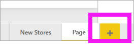

1. Dans le volet **Visualisations** , sélectionnez l’icône d’histogramme empilé. Cette action ajoute un modèle vide au canevas du rapport.

    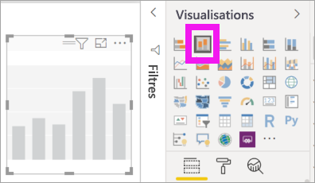

1. Pour définir les valeurs de l’axe X, dans le volet **Champs** , sélectionnez **Temps** > **FiscalMonth** (MoisFiscal).

1. Pour définir les valeurs de l’axe Y, dans le volet **Champs** , sélectionnez **Sales** > **Last Year Sales** (Ventes > Ventes de l’année dernière) et **Sales** > **This Year Sales** > **Value** (Ventes > Ventes de cette année > Valeur).

    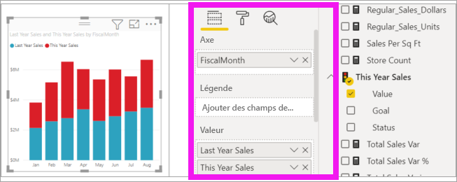

    Vous pouvez désormais personnaliser votre axe X. Power BI offre des options presque illimitées pour mettre en forme votre visualisation. 

## Personnaliser l’axe X
Beaucoup de fonctionnalités peuvent être personnalisées pour l’axe X. Vous pouvez ajouter et modifier les étiquettes de données et le titre de l’axe X. Pour les catégories, vous pouvez modifier la largeur, la taille et le remplissage des barres, des colonnes, des lignes et des zones. Pour les valeurs, vous pouvez modifier les unités d’affichage, les décimales et le quadrillage. L’exemple suivant illustre la personnalisation d’un histogramme. Nous allons ajouter quelques personnalisations pour vous familiariser avec les options, puis vous pourrez continuer d’explorer le reste par vous-même.

### Personnaliser les étiquettes de l’axe X
Les étiquettes de l’axe X sont affichées sous les colonnes du graphique. En l’état, elles sont difficiles à lire du fait de leur couleur gris clair et de leur petite taille. Nous allons changer leur mise en forme.

1. Dans le volet **Visualisations** , sélectionnez **Mise en forme** (icône représentant un rouleau ) pour afficher les options de personnalisation.

2. Développez les options de l’axe X.

   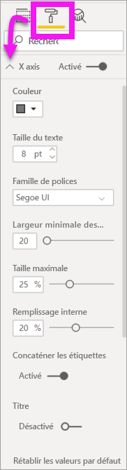

3. Déplacez le curseur **Axe X** sur **Activé**.

    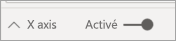

    Vous souhaiterez peut-être définir l’axe X sur **Désactivé** pour différentes raisons, par exemple si la visualisation est suffisamment explicite sans étiquette ou si vous avez besoin de libérer de l’espace dans une page de rapport encombrée afin d’afficher plus de données.

4. Mettez en forme la police, la taille et la couleur du texte :

    - **Couleur**  : Sélectionnez noir

    - **Taille du texte**  : Entrez *14*

    - **Famille de polices**  : Sélectionnez **Arial noir**

    - **Remplissage interne**  : entrez *40 %*

        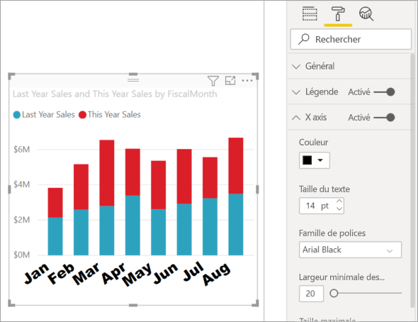
    
5. Vous n’aimez peut-être pas le mode d’affichage du texte de l’axe X sur une diagonale. Plusieurs options s’offrent à vous. 
    - Changez la taille du texte à une valeur inférieure à 14.
    - Agrandissez la visualisation. 
    - Affichez moins de colonnes et ajoutez une barre de défilement en augmentant la valeur **Largeur de catégorie minimale**. 
    
    Ici, nous avons choisi la deuxième option et sélectionné l’une des barres de redimensionnement pour élargir la visualisation. La visualisation restitue maintenant le texte d’une taille de 14 points sans avoir à afficher le texte en angle ni à utiliser une barre de défilement. 

   

### Personnaliser le titre de l’axe X
Quand le titre de l’axe X est **Activé** , il s’affiche sous les étiquettes de l’axe X. 

1. Commencez par définir le titre de l’axe X sur **Activé**.  

    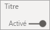

    La première chose que vous remarquez est que votre visualisation a maintenant un titre d’axe X par défaut.  Dans ce cas, il s’agit de **MoisFiscal**.

   

1. Mettez en forme la police, la taille et la couleur de texte du titre :

    - **Couleur du titre**  : Sélectionnez orange

    - **Titre de l’axe**  : tapez *Mois fiscal* (avec un espace)

    - **Taille du texte du titre**  : entrez *18*

    Une fois les personnalisations effectuées, votre histogramme empilé ressemble à ceci :

    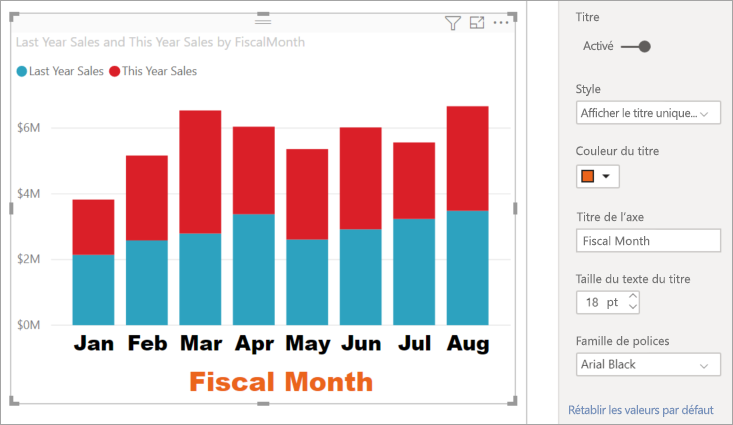

1. Enregistrez les modifications que vous avez apportées, puis passez à la section suivante. Si vous devez annuler toutes les modifications, sélectionnez **Rétablir les valeurs par défaut** en bas du volet de personnalisation **Axe X**. Vous allez maintenant personnaliser votre axe Y.

## Personnaliser l’axe Y
Beaucoup de fonctionnalités peuvent être personnalisées pour l’axe Y. Vous pouvez ajouter et modifier les étiquettes de données, le titre de l’axe Y et le quadrillage. Pour les valeurs, vous pouvez modifier les unités d’affichage, les décimales, le point de début et le point de fin. Pour les catégories, vous pouvez modifier la largeur, la taille et le remplissage des barres, des colonnes, des lignes et des zones. 

L’exemple suivant poursuit notre personnalisation d’un histogramme. Nous allons apporter quelques modifications pour vous familiariser avec les options, puis vous pourrez continuer d’explorer le reste par vous-même.

### Personnaliser les étiquettes de l’axe Y
Les étiquettes de l’axe Y sont affichées à gauche par défaut. En l’état, elles sont difficiles à lire du fait de leur couleur gris clair et de leur petite taille. Nous allons changer leur mise en forme.

1. Développez les options de l’axe Y.

   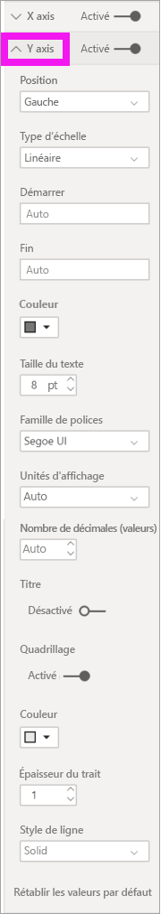

1. Déplacez le curseur **Axe Y** sur **Activé**.  

    

    Vous souhaiterez peut-être désactiver l’axe Y afin de libérer de l’espace pour afficher des données supplémentaires.

1. Mettez en forme la police, la taille et la couleur du texte :

    - **Couleur**  : Sélectionnez noir

    - **Taille du texte**  : entrez *10*

    - **Unités d’affichage**  : sélectionnez **Millions**

    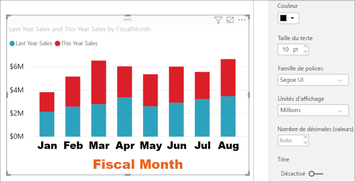

### Personnaliser le titre de l’axe Y
Quand le titre de l’axe Y est **Activé** , il s’affiche à côté des étiquettes de l’axe Y. Pour cette visualisation, étant donné que la présence d’un titre pour l’axe Y n’améliore pas le visuel, laissez **Titre** désactivé ( **Off** ). Nous ajouterons des titres d’axe Y à un visuel à deux axes plus tard dans ce tutoriel. 

### Personnaliser le quadrillage
Faisons ressortir les lignes du quadrillage en changeant la couleur et en augmentant l’épaisseur du trait :

- **Couleur**  : Sélectionnez orange

- **Épaisseur du trait**  : Entrez *2*

Après toutes ces personnalisations, votre histogramme doit ressembler à ceci :

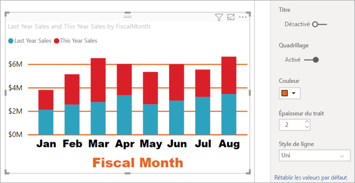

## Personnalisation des visualisations ayant deux axes Y

Dans certaines visualisations, il peut être utile d’avoir deux axes Y. Les graphiques combinés en sont un bon exemple. Avant de mettre en forme deux axes Y, nous allons créer un graphique combiné qui compare les tendances des ventes et la marge brute.  

### Créer un graphique avec deux axes Y

1. Sélectionnez l’histogramme, puis changez-le en graphique *en courbes et histogramme empilé*. Ce type de visuel prend en charge une seule valeur de graphique en courbes et plusieurs valeurs de colonnes empilables. 

    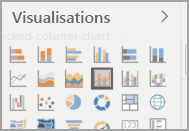
   

2. Faites glisser **Sales** > **Gross Margin Last Year %** (Ventes > Pourcentage de marge brute de l’année précédente) du volet Champs vers le compartiment **Valeurs de ligne**.

    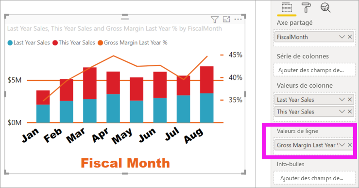

    
3. Modifiez la mise en forme de la visualisation afin de supprimer les étiquettes de l’axe X en angle. 

   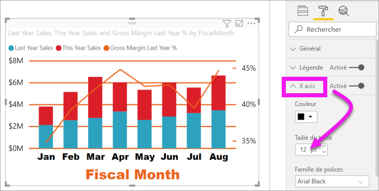

   Power BI crée deux axes Y, ce qui vous permet d’afficher les valeurs selon une échelle différente. L’axe de gauche mesure le montant des ventes et l’axe de droite mesure le pourcentage de marge brute.

### Mettre en forme le second axe Y
Comme nous avons commencé avec une visualisation comportant un seul axe Y mis en forme, Power BI créé le deuxième axe Y en appliquant les mêmes paramètres. Toutefois, nous pouvons modifier cela. 

1. Dans le volet **Visualisations** , sélectionnez l’icône représentant un rouleau pour afficher les options de mise en forme.

1. Développez les options de l’axe Y.

1. Faites défiler vers le bas jusqu'à l’option **Afficher les valeurs secondaires**. Vérifiez que cette option est activée ( **On** ). Notre second axe Y représente le graphique en courbes.

   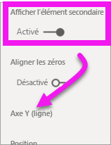

1. (Facultatif) Personnalisez la couleur de la police, la taille et les unités d’affichage des deux axes. Si vous basculez **Position** sur l’axe des colonnes ou l’axe des lignes, les deux axes changent de côté.

### Ajouter des titres aux deux axes

Dans une visualisation complexe, il est utile d’ajouter des titres aux axes.  Les titres permettent à vos collègues de mieux comprendre le contenu de votre visualisation.

1. Basculez **Titre** sur **Activé** pour **Axe Y (colonne)** et **Axe Y (ligne)** .

1. Définissez **Style** sur **Afficher le titre uniquement** pour les deux axes.

   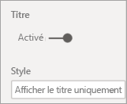

1. Votre graphique combiné affiche maintenant les deux axes, chacun avec un titre.

   

1. Mettez en forme les titres. Dans cet exemple, nous avons raccourci l’un des titres et réduit la taille de police des deux titres. 
    - Taille de police : **9**
    - **Titre de l’axe** raccourci pour le premier axe Y (l’histogramme) : Ventes l’année dernière/cette année. 
    
     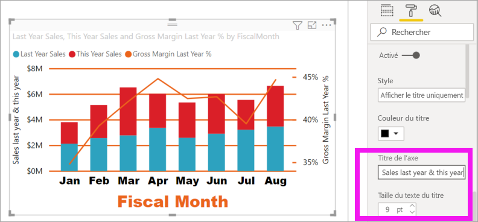

    Pour plus d’informations, consultez [Trucs et astuces pour la mise en forme des couleurs dans Power BI](service-tips-and-tricks-for-color-formatting.md) et [Personnaliser le titre, la légende et l’arrière-plan d’une visualisation](power-bi-visualization-customize-title-background-and-legend.md). 
    

## Étapes suivantes

- [Visualisations dans des rapports Power BI](power-bi-report-visualizations.md)

D’autres questions ? [Posez vos questions à la communauté Power BI](https://community.powerbi.com/)
