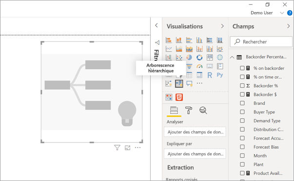
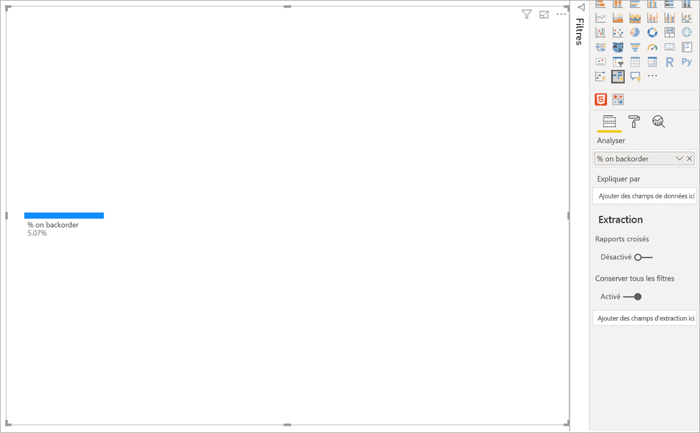
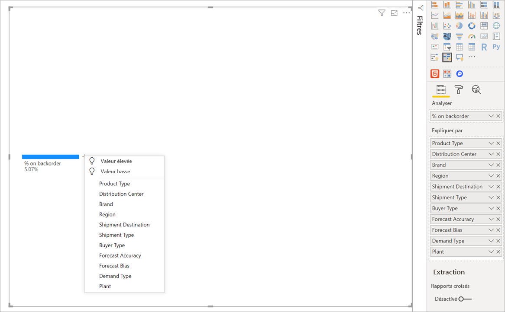
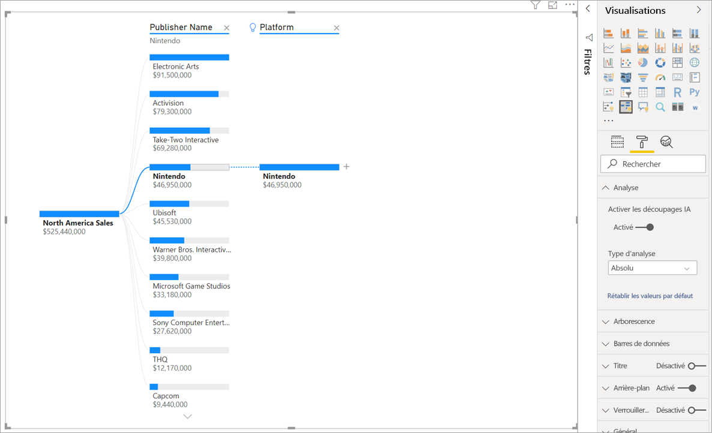
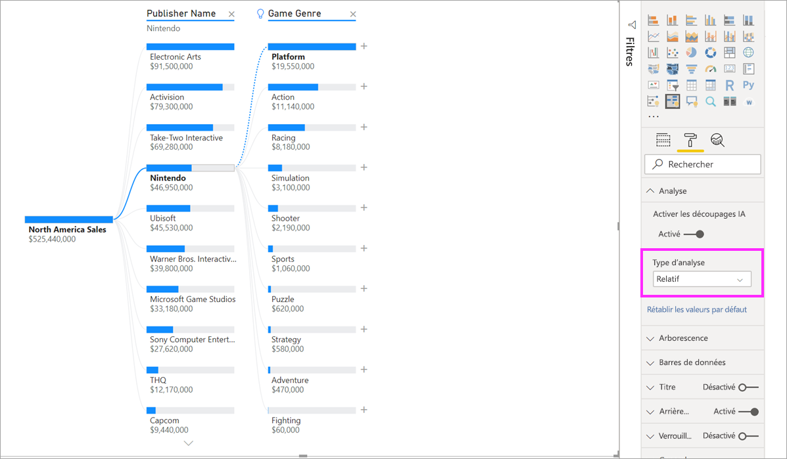
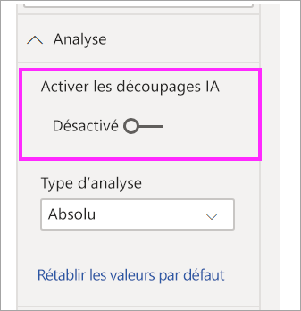

# Créer et afficher des visuels d’arborescence hiérarchique dans Power BI

[!INCLUDE[consumer-appliesto-nyyn](../includes/consumer-appliesto-nyyn.md)]

[!INCLUDE [power-bi-visuals-desktop-banner](../includes/power-bi-visuals-desktop-banner.md)]

Le visuel de l’arborescence hiérarchique dans Power BI vous permet de visualiser les données sur plusieurs dimensions. Il agrège automatiquement les données et permet d'explorer vos dimensions dans n'importe quel ordre. Comme il s’agit également d’une visualisation à intelligence artificielle (IA), vous pouvez lui demander de trouver la prochaine dimension à explorer selon certains critères. Cela en fait un outil précieux pour l'exploration ad hoc et l'analyse de la cause racine.

Ce didacticiel utilise deux exemples :

- Un scénario de chaîne d'approvisionnement qui analyse le pourcentage de produits en rupture de stock.  
- Un scénario de vente qui décompose les ventes de jeux vidéo selon de nombreux facteurs tels que le genre de jeu et l'éditeur.

Vous pouvez trouver le pbix utilisé dans le scénario de chaîne d’approvisionnement ici : [Supply Chain Sample.pbix](
https://github.com/microsoft/powerbi-desktop-samples/blob/master/Sample%20Reports/Supply%20Chain%20Sample.pbix).

> [!NOTE]
> Pour que vous puissiez partager votre rapport avec un collègue Power BI, il faut que vous disposiez tous deux de licences individuelles Power BI Pro ou que le rapport soit enregistré dans une capacité Premium.    

## Commencer
Sélectionnez l'icône de l'arborescence hiérarchique dans le volet Visualisations.

La visualisation nécessite deux types d’entrée :

 - **Analyser**  : la métrique que vous souhaitez analyser. Il doit s'agir d'une mesure ou d'un agrégat.  
 - **Expliquez par**  : une ou plusieurs dimensions que vous souhaitez explorer.

Une fois que vous avez déposé votre métrique dans le champ, les mises à jour des visuels présentent la métrique agrégée. Dans l’exemple ci-dessous, nous visualisons le pourcentage moyen de produits en rupture de stock (5,07 %).

L'étape suivante consiste à introduire une ou plusieurs dimensions à explorer. Ajoutez ces champs au compartiment **Expliquer par**. Notez qu'un signe plus apparaît en regard de votre nœud racine. Ce signe plus vous permet de choisir la zone à explorer (vous pouvez explorer les champs dans l'ordre de votre choix).

Si vous sélectionnez **Forecast bias** (Biais de prévision), l'arborescence se développe et décompose la métrique selon les valeurs de la colonne. Ce processus peut être répété en choisissant un autre nœud à explorer.

La sélection d'un nœud dans le dernier niveau entraîne un filtrage croisé des données. La sélection d'un nœud dans un niveau précédent modifie le chemin d'accès.

L'interaction avec d'autres visuels entraîne un filtrage croisé de l'arborescence hiérarchique. L'ordre des nœuds à l'intérieur des niveaux pourrait changer en conséquence.
Dans l'exemple ci-dessous, nous avons appliqué un filtrage croisé à l'arborescence par Ubisoft. Les mises à jour du chemin et les ventes de Xbox passent de la première à la deuxième place, devancées par la PlayStation. 

Si l'on applique ensuite un filtrage croisé à l’arborescence à l’aide du critère Nintendo, les ventes de Xbox sont vides car il n’existe aucun jeu Nintendo développé pour Xbox. Xbox, ainsi que son chemin, disparaissent de l’arborescence.

Malgré la disparition du chemin, les niveaux existants (en l'occurrence Genre de jeu) sont conservés dans l'arborescence. En sélectionnant le nœud Nintendo, l'arborescence développe automatiquement le niveau Genre de jeu.

## Découpages IA

Vous pouvez utiliser des « découpages IA » pour spécifier les prochaines données à examiner. Ces découpages apparaissent en haut de la liste et sont signalés par une ampoule. Ils vous aident à identifier automatiquement les valeurs hautes et basses dans les données.

L'analyse peut fonctionner de deux façons, selon vos préférences. Le comportement par défaut est le suivant :

 - **Valeur élevée**  : Considère tous les champs disponibles et détermine celui qu'il faut explorer pour obtenir la valeur la plus haute de la métrique analysée.  
 - **Valeur basse**  : Considère tous les champs disponibles et détermine celui qu'il faut explorer pour obtenir la valeur la plus basse de la métrique analysée.  

Si vous sélectionnez **Valeur élevée** dans l'exemple des produits en rupture de stock, vous obtenez les résultats suivants :

Une ampoule apparaît à côté de **Type de produit** pour indiquer qu'il s'agit d'un « découpage IA ». L'arborescence affiche également une ligne pointillée recommandant le nœud **Patient Monitoring** (Suivi des patients), car elle génère la valeur la plus élevée des produits en rupture de stock (9,2 %). 

Pointez sur l'ampoule pour afficher une info-bulle. Dans cet exemple, l'info-bulle indique « % on backorder is highest when Product Type is Patient Monitoring » (% des produits en rupture de stocke le plus élevé lorsque le type de produit est le suivi des patients).

Vous pouvez configurer le visuel pour qu'il identifie les découpages IA **Relative** (relatifs) plutôt que les découpages **Absolute** (absolus). 

Le mode Relative recherche les valeurs hautes qui se démarquent (par rapport au reste des données de la colonne). Pour illustrer cela, prenons un exemple :

Dans la capture d'écran ci-dessus, nous examinons les ventes de jeux vidéo en Amérique du Nord. Nous divisons d'abord l'arborescence par **Nom de l'éditeur** , puis nous explorons le critère Nintendo. La sélection de l’option **Valeur élevée** entraîne l'expansion du champ **Platform is Nintendo** (Plate-forme Nintento). Étant donné que Nintendo (l'éditeur) développe uniquement des jeux pour les consoles Nintendo, il n'y a qu'une seule valeur présente, et c'est donc, sans surprise, la valeur la plus élevée.

Néanmoins, il serait plus intéressant d'examiner quelle valeur élevée se démarque des autres valeurs de la même colonne. Si nous changeons le type d'analyse de **Absolute** à **Relative** , nous obtenons le résultat suivant pour Nintendo : 

Cette fois, la valeur recommandée est **Platform within Game Genre** (Plate-forme dans Genre de jeu).  Le champ Platform (Plate-forme) ne génère aucune valeur absolue supérieure à celle de Nintendo (19 950 000 $ contre 46 950 000 $). Néanmoins, c'est une valeur qui se démarque.

Plus précisément, puisqu'il existe 10 valeurs de genre de jeu, la valeur attendue pour la plate-forme serait de 4,6 millions de dollars si elles devaient être réparties de façon égale. Puisque le champ Platform affiche une valeur de près de 20 millions de dollars, le résultat est intéressant car il est quatre fois plus élevé que le résultat attendu.

Le calcul est le suivant :

North America Sales for Platform/ Abs(Avg(North America Sales for Game Genre))  
et  
North America Sales for Nintendo / Abs(Avg(North America Sales for Platform))  

Ce qui se traduit par :

19,550,000 / (19,550,000 + 11,140,000 + ... + 470,000 + 60,000 /10) = 4.25x  
et  
46,950,000/ (46,950,000/1) = 1x  

Si vous préférez ne pas utiliser de découpages IA dans l'arborescence, vous pouvez également les désactiver dans les options de **formatage de l’analyse**   :  

## Interactions dans l’arborescence avec des découpages IA

Vous pouvez avoir plusieurs niveaux d'IA subséquents. Vous pouvez également combiner différents types de niveaux d'IA (passer de Valeur élevée à Valeur basse, puis de nouveau à Valeur élevée) :

Si vous sélectionnez un autre nœud dans l'arborescence, les découpages IA effectuent un nouveau calcul à partir de zéro. Dans l'exemple ci-dessous, nous avons modifié le nœud sélectionné au niveau **Forecast Bias** (Biais de prévision). Les niveaux suivants changent pour afficher les valeurs élevées et basses correctes pour le champ.

Les niveaux d'IA sont également recalculés lorsque vous filtrez l'arborescence hiérarchique selon un autre visuel. Dans l'exemple ci-dessous, nous pouvons constater que notre pourcentage de produits en rupture de stock est le plus élevé pour l'usine 0477.

Mais si nous sélectionnons **April** (avril) dans l’histogramme, la valeur la plus élevée devient **Product Type is Advanced Surgical** (Type de produit est chirurgie avancée). Dans ce cas, ce ne sont pas seulement les nœuds qui ont été réorganisés, mais une colonne complètement différente a été choisie. 

Si nous voulons que les niveaux d'IA se comportent comme des niveaux non-AI, sélectionnez l'ampoule pour rétablir le comportement par défaut. 

Même si plusieurs niveaux d’IA peuvent être combinés, un niveau non-IA ne peut pas suivre un autre niveau d’IA. Si nous effectuons un découpage manuel à la suite d'un découpage IA, l'ampoule du niveau d’IA disparaît et le niveau se transforme en un niveau normal. 

## Verrouillage

Un créateur de contenu peut verrouiller les niveaux pour les utilisateurs de rapports. Lorsqu'un niveau est verrouillé, il ne peut pas être supprimé ou modifié. Un consommateur peut explorer différents chemins à l'intérieur du niveau verrouillé, mais il ne peut pas changer le niveau lui-même. En tant que créateur, vous pouvez survoler les niveaux existants pour afficher l'icône de verrouillage. Vous pouvez verrouiller autant de niveaux que vous le souhaitez, mais les niveaux déverrouillés ne peuvent pas précéder des niveaux verrouillés.

Dans l'exemple ci-dessous, les deux premiers niveaux sont verrouillés. Cela signifie que les consommateurs peuvent modifier les niveaux 3 et 4, et même ajouter de nouveaux niveaux par la suite. Les deux premiers niveaux ne peuvent toutefois pas être modifiés :

## Limites connues

Le nombre maximal de niveaux dans l’arborescence est de 50. Le nombre maximal de points de données visualisables simultanément dans l’arborescence est de 5 000. Nous tronquons les niveaux pour afficher les n premiers. Actuellement, nous affichons les 10 premiers par niveau. 

L'arborescence hiérarchique n'est pas prise en charge dans les scénarios suivants :  
-   Services Analysis Services locaux

Les découpages IA ne sont pas pris en charge dans les scénarios suivants :  
-   Azure Analysis Services
-   Power BI Report Server
-   Publication sur le web
-   Mesures complexes et mesures provenant de schémas d'extensions dans 'Analyzer'

Autres limitations :
- Support dans les Questions et réponses

## Étapes suivantes

[Graphique en anneau Power BI](power-bi-visualization-doughnut-charts.md)

[Visualisation Power BI](power-bi-report-visualizations.md)

