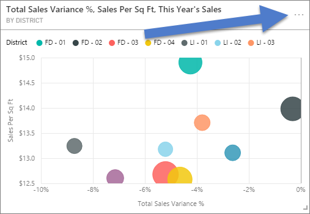
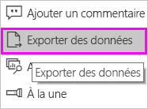
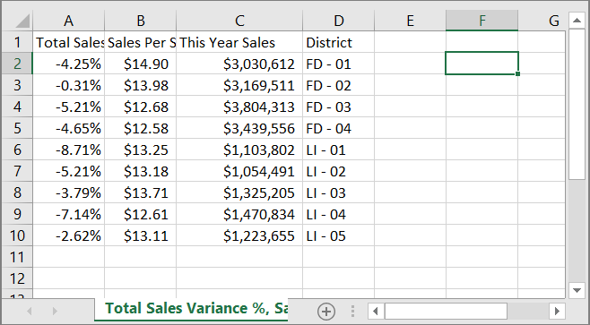
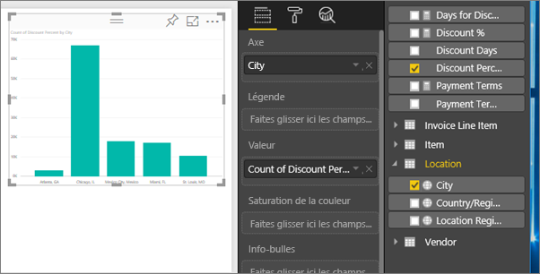
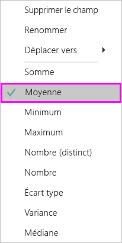
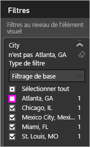
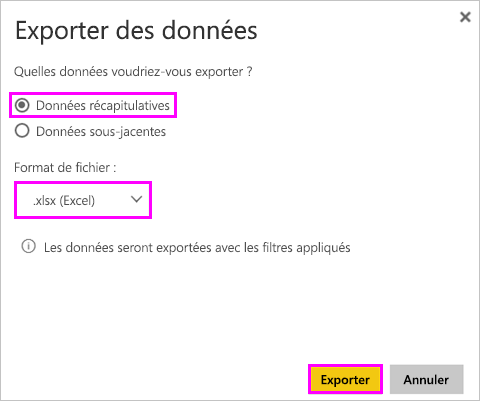
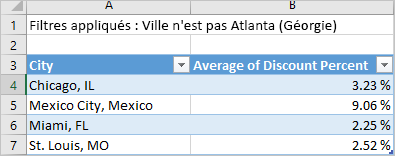
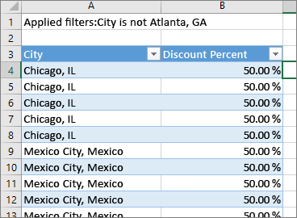
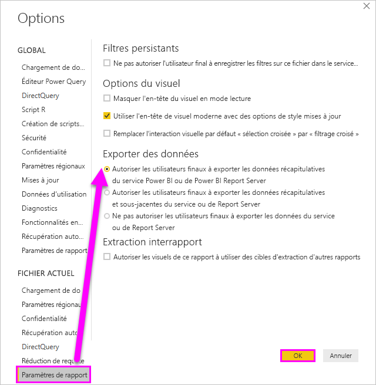

# Exportez des données à partir de visualisations
Si vous souhaitez afficher les données qui sont utilisées pour créer une visualisation, vous pouvez le faire dans Power BI ou exporter ces données vers Excel sous forme de fichier .xlsx ou .csv. La possibilité d’exporter les données nécessite une licence Pro ou Premium et des autorisations de modification sur le jeu de données et le rapport. 

Regardez Will pendant qu’il exporte les données à partir d’une des visualisations de son rapport, les enregistre au format .xlsx et ouvre le fichier dans Excel. Suivez ensuite les instructions détaillées sous la vidéo pour essayer vous-même.

<iframe width="560" height="315" src="https://www.youtube.com/embed/KjheMTGjDXw" frameborder="0" allowfullscreen></iframe>

## À partir d’une visualisation dans un tableau de bord Power BI
1. Sélectionnez les ellipses, dans le coin supérieur droit de la visualisation.

    
2. Sélectionnez l’icône  **Exporter les données**.

    
3. Les données sont exportées dans un fichier .csv. Si l’élément visuel est filtré, les données téléchargées sont aussi filtrées.    
4. Votre navigateur vous invite à enregistrer le fichier.  Lorsque c’est fait, ouvrez le fichier .csv dans Excel.

    

## À partir d’une visualisation dans un rapport
Pour effectuer cette procédure, ouvrez le [rapport Exemple Analyse de l'approvisionnement](../sample-procurement.md) en [mode Édition](../consumer/end-user-reading-view.md). Ajoutez une nouvelle page de rapport vierge. Puis suivez les étapes ci-dessous pour ajouter un regroupement et un filtre au niveau des visualisations.

1. Créez un histogramme.  Dans le volet Champs, sélectionnez **Location > City** (Emplacement > Ville) et **Invoice > Discount Percent** (Facture > % de remise).  Vous devrez peut-être déplacer **Discount Percent** (% de remise) dans la zone Valeur. 

    
2. Définissez l’agrégation **Discount Percent** (% de remise) de **Nombre** à **Moyenne**. Dans la zone Valeur, sélectionnez la flèche à droite de **Discount Percent** (% de remise)(il se peut qu’elle indique **Nombre du pourcentage de remise**), puis choisissez **Moyenne**.

    
3. Ajoutez un filtre à **City** (Ville) pour supprimer **Atlanta**.

   

   Vous êtes maintenant prêt à tester les deux options d’exportation des données. 

4. Sélectionnez les ellipses, dans le coin supérieur droit de la visualisation. Choisissez  **Exporter des données**.

   
5. Dans Power BI en ligne, si votre visualisation a un agrégat (par exemple si vous avez défini **Nombre** sur *Moyenne*, *Somme* ou *Minimum*), vous avez deux options : **Données résumées** et **Données sous-jacentes**. Dans Power BI Desktop, vous aurez seulement l’option **Données résumées**. Pour comprendre le fonctionnement des agrégats, consultez [Agrégats dans Power BI](../service-aggregates.md).
    
6. Sélectionnez **Données résumées** > **Exporter** et choisissez .xlsx ou .csv. Power BI exporte les données.  Si vous avez appliqué des filtres à la visualisation, les données sont exportées en étant filtrées. Lorsque vous sélectionnez **Exporter**, votre navigateur vous invite à enregistrer le fichier. Lorsque c’est fait, ouvrez le fichier dans Excel.

   **Données résumées** : sélectionnez cette option si vous voulez exporter les données correspondant au visuel affiché.  Ce type d’exportation contient uniquement les données (colonnes et mesures) que vous avez choisies pour créer le visuel.  Si le visuel contient un agrégat, vous exportez des données agrégées. Par exemple, si vous avez un graphique à barres affichant 4 barres, vous obtenez 4 lignes de données. Les données résumées sont disponibles aux formats .xlsx et .csv.

   Dans cet exemple, notre exportation Excel affiche un seul total par ville. Étant donné que nous avons filtré et retiré la ville d’Atlanta, celle-ci n’est pas incluse dans les résultats.  La première ligne de la feuille de calcul affiche les filtres qui ont été utilisés lors de l’extraction des données à partir de Power BI.

   
7. Essayez maintenant de sélectionner **Données sous-jacentes** > **Exporter** et .xlsx. Power BI exporte les données. Si vous avez appliqué des filtres à la visualisation, les données sont exportées en étant filtrées. Lorsque vous sélectionnez **Exporter**, votre navigateur vous invite à enregistrer le fichier. Lorsque c’est fait, ouvrez le fichier dans Excel.

   >[!WARNING]
   >L’exportation de données sous-jacentes permet aux utilisateurs de voir toutes les données détaillées, chaque colonne de données. Les administrateurs de service Power BI peuvent désactiver cette option pour leur organisation. Si vous êtes propriétaire d’un jeu de données, vous pouvez définir des colonnes propriétaires comme étant masquées afin qu’elles n’apparaissent pas dans la liste de champs dans le service Power BI ou dans Power BI Desktop.

   **Données sous-jacentes** : sélectionnez cette option si vous voulez afficher les données contenues dans le visuel ***et*** les autres données du modèle (voir le tableau ci-dessous pour plus de détails).  Si votre visualisation contient un agrégat, celui-ci est supprimé si vous sélectionnez *Données sous-jacentes*. Lorsque vous sélectionnez **Exporter**, les données sont exportées dans un fichier .xlsx que votre navigateur vous invite à enregistrer. Lorsque c’est fait, ouvrez le fichier dans Excel.

   Dans cet exemple, notre exportation Excel affiche une seule ligne pour chaque ligne unique Ville de notre jeu de données, ainsi que le pourcentage de remise pour cette entrée unique. En d’autres termes, les données sont aplaties et non agrégées. La première ligne de la feuille de calcul affiche les filtres qui ont été utilisés lors de l’extraction des données à partir de Power BI.  

   

## Exporter les détails concernant les données sous-jacentes
Ce qui s’affiche à l’écran quand vous sélectionnez **Données sous-jacentes** peut varier selon le cas. L’aide de votre administrateur ou de votre service informatique peut s’avérer nécessaire pour bien comprendre ces détails. In Power BI Desktop ou le service Power BI, dans la vue de création de rapports, une *mesure* s’affiche dans la liste Champs avec une icône représentant une calculatrice . Les mesures sont créées dans Power BI Desktop, et non dans le service Power BI.

| Contenu du visuel |                                                                              Contenu de l’exportation                                                                              |
|-----------------|-------------------------------------------------------------------------------------------------------------------------------------------------------------------------------------|
|   Agrégats    |                                                 Le *premier* agrégat et les données non masquées de la table entière pour cet agrégat                                                  |
|   Agrégats    | Les données associées, si le visuel utilise les données d’autres tables de données *\*\*associées*\* à celle qui contient l’agrégat (dans la mesure où il s’agit d’une relation \*: 1 ou 1:1. |
|    Mesures     |                                      Toutes les mesures contenues dans le visuel *et* toutes les mesures d’une table de données contenant une mesure utilisée dans le visuel                                      |
|    Mesures     |                                       Toutes les données non masquées des tables qui contiennent cette mesure (dans la mesure où il s’agit d’une relation \*:1 ou 1:1)                                       |
|    Mesures     |                                      Toutes les données de toutes les tables associées à une ou plusieurs tables contenant les mesures via une chaîne de \*: 1 sur 1:1.                                      |
|  Mesures uniquement  |                                                   Toutes les colonnes non masqués de toutes les tables associées (dans le but d’étendre la mesure)                                                   |
|  Mesures uniquement  |                                                             Les données résumées de toutes les lignes en double pour les mesures du modèle.                                                              |

### Définir les options d’exportation
Les concepteurs de rapports Power BI contrôlent les types d’options d’exportation de données qui sont à la disposition de leurs clients. Les choix sont les suivants :
- Autoriser l’exportation de données totalisées uniquement (il s’agit de la valeur par défaut pour les nouveaux rapports) 
- Autoriser l’exportation de données totalisées et sous-jacentes (il s’agissait de la valeur par défaut avant octobre 2018) 
- Ne pas autoriser l’exportation de données  

    > [!IMPORTANT]
    > Nous recommandons aux concepteurs de rapports de réexaminer les anciens rapports et de réinitialiser manuellement l’option d’exportation en fonction des besoins.

1. Pour définir ces options, démarrez dans Power BI Desktop.

2. Dans le coin supérieur gauche, sélectionnez **Fichier** > **Options et paramètres** > **Options**. 

3. Sous **Fichier actuel**, sélectionnez **Paramètres du rapport**.

    

4. Effectuez votre sélection dans la liste déroulante **Exporter des données**.

Vous pouvez également mettre à jour ce paramètre dans le service Power BI.  

Il est important de noter que si les paramètres du portail d’administration Power BI sont en conflit avec les paramètres du rapport des données d’exportation, les paramètres administrateur remplaceront les paramètres des données d’exportation. 

## Considérations et limitations
* Le nombre maximal de lignes pouvant être exportées de **Power BI Desktop** et du **service Power BI** au format .csv est de 30 000.
* Le nombre maximal de lignes pouvant être exportées au format .xlsx est de 150 000.
* L’exportation à l’aide de *données sous-jacentes* ne fonctionne pas si la source de données est une connexion active Analysis Services, si la version est antérieure à 2016 et si les tables du modèle ne possèdent pas de clé unique.  
* L’exportation à l’aide de *données sous-jacentes* ne fonctionne pas si l’option *Afficher les éléments sans données* est activée pour la visualisation en cours d’exportation.
* Lorsque vous utilisez DirectQuery, la quantité maximale de données pouvant être exportées est de 16 Mo. Cela peut entraîner l’exportation d’un nombre de lignes inférieur au nombre maximal (en particulier en présence de nombreuses colonnes), des données difficiles à compresser et d’autres facteurs qui augmentent la taille du fichier et diminuent le nombre de lignes exportées.
* Si le visuel utilise les données de plusieurs tables de données et qu’il n’existe aucune relation pour ces tables dans le modèle de données, seules les données de la première table sont exportées. 
* Les visuels personnalisés et les visuels R ne sont actuellement pas pris en charge.
* Les données d'exportation ne sont pas disponibles pour les utilisateurs externes à votre organisation qui utilisent un tableau de bord partagé avec eux. 
* Dans Power BI, vous pouvez renommer un champ (colonne) en double-cliquant sur le champ et en tapant un nouveau nom.  Ce nouveau nom est appelé un *alias*. Il est possible qu’un rapport Power BI contienne au final des noms de champs en doublon, mais Excel n’autorise pas les doublons.  Ainsi, quand les données sont exportées vers Excel, les alias de champ reprennent leur nom de champ (colonne) d’origine.  
* Si le fichier .csv contient des caractères Unicode, le texte dans Excel peut ne pas s’afficher correctement. Cependant, l’ouverture dans le bloc-notes fonctionnera correctement. Les symboles monétaires et les mots étrangers sont des exemples de caractères Unicode. La solution consiste à importer le fichier csv dans Excel, au lieu d’ouvrir le fichier csv directement. Pour ce faire :

  1. Ouvrez Excel
  2. Dans l’onglet **Données**, sélectionnez **Obtenir des données externes** > **À partir du texte**.
* Les administrateurs Power BI ont la possibilité de désactiver l’exportation des données.

## Étapes suivantes
[Tableaux de bord dans Power BI](../consumer/end-user-dashboards.md)  
[Power BI – Concepts de base](../consumer/end-user-basic-concepts.md)

D’autres questions ? [Essayez d’interroger la communauté Power BI](http://community.powerbi.com/)

