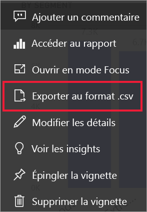
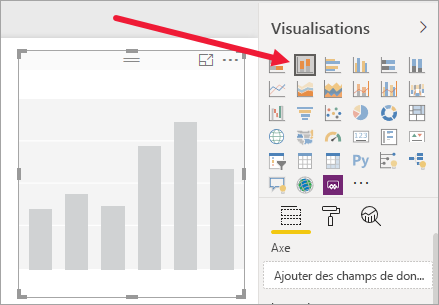
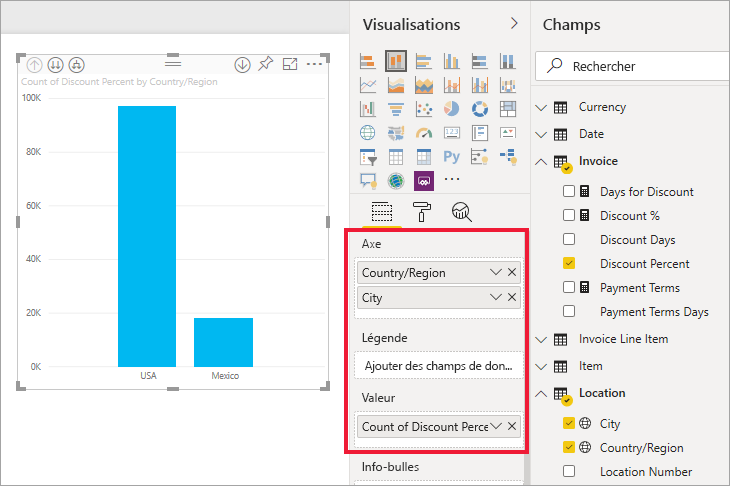
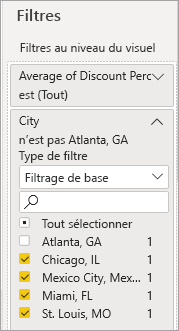
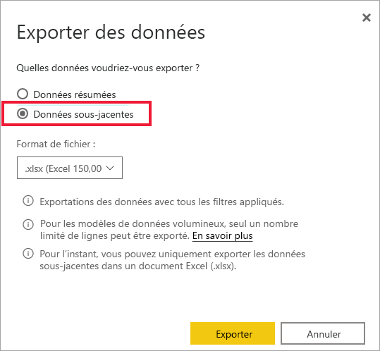

# Exporter les données utilisées pour créer une visualisation

> [!IMPORTANT]
> Les données ne peuvent pas toutes être vues ou exportées par tous les utilisateurs. Les concepteurs de rapports et les administrateurs utilisent des dispositifs de protection lors de la création de tableaux de bord et de rapports. Certaines données sont limitées, masquées ou confidentielles, et ne peuvent pas être vues ou exportées sans autorisations spéciales. 

## Qui peut exporter des données

Si vous avez des autorisations sur les données, vous pouvez voir et exporter les données que Power BI utilise pour créer une visualisation. Souvent, les données sont confidentielles ou limitées à des utilisateurs spécifiques. Dans ce cas, vous ne pourrez pas voir ou exporter ces données. Pour les détails, consultez la section **Limitations et considérations** à la fin de ce document. 

## Consultation et exportation des données

Si vous souhaitez afficher les données utilisées par Power BI pour créer une visualisation, vous pouvez [le faire dans Power BI](service-reports-show-data.md). Vous pouvez également exporter ces données vers Excel sous forme de fichier *.xlsx* ou *.csv*. La possibilité d’exporter les données nécessite une licence Pro ou Premium et des autorisations de modification sur le jeu de données et le rapport. Si vous avez accès au tableau de bord ou au rapport, mais que les données sont classées comme *hautement confidentielles*, Power BI ne vous autorisera pas à exporter les données.

Regardez Will pendant qu’il exporte les données à partir d’une des visualisations de son rapport, les enregistre au format *.xlsx* et ouvre le fichier dans Excel. Suivez ensuite les instructions détaillées sous la vidéo pour essayer vous-même. Notez que cette vidéo utilise une version antérieure de Power BI.

<iframe width="560" height="315" src="https://www.youtube.com/embed/KjheMTGjDXw" frameborder="0" allowfullscreen></iframe>

## Exporter des données à partir d’un tableau de bord Power BI

1. Sélectionnez Plus d’options (...) en haut à droite de la visualisation.

    

1. Choisissez l’option **Exporter au format .csv**.

    

1. Power BI exporte les données vers un fichier *.csv*. Si vous avez filtré la visualisation, le fichier .csv exporté est aussi filtré. 

1. Votre navigateur vous invite à enregistrer le fichier.  Lorsque c’est fait, ouvrez le fichier *.csv* dans Excel.

    

## Exporter des données à partir d’un rapport

Pour effectuer cette procédure, ouvrez l’[exemple de rapport Analyse de l’approvisionnement](../create-reports/sample-procurement.md) dans le service Power BI en mode Édition. Ajoutez une nouvelle page de rapport vierge. Ensuite, suivez les étapes ci-dessous pour ajouter une agrégation, une hiérarchie et un filtre au niveau des visualisations.

### Créer un histogramme empilé

1. Créer un **histogramme empilé**.

    

1. Dans le volet **Champs**, sélectionnez **Location > City** (Lieu > Ville), **Location > Country/Region** (Lieu > Pays/Région) et **Invoice > Discount Percent** (Facture > % de remise).  Vous devrez peut-être déplacer **Discount Percent** (% de remise) dans la zone **Valeur**.

    

1. Définissez l’agrégation **Discount Percent** (% de remise) de **Nombre** à **Moyenne**. Dans la zone **Valeur**, sélectionnez la flèche à droite de **Discount Percent** (% de remise)(il se peut qu’elle indique **Nombre du pourcentage de remise**), puis choisissez **Moyenne**.

    

1. Ajoutez un filtre à **City**, sélectionnez toutes les villes, puis supprimez **Atlanta**.

    

   
1. Descendez d’un niveau dans la hiérarchie. Activez l’exploration et descendez dans la hiérarchie au niveau de **City**. 

    

Vous êtes maintenant prêt à tester les deux options d’exportation des données.

### Exporter les données **_résumées_* _
Sélectionnez l’option pour _ *Données résumées** si vous voulez exporter les données de ce que vous voyez dans ce visuel.  Ce type d’exportation vous montre uniquement les données (colonnes et mesures) qui sont utilisées pour créer le visuel.  Si le visuel contient un agrégat, vous exportez des données agrégées. Par exemple, si vous avez un graphique à barres montrant quatre barres, vous obtenez quatre lignes de données Excel. Les données résumées sont disponibles dans le service Power BI au format *.xlsx* et *.csv* et dans Power BI Desktop au format .csv.

1. Sélectionnez les points de suspension (...) dans le coin supérieur droit de la visualisation. Sélectionner **Exporter des données**.

    

    Dans le service Power BI, dans la mesure où votre visualisation a un agrégat (vous avez remplacé **nombre** par *moyenne*), vous avez deux options :

    - **Données résumées**

    - **Données sous-jacentes**

    Pour comprendre le fonctionnement des agrégats, consultez [Agrégats dans Power BI](../create-reports/service-aggregates.md).

    > [!NOTE]
    > Dans Power BI Desktop, vous avez seulement la possibilité d’exporter les données résumées au format .csv. 
    
    
1. À partir de **Exporter des données**, sélectionnez **Données résumées**, choisissez *.xlsx* ou *.csv*, puis sélectionnez **Exporter**. Power BI exporte les données.

    

1. Lorsque vous sélectionnez **Exporter**, votre navigateur vous invite à enregistrer le fichier. Lorsque c’est fait, ouvrez le fichier dans Excel.

    

    Dans cet exemple, notre exportation Excel affiche un seul total par ville. Étant donné que nous avons filtré et retiré la ville d’Atlanta, celle-ci n’est pas incluse dans les résultats. La première ligne de la feuille de calcul affiche les filtres que Power BI a utilisés lors de l’extraction des données.
    
    - Toutes les données utilisées par la hiérarchie sont exportées, pas seulement celles utilisées pour le niveau de détail actuel du visuel. Par exemple, nous étions descendus jusqu’au niveau de la ville (City), mais notre exportation comprend également des données de pays.  

    - Nos données exportées sont agrégées. Nous obtenons un total, une ligne, pour chaque ville.

    - Comme nous avons appliqué des filtres à la visualisation, les données sont exportées en étant filtrées. Notez que la première ligne affiche **Filtres appliqués : Ville n’est pas Atlanta, GA**. 

### Exporter les données **_sous-jacentes_* _

Sélectionnez cette option si vous voulez voir les données du visuel _*_et_*_ les autres données du jeu de données (examinez le graphique ci-dessous pour plus de détails). Si votre visualisation contient un agrégat, celui-ci est supprimé si vous sélectionnez _ *Données sous-jacentes**. Dans cet exemple, l’exportation Excel affiche une seule ligne pour chaque ligne unique Ville de notre jeu de données, ainsi que le pourcentage de remise pour cette entrée unique. Power BI aplatit les données, il ne les agrège pas.  

Lorsque vous sélectionnez **Exporter**, Power BI exporte les données sont dans un fichier *.xlsx* que votre navigateur vous invite à enregistrer. Lorsque c’est fait, ouvrez le fichier dans Excel.

1. Sélectionnez les points de suspension en haut à droite de la visualisation. Sélectionner **Exporter des données**.

    

    Dans le service Power BI, dans la mesure où votre visualisation a un agrégat (vous avez remplacé **nombre** par **moyenne**), vous avez deux options :

    - **Données résumées**

    - **Données sous-jacentes**

    Pour comprendre le fonctionnement des agrégats, consultez [Agrégats dans Power BI](../create-reports/service-aggregates.md).

    > [!NOTE]
    > Dans Power BI Desktop, vous avez seulement la possibilité d’exporter les données résumées. 
    
    
1. Dans **Exporter des données**, sélectionnez **Données sous-jacentes**, puis **Exporter**. Power BI exporte les données.

    

1. Lorsque vous sélectionnez **Exporter**, votre navigateur vous invite à enregistrer le fichier. Lorsque c’est fait, ouvrez le fichier dans Excel.

    
    
    - Cette capture d’écran vous montre uniquement une petite partie du fichier Excel, car il contient plus de 100 000 lignes.  
    
    - Toutes les données utilisées par la hiérarchie sont exportées, pas seulement celles utilisées pour le niveau de détail actuel du visuel. Par exemple, nous étions descendus jusqu’au niveau de la ville (City), mais notre exportation comprend également des données de pays.  

    - Comme nous avons appliqué des filtres à la visualisation, les données sont exportées en étant filtrées. Notez que la première ligne affiche **Filtres appliqués : Ville n’est pas Atlanta, GA**. 

## Personnaliser l’expérience utilisateur de l’exportation de données

Les utilisateurs qui disposent d’une autorisation d’accès à un rapport sont **autorisés à accéder à l’ensemble du jeu de données sous-jacent**, sauf si la [sécurité au niveau des lignes (SNL)](../admin/service-admin-rls.md) limite leur accès. Les créateurs de rapports et les administrateurs Power BI peuvent utiliser les fonctionnalités décrites ci-dessous pour personnaliser l’expérience utilisateur.

- Les créateurs de rapports [déterminent quelles *options d’exportation*](#set-the-export-options) sont à la disposition des utilisateurs.  

- Les administrateurs Power BI peuvent désactiver tout ou partie des options d’exportation de données pour leur organisation.  

- Les propriétaires de jeux de données peuvent définir la sécurité au niveau des lignes (RLS, Row level security). La sécurité RLS limite l’accès aux utilisateurs en lecture seule. Toutefois, si vous avez configuré un espace de travail d’applications et accordé aux membres les autorisations de modification, les rôles RLS ne s’appliquent pas à eux. Pour plus d’informations, consultez [Sécurité au niveau des lignes](../admin/service-admin-rls.md).

- Les créateurs de rapports peuvent masquer des colonnes afin de ne pas les faire apparaître dans la liste **Champs**. Pour plus d’informations, consultez [Propriétés de jeu de données](../developer/automation/api-dataset-properties.md)

**Ces expériences utilisateur personnalisées ne limitent pas les données auxquelles les utilisateurs peuvent accéder dans le jeu de données. Utilisez la [sécurité au niveau des lignes (RLS)](../admin/service-admin-rls.md) dans le jeu de données pour que les informations d’identification de chaque personne déterminent les données auxquelles elle peut accéder.**

## Protéger les données quand elles sont exportées en dehors de Power BI

- Les auteurs de rapports peuvent classer et étiqueter les rapports à l’aide des [étiquettes de confidentialité](../admin/service-security-data-protection-overview.md) de la protection des données Microsoft. Si l’étiquette de sensibilité possède des paramètres de protection, Power BI les applique lors de l’exportation des données de rapport dans des fichiers Excel, PowerPoint ou PDF. Seuls les utilisateurs autorisés peuvent ouvrir des fichiers protégés.

- Les administrateurs de la sécurité et les administrateurs Power BI peuvent utiliser [Microsoft Cloud App Security](../admin/service-security-data-protection-overview.md) pour superviser l’accès et l’activité des utilisateurs, effectuer une analyse des risques en temps réel et définir des contrôles spécifiques aux étiquettes. Par exemple, les organisations peuvent utiliser Microsoft Cloud App Security pour configurer une stratégie qui empêche les utilisateurs de télécharger des données sensibles de Power BI vers des appareils non gérés.

## Exporter les détails concernant les données sous-jacentes

Ce qui s’affiche à l’écran quand vous sélectionnez **Données sous-jacentes** peut varier selon le cas. L’aide de votre administrateur ou de votre service informatique peut s’avérer nécessaire pour bien comprendre ces détails. 

>

| Contenu du visuel | Contenu de l’exportation  |
|---------------- | ---------------------------|
| Agrégats | Le *premier* agrégat et les données non masquées de la table entière pour cet agrégat |
| Agrégats | Les données associées, si le visuel utilise les données d’autres tables de données *associées* à celle qui contient l’agrégat (dans la mesure où il s’agit d’une relation \*:1 ou 1:1) |
| Mesures* | toutes les mesures contenues dans le visuel *et* toutes les mesures d’une table de données contenant une mesure utilisée dans le visuel |
| Mesures* | toutes les données non masquées des tables qui contiennent cette mesure (dans la mesure où il s’agit d’une relation \*:1 ou 1:1) |
| Mesures* | toutes les données de toutes les tables associées à une ou plusieurs tables contenant les mesures via une chaîne de \* : 1 sur 1:1 |
| Mesures uniquement | toutes les colonnes non masqués de toutes les tables associées (pour étendre la mesure) |
| Mesures uniquement | les données résumées de toutes les lignes en double pour les mesures du modèle |

\*Dans Power BI Desktop ou le service Power BI, dans la vue de création de rapports, une *mesure* s’affiche dans la liste **Champs** avec une icône de calculatrice . Les mesures peuvent être créées dans Power BI Desktop.

### Définir les options d’exportation

Les concepteurs de rapports Power BI contrôlent les types d’options d’exportation de données qui sont à la disposition de leurs clients. Les choix sont les suivants :

- Autoriser les utilisateurs finaux à exporter les données récapitulatives du service Power BI ou de Power BI Report Server

- Autoriser les utilisateurs finaux à exporter les données récapitulatives et sous-jacentes du service ou de Report Server

- Ne pas autoriser les utilisateurs finaux à exporter les données du service ou de Report Server

    > [!IMPORTANT]
    > Nous recommandons aux concepteurs de rapports de réexaminer les anciens rapports et de réinitialiser manuellement l’option d’exportation en fonction des besoins.

Pour définir ces options :

1. Démarrez dans Power BI Desktop.

1. Dans le coin supérieur gauche, sélectionnez **Fichier** > **Options et paramètres** > **Options**.

1. Sous **FICHIER ACTUEL**, sélectionnez **Paramètres du rapport**.

    

1. Effectuez votre sélection dans la section **Exporter des données**.

Vous pouvez également mettre à jour ce paramètre dans le service Power BI.

Il est important de noter que si les paramètres du portail d’administration Power BI sont en conflit avec les paramètres du rapport des données d’exportation, les paramètres administrateur remplaceront les paramètres des données d’exportation.

## Considérations et limitations
Ces limitations et ces considérations s’appliquent à Power BI Desktop et au service Power BI, notamment Power BI Pro et Premium.

- Pour exporter les données à partir d’un visuel, vous devez avoir [Autorisation de création pour le jeu de données sous-jacent](../connect-data/service-datasets-build-permissions.md).

-  Le nombre maximal de lignes que **Power BI Desktop** et le **service Power BI** peuvent exporter depuis un **rapport de mode d’importation** vers un fichier *.csv* est de 30 000.

- Le nombre maximal de lignes que les applications peuvent exporter depuis un **rapport de mode d’importation** au format *.xlsx* est de 150 000.

- L’exportation à l’aide de *Données sous-jacentes* ne fonctionne pas dans les cas suivants :

  - La version est antérieure à 2016.

  - Les tables du modèle n’ont pas de clé unique.
    
  -  Un administrateur ou un concepteur de rapports a désactivé cette fonctionnalité.

- L’exportation à l’aide de *données sous-jacentes* ne fonctionne pas si vous activez l’option *Afficher les éléments sans données* pour la visualisation que Power BI est en train d’exporter.

- Lorsque vous utilisez DirectQuery, la quantité maximale de données que Power BI peut exporter est de 16 Mo de données non compressées. Un résultat inattendu peut être que vous exportez moins que le nombre maximal de lignes, qui est de 150 000. C’est probable dans les cas suivants :

    - Le nombre de colonnes est trop important. Essayez de réduire le nombre de colonnes et de réexporter.

    - Certaines données sont difficiles à compresser.

    - D’autres facteurs jouent un rôle dans l’augmentation de la taille des fichiers et la diminution du nombre de lignes que Power BI peut exporter.

- Si la visualisation utilise les données de plusieurs tables de données et qu’il n’existe aucune relation pour ces tables dans le modèle de données, Power BI exporte uniquement les données de la première table.

- Les visuels Power BI et les visuels R ne sont actuellement pas pris en charge.

- Dans Power BI, vous pouvez renommer un champ (colonne) en double-cliquant sur le champ et en tapant un nouveau nom. Power BI fait référence au nouveau nom comme à un *alias*. Il est possible qu’un rapport Power BI contienne au final des noms de champs en doublon, mais Excel n’autorise pas les doublons. Ainsi, lorsque Power BI exporte les données vers Excel, les alias de champ reprennent leur nom de champ (colonne) d’origine.  

- Si le fichier  *.csv* contient des caractères Unicode, le texte dans Excel peut ne pas s’afficher correctement. Les symboles monétaires et les mots étrangers sont des exemples de caractères Unicode. Vous pouvez ouvrir le fichier dans le bloc-notes. Unicode s’affiche alors correctement. Si vous souhaitez ouvrir le fichier dans Excel, la solution de contournement consiste à importer le fichier *.csv*. Pour importer le fichier dans Excel :

  1. Ouvrez Excel.

  1. Accédez à l’onglet **Données**.
  
  1. Sélectionnez **Obtenir des données externes** > **À partir du texte**.
  
  1. Accédez au dossier local où le fichier est stocké et sélectionnez le fichier *.csv*.

- En cas d’exportation au format *.csv*, certains caractères sont précédés du caractère d’échappement **'** pour empêcher l’exécution de scripts au moment de l’ouverture dans Excel. Cela se produit dans les situations suivantes :
  - La colonne est définie avec le type « texte » dans le modèle de données, **_et_**
  - Le premier caractère du texte est l’un des suivants : **=, @, +, -**

- Les administrateurs Power BI peuvent désactiver l’exportation des données.

D’autres questions ? [Essayez d’interroger la communauté Power BI](https://community.powerbi.com/)