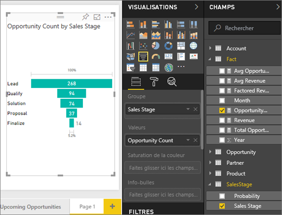
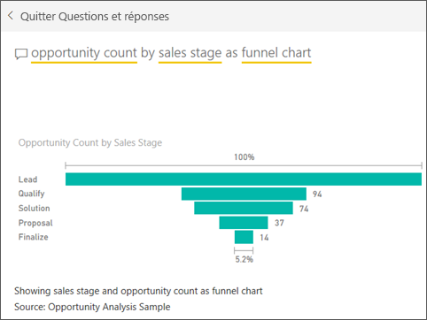

# Graphiques en entonnoir
Un graphique en entonnoir vous permet de mieux visualiser un processus linéaire qui comporte des étapes séquentielles liées entre elles. Par exemple, un entonnoir de ventes qui effectue le suivi des clients à travers des étapes : Lead \> Qualified Lead \> Prospect \> Contract \> Close.  En regardant la forme de l’entonnoir, vous savez instantanément comment se déroule le processus dont vous effectuez le suivi.

Chaque étape de l’entonnoir représente un pourcentage du total. C’est pourquoi un graphique en entonnoir a généralement la forme d’un entonnoir, où la première étape est la plus large et chaque étape suivante est plus étroite que l’étape précédente.  Un entonnoir en forme de poire est également utile, car il peut indiquer un problème dans le processus.  Mais le plus souvent, la première étape (l’étape de départ) est la plus large.

## Quand faut-il utiliser un graphique en entonnoir ?
Les graphiques en entonnoir sont conseillés :

* quand les données sont séquentielles et portent sur au moins quatre étapes ;
* quand le nombre « d’éléments » à la première étape doit normalement être supérieur au nombre à l’étape finale ;
* pour calculer le potentiel (revenus/ventes/contrats/etc.) à chaque étape ;
* pour calculer et suivre des taux de conversion et de rétention ;
* pour révéler les goulots d’étranglement dans un processus linéaire ;
* pour effectuer le suivi d’un parcours d’achat en ligne ;
* pour suivre la progression et le résultat des campagnes de publicité/marketing (taux de clics).

## Utilisation des graphiques en entonnoir
Graphiques en entonnoir :

* peuvent être épinglés à partir des rapports et de Q&R ;
* peuvent être triés ;
* prennent en charge les multiples ;
* prennent en charge la mise en surbrillance et le filtrage croisé par d’autres visualisations sur la même page de rapport ;
* peuvent être utilisés pour la mise en surbrillance et le filtrage croisé d’autres visualisations sur la même page de rapport.

## Créer un graphique en entonnoir simple
Regardez cette vidéo pour voir comment créer un graphique en entonnoir à l’aide de l’exemple Vente et marketing.

<iframe width="560" height="315" src="https://www.youtube.com/embed/qKRZPBnaUXM" frameborder="0" allow="autoplay; encrypted-media" allowfullscreen></iframe>

À présent, créez votre propre graphique en entonnoir qui montre le nombre d’opportunités identifiées à chaque étape de vente.

Ces instructions s’appliquent à l’exemple Analyse d’opportunités. Pour effectuer la procédure, [téléchargez l’exemple](../sample-datasets.md) pour le service Power BI (app.powerbi.com) ou Power BI Desktop.   

1. Démarrez sur une page de rapport vierge, puis sélectionnez le champ **SalesStage** \> **Étape de vente**. Si vous utilisez le service Power BI, veillez à ouvrir le rapport en [mode Édition](../service-interact-with-a-report-in-editing-view.md).
   
    
2. [Convertissez le graphique](power-bi-report-change-visualization-type.md) en Entonnoir. Notez que **Étape de vente** se trouve dans la zone **Groupe** . 
3. Dans le volet **Champs**, sélectionnez **Fait** \> **Nombre d’opportunités**.
   
    
4. Placez le curseur sur une barre pour afficher diverses informations :
   
   * Nom de l’étape
   * Nombre d’opportunités actuellement identifiées à cette étape
   * Taux de conversion global (% de prospect) 
   * Taux d’abandon, qui est le pourcentage de l’étape précédente (dans ce cas, étape Proposal/étape Solution).
     
     
5. [Ajoutez l’entonnoir en vignette de tableau de bord](../service-dashboard-tiles.md). 
6. [Enregistrez le rapport](../service-report-save.md).

## Mise en surbrillance et filtrage croisé
Pour plus d’informations sur le volet Filtres, consultez [Ajouter un filtre à un rapport](../power-bi-report-add-filter.md).

La mise en surbrillance d’une barre dans un graphique en entonnoir entraîne le filtrage croisé des autres visualisations sur la page du rapport, et vice versa. Pour suivre la procédure, ajoutez quelques éléments visuels de plus à la page de rapport qui contient le graphique en entonnoir.

1. Dans l’entonnoir, sélectionnez la barre **Proposal** (Proposition). Cela met en surbrillance croisée les autres visualisations sur la page. Utilisez la touche CTRL pour sélectionner simultanément plusieurs éléments.
   
   
2. Pour définir les préférences pour la mise en surbrillance croisée et le filtrage croisé des visuels entre eux, consultez [Interaction des éléments visuels dans Power BI](../service-reports-visual-interactions.md).

## Créer un graphique en entonnoir à l’aide de Questions et réponses
Ouvrez le tableau de bord Exemple Analyse des opportunités ou un autre tableau de bord auquel au moins une visualisation a été épinglée à partir du jeu de données Exemple Analyse des opportunités.  Quand vous tapez une question dans Q&R, Power BI recherche des réponses dans tous les jeux de données associés au tableau de bord sélectionné (ceux ayant des vignettes épinglées à ce tableau de bord). Pour plus d’informations, consultez [Power BI – Concepts de base](../service-basic-concepts.md).

1. Dans le tableau de bord Exemple Analyse des opportunités, commencez à taper votre question dans la zone Questions et réponses.
   
   
   
2. N’oubliez pas d’inclure « as funnel » (en entonnoir) pour indiquer à Power BI le type de visualisation souhaité.

## Étapes suivantes

[Jauges dans Power BI](power-bi-visualization-radial-gauge-charts.md)

[Types de visualisation dans Power BI](power-bi-visualization-types-for-reports-and-q-and-a.md)
