# Créer des visualisations des influenceurs clés

[!INCLUDE [power-bi-visuals-desktop-banner](../includes/power-bi-visuals-desktop-banner.md)]

Le visuel d’influenceurs clés vous aide à comprendre les facteurs affectant une métrique qui vous intéresse. Il analyse vos données, classe les facteurs qui sont importants et les affiche sous forme d’influenceurs clés. Par exemple, supposons que vous souhaitez déterminer ce qui influence le renouvellement du personnel. L’un des facteurs peut être la longueur du contrat d’emploi et un autre l’âge de l’employé. 
 
## Quand utiliser des influenceurs clés 
Le visuel d’influenceurs clés constitue un excellent choix quand vous souhaitez : 
- Voir quels facteurs affectent la métrique en cours d’analyse.
- Comparer l’importance relative de ces facteurs. Par exemple, les contrats à court terme ont-ils plus d’impact sur le renouvellement du personnel que les contrats à long terme ? 

## Fonctionnalités du visuel d’influenceurs clés

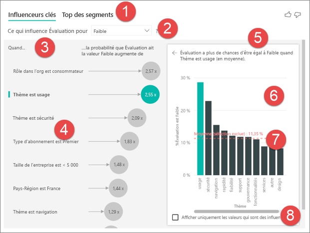

1. **Onglets** : sélectionnez un onglet pour changer de vue. **Influenceurs clés** montre les principaux contributeurs à la valeur de métrique sélectionnée. **Top des segments** montre les principaux segments qui contribuent à la valeur de métrique sélectionnée. Un *segment* est composé d’une combinaison de valeurs. Par exemple, un segment peut représenter les consommateurs qui sont clients depuis au moins 20 ans et qui habitent dans la région Ouest. 

2. **Zone de liste déroulante** : valeur de la métrique étudiée. Dans cet exemple, examinez la métrique **Évaluation**. La valeur sélectionnée est **Faible**.

3. **Répétition** : permet d’interpréter le visuel dans le volet gauche.

4. **Volet gauche** : le volet gauche contient un visuel. Ici, le volet gauche montre une liste des principaux influenceurs clés.

5. **Répétition** : permet d’interpréter le visuel dans le volet droit.

6. **Volet droit** : le volet droit contient un visuel. Ici, l’histogramme affiche toutes les valeurs pour l’influenceur clé **Thème** qui est sélectionné dans le volet gauche. La valeur spécifique (**usage**) dans le volet gauche est indiquée en vert. Toutes les autres valeurs pour **Thème** sont en noir.

7. **Ligne moyenne** : La moyenne est calculée pour toutes les autres valeurs possibles pour **Thème** sauf **usability** (utilisabilité) (qui est l’influenceur sélectionné). Le calcul s’applique donc à toutes les valeurs en noir. Il vous indique quel pourcentage des autres **Thèmes** a donné une évaluation faible. Dans ce cas, 11,35 % avait une évaluation faible (indiquée par la ligne en pointillés).

8. **Case à cocher** : Filtre le visuel dans le volet droit pour afficher uniquement les valeurs qui sont des influenceurs pour ce champ. Dans cet exemple, cela permet de filtrer le visuel sur l’utilisabilité, la sécurité et la navigation.

## Analyser une métrique de catégorie
 
Regardez cette vidéo pour découvrir comment créer un visuel d’influenceurs clés avec une métrique de catégorie. Effectuez ensuite ces étapes pour en créer un. 

   > [!NOTE]
   > Cette vidéo utilise une version antérieure de Power BI Desktop.
   > 
   > 
<iframe width="560" height="315" src="https://www.youtube.com/embed/fDb5zZ3xmxU" frameborder="0" allow="accelerometer; autoplay; encrypted-media; gyroscope; picture-in-picture" allowfullscreen></iframe>

Votre responsable produit vous demande d’identifier les facteurs qui poussent les clients à laisser des avis négatifs sur votre service cloud. Pour suivre la procédure, ouvrez le [fichier PBIX de commentaires client](https://github.com/microsoft/powerbi-desktop-samples/tree/master/Monthly%20Desktop%20Blog%20Samples/2019/customerfeedback.pbix) dans Power BI Desktop. Vous pouvez également télécharger le [fichier Excel de commentaires client pour le service Power BI ou Power BI Desktop](https://github.com/microsoft/powerbi-desktop-samples/tree/master/Monthly%20Desktop%20Blog%20Samples/2019/customerfeedback.xlsx). Sélectionnez l’un des liens, puis sélectionnez **Télécharger** dans la page GitHub qui s’ouvre.

> [!NOTE]
> Le jeu de données de commentaires clients est basé sur [Moro et al., 2014] S. Moro, P. Cortez et P. Rita. « A Data-Driven Approach to Predict the Success of Bank Telemarketing. » *Decision Support Systems*, Elsevier, 62:22-31, juin 2014. 

1. Ouvrez le rapport et sélectionnez l’icône **Influenceurs clés**. 

    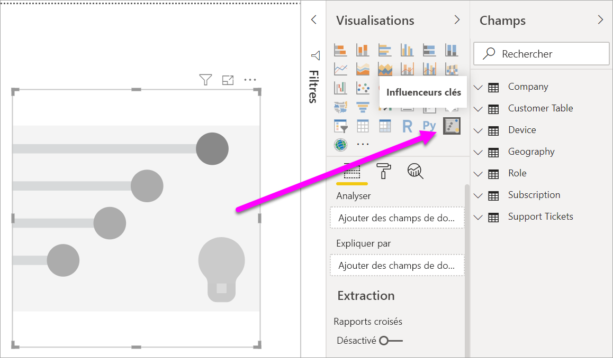

2. Déplacez la métrique que vous voulez examiner dans le champ **Analyser**. Pour voir les facteurs qui incitent les clients à laisser une évaluation faible, sélectionnez **Table des clients** > **Évaluation**.

3. Déplacez les champs qui selon vous pourraient influencer **Évaluation** dans le champ **Expliquer par**. Vous pouvez déplacer autant de champs que vous le souhaitez. Dans ce cas, démarrez avec :
    - Pays-Région 
    - Rôle dans l’org 
    - Type d’abonnement 
    - Taille de l’entreprise 
    - Thème
    
4. Laissez vide le champ **Développer par**. Ce champ est utilisé seulement lors de l’analyse d’une mesure ou d’un champ synthétisé. 

5. Pour vous concentrer sur les évaluations négatives, sélectionnez **Faible** dans la zone de liste déroulante **Ce qui influence l’évaluation**.  

    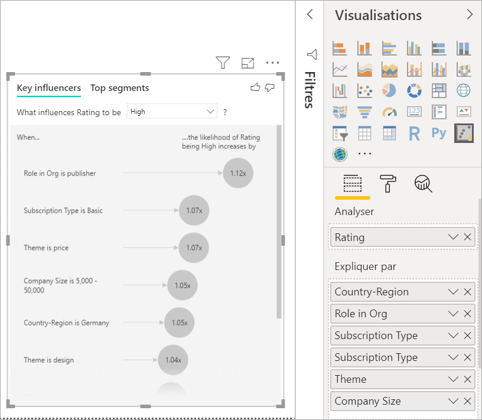

L’analyse s’exécute au niveau table du champ en cours d’analyse. Dans ce cas, il s’agit de la métrique **Évaluation**. Cette métrique est définie au niveau client. Chaque client a donné un score élevé ou un score faible. Tous les facteurs explicatifs doivent être définis au niveau client pour que le visuel puisse les utiliser. 

Dans l’exemple précédent, tous les facteurs explicatifs ont une relation un-à-un ou plusieurs-à-un avec la métrique. Dans ce cas, chaque client a affecté un seul thème à son évaluation. De même, les clients proviennent d’un pays, ont un type d’appartenance et jouent un rôle dans leur organisation. Les facteurs explicatifs sont déjà des attributs d’un client et aucune transformation n’est nécessaire. Le visuel peut les utiliser immédiatement. 

Plus loin dans le tutoriel, vous examinerez des exemples plus complexes avec des relations un-à-plusieurs. Dans ces cas-là, vous devrez d’abord agréger les colonnes au niveau client avant de pouvoir exécuter l’analyse. 

Les métriques et agrégats utilisés comme facteurs explicatifs sont également évalués au niveau table de la métrique **Analyse**. Vous verrez quelques exemples plus loin dans cet article. 

## Interpréter les influenceurs clés catégoriels 
Jetons un œil aux influenceurs clés pour les évaluations faibles. 

### Principal facteur influençant la probabilité d’une évaluation faible

Dans cet exemple, le client peut avoir trois rôles : consommateur, administrateur et éditeur. Le fait d’être un consommateur est le principal facteur contribuant à une évaluation faible. 

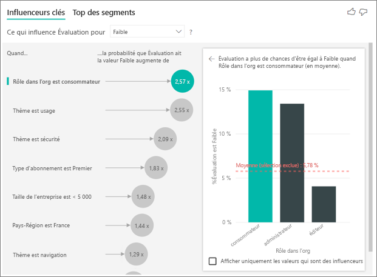

Plus précisément, vos consommateurs sont 2,57 fois plus susceptibles d’attribuer à votre service un score négatif. Le graphique d’influenceurs clés mentionne **Rôle dans l’org est consommateur** en premier dans la liste sur la gauche. En sélectionnant **Rôle dans l’org est consommateur**, Power BI affiche des détails supplémentaires dans le volet droit. L’effet comparatif de chaque rôle sur la probabilité d’une évaluation faible est indiqué.
  
- 14,93 % des consommateurs attribuent un score faible. 
- En moyenne, tous les autres rôles attribuent un score faible 5,78 % du temps.
- Les consommateurs sont 2,57 fois plus susceptibles d’attribuer un score faible par rapport à tous les autres rôles. Vous pouvez déterminer cela en divisant la barre verte par la ligne rouge en pointillés. 

### Deuxième facteur influençant la probabilité d’une évaluation faible

Le visuel d’influenceurs clés compare et classe les facteurs à partir de nombreuses variables différentes. Le deuxième influenceur n’a rien à voir avec **Rôle dans l’org**. Sélectionnez le deuxième influenceur dans la liste, à savoir **Thème est usage**. 

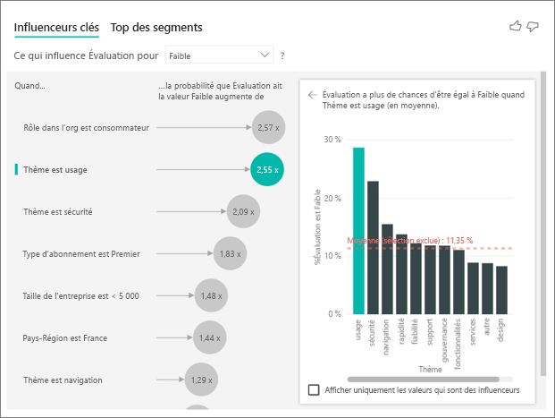

Le deuxième facteur le plus important est lié au thème de l’évaluation du client. Les clients qui ont commenté l’usage du produit étaient 2,55 fois plus susceptibles d’attribuer un score faible par rapport aux clients ayant commenté d’autres thèmes tels que la fiabilité, la conception ou la vitesse. 

Entre les visuels, la moyenne (ligne rouge en pointillés) est passé de 5,78 % à 11,34 %. La moyenne est dynamique, car elle est basée sur la moyenne de toutes les autres valeurs. Pour le premier influenceur, la moyenne exclut le rôle client. Pour le deuxième influenceur, elle exclut le thème de l’usage. 
 
Cochez la case **Afficher uniquement les valeurs qui sont des influenceurs** pour filtrer en utilisant uniquement les valeurs influentes. Dans ce cas, ils s’agit des rôles qui génèrent un score faible. Sur les douze thèmes, Power BI en retient quatre générant des évaluations faibles. 

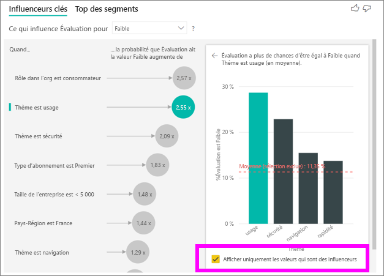

## Interagir avec d’autres visuels 
 
Chaque fois que vous sélectionnez un segment, un filtre ou un autre visuel sur le canevas, le visuel d’influenceurs clés réexécute son analyse sur la nouvelle portion de données. Par exemple, vous pouvez déplacer **Taille de l’entreprise** dans le rapport et l’utiliser comme segment. Utilisez-le pour voir si les influenceurs clés pour nos clients en entreprise diffèrent de ceux de la population générale. Une grande entreprise est une organisation qui compte plus de 50 000 employés.
 
Sélectionnez **> 50 000** pour réexécuter l’analyse. Vous pouvez alors voir que les influenceurs ont changé. Pour les clients des grandes entreprises, le principal influenceur pour les évaluations faibles a un thème lié à la sécurité. Vous souhaiterez peut-être approfondir vos recherches afin de déterminer s’il existe des fonctionnalités de sécurité spécifiques dont vos clients de grandes entreprises ne sont pas satisfaits. 

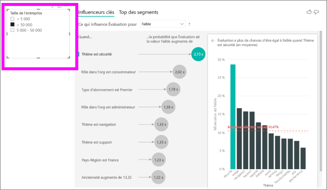

## Interpréter les influenceurs clés continus 
 
Jusqu’à présent, vous avez vu comment utiliser le visuel pour explorer la manière dont différents champs de catégorie influencent les évaluations faibles. Il est également possible d’avoir des facteurs continus tels que l’âge, la hauteur et le prix dans le champ **Expliquer par**. Examinons à présent ce qui se passe si nous déplaçons **Ancienneté** de la table des clients dans **Expliquer par**. L’ancienneté représente depuis combien de temps le client utilise le service. 
 
À mesure que l’ancienneté augmente, la probabilité de recevoir une évaluation plus faible augmente également. Cette tendance suggère que les clients à long terme sont plus susceptibles d’attribuer un score négatif. Cet insight est intéressant et peut faire l’objet d’un suivi par la suite. 
 
La visualisation montre que chaque fois que l’ancienneté augmente de 13,44 mois, en moyenne la probabilité d’une évaluation faible est multipliée par 1,23. Ici, 13,44 mois représente l’écart type pour Ancienneté. Ainsi, l’insight que vous obtenez examine comment le fait d’augmenter l’ancienneté d’une certaine valeur (c’est-à-dire l’écart type pour l’ancienneté) affecte la probabilité de recevoir une évaluation faible. 
 
Le nuage de points dans le volet droit trace le pourcentage moyen d’évaluations faibles pour chaque valeur d’ancienneté. Il met en évidence la pente avec une courbe de tendance.

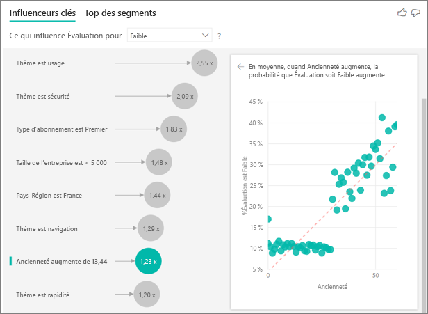

## Influenceurs clés continus compartimentés

Dans certains cas, vous pouvez constater que vos facteurs continus ont été automatiquement convertis en catégories. Cela est dû au fait que nous avons découvert que la relation entre les variables n’est pas linéaire et que nous ne pouvons pas décrire la relation comme une simple augmentation ou une diminution (comme nous l’avons fait dans l’exemple ci-dessus).

Nous exécutons des tests de corrélation pour déterminer la linéarité de l’influenceur par rapport à la cible. Si la cible est continue, nous exécutons la corrélation de Pearson et, si la cible est une catégorie, nous exécutons des tests de corrélation bisérielle de points. Si nous détectons que la relation n’est pas suffisamment linéaire, nous traitons des compartimentages supervisés et générons un maximum de 5 emplacements. Pour déterminer les emplacements les plus significatifs, nous utilisons une méthode de compartimentage supervisée qui examine la relation entre le facteur explicatif et la cible analysée.

## Interpréter les mesures et agrégats comme influenceurs clés 
 
Vous pouvez utiliser des mesures et des agrégats comme facteurs explicatifs dans votre analyse. Par exemple, vous pouvez souhaiter connaître l’impact du nombre de tickets de support client ou de la durée moyenne d’un ticket ouvert sur le score que vous recevez. 
 
Ici, vous voulez voir si le nombre de tickets de support d’un client a un impact sur le score qu’il attribue. Importez à présent l’**ID de ticket de support** à partir de la table de ticket de support. Un client pouvant avoir plusieurs tickets de support, vous agrégez l’ID au niveau client. L’agrégation est importante car l’analyse s’exécute au niveau client, et tous les facteurs doivent donc être définis à ce niveau de granularité. 
 
Examinons le nombre d’ID. Chaque ligne de client est donc associée à un nombre de tickets de support. Ici, à mesure que le nombre de tickets de support augmente, la probabilité de recevoir une évaluation faible est multipliée par 5,51. Le visuel de droite indique le nombre moyen de tickets de support en fonction de différentes valeurs **Évaluation** au niveau client. 

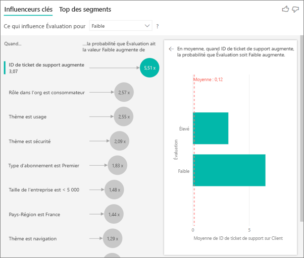

## Interprétez les résultats : Top des segments 
 
Vous pouvez utiliser l’onglet **Influenceurs clés** pour évaluer chaque facteur individuellement. Vous pouvez également utiliser l’onglet **Top des segments** pour voir comment une combinaison de facteurs affecte la métrique que vous analysez. 
 
Top des segments montre initialement une vue d’ensemble de tous les segments découverts par Power BI. L’exemple suivant montre que six segments ont été trouvés. Ces segments sont classés en fonction du pourcentage d’évaluations faibles dans le segment. Le segment 1, par exemple, a 74,3 % d’évaluations de client qui sont faibles. Plus la bulle est haute, plus la proportion d’évaluations faibles est élevée. La taille de la bulle représente le nombre de clients inclus dans le segment. 

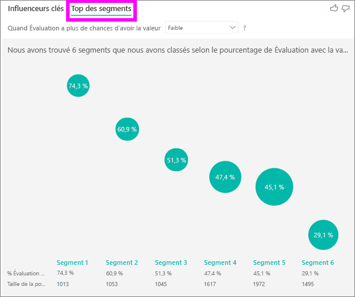

La sélection d’une bulle permet d’explorer les détails de ce segment. Si vous sélectionnez par exemple le segment 1, vous observez qu’il est constitué de clients relativement anciens. Ils sont clients depuis plus de 29 mois et ont plus de quatre tickets de support. Pour finir, il ne s’agit pas d’éditeurs (ils sont donc consommateurs ou administrateurs). 
 
Dans ce groupe, 74,3 % des clients ont attribué une évaluation faible. Le client moyen attribue une évaluation faible 11,7 % du temps. Ce segment a donc une proportion nettement plus élevée d’évaluations faibles (63 points de pourcentage en plus). Le segment 1 contient également environ 2,2 % des données. Il représente donc une partie de la population pouvant être identifiée et ciblée. 

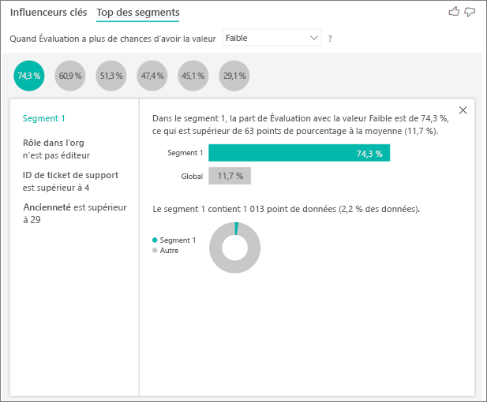

## Ajout de décomptes

Parfois, un influenceur peut avoir un impact important, mais représenter très peu de données. Par exemple, **Thème** est **usability** (utilisabilité) est le deuxième plus grand influenceur pour les évaluations basses. Cependant, il n’y a qu’un petit nombre de clients qui se sont plaint de l’utilisabilité. Les décomptes peuvent vous aider à hiérarchiser les influenceurs sur lesquels vous voulez vous concentrer.

Vous pouvez activer les décomptes via la **Carte d’analyse** du volet de mise en forme.

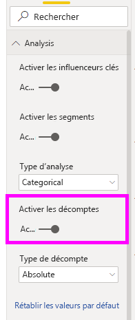

Une fois les décomptes activés, vous verrez un anneau autour de la bulle de chaque influenceur, qui représente le pourcentage approximatif de données contenues dans l’influenceur. Plus la partie de la bulle encerclée par l’anneau est importante, plus il contient de données. Nous pouvons voir que **Thème** est **usability** (utilisabilité) contient une très petite proportion des données.

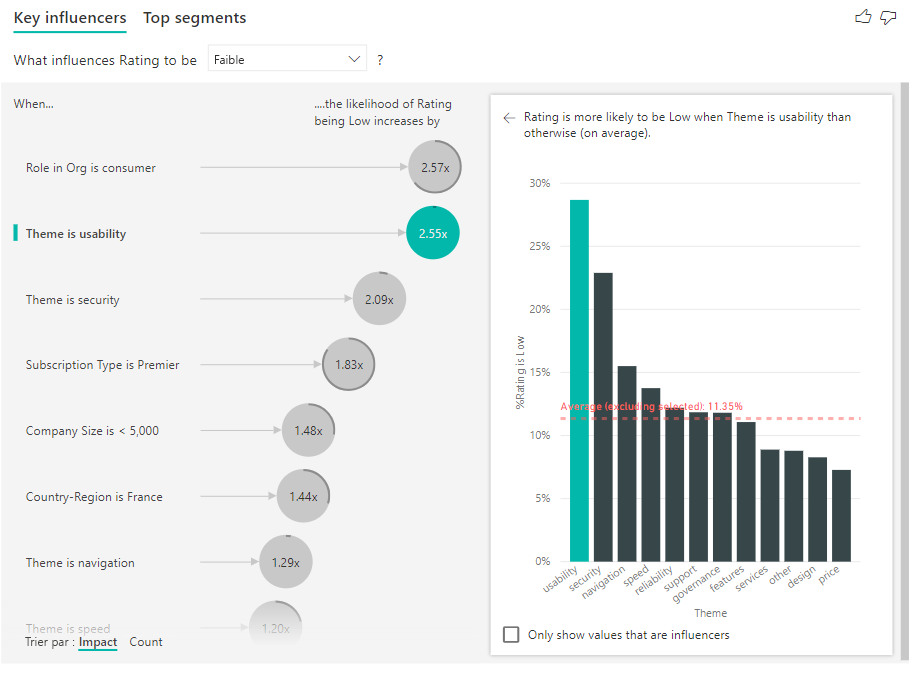

Vous pouvez également utiliser la bascule Trier par dans le coin inférieur gauche du visuel pour trier les bulles d’abord par décompte au lieu de les trier par impact. **Type d’abonnement** est **Premier** est le premier influenceur en fonction du décompte.

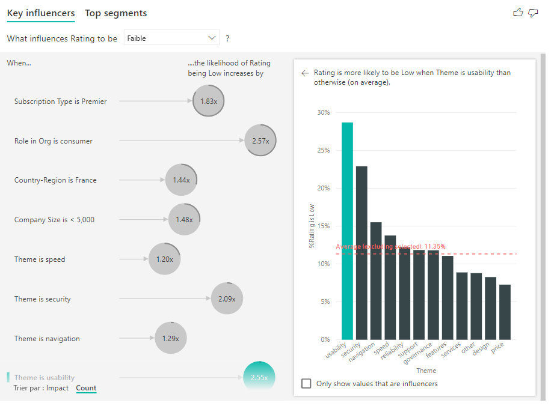

Si vous avez un anneau complet autour du cercle, cela signifie que l’influenceur contient 100 % des données. Vous pouvez changer le type de décompte pour qu’il soit relatif à l’influenceur maximal en utilisant la liste déroulante **Type de décompte** dans la **Carte d’analyse** du volet de mise en forme. À présent, l’influenceur avec la plus grande quantité de données est représenté par un anneau complet, et tous les autres décomptes sont relatifs à cet influenceur.

## Analyser une métrique numérique

Si vous déplacez un champ numérique non synthétisé dans le champ **Analyser**, vous pouvez choisir comment gérer ce scénario. Pour changer le comportement du visuel, accédez au **volet de mise en forme** et basculez entre le type d’analyse **Catégorie** et le type d’analyse **Continu**.

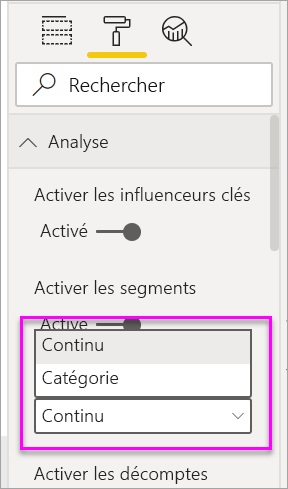

Un type d’analyse **Catégorie** se comporte comme dans la description ci-dessus. Par exemple, si vous passez en revue les scores d’une enquête allant de 1 à 10, vous pouvez vous poser la question suivante : « Quels sont les facteurs qui contribuent à l’obtention d’un score d’enquête de 1 ? ».

Un type d’analyse **Continu** change la question en question continue. Dans l’exemple ci-dessus, notre nouvelle question serait la suivante : « Quels sont les facteurs qui influent sur l’augmentation ou la diminution des scores d’enquête ? ».

Cette distinction est très utile quand vous avez un grand nombre de valeurs uniques dans le champ que vous analysez. Dans l’exemple ci-dessous, nous allons examiner le prix d’une maison. La question « Quels sont les facteurs qui contribuent à l’obtention d’un prix de 156 214 $ ? » n’a guère d’utilité. Elle est en effet très spécifique, et nous risquons de ne pas avoir suffisamment de données pour en déduire une tendance.

Au lieu de cela, nous pouvons nous poser la question suivante : « Quels sont les facteurs qui influencent l’augmentation du prix d’une maison ? ». Nous pouvons ainsi traiter le prix de la maison comme une plage et non comme une valeur distincte.

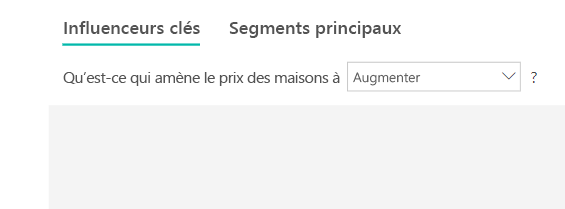

## Interprétez les résultats : Influenceurs clés 

Dans ce scénario, nous examinons les facteurs qui influent sur l’augmentation du prix d’une maison. Nous nous intéressons à plusieurs facteurs explicatifs susceptibles d’impacter le prix d’une maison, notamment **Year Built** (année de construction), **KitchenQual** (qualité de la cuisine) et **YearRemodAdd** (année de rénovation). 

Dans l’exemple ci-dessous, nous examinons notre influenceur principal, à savoir une cuisine d’excellente qualité. Les résultats sont très similaires à ceux que nous avons vu quand nous analysions les métriques catégorielles, avec toutefois quelques différences importantes :

- L’histogramme sur la droite s’intéresse aux moyennes plutôt qu’aux pourcentages. Il nous montre donc le prix moyen d’une maison équipée d’une cuisine d’excellente qualité (barre verte) par rapport au prix moyen d’une maison sans une telle cuisine (ligne en pointillés).
- Le chiffre dans la bulle est la différence entre la ligne en pointillés rouge et la barre verte, mais elle est exprimée sous forme d’un nombre (158 490 $) et non d’une probabilité (1,93 fois). Ainsi, en moyenne, les maisons équipées d’une cuisine d’excellente qualité sont presque 160 000 $ plus chères que les maisons sans une telle cuisine.

Dans l’exemple ci-dessous, nous nous intéressons à l’impact d’un facteur continu (année de rénovation) sur le prix d’une maison. Les différences par rapport à la façon dont nous analysons les influenceurs continus pour les métriques de catégorie sont les suivantes :

-   Le nuage de points dans le volet droit indique le prix moyen d’une maison pour chaque année de rénovation. 
-   La valeur dans la bulle indique dans quelle mesure le prix moyen d’une maison augmente (ici, de 2 870 $) quand l’année de rénovation de la maison augmente de son écart type (dans ce cas, 20 ans).

Enfin, dans le cas des mesures, nous examinons l’année moyenne de la construction d’une maison. L’analyse ici est la suivante :

-   Le nuage de points dans le volet droit indique le prix moyen d’une maison pour chaque valeur distincte dans la table.
-   La valeur dans la bulle indique dans quelle mesure le prix moyen d’une maison augmente (ici, de 1 350 $) quand l’année moyenne augmente de son écart type (dans ce cas, 30 ans).

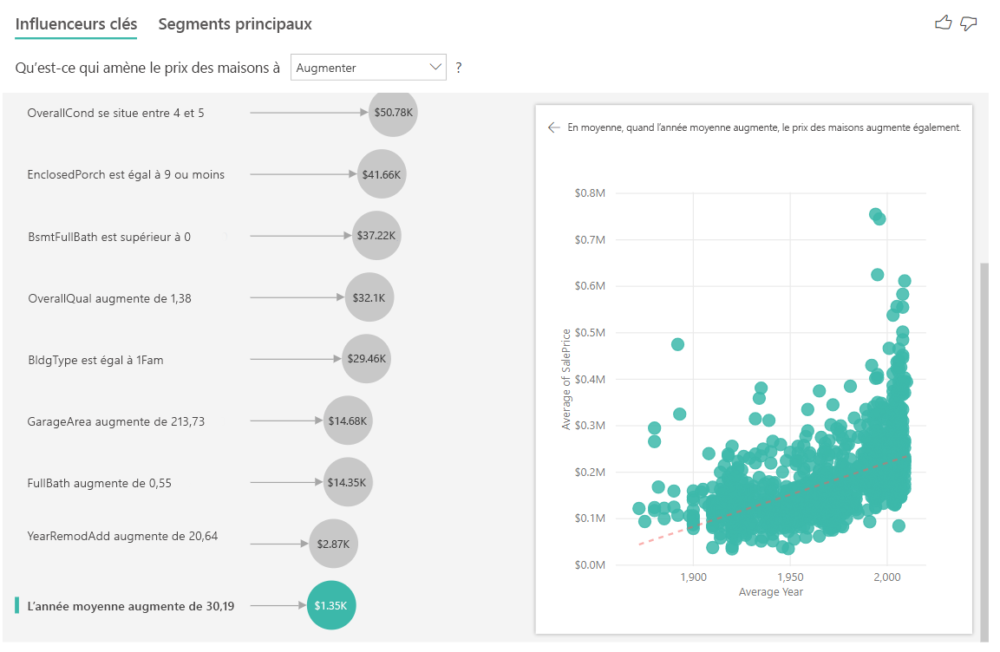

## Interprétez les résultats : Top des segments

Le top des segments pour les cibles numériques montre les groupes pour lesquels le prix de la maison est en moyenne supérieur à celui du jeu de données d’ensemble. Par exemple, nous pouvons voir ci-dessous que le **Segment 1** se compose de maisons où **GarageCars** (capacité du garage en nombre de voitures) est supérieur à 2 et où **RoofStyle** est Hip. Les maisons présentant ces caractéristiques ont un prix moyen de 355 000 $, tandis que la moyenne globale dans les données est de 180 000 $.

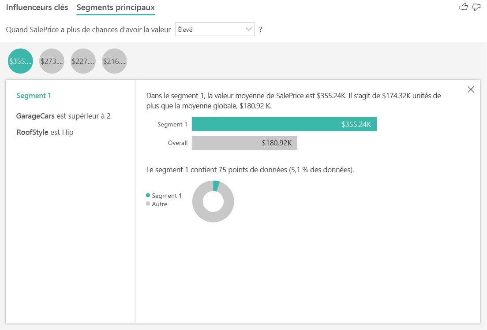

## Analyser une métrique qui est une mesure ou une colonne synthétisée

Dans le cas d’une mesure ou d’une colonne synthétisée, l’analyse est définie par défaut sur le **Type d’analyse continue** décrit [ci-dessus](https://docs.microsoft.com/power-bi/visuals/power-bi-visualization-influencers#analyze-a-metric-that-is-numeric). Ceci ne peut pas être modifié. La plus grande différence entre l’analyse d’une mesure/colonne synthétisée et une colonne numérique non synthétisée est le niveau auquel l’analyse est effectuée.

Dans le cas de colonnes non synthétisées, l’analyse est toujours effectuée au niveau de la table. Dans l’exemple du prix des maisons ci-dessus, nous avons analysé la métrique **House Price** (Prix de la maison) pour voir ce qui influence l’augmentation/diminution du prix d’une maison. L’analyse s’effectue automatiquement au niveau de la table. Notre table a un ID unique pour chaque maison, de sorte que l’analyse s’effectue au niveau de la maison.

Pour les mesures et les colonnes synthétisées, nous ne savons pas immédiatement à quel niveau les analyser. Si **House Price** (Prix de la maison) était synthétisé sous forme de **Moyenne**, nous devrions déterminer à quel niveau nous voulons que le prix moyen d’une maison soit calculé. S’agit-il du prix moyen d’une maison au niveau du voisinage ? Ou peut-être au niveau régional ?

Les mesures et les colonnes synthétisées sont automatiquement analysées au niveau des champs **Expliquer par** utilisés. Imaginez que nous avons trois champs dans **Expliquer par** qui nous intéressent : **Kitchen Quality** (Qualité de la cuisine), **Building Type** (Type de construction) et **Air Conditioning** (Air conditionné). **Average House Price** (Prix moyen d’une maison) est calculé pour chaque combinaison unique de ces trois champs. Il est souvent utile de passer à une vue tabulaire pour voir à quoi ressemblent les données évaluées.

Cette analyse est une synthèse très globale et il est donc difficile pour le modèle de régression de trouver des modèles dans les données à partir desquels il peut apprendre. Nous devons exécuter l’analyse à un niveau plus détaillé pour obtenir de meilleurs résultats. Si nous voulions analyser le prix des maisons au niveau des maisons, nous devrions ajouter explicitement le champ **ID** à l’analyse. Néanmoins, nous ne voulons pas que l’ID des maisons soit considéré comme un influenceur. Il n’est pas très utile d’apprendre que quand l’ID de la maison augmente, le prix d’une maison augmente. C’est là où l’option du champ **Développer par** se révèle pratique. Vous pouvez utiliser **Développer par** pour ajouter des champs que vous voulez utiliser pour définir le niveau de l’analyse sans rechercher de nouveaux influenceurs.

Regardez à quoi ressemble la visualisation une fois que nous ajoutons **ID** à **Développer par**. Une fois que vous avez défini le niveau auquel vous voulez que votre mesure soit évaluée, l’interprétation des influenceurs est exactement la même que pour les [colonnes numériques non synthétisées](https://docs.microsoft.com/power-bi/visuals/power-bi-visualization-influencers#analyze-a-metric-that-is-numeric).

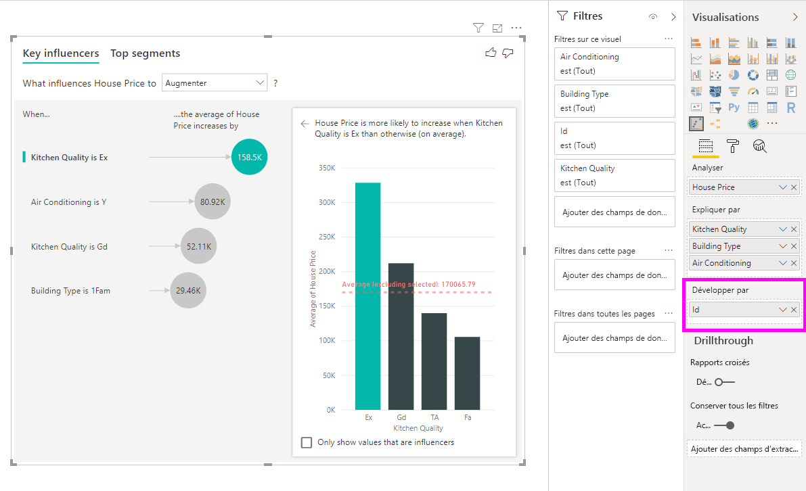

Si vous voulez en savoir plus sur la façon dont vous pouvez analyser des mesures avec la visualisation des influenceurs clés, regardez le tutoriel suivant.

<iframe width="1167" height="631" src="https://www.youtube.com/embed/2X1cW8oPtc8" frameborder="0" allow="accelerometer; autoplay; encrypted-media; gyroscope; picture-in-picture" allowfullscreen></iframe>

## Considérations et résolution des problèmes 
 
**Quelles sont les limitations du visuel ?** 
 
Le visuel Influenceur clés présente certaines limitations :

- La requête directe n’est pas prise en charge
- La connexion active à Azure Analysis Services et à SQL Server Analysis Services n’est pas prise en charge
- La publication sur le web n’est pas prise en charge
- .NET Framework 4.6 ou une version ultérieure est requis

**Je reçois une erreur indiquant qu’aucun influenceur ou segment n’a été trouvé. Pourquoi ?** 

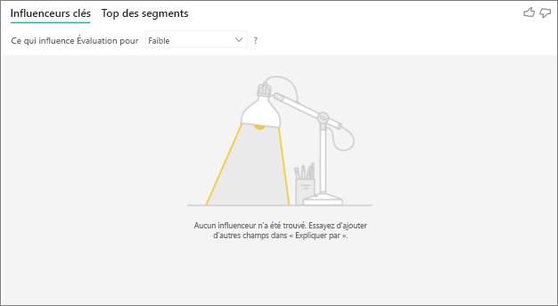

Cette erreur se produit quand vous avez inclus des champs dans **Expliquer par**, mais qu’aucun influenceur n’a été trouvé. 
- Vous avez inclus la métrique que vous analysiez à la fois dans **Analyser** et dans **Expliquer par**. Supprimez-la de **Expliquer par**. 
- Vos champs explicatifs ont trop de catégories avec peu d’observations. La visualisation a donc plus de difficulté à déterminer quels facteurs sont des influenceurs. Il est difficile de généraliser d’après seulement quelques observations. Si vous analysez un champ numérique, vous pouvez passer de l’**analyse par catégorie** à l’**analyse en continu** dans le **volet de mise en forme** sous la carte  **Analyse**.
- Vos facteurs explicatifs ont assez d’observations pour effectuer des généralisations, mais la visualisation n’a trouvé aucune corrélation significative à signaler.
 
**Je reçois une erreur indiquant que la métrique que je suis en train d’analyser n’a pas suffisamment de données pour exécuter l’analyse. Pourquoi ?** 

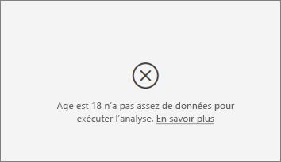

La visualisation examine les tendances des données d’un groupe par rapport à celles d’autres groupes. Par exemple, elle recherche le nombre de clients ayant attribué des évaluations faibles par rapport au nombre de clients ayant attribué des évaluations élevées. Si les données dans votre modèle ont seulement quelques observations, il est difficile de trouver des tendances. Si la visualisation n’a pas suffisamment de données pour trouver des influenceurs significatifs, elle signale que davantage de données sont nécessaires pour exécuter l’analyse. 

Nous recommandons au moins 100 observations pour l’état sélectionné. Dans ce cas, l’état correspond aux clients qui renouvellent leur contrat. Vous avez également besoin d’au moins 10 observations pour les états que vous utilisez à des fins de comparaison. Dans ce cas, l’état de la comparaison correspond aux clients qui ne renouvellent pas leur contrat.

Si vous analysez un champ numérique, vous pouvez passer de l’**analyse par catégorie** à l’**analyse en continu** dans le **volet de mise en forme** sous la carte  **Analyse**.

**Je reçois une erreur indiquant que quand l’analyse n’est pas synthétisée, elle s’effectue toujours au niveau des lignes de sa table parente. La modification de ce niveau via des champs « Développer par» n’est pas autorisée. Pourquoi ?**

Lors de l’analyse d’une colonne numérique ou de catégorie, l’analyse s’effectue toujours au niveau de la table. Par exemple, si vous analysez des prix de maisons et que votre table contient une colonne ID, l’analyse s’effectue automatiquement au niveau de l’ID des maisons. 

Quand vous analysez une mesure ou une colonne synthétisée, vous devez spécifier explicitement à quel niveau vous voulez que l’analyse soit effectuée. Vous pouvez utiliser **Développer par** pour changer le niveau de l’analyse pour les mesures et les colonnes synthétisées sans ajouter de nouveaux influenceurs. Si **House price** (Prix de la maison) était défini comme mesure, vous pourriez ajouter la colonne d’ID de maison à **Développer par** pour changer le niveau de l’analyse.

**Je reçois une erreur indiquant qu’un champ dans *Expliquer par* n’est pas lié de manière unique à la table contenant la métrique que je suis en train d’analyser. Pourquoi ?**
 
L’analyse s’exécute au niveau table du champ en cours d’analyse. Par exemple, si vous analysez les commentaires des clients pour votre service, vous pouvez avoir une table qui indique si un client a donné une évaluation élevée ou faible. Dans ce cas, votre analyse s’exécute au niveau de la table des clients. 

Si vous avez une table associée qui est définie à un niveau plus précis que celle qui contient votre métrique, vous obtenez cette erreur. Voici un exemple : 
 
- Vous analysez ce qui incite les clients à attribuer des évaluations faibles à votre service.
- Vous souhaitez vérifier si l’appareil sur lequel le client consomme votre service influence son évaluation.
- Un client peut consommer le service de plusieurs façons.
- Dans l’exemple suivant, le client 10000000 utilise un navigateur et une tablette pour interagir avec le service.

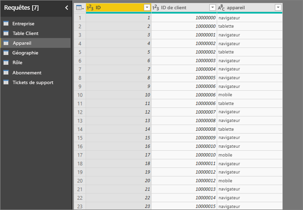

Si vous essayez d’utiliser la colonne de l’appareil en tant que facteur explicatif, vous recevez l’erreur suivante : 

Cette erreur s’affiche parce que l’appareil n’est pas défini au niveau client. Un client peut consommer le service sur plusieurs appareils. Pour que la visualisation trouve des tendances, l’appareil doit être un attribut du client. Il existe plusieurs solutions qui dépendent de votre compréhension de l’entreprise : 
 
- Vous pouvez changer la synthèse des appareils à compter. Par exemple, utilisez le décompte si le nombre d’appareils peut affecter le score attribué par un client. 
- Vous pouvez faire pivoter la colonne de l’appareil pour voir si l’utilisation du service sur un appareil spécifique influence l’évaluation d’un client.
 
Dans cet exemple, les données ont été croisées pour créer de nouvelles colonnes pour les navigateurs, les appareils mobiles et les tablettes (veillez à supprimer et à recréer vos relations dans la vue de modélisation après avoir croisé vos données). Vous pouvez désormais utiliser ces appareils spécifiques dans **Expliquer par**. Tous les appareils sont des influenceurs, le navigateur ayant le plus grand impact sur le score attribué par le client.

Plus précisément, les clients qui n’utilisent pas le navigateur pour consommer le service sont 3,79 fois plus susceptibles d’attribuer un faible score que ceux qui en utilisent un. Plus bas dans la liste, pour « mobile », l’inverse est vrai. Les clients qui utilisent l’application mobile sont plus susceptibles d’attribuer un faible score que ceux qui ne l’utilisent pas. 

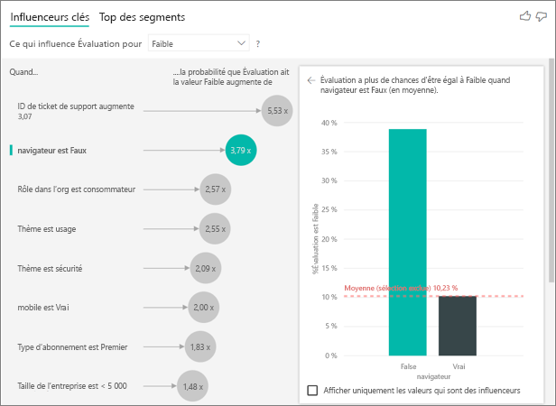

**Je reçois un avertissement signalant que les mesures n’ont pas été incluses dans mon analyse. Pourquoi ?** 

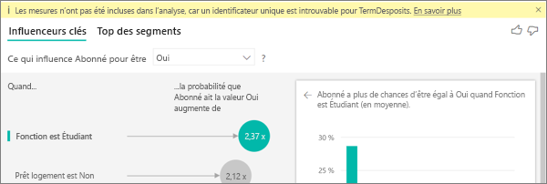

L’analyse s’exécute au niveau table du champ en cours d’analyse. Si vous analysez le taux d’attrition des clients, vous pouvez avoir une table qui indique si un client a renouvelé son contrat ou non. Dans ce cas, votre analyse s’exécute au niveau de la table de clients.
 
Les mesures et agrégats sont par défaut analysés à ce niveau table. S’il y avait une mesure des dépenses mensuelles moyennes, elle serait analysée au niveau de la table des clients. 

Si la table des clients n’a pas d’identificateur unique, vous ne pouvez pas évaluer la mesure et elle est ignorée par l’analyse. Pour éviter cette situation, vérifiez que la table avec votre métrique a un identificateur unique. Dans ce cas, il s’agit de la table de clients et l’identificateur unique est l’ID du client. Vus pouvez également ajouter facilement une colonne d’index à l’aide de Power Query.
 
**Je reçois un avertissement signalant que la mesure que je suis en train d’analyser a plus de 10 valeurs uniques, et que cela peut avoir une incidence sur la qualité de mon analyse. Pourquoi ?** 

La visualisation d’intelligence artificielle peut analyser les champs de catégorie et les champs numériques. Dans le cas des champs de catégorie, vous pouvez avoir par exemple l’attrition (oui ou non) et la satisfaction du client (élevée, moyenne ou faible). L’augmentation du nombre de catégories à analyser signifie qu’il y a moins d’observations par catégorie. Dans cette situation, il est difficile pour la visualisation de trouver des tendances dans les données. 

Quand vous analysez des champs numériques, vous avez l’option de les traiter comme du texte, auquel cas vous exécutez la même analyse que pour des données de catégorie (**analyse par catégorie**). Si vous avez beaucoup de valeurs distinctes, nous vous recommandons de passer à l’**analyse continue**, ce qui signifie que nous pouvons déduire des tendances quand les nombres augmentent ou diminuent plutôt que de les traiter comme des valeurs distinctes. Vous pouvez passer de l’**analyse par catégorie** à l’**analyse en continu** dans le **volet de mise en forme** sous la carte  **Analyse**.

Pour trouver des influenceurs plus forts, nous vous recommandons de regrouper les valeurs similaires dans une même unité. Par exemple, si vous avez une métrique pour le prix, vous obtiendrez sans doute de meilleurs résultats en regroupant les prix similaires dans des catégories comme « Élevé », « Moyen » et « Faible » au lieu d’utiliser des niveaux de prix individuels. 

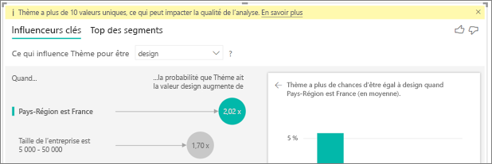

**Il y a des facteurs dans mes données qui devraient visiblement être des influenceurs clés, mais qui ne le sont pas. À quoi cela peut-il être dû ?**

Dans l’exemple suivant, les clients qui sont des consommateurs attribuent des évaluations faibles (14,93 % des évaluations). Le rôle d’administrateur présente également une proportion élevée d’évaluations faibles (13,42 %), mais n’est pas considéré comme un influenceur. 

La raison de cette détermination est que la visualisation prend également en compte le nombre de points de données quand elle trouve des influenceurs. L’exemple suivant a plus de 29 000 consommateurs et 10 fois moins d’administrateurs, environ 2 900. Seuls 390 d’entre eux ont donné une évaluation faible. Le visuel n’a pas suffisamment de données pour déterminer s’il a détecté une tendance avec les évaluations des administrateurs ou s’il s’agit simplement d’une déduction hasardeuse. 

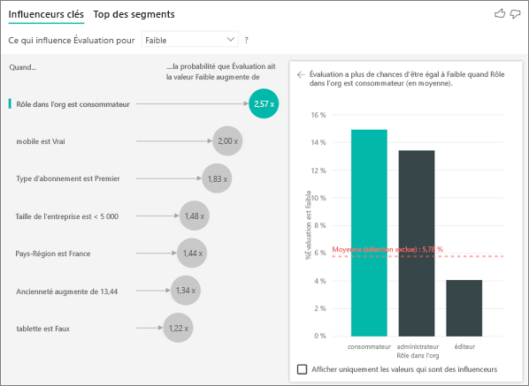

**Quelles sont les limites de points de données pour les influenceurs clés ?**
Nous lançons l’analyse sur un échantillon de 10 000 points de données. Les bulles sur un côté affichent tous les influenceurs trouvés. Les histogrammes et les nuages de points sur l’autre côté appliquent les stratégies d’échantillonnage définies pour ces visuels principaux.

**Comment calculer les influenceurs clés pour l’analyse par catégorie ?**

En arrière-plan, la visualisation d’intelligence artificielle utilise [ML.NET](https://dotnet.microsoft.com/apps/machinelearning-ai/ml-dotnet) pour exécuter une régression logistique qui calcule les influenceurs clés. Une régression logistique est un modèle statistique qui compare différents groupes. 

Si vous voulez voir ce qui contribue à des évaluations faibles, la régression logistique examine en quoi les clients qui ont attribué un score faible diffèrent de ceux ayant attribué un score élevé. Si vous avez plusieurs catégories (scores élevés, neutres et faibles par exemple), vous examinez en quoi les clients qui ont attribué une évaluation faible diffèrent de ceux n’ayant pas attribué une telle évaluation. Dans ce cas, en quoi les clients qui ont attribué un score faible diffèrent de ceux ayant attribué une évaluation élevée ou neutre ? 
 
La régression logistique recherche des tendances dans les données, autrement dit des indices suggérant en quoi les clients qui ont donné une évaluation faible peuvent différer de ceux ayant donné une évaluation élevée. Elle peut ainsi détecter que les clients qui ont de nombreux tickets de support présentent un pourcentage beaucoup plus élevé d’évaluations faibles que ceux qui en ont peu ou aucun.
 
La régression logistique prend également en compte le nombre de points de données présents. Par exemple, si les clients qui jouent un rôle d’administrateur attribuent des scores proportionnellement plus négatifs, mais qu’il n’y a que quelques administrateurs, ce facteur n’est pas considéré comme influent. Cette détermination tient au fait qu’il n’y a pas assez de points de données disponibles pour déduire une tendance. Un test statistique (appelé test de Wald) est utilisé pour déterminer si un facteur est considéré comme un influenceur. Le visuel utilise une valeur p de 0,05 pour déterminer le seuil. 

**Comment calculer les influenceurs clés pour l’analyse numérique ?**

En arrière-plan, la visualisation d’intelligence artificielle utilise [ML.NET](https://dotnet.microsoft.com/apps/machinelearning-ai/ml-dotnet) pour exécuter une régression linéaire qui calcule les influenceurs clés. Une régression linéaire est un modèle statistique qui examine comment le résultat du champ que vous analysez change en fonction de vos facteurs explicatifs.

Par exemple, si nous analysons le prix des maisons, une régression linéaire examine l’impact d’une cuisine d’excellente qualité sur le prix. Les maisons équipées d’une cuisine d’excellente qualité sont-elles généralement plus chères ou moins chères que les maisons n’offrant pas une telle cuisine ?

La régression linéaire prend également en compte le nombre de points de données. Par exemple, si les maisons avec des courts de tennis ont des prix plus élevés mais que très peu de maisons ont un court de tennis, ce facteur n’est pas considéré comme influent. Cette détermination s’explique par le fait qu’il n’y a pas assez de points de données disponibles pour déduire une tendance. Un test statistique (appelé test de Wald) est utilisé pour déterminer si un facteur est considéré comme un influenceur. Le visuel utilise une valeur p de 0,05 pour déterminer le seuil. 

**Comment les segments sont calculés ?**

En arrière-plan, la visualisation d’intelligence artificielle utilise [ML.NET](https://dotnet.microsoft.com/apps/machinelearning-ai/ml-dotnet) pour exécuter un arbre de décision afin de trouver des sous-groupes intéressants. L’objectif de l’arbre de décision est d’obtenir un sous-groupe de points de données qui est relativement élevé dans la métrique qui vous intéresse. Il peut s’agir de clients ayant donné des évaluations faibles ou de maisons avec des prix élevés.

L’arbre de décision prend chaque facteur explicatif et tente d’identifier quel facteur lui donne la meilleure *division*. Par exemple, si vous filtrez les données pour inclure uniquement les grandes entreprises, cela permettra-il de séparer les clients qui nous ont donné une évaluation élevée de ceux qui ont donné une évaluation faible ? Ou peut-être est-il préférable de filtrer les données pour inclure uniquement les clients qui ont commenté la sécurité ? 

Une fois que l’arbre de décision effectue une division, il prend le sous-groupe de données et détermine quelle serait la meilleure division suivante pour ces données. Dans ce cas, le sous-groupe est constitué des clients qui ont commenté la sécurité. Après chaque division, il prend également en compte le nombre de points de données de ce groupe afin de déterminer s’il est suffisamment représentatif pour en déduire une tendance, ou s’il pourrait simplement s’agir d’une anomalie dans les données (et non d’un segment réel). Un autre test statistique est appliqué pour vérifier la signification statistique de la condition de division, avec une valeur p égale à 0,05. 

Une fois l’exécution de l’arbre de décision terminée, il prend toutes les divisions (commentaires sur la sécurité et grande entreprise par exemple) et crée des filtres Power BI. Cette combinaison de filtres est empaqueté en tant que segment dans le visuel. 
 
**Pourquoi certains facteurs deviennent des influenceurs ou cessent d’en être à mesure que je déplace davantage de champs dans le champ *Expliquer par* ?**

La visualisation évalue tous les facteurs explicatifs ensemble. Un facteur peut être un influenceur en soi, mais il peut ne pas l’être quand il est considéré avec d’autres facteurs. Supposons que vous souhaitiez analyser les facteurs contribuant au prix élevé d’une maison, avec le nombre de chambres et la taille de la maison comme facteurs explicatifs :

- En soi, un nombre de chambres plus élevé peut faire augmenter le prix de la maison.
- Le fait d’inclure la taille de la maison dans l’analyse signifie que nous pouvons désormais observer ce qui se passe au niveau des chambres en maintenant la taille de la maison constante.
- Si la taille de la maison est fixée à 140 mètres carrés, il est peu probable que le fait d’augmenter de manière continue le nombre de chambres augmentera sensiblement le prix de la maison. 
- Le nombre de chambres ne sera peut-être pas un facteur aussi important qu’il l’était avant la prise en compte de la taille de la maison. 

## Étapes suivantes
- [Graphiques en entonnoir dans Power BI](power-bi-visualization-combo-chart.md)
- [Types de visualisation dans Power BI](power-bi-visualization-types-for-reports-and-q-and-a.md)
