# Tutoriel : Incorporer un nouveau visuel Power Apps dans un rapport Power BI

Dans ce tutoriel, vous utilisez le visuel Power Apps pour créer une application incorporée dans un exemple de rapport Power BI. Cette application interagit avec d’autres visuels de ce rapport.

Si vous n’avez pas d’abonnement Power Apps, [créez un compte gratuit](https://web.powerapps.com/signup?redirect=marketing&email=) avant de commencer.

Dans ce tutoriel, vous allez découvrir comment :
> [!div class="checklist"]
> * Ajouter un visuel Power Apps à un rapport Power BI
> * Utiliser Power Apps pour créer une nouvelle application qui utilise les données du rapport Power BI
> * Afficher et interagir avec le visuel Power Apps dans le rapport

## Prérequis

* Navigateur[Google Chrome](https://www.google.com/chrome/browser/) ou [Microsoft Edge](https://www.microsoft.com/windows/microsoft-edge)
* [Abonnement Power BI](https://docs.microsoft.com/power-bi/service-self-service-signup-for-power-bi), avec [l’exemple Analyse des opportunités](https://docs.microsoft.com/power-bi/sample-opportunity-analysis#get-the-content-pack-for-this-sample) installé
* Savoir [créer des applications dans Power Apps](https://docs.microsoft.com/powerapps/maker/canvas-apps/data-platform-create-app-scratch) et [modifier des rapports Power BI](https://docs.microsoft.com/power-bi/service-the-report-editor-take-a-tour)

## Créer une application
Quand vous ajoutez le visuel Power Apps à votre rapport, l’application lance Power Apps Studio avec une connexion de données active entre Power Apps et Power BI.

1. Ouvrez l’exemple de rapport Analyse des opportunités, puis sélectionnez la page *Upcoming Opportunities* (Opportunités à venir). 

2. Déplacez et redimensionnez certaines des vignettes de rapport afin de libérer de l’espace pour le nouveau visuel.

    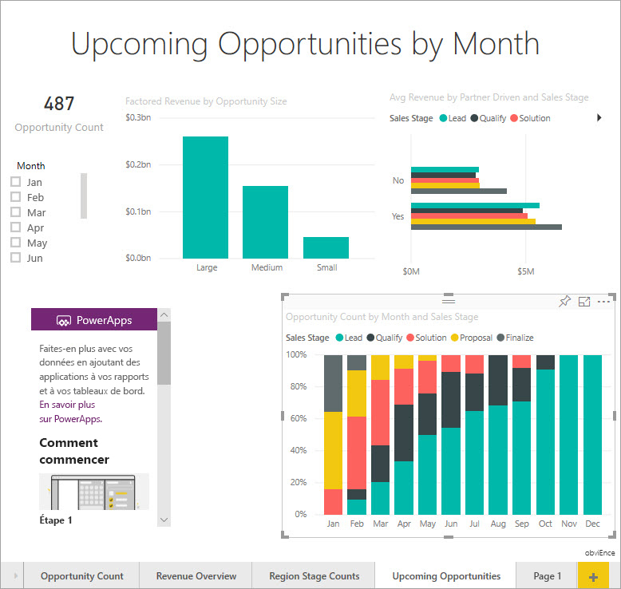

2. Dans le volet Visualisations, sélectionnez l’icône Power Apps, puis redimensionnez le visuel pour l’ajuster à l’espace que vous venez de créer.

    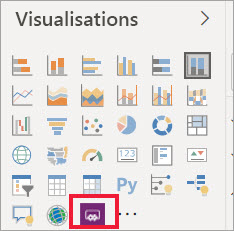

3. Dans le volet **Champs**, sélectionnez **Nom**, **Code du produit** et **Étape de vente**. 

    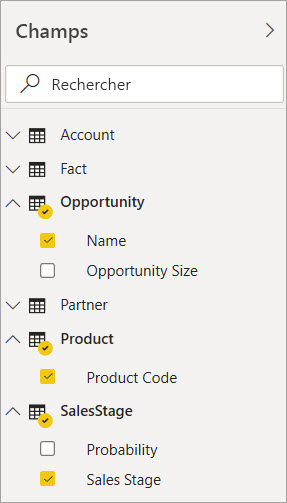

4. Sur le visuel Power Apps, sélectionnez l’environnement Power Apps où vous souhaitez créer l’application, puis choisissez **Créer**.

    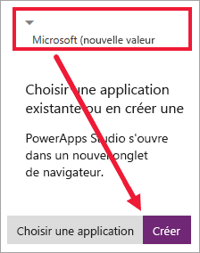

    Dans Power Apps Studio, vous voyez qu’une application de base est créée avec une *galerie* qui affiche l’un des champs que vous avez sélectionnés dans Power BI.

    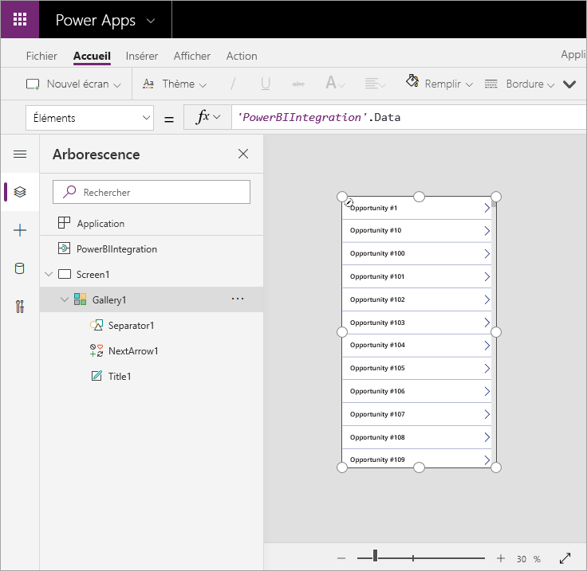

5.  Redimensionnez la galerie afin qu’elle n’occupe qu’une moitié de l’écran. 

6. Dans le volet gauche, sélectionnez **Screen1**, puis affectez « LightBlue » à la propriété **Fill** de l’écran (pour optimiser son affichage dans le rapport).

    

6. Libérez de l’espace pour un contrôle Étiquette. 

    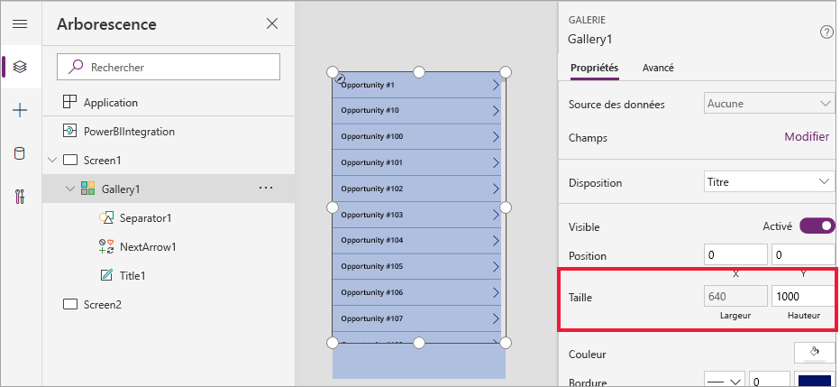

8. Sous **Galerie**, insérez un contrôle Étiquette de texte.

   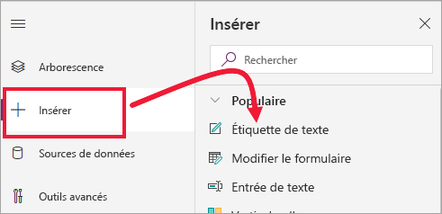

7. Faites glisser l’étiquette vers le bas de votre visuel. Définissez la propriété **Texte** sur `"Opportunity Count: " & CountRows(Gallery1.AllItems)`. Le nombre total d’opportunités dans le jeu de données est à présent affiché.

    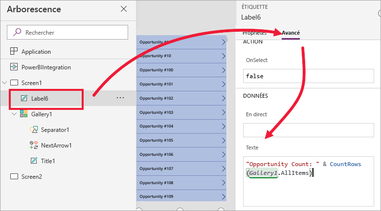

    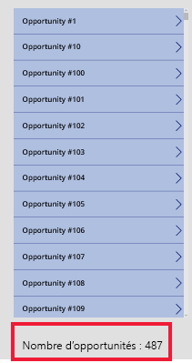

7. Enregistrez l’application sous le nom « Application Opportunités ». 

    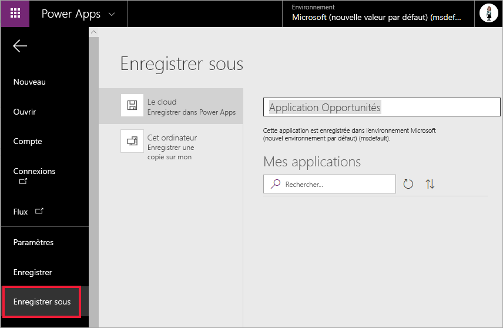

## Afficher l’application dans le rapport
L’application est désormais disponible dans le rapport Power BI et interagit avec les autres visuels, car elle partage la même source de données.

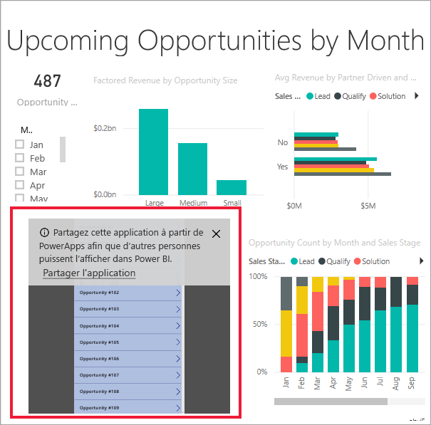

Dans le rapport Power BI, sélectionnez **Jan** dans le segment pour filtrer le rapport entier, dont les données dans l’application.

Notez que le nombre d’opportunités dans l’application correspond au nombre figurant en haut à gauche du rapport. Vous pouvez sélectionner d’autres éléments dans le rapport et les données dans les mises à jour de l’application.

## Nettoyer les ressources
Si vous ne souhaitez plus utiliser l’exemple Analyse des opportunités, vous pouvez supprimer le tableau de bord, le rapport et le jeu de données.

## Étapes suivantes
[Visuel de Questions et réponses](power-bi-visualization-types-for-reports-and-q-and-a.md)    
[Tutoriel : Incorporer un visuel Power Apps dans un rapport Power BI](https://docs.microsoft.com/powerapps/maker/canvas-apps/powerapps-custom-visual)    
