# Présentation des visualisations Questions et réponses de Power BI

[!INCLUDE [power-bi-service-new-look-include](../includes/power-bi-service-new-look-include.md)]

## Que sont les visualisations Questions et réponses ?

Le visuel Questions et réponses permet aux utilisateurs de poser des questions en langage naturel et d’obtenir des réponses sous la forme d’un visuel. 

[!INCLUDE [power-bi-visuals-desktop-banner](../includes/power-bi-visuals-desktop-banner.md)]

Le visuel Questions et réponses peut être utilisé comme outil par les *consommateurs* pour obtenir rapidement des réponses à leurs questions sur des données, et par les *concepteurs* pour créer des visuels de rapport simplement en double-cliquant n’importe où dans un rapport et en utilisant le langage naturel pour commencer. À l’instar des autres types de visuels, le visuel Questions et réponses prend en charge le filtrage croisé/la sélection croisée et les signets. Il prend également en charge les thèmes et d’autres options de mise en forme par défaut disponibles dans Power BI.

Le visuel Questions et réponses a quatre composants principaux :

- Le champ de question. C’est l’endroit où les utilisateurs tapent leur question et où leur sont présentées des suggestions pour les aider à formuler leur question.
- Une liste préremplie de questions suggérées.
- L’icône pour convertir le visuel Questions et réponses en visuel standard. 
- L’icône pour ouvrir l’outil Questions et réponses avec lequel les concepteurs configurent le moteur de langage naturel sous-jacent.

## Conditions préalables

1. Ce tutoriel utilise le [fichier PBIX de l’exemple Vente et marketing](https://download.microsoft.com/download/9/7/6/9767913A-29DB-40CF-8944-9AC2BC940C53/Sales%20and%20Marketing%20Sample%20PBIX.pbix). 

1. Dans la section supérieure gauche de la barre de menus Power BI Desktop, sélectionnez **Fichier** > **Ouvrir**
   
2. Recherchez votre copie du **fichier PBIX de l’exemple Vente et marketing**

1. Ouvrez le fichier dans la vue Rapport .

1. Select  pour ajouter une nouvelle page.

Si vous rencontrez une erreur quand vous créez un visuel Questions et réponses, consultez l’article sur les [limitations](../natural-language/q-and-a-limitations.md) pour vérifier que la configuration de la source de données est prise en charge.

## Créer un visuel Questions et réponses à l’aide d’une question suggérée
Dans cet exercice, nous allons sélectionner l’une des questions suggérées pour créer un visuel Questions et réponses. 

1. Ouvrez une page de rapport vide et sélectionnez l’icône du visuel Questions et réponses dans le volet Visualisations.

    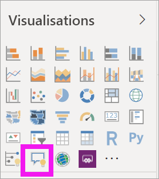

2. Faites glisser la bordure pour redimensionner le visuel.

    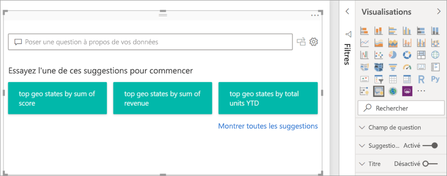

3. Pour créer le visuel, sélectionnez l’une des questions suggérées ou commencez à taper votre propre question dans le champ de question. Dans cet exemple, nous avons sélectionné **top geo states by sum of revenue** (premiers états géographiques par revenus totaux). Power BI essaie de sélectionner le type de visuel le plus adapté pour représenter les données. Dans ce cas, il sélectionne une carte.

    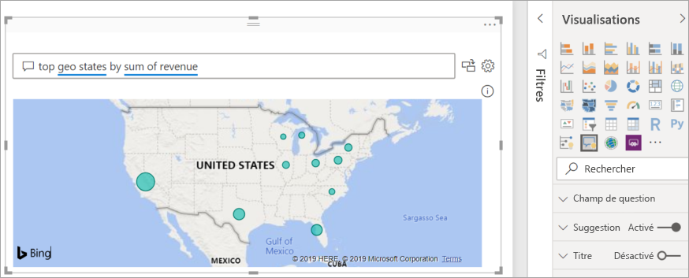

    Toutefois, vous pouvez indiquer à Power BI un type de visuel spécifique à utiliser, en l’ajoutant à votre requête en langage naturel. Gardez à l’esprit que les types de visuels ne sont pas tous toujours disponibles ou adaptés pour vos données. Par exemple, la représentation de ces données dans un graphique en nuages de points ne serait pas pertinente. En revanche, l’utilisation d’une carte choroplèthe serait une bonne option.

    

## Créer un visuel Questions et réponses à l’aide d’une requête en langage naturel
Dans l’exemple ci-dessus, nous avons sélectionné l’une des questions suggérées pour créer notre visuel Questions et réponses.  Dans cet exercice, nous allons taper notre propre question. À mesure que nous taperons notre question, Power BI nous aidera avec l’autocomplétion, des suggestions et des commentaires.

Si vous n’êtes pas sûr du type de questions à poser ou de la terminologie à employer, développez **Montrer toutes les suggestions** ou examinez le volet Champs qui se trouve sur le côté droit du canevas. Vous pourrez ainsi vous familiariser avec les termes et le contenu du jeu de données Vente et marketing.

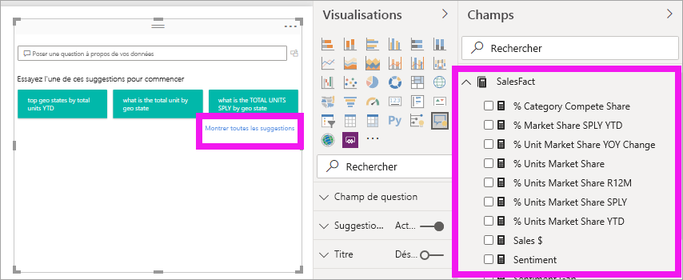

1. Tapez une question dans le champ Questions et réponses. Power BI souligne d’un trait rouge les mots qu’il ne reconnaît pas. Quand il le peut, Power BI vous aide à définir les mots non reconnus.  Dans le premier exemple ci-dessous, nous pouvons sélectionner l’une ou l’autre des suggestions.  

    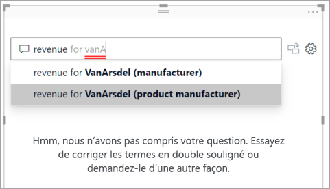

2. Si nous continuons à taper la question, Power BI nous signale qu’il ne comprend pas la question et il tente de nous aider. Dans l’exemple ci-dessous, Power BI nous demande « Vous voulez dire... » et suggère une autre formulation de notre question avec la terminologie employée dans notre jeu de données. 

    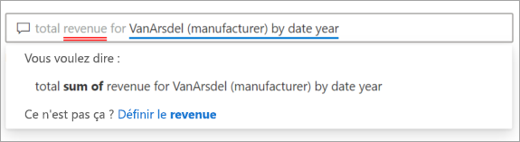

5. Avec l’aide de Power BI, nous avons pu poser une question contenant tous les termes reconnaissables. Power BI affiche les résultats dans un graphique en courbes. 

    

6. Nous allons remplacer ce type de visuel par un histogramme. 

    

7.  Ajoutez d’autres visuels à la page de rapport pour voir comment le visuel de Questions et réponses interagit avec les autres visuels de la page. Dans cet exemple, le visuel de Questions et réponses a effectué un filtrage croisé du graphique en courbes et de la carte, ainsi qu’une sélection croisée du graphique à barres.

    

## Mettre en forme et personnaliser le visuel Questions et réponses
Le visuel Questions et réponses peut être personnalisé en utilisant le volet de mise en forme et en appliquant un thème. 

### Appliquer un thème
Lorsque vous sélectionnez un thème, celui-ci est appliqué à toute la page de rapport. Pour déterminer quel thème choisir parmi les nombreux thèmes proposés, essayez-les jusqu’à ce que vous obteniez l’apparence souhaitée. 

1. Dans la barre de menus, sélectionnez l’onglet **Accueil** et choisissez **Changer de thème**. 

    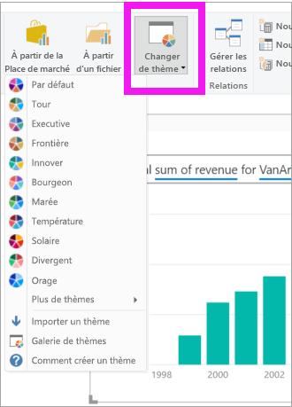

    
    
2. Dans cet exemple, nous avons sélectionné **Autres thèmes** > **Adapté aux daltoniens**.

    

### Mettre en forme le visuel Questions et réponses
Mettez en forme le visuel Questions et réponses, le champ de question et le mode d’affichage des suggestions. Vous pouvez tout changer, de l’arrière-plan d’un titre à la couleur de soulignement des mots non reconnus. Ici, nous avons ajouté un arrière-plan gris au champ de question et changé la couleur de soulignement de jaune à vert. Le titre est centré et s’affiche sur un arrière-plan jaune. 

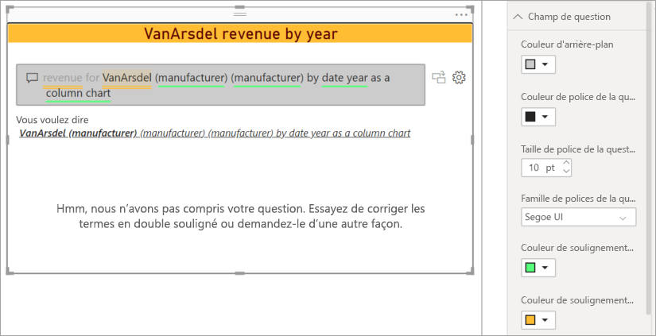

## Convertir le visuel Questions et réponses en visuel standard
Nous avons un peu mis en forme notre visuel d’histogramme adapté aux daltoniens, et avons ajouté un titre et une bordure. Nous sommes maintenant prêts à convertir ce visuel en visuel standard dans notre rapport et à l’épingler à un tableau de bord.

Sélectionnez l’icône  pour **Transformer ce résultat Questions et réponses en visuel standard**.

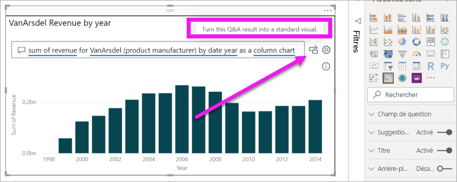

Ce visuel n’est plus un visuel Questions et réponses ; c’est un histogramme standard. Il peut être épinglé à un tableau de bord. Dans le rapport, ce visuel se comporte comme les autres visuels standard. Notez que le volet Visualisations affiche l’icône Histogramme (en surbrillance) à la place de l’icône Visuel Questions et réponses.

Si vous utilisez le ***service Power BI***, vous pouvez maintenant épingler le visuel à un tableau de bord en sélectionnant l’icône Épingler. 

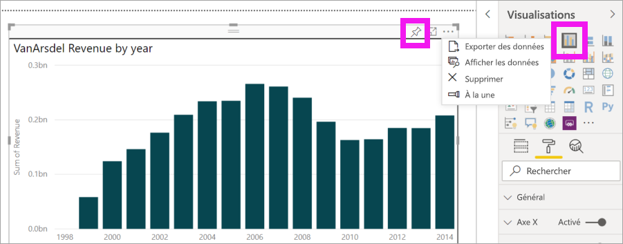

## Fonctionnalités avancées du visuel Questions et réponses
La sélection de l’icône d’engrenage ouvre le volet des outils du visuel Questions et réponses. 

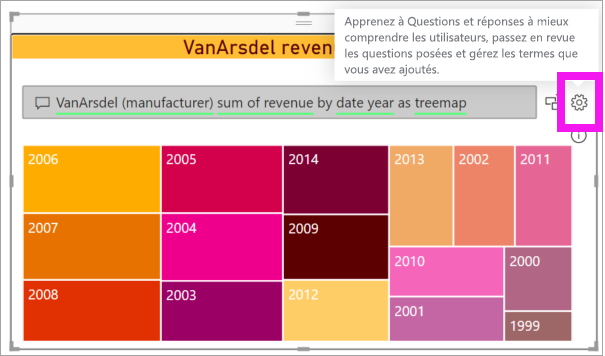

Utilisez le volet des outils pour apprendre au visuel Questions et réponses les termes qu’il ne reconnaît pas, pour gérer ces termes et pour gérer les questions suggérées pour ce jeu de données et ce rapport. Dans le volet des outils, vous pouvez également examiner les questions qui ont déjà été posées à l’aide de ce visuel Questions et réponses, ainsi que les questions qui ont été identifiées par des utilisateurs. Pour en savoir plus, consultez [Présentation des outils de Questions et réponses](../natural-language/q-and-a-tooling-intro.md).

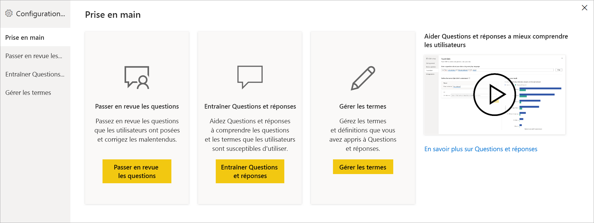

## Considérations et résolution des problèmes
Intégré à Office et à Bing, le visuel Questions et réponses essaie de mettre en correspondance les mots courants non reconnus avec des champs de votre jeu de données.  

## Étapes suivantes

Il existe diverses façons d’intégrer le langage naturel. Pour plus d’informations, consultez les articles suivants :

* [Outils de Questions et réponses](../natural-language/q-and-a-tooling-intro.md)
* [Bonnes pratiques pour Questions et réponses](../natural-language/q-and-a-best-practices.md)
