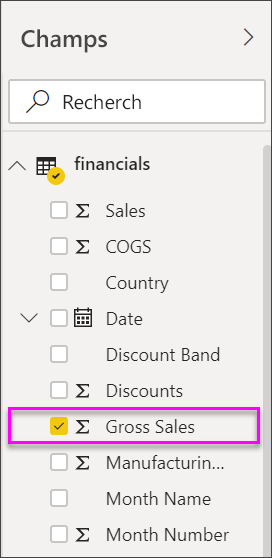
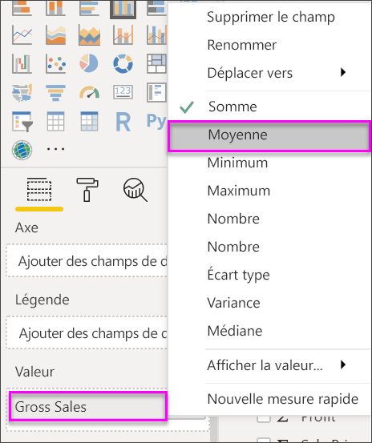
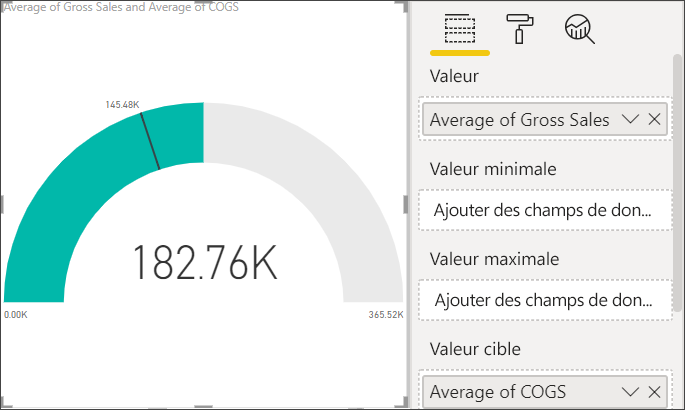
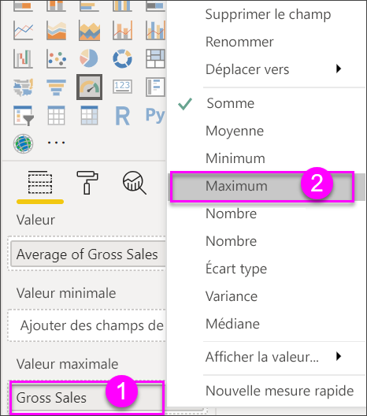
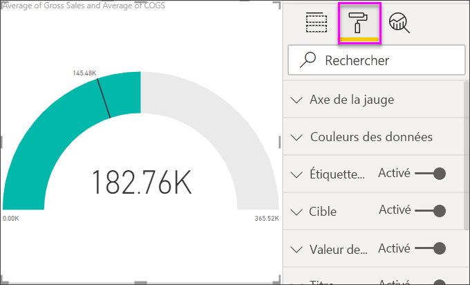
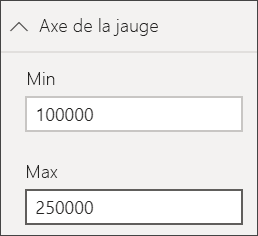
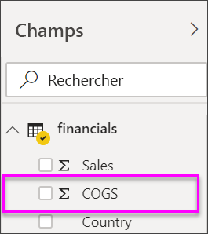
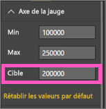
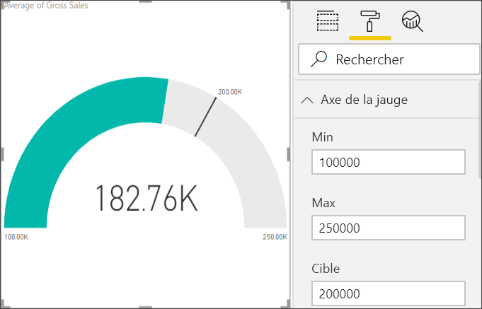

# Graphiques en jauge radiale dans Power BI

[!INCLUDE[consumer-appliesto-nyyn](../includes/consumer-appliesto-nyyn.md)]

[!INCLUDE [power-bi-visuals-desktop-banner](../includes/power-bi-visuals-desktop-banner.md)]

Un graphique en jauge radiale est en forme d’arc de cercle. Il affiche une seule valeur qui mesure la progression vers un objectif/indicateur de performance clé (KPI). La ligne (ou *aiguille*) représente l’objectif ou la valeur cible. L’ombrage représente la progression vers cet objectif. La valeur à l’intérieur de l’arc représente la valeur de la progression. Power BI répartit toutes les valeurs possibles uniformément le long de l’arc, de la valeur minimale (la plus à gauche) à la valeur maximale (la plus à droite).

Dans cet exemple, vous êtes un concessionnaire automobile et effectuez le suivi de la moyenne des ventes mensuelles réalisées par votre équipe de vente. L’aiguille correspond à un objectif de ventes de 140 véhicules. La moyenne minimale de ventes mensuelles possible est 0 et la moyenne maximale a été définie à 200.  L’ombrage bleu indique que l’équipe a atteint une moyenne de 120 ventes ce mois-ci. Heureusement, il reste encore une semaine pour atteindre l’objectif fixé.

> [!NOTE]
> Pour que vous puissiez partager votre rapport avec un collègue Power BI, il faut que vous disposiez tous deux de licences individuelles Power BI Pro ou que le rapport soit enregistré dans une capacité Premium.

## Quand faut-il utiliser un graphique en jauge radiale ?

Les graphiques en jauge radiale sont conseillés pour :

* montrer la progression vers un objectif ;

* représenter une mesure en centiles, comme un indicateur de performance clé ;

* montrer l’intégrité d’une seule mesure ;

* montrer des informations faciles à analyser et à comprendre.

## Prérequis

Ce tutoriel utilise le [fichier Excel d’exemple financier](https://go.microsoft.com/fwlink/?LinkID=521962).

1. Dans la section supérieure gauche de la barre de menus, sélectionnez **Obtenir les données** > **Excel**.
   
2. Trouver votre copie de l’**du fichier Excel d’exemple financier**

1. Ouvrez le **fichier Excel d’exemple financier** dans la vue Rapport .

1. Sélectionnez **financials** (données financières) et **Feuil1**

1. Cliquez sur **Charger**

1. Sélectionner  pour ajouter une nouvelle page.

## Créer une jauge radiale simple

### Étape 1 : Créer une jauge pour effectuer le suivi du chiffre d’affaires brut

1. Démarrer sur une page de rapport vide

1. Dans le volet **Champs** , sélectionnez **Gross Sales** (Chiffre d’affaires brut).

   

1. Changez l’agrégation en **Moyenne**.

   

1. Sélectionnez l’icône jauge  pour convertir l’histogramme en un graphique en jauge.

    

    Selon le moment où vous téléchargez le fichier **Financial Sample** (exemple financier), les valeurs affichées peuvent ne pas correspondre à ces chiffres.

    > [!TIP]
    > Par défaut, Power BI crée un graphique en jauge où la valeur actuelle (dans cet exemple, le **chiffre d’affaires brut moyen**) est présumée être au milieu de la jauge. La valeur du **chiffre d’affaires brut moyen** étant de 182 760 $, la valeur de départ (Minimum) est définie sur 0 et la valeur de fin (Maximum) est définie sur le double de la valeur actuelle.

### Étape 3 : Sélectionner la valeur cible

1. Faites glisser **COGS** du volet **Champs** vers le puits **Valeur cible** .

1. Changez l’agrégation en **Moyenne**.

   Power BI ajoute une aiguille pour représenter la valeur cible **145 480 $** .

   

    Comme vous pouvez le remarquer, l’objectif a même été dépassé.

   > [!NOTE]
   > Vous pouvez également entrer manuellement une valeur cible. Consultez la section [Utiliser les options de mise en forme pour définir manuellement les valeurs Minimum, Maximum et Cible](#use-manual-format-options-to-set-minimum-maximum-and-target-values).

### Étape 4 : Définir une valeur maximale

Dans l’étape 2, Power BI a utilisé le champ **Valeur** pour définir automatiquement une valeur minimale et une valeur maximale. Comment définir votre propre valeur maximale ? Supposons qu’au lieu de définir la valeur maximale possible au double de la valeur actuelle, vous souhaitez la définir au chiffre d’affaires brut le plus élevé dans votre jeu de données.

1. Faites glisser **Gross Sales** (Chiffre d’affaires brut) du volet **Champs** vers le puits **Valeur maximale** .

1. Changez l’agrégation en **Maximum**.

   

   La jauge est redessinée avec une nouvelle valeur de fin (1,21 million de chiffre d’affaires brut).

   

### Étape 5 : Enregistrer votre rapport

1. [Enregistrez le rapport](../create-reports/service-report-save.md).

## Utiliser les options de mise en forme pour définir manuellement les valeurs Minimum, Maximum et Cible

1. Supprimez **Max of Gross Sales** (Chiffre d’affaires brut maximum) de **Valeur maximale** .

1. Sélectionnez l’icône en forme de rouleau pour ouvrir le volet **Mise en forme**.

   

1. Développez l’**axe de la jauge** et entrez des valeurs pour **Min** et **Max**.

    

1. Effacez l’option **COGS** dans le volet **champs** pour supprimer la valeur cible.

    

1. Lorsque le champ **Cible** apparaît sous **Axe de la jauge**, entrez une valeur.

     

1. Éventuellement, continuez la mise en forme de votre graphique de type Jauge.

Une fois que vous avez terminé ces étapes, vous disposez d’un graphique en jauge qui ressemble à ceci :

## Étape suivante

* [Visuels d’indicateur de performance clé (KPI)](power-bi-visualization-kpi.md)

* [Types de visualisation dans Power BI](power-bi-visualization-types-for-reports-and-q-and-a.md)

D’autres questions ? [Posez vos questions à la communauté Power BI](https://community.powerbi.com/)

