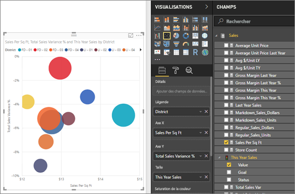
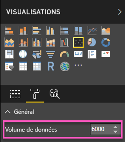
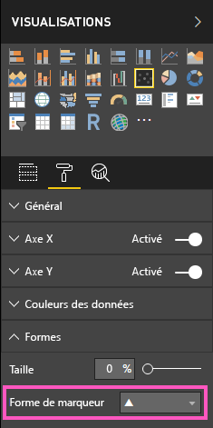
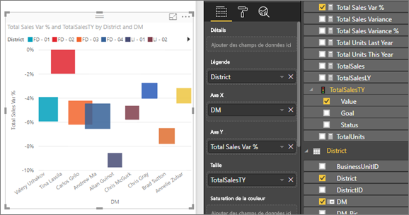
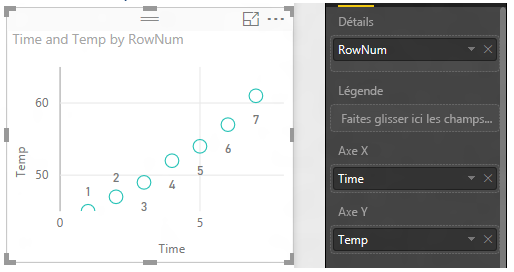
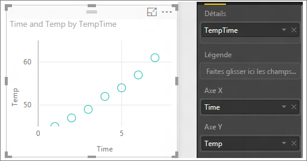

# Nuages de points, graphiques en bulles et graphiques à points dans Power BI
Un nuage de points a toujours deux axes de valeur pour afficher un jeu de données numériques sur l’axe horizontal et un autre jeu de valeurs numériques sur l’axe vertical. Le graphique affiche les points à l’intersection d’une valeur numérique x et y, en associant ces valeurs en points de données uniques. Ces derniers peuvent être distribués uniformément ou non sur l’axe horizontal, en fonction des données.

Un graphique en bulles remplace les points de données par des bulles, la *taille* de la bulle représentant une dimension supplémentaire des données.

Un graphique à points est similaire à un graphique en bulles et à un nuage de points sauf que vous pouvez tracer des données numériques ou de catégorie sur l’axe X. 

Vous pouvez définir le nombre de points de donnée, dans la limite maximale de 10 000.  

## Choix de l’utilisation d’un nuage de points ou d’un graphique en bulles
### Les nuages de points sont conseillés dans les cas suivants :
* Pour afficher les relations entre 2 (nuage de points) ou 3 (bulles) valeurs **numériques** .
* Pour tracer les deux groupes de nombres sous la forme d’une série de coordonnées xy.
* À la place d’un graphique en courbes lorsque vous souhaitez modifier l’échelle de l’axe horizontal.    
* Pour transformer l’axe horizontal en échelle logarithmique.
* Pour afficher les données de feuille de calcul qui incluent des paires ou des jeux groupés de valeurs. Dans un nuage de points, vous pouvez ajuster les échelles indépendantes des axes pour afficher plus d’informations sur les valeurs groupées.
* Pour afficher des modèles dans de grands jeux de données, par exemple en affichant des valeurs hors norme, des clusters et des tendances linéaires ou non linéaires.
* Pour comparer un grand nombre de points de données sans distinction de temps.  Plus vous incluez de données dans un nuage de points, meilleures sont les comparaisons possibles.

### Les graphiques en bulles sont conseillés dans les cas suivants :
* Si vos données ont 3 séries de données qui contiennent chacune un jeu de valeurs.
* Pour présenter des données financières.  Différentes tailles de bulles sont utiles pour souligner visuellement des valeurs spécifiques.
* Pour utiliser avec des quadrants.

### Les graphiques à points constituent un meilleur choix que les nuages de points ou les graphiques en bulles :
* si vous voulez inclure des données de catégorie sur l’axe X

## Créer un nuage de points
Regardez cette vidéo dans laquelle Will crée un graphique à nuages de points, puis suivez les étapes ci-dessous pour en créer un vous-même.

<iframe width="560" height="315" src="https://www.youtube.com/embed/PVcfPoVE3Ys?list=PL1N57mwBHtN0JFoKSR0n-tBkUJHeMP2cP" frameborder="0" allowfullscreen></iframe>

Ces instructions s’appliquent à l’exemple Analyse de la vente au détail. Pour effectuer la procédure, [téléchargez l’exemple](../sample-datasets.md) pour le service Power BI (app.powerbi.com) ou Power BI Desktop.   

1. Ouvrez le rapport en mode Édition, puis sélectionnez l’icône Plus jaune pour créer une page de rapport vierge.
 
2. Dans le volet Champs, sélectionnez les champs suivants :
   - **Ventes** > **Ventes par mètre carré**
   - **Ventes** > **% d’écart des ventes totales**
   - **District** > **District**

     

     Si vous utilisez le service Power BI, veillez à ouvrir le rapport en [mode Édition](../service-interact-with-a-report-in-editing-view.md).

3. Effectuez la conversion en nuage de points. Dans le volet Visualisation, sélectionnez l’icône de nuage de points.

   .

4. Faites glisser **District** depuis **Détails** vers **Légende**. Cette opération affiche un nuage de points qui trace le **% d’écart des ventes totales** sur l’axe Y et les **Ventes par mètre carré** sur l’axe X. Les couleurs de points de données représentent des districts :

    

Ajoutons à présent une troisième dimension.

## Créer un graphique en bulles

1. Dans le volet **Champs**, faites glisser **Ventes** > **Ventes de cette année** > **Valeur** vers la zone **Taille**. Les points de données se développent en volumes proportionnels à la valeur des ventes.
   
   

2. Pointez sur une bulle. La taille de la bulle reflète la valeur de la zone **Ventes de cette année**.
   
    

3. Pour définir le nombre de points de données à afficher dans votre graphique en bulles, dans la section **Mise en forme** du volet **Visualisations**, développez la carte **Général** et ajustez le **Volume de données**. Vous pouvez définir le volume maximal de données sur n’importe quel nombre jusqu’à 10 000. Quand vous atteignez des nombres très élevés, nous vous suggérons de commencer par tester pour vérifier que vous conservez de bonnes performances. 

     

   Étant donné que plus le nombre de points de données est important, plus le temps de chargement est long, si vous choisissez de publier des rapports avec des limites à l’extrémité supérieure de l’échelle, testez vos rapports sur le web et les appareils mobiles pour vérifier que les performances correspondent aux attentes de vos utilisateurs. 

4. Vous pouvez [mettre en forme les couleurs, étiquettes, titres, arrière-plan, etc.](service-getting-started-with-color-formatting-and-axis-properties.md) de la visualisation. Pour [améliorer l’accessibilité](../desktop-accessibility.md), ajoutez des formes de marqueur à chaque ligne. L’utilisation d’une forme de marqueur différente pour chaque ligne permet aux lecteurs du rapport de différencier plus facilement les lignes (ou aires) les unes des autres. Pour sélectionner la forme de marqueur, développez la carte **Formes**, puis sélectionnez une forme de marqueur.

      

   Vous pouvez également modifier la forme de marqueur et la définir sur un losange, triangle ou carré :

   

## Créer un graphique à points
Pour créer un graphique à points, remplacez le champ d’axe X numérique par un champ de catégorie.

Dans le volet **Axe X**, remplacez **Sales per sq ft** par **District > DM**.
   

## Considérations et résolution des problèmes

### **Votre nuage de points a un seul point de données**
Votre nuage de points a-t-il uniquement un point de données qui regroupe toutes les valeurs sur les axes X et Y ?  Ou regroupe-t-il toutes les valeurs le long d’une unique ligne horizontale ou verticale ?

Ajoutez un champ à la zone **Détails** pour indiquer à Power BI comment regrouper les valeurs. Ce champ doit être unique pour chaque point à tracer, comme un champ de numéro de ligne ou d’ID simple.

Ou, si vous n’en avez pas dans vos données, créez un champ qui concatène les valeurs X et Y pour les convertir en élément unique par point :

Pour créer un champ, [utilisez l’éditeur de requête Power BI Desktop pour ajouter une colonne d’index](../desktop-add-custom-column.md) à votre jeu de données.  Ajoutez ensuite cette colonne à la zone **Détails** de la visualisation.

## Étapes suivantes

[Nuages de points haute densité](desktop-high-density-scatter-charts.md)

[Types de visualisation dans Power BI](power-bi-visualization-types-for-reports-and-q-and-a.md)

