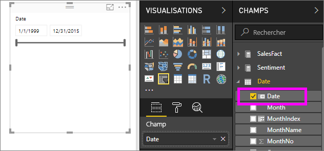
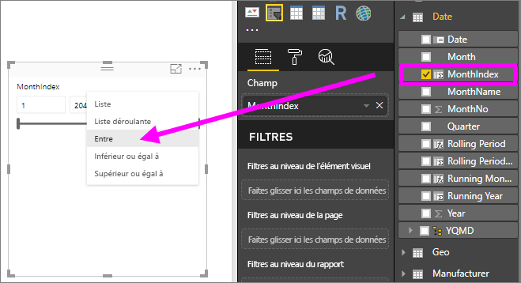

# Segments dans Power BI

[!INCLUDE [power-bi-visuals-desktop-banner](../includes/power-bi-visuals-desktop-banner.md)]

Vous souhaitez que vos lecteurs de rapports soient en mesure de rechercher des mesures de ventes globales, mais également de mettre en surbrillance des performances pour les responsables de région individuels et les différentes périodes. Vous pouvez créer des rapports distincts ou des graphiques de comparaison ou vous pouvez utiliser des segments. Un segment constitue un autre moyen de réduire la partie du jeu de données affichée dans les autres visualisations d’un rapport. 

Ce tutoriel utilise [Exemple Analyse de la vente au détail](../sample-retail-analysis.md) gratuit pour vous expliquer pas à pas comment créer, mettre en forme et utiliser des segments de plages de dates et de listes. Amusez-vous à découvrir les différentes mises en forme et utilisations possibles des segments. 

## Quand utiliser un segment
Les segments sont très utiles pour :

* Afficher les filtres couramment utilisés ou importants sur le canevas de rapport pour en faciliter l’accès.
* Déterminer plus rapidement l’état de filtrage actuel sans avoir à ouvrir une liste déroulante. 
* Filtrer les colonnes qui sont inutiles et masquées dans les tables de données.
* Créer des rapports plus ciblés en ajoutant des segments à côté des visuels importants.

Les segments Power BI présentent les limitations suivantes :

- Les segments ne prennent pas en charge les champs d’entrée.
- L’exploration n’est pas prise en charge pour les segments.

## Créer des segments

**Créer un nouveau segment pour filtrer les données par le Gestionnaire de districts**

Ce tutoriel utilise le [fichier PBIX de l’exemple Analyse de la vente au détail](https://download.microsoft.com/download/9/6/D/96DDC2FF-2568-491D-AAFA-AFDD6F763AE3/Retail%20Analysis%20Sample%20PBIX.pbix).

1. Dans la section supérieure gauche de la barre de menus, sélectionnez **Fichier** > **Ouvrir**.
   
2. Rechercher votre copie du **fichier PBIX de l’exemple Analyse de la vente au détail**

1. Ouvrez le **fichier PBIX de l’exemple Analyse de la vente au détail** dans la vue Rapport .

1. Sélectionner  pour ajouter une nouvelle page.

2. Dans la page Vue d’ensemble, rien n’est sélectionné sur le canevas, sélectionnez l’icône **Segment**  dans le volet **Visualisations** pour créer un nouveau segment. 
3. Une fois le nouveau segment sélectionné, dans le volet Champs, sélectionnez **District** > **DM** pour remplir le segment. Le nouveau segment est une liste des boîtes de sélection avant les noms. 
    
    
    
4. Redimensionnez et faites glisser le segment et autres éléments sur le canevas pour libérer de l’espace pour le segment. Notez que les éléments de segment sont tronqués si vous redimensionnez le segment trop petit. 
5. Sélectionnez les noms sur le segment et notez les effets sur les autres visualisations de la page. Sélectionnez à nouveau les noms pour les désélectionner, maintenez la touche **Ctrl** enfoncée pour sélectionner plusieurs noms. La sélection de tous les noms a le même effet que la sélection d’aucun nom. 

6. Vous pouvez également sélectionner l'icône de rouleau de peinture pour mettre en forme votre segment. Il existe tout simplement trop d'options pour les décrire toutes ici, alors testez-les vous-même afin de créer le segment adapté à vos besoins. Dans les exemples ci-dessous, le premier segment utilise une orientation horizontale et applique des arrière-plans colorés aux éléments. Le deuxième segment reste en position verticale et colore le texte pour lui donner un aspect plus standard.

   
>[!TIP]
>Par défaut, les éléments de segment de liste sont triés par ordre croissant. Pour inverser l’ordre de tri et utiliser l’ordre décroissant, sélectionnez les points de suspension ( **...** ) en haut à droite du segment et choisissez **Tri décroissant**.

**Pour créer un nouveau segment pour filtrer les données par plage de dates**

1. Sans aucun élément sélectionné dans le canevas, faites défiler la liste déroulante **Magasin** dans le volet Champs, puis faites glisser **OpenDate** vers la boîte **Valeurs** dans le volet Visualisations pour créer une visualisation.
2. Une fois la nouvelle visualisation sélectionnée, sélectionnez l’icône **Segment** pour convertir la nouvelle visualisation en segment. Ce segment est un segment de contrôle avec la plage de dates remplie.
    
    

    
4. Redimensionnez et faites glisser le segment et autres éléments sur le canevas pour libérer de l’espace pour le segment. Notez que le curseur est redimensionné selon la taille du segment, mais il disparaît et les dates sont tronquées si vous redimensionnez le segment trop petit. 
4. Sélectionnez des plages de dates différentes avec le curseur ou sélectionnez un champ de date pour entrer une valeur ou afficher un calendrier pour une sélection plus précise. Notez les effets sur les autres visualisations de la page.
    
    >[!NOTE]
    >Les types de données numériques et date/heure produisent des segments de curseur de plage par défaut. À compter de la mise à jour de Power BI de février 2018, les segments des types de données de nombres entiers s’alignent sur des valeurs de nombre entier plutôt que d’afficher des places décimales. 

5. Pour modifier le type de segment, une fois le segment sélectionné, placez votre curseur sur la zone supérieure droite du segment, faites défiler vers le bas le carat qui s’affiche et choisissez une des autres options, telles que **Liste** ou **Avant**. Notez les changements d’apparence du segment et des options de sélection. 
 
    

Pour plus d’informations sur la création des segments de plages numériques et de dates, consultez [Utiliser le segment de plages numériques dans Power BI Desktop](../desktop-slicer-numeric-range.md) et regardez la vidéo suivante.
   > [!NOTE]
   > Cette vidéo utilise une version antérieure de Power BI Desktop.
   > 
   > 
<iframe width="560" height="315" src="https://www.youtube.com/embed/zIZPA0UrJyA" frameborder="0" allowfullscreen></iframe> 

## Contrôler l’impact des segments sur les visuels de la page
Par défaut, les segments des pages du rapport affectent toutes les autres visualisations sur cette page, y compris les unes par rapport aux autres. Lorsque vous choisissez des valeurs dans les curseurs de liste et de date que vous venez de créer, notez les effets sur les autres visualisations. Les données filtrées sont une intersection des valeurs sélectionnées dans les deux segments. 

Vous pouvez utiliser **Interactions avec le visuel** pour empêcher certaines visualisations de la page d’être affectées par les autres. Sur la page **Vue d’ensemble**, le graphique « Variance des ventes totales par FiscalMonth et Gestionnaire de districts » affiche des données comparatives générales pour les Gestionnaires de districts par Mois, que vous souhaitez laisser visibles à tout moment. Vous pouvez utiliser **Interactions visuelles** pour empêcher les sélections de segment de filtrer ce graphique. 

1. Après avoir sélectionné le segment Gestionnaire de districts dans la page **Ventes mensuelles du district** :
    - Dans Power BI Desktop, sélectionnez le menu **Format** sous **Outils d'élément visuel**, puis sélectionnez **Modifier les interactions**.
   
   Les contrôles de filtre  s’affichent au-dessus de tous les autres visuels de la page. Au départ, toutes les icônes **Filtre** sont sélectionnées.
   
2. Sélectionnez l’icône **Aucun** au-dessus du graphique **Variance des ventes totales par FiscalMonth et Gestionnaire de districts** pour arrêter le filtrage par le segment. 
3. Sélectionnez le segment **Mois** et sélectionnez à nouveau l’icône **Aucun** au-dessus du graphique **Variance des ventes totales par FiscalMonth et Gestionnaire de districts** pour arrêter le filtrage par ce segment. Désormais, lorsque vous sélectionnez les noms et les plages de dates dans les segments, le graphique Variance des ventes totales par FiscalMonth et Gestionnaire de districts est inchangé. 

Pour plus d’informations sur la modification des interactions, consultez [Interactions entre les visuels dans un rapport Power BI](../service-reports-visual-interactions.md).

## Synchroniser et utiliser des segments dans d’autres pages
À compter de la mise à jour de février 2018 de Power BI, vous pouvez synchroniser un segment et l’utiliser dans toutes les pages d’un rapport ou dans certaines pages uniquement. 

Dans le rapport actuel, la page **Ventes mensuelles du district** affiche également un segment **Gestionnaire de districts**, mais comment afficher également ce segment dans la page de **vue d’ensemble**  ? La page **Nouveaux magasins** comporte aussi un segment, mais elle ne fournit que les informations **Nom du magasin**. Grâce au volet de **synchronisation des segment**, nous pouvons synchroniser le segment **Gestionnaire de districts** avec ces pages, afin que les sélections du segment sur n’importe quelle page affectent les visualisations sur les trois pages.

1. Dans le menu **Affichage**, sélectionnez **Synchroniser les segments** dans Power BI Desktop.

    

1.  Le volet **Synchroniser les segments** apparaît entre les volets **Filtres**et **Visualisations**.  

    

1. Dans la page **Ventes mensuelles du district**, sélectionnez le segment **Gestionnaire de districts**. 
    
    
    
3. Dans la colonne **Synchrone**, sélectionnez la page **Nouveaux magasins** et la page **Vue d’ensemble** pour synchroniser le segment **Ventes mensuelles du district** avec ces pages. 
    
3. Dans la colonne **Visible**, sélectionnez la page **Nouveaux magasins**, puis **Vue d’ensemble**. Votre volet **Synchroniser les segments** devrait maintenant ressembler à l'image ci-dessous :

    

1. Observez les effets de la synchronisation du segment et de la visibilisation sur les autres pages. Sur la page **Ventes mensuelles du district**, le segment **Gestionnaire de districts** affiche alors les mêmes sélections que celui de la page **Vue d’ensemble**. Sur la page **Nouveaux magasins**, les sélections effectuées dans le segment **Gestionnaire de districts** affectent les sélections disponibles dans le segment **Nom de magasin**. 
    
    >[!TIP]
    >Bien que le segment apparaisse initialement dans les pages synchronisées à la même taille et dans la même position que sur la page d’origine, vous pouvez déplacer, redimensionner et mettre en forme des segments synchronisés sur les différentes pages indépendamment. 

>[!NOTE]
>Si vous synchronisez un segment sur une page mais ne le rendez pas visible sur cette page, les sélections de segment effectuées sur les autres pages filtrent toujours les données sur la page.
 
## Mettre en forme des segments
Différentes options de mise en forme sont disponibles selon le type de segment. À l’aide de l’orientation **Horizontal**, de la disposition **Dynamique** et de la coloration des **Éléments**, vous pouvez produire des boutons ou mosaïques, plutôt que des éléments de liste standard et redimensionner les éléments de segment pour s’adapter aux différentes tailles et dispositions d’écran.  

1. Une fois le segment **Gestionnaire de districts** sélectionné sur une page, dans le volet **Visualisations**, sélectionnez l’icône **Format**  pour afficher les contrôles de mise en forme. 
    
    
    
2. Sélectionnez les flèches de liste déroulante à côté de chaque catégorie pour afficher et modifier les options. 

### Options générales
1. Sélectionnez la couleur rouge sous **Couleur du contour** et changez la valeur **Épaisseur du contour** à « 2 ». Ces options définissent la couleur et l’épaisseur des contours ou soulignements de l’en-tête et des éléments, quand ils sont activés. 
2. Sous **Orientation**, **Vertical** est la valeur par défaut. Sélectionnez **Horizontal** pour produire un segment avec des mosaïques ou des boutons organisés horizontalement et utilisez les flèches pour accéder aux éléments qui ne tiennent pas dans le segment.
    
    
    
3. Activez la disposition **Dynamique** pour modifier la taille et la disposition des éléments de segment en fonction de la taille de l’écran et des segments. Pour les segments de la liste, la disposition dynamique est disponible uniquement dans une orientation horizontale et empêche que des éléments soient tronqués sur de petits écrans. Pour les segments de curseurs de plages, la mise en forme dynamique modifie le style du curseur et fournit un redimensionnement plus flexible. Les deux types de segments deviennent des icônes de filtre de très petite taille. 
    
    
    
    >[!NOTE]
    >Les changements de disposition dynamique peuvent substituer la mise en forme spécifique du titre et des éléments que vous avez définie. 
    
4. Définissez la position et la taille du segment avec une précision numérique sous **Position X**, **Position Y**, **Largeur** et **Hauteur** ou déplacez et redimensionnez le segment directement sur le canevas. Faites des essais avec des tailles d’éléments et des dispositions différentes et notez les modifications de la mise en forme dynamique en conséquence.  

    

Pour plus d’informations sur l’orientation horizontale et la disposition dynamique, consultez [Créer un segment réactif que vous pouvez redimensionner dans Power BI](../power-bi-slicer-filter-responsive.md).

### Options des contrôles de sélection (uniquement pour les segments de liste)
1. L’option **Afficher Sélectionner tout** est **Désactivée** par défaut. **Activez-la** pour ajouter un élément **Sélectionner tout** au segment qui sélectionne ou désélectionne tous les éléments, le cas échéant. Quand tous les éléments sont sélectionnés, il suffit de cliquer ou d’appuyer sur un élément pour le désélectionner. Il s’agit d’un filtre de type « n’est pas ». 
    
    
    
2. L’option **Sélection simple** est **Activée** par défaut. Pour sélectionner un seul élément, cliquez ou appuyez dessus et maintenez la touche **Ctrl** en cliquant ou en tapant pour sélectionner plusieurs éléments. **Désactivez** l’option **Sélection simple** pour pouvoir sélectionner plusieurs éléments sans avoir à maintenir la touche **Ctrl** enfoncée. Le fait de cliquer ou d’appuyer à nouveau sur un élément sélectionné le désélectionne. 

### Options de titre
Le **titre** est **Activé** par défaut. Il affiche le nom du champ de données en haut du segment. 
1. Mettez en forme le texte du titre en définissant les options **Couleur de police** sur rouge, **Taille du texte** sur 14 points, **Alignement** sur centrer, et **Famille de polices** sur Arial Noir. 

### Options de l’élément (uniquement pour les segments de liste)
1. Mettez en forme le texte et l’arrière-plan des éléments en définissant les options **Couleur de police** sur noir, **Arrière-plan** sur rouge clair, **Taille du texte** sur 10 points et **Famille de polices** sur Arial. 
2. Sous **Contour**, choisissez **Cadre** pour dessiner une bordure autour de chaque élément avec la taille et la couleur que vous avez définies dans les options **Général**. 
    
    
    
    >[!TIP]
    >- Avec **Orientation > Horizontal**, les éléments désélectionnés affichent le texte et l’arrière-plan dans les couleurs choisies, alors que les éléments sélectionnés utilisent les couleurs par défaut du système, généralement, les arrière-plans sont en noir et le texte est en blanc.
    >- Avec **Orientation > Vertical**, les éléments s’affichent toujours dans les couleurs définies et les boîtes de sélection s’affichent toujours en noir quand elles sont sélectionnées. 

### Entrées de date/numériques et options du curseur (segments des curseurs de plage uniquement)
- Les options d’entrées de date/numériques sont les mêmes que les options **d’élément** pour les segments de la liste, sauf s’il n’y a aucun **Contour** ou soulignement.
- Les options de curseur vous permettent de définir la couleur du curseur de la plage ou **désactivez** le curseur, en laissant uniquement les entrées numériques.

### Autres options de mise en forme
Les autres options de mise en forme sont désactivées par défaut. Quand elles sont **activées** : 
- **Arrière-plan :** ajoute une couleur d’arrière-plan au segment entier et définit sa transparence.
- **Verrouiller l’aspect :** conserve la forme du segment quand il est redimensionné.
- **Bordure :** ajoute une bordure d’un pixel autour du segment et définit sa couleur. (Cette bordure de segment est distincte et indépendante des paramètres de contour définis sous Général.) 

## Étapes suivantes
[Types de visualisation dans Power BI](power-bi-visualization-types-for-reports-and-q-and-a.md)

[Tableaux dans Power BI](power-bi-visualization-tables.md)

