# Segments dans Power BI

[!INCLUDE [applies-to](../includes/applies-to.md)] [!INCLUDE [yes-desktop](../includes/yes-desktop.md)] [!INCLUDE [yes-service](../includes/yes-service.md)]

Supposons que vous souhaitiez permettre aux lecteurs de vos rapports d’examiner les métriques des ventes globales, mais aussi de mettre en évidence les performances pour des responsables de district individuels et différentes périodes. Vous pouvez créer des rapports distincts ou des graphiques de comparaison. Vous pouvez également utiliser des *segments*. Un segment constitue un autre moyen de réduire la partie du jeu de données affichée dans les autres visualisations d’un rapport. 

Cet article décrit la création et le débogage d’un segment simple en utilisant l’[exemple Analyse de la vente au détail](../create-reports/sample-retail-analysis.md) gratuit. Il montre également comment vous pouvez contrôler les visuels affectés par un segment et comment effectuer une synchronisation avec des segments se trouvant sur d’autres pages. Voici d’autres articles qui expliquent comment créer des types spécifiques de segments :

- [s de plages numériques](../create-reports/desktop-slicer-numeric-range.md).
- [Segments de dates relatives](desktop-slicer-filter-date-range.md).
- [Segments redimensionnables](../create-reports/power-bi-slicer-filter-responsive.md) réactifs.
- [Segments de hiérarchie](../create-reports/power-bi-slicer-hierarchy-multiple-fields.md) avec plusieurs champs.

## Quand utiliser un segment
Les segments sont très utiles pour :

* Afficher les filtres couramment utilisés ou importants sur le canevas de rapport pour en faciliter l’accès.
* Déterminer plus rapidement l’état de filtrage actuel sans avoir à ouvrir une liste déroulante. 
* Filtrer les colonnes qui sont inutiles et masquées dans les tables de données.
* Créer des rapports plus ciblés en ajoutant des segments à côté des visuels importants.

Les segments Power BI ne prennent pas en charge ce qui suit :

- Champs d’entrée
- Exploration hiérarchique

## Création d’un segment

Ce segment filtre les données par responsable de district. Si vous voulez suivre cette procédure, téléchargez l’exemple [Fichier PBIX de l’exemple Analyse de la vente au détail](https://download.microsoft.com/download/9/6/D/96DDC2FF-2568-491D-AAFA-AFDD6F763AE3/Retail%20Analysis%20Sample%20PBIX.pbix).

1. Ouvrez Power BI Desktop, puis dans la barre de menus, sélectionnez **Fichier** > **Ouvrir**.
   
1. Accédez au fichier **Retail Analysis sample PBIX.pbix**, puis sélectionnez **Ouvrir**.

1. Dans le volet gauche, sélectionnez l’icône **Rapport** pour ouvrir le fichier en mode rapport.

1. Dans la page **Overview**, rien n’étant sélectionné sur le canevas du rapport, sélectionnez l’icône **Segment** dans le volet **Visualisations** pour créer un segment. 

1. Une fois le nouveau segment sélectionné, dans le volet **Champs**, sélectionnez **District** > **DM** pour remplir le segment. 

    Le nouveau segment est maintenant renseigné avec une liste de noms de responsables de district et les cases de sélection correspondantes.
    
    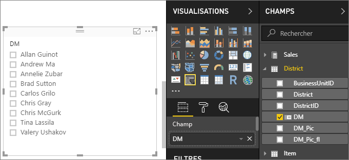
    
1. Redimensionnez et faites glisser les éléments sur le canevas pour faire de la place au segment. Si vous réduisez trop la taille du segment, ses éléments sont tronqués. 

1. Sélectionnez les noms sur le segment et notez les effets sur les autres visualisations de la page. Sélectionnez à nouveau les noms pour les désélectionner ou maintenez la touche **Ctrl** enfoncée pour sélectionner plusieurs noms. La sélection de tous les noms a le même effet que la sélection d’aucun nom. 

1. Vous pouvez également sélectionner **Format** (icône en forme de rouleau de peinture) dans le volet **Visualisations** pour mettre en forme votre segment. 

   Il existe trop d’options pour les décrire toutes ici, alors testez-les vous-même afin de créer le segment adapté à vos besoins. Dans l’image suivante, le premier segment utilise une orientation horizontale et des arrière-plans colorés pour les éléments. Le deuxième segment a une orientation verticale et un texte coloré pour une apparence plus standard.

   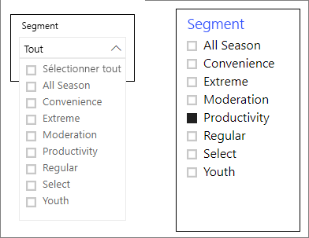

   >[!TIP]
   >Par défaut, les éléments de segment de liste sont triés par ordre croissant. Pour inverser l’ordre de tri et utiliser l’ordre décroissant, sélectionnez les points de suspension ( **...** ) en haut à droite du segment et choisissez **Tri décroissant**.

## Contrôler l’impact des segments sur les visuels de la page
Par défaut, les segments des pages du rapport affectent toutes les autres visualisations sur cette page, y compris les unes par rapport aux autres. Quand vous choisissez des valeurs dans les curseurs de liste et de date que vous venez de créer, notez les effets sur les autres visualisations. Les données filtrées sont une intersection des valeurs sélectionnées dans les deux segments. 

Utilisez les interactions entre les visuels pour empêcher certaines visualisations de la page d’être affectées par les autres. Dans la page **Overview**, le graphique **Total Sales Variance by FiscalMonth and District Manager** affiche des données comparatives générales pour les responsables de district par mois, que vous souhaitez laisser visibles à tout moment. Utilisez les interactions entre les visuels pour empêcher les sélections de segment de filtrer ce graphique. 

1. Accédez à la page **Overview** du rapport, puis sélectionnez le segment **DM** que vous avez créé précédemment.

1. Dans Power BI Desktop, sélectionnez le menu **Format** sous **Outils pour les visuels**, puis sélectionnez **Modifier les interactions**.
   
   Les contrôles de filtre  ont chacun deux options, **Filtre** et **Aucun**, et apparaissent au-dessus de tous les visuels de la page. Au départ, l’option **Filtre** est présélectionnée sur tous les contrôles.
   
1. Sélectionnez l’option **Aucun** dans le contrôle de filtre au-dessus du graphique **Total Sales Variance by FiscalMonth and District Manager** pour arrêter le filtrage par le segment **DM**. 

1. Sélectionnez le segment **OpenDate**, puis l’option **Aucun** au-dessus du graphique **Total Sales Variance by FiscalMonth and District Manager** pour arrêter le filtrage par ce segment. 

   Maintenant, quand vous sélectionnez des noms et des plages de dates dans les segments, le graphique **Total Sales Variance by FiscalMonth and District Manager** est inchangé.

Pour plus d’informations sur la modification des interactions, consultez [Modifier l’interaction des visuels dans un rapport Power BI](../create-reports/service-reports-visual-interactions.md).

## Synchroniser et utiliser des segments dans d’autres pages
À compter de la mise à jour de février 2018 de Power BI, vous pouvez synchroniser un segment et l’utiliser dans toutes les pages d’un rapport ou dans certaines pages uniquement. 

Dans le rapport actuel, la page **District Monthly Sales** affiche également un segment **District Manager**, mais comment afficher également ce segment dans la page **New Stores** ? La page **New Stores** a un segment, mais elle ne fournit que les informations sur le nom du magasin (**Store Name**). Avec le volet **Synchroniser les segments**, vous pouvez synchroniser le segment **District Manager** avec ces pages afin que les sélections du segment sur n’importe quelle page affectent les visualisations sur les trois pages.

1. Dans le menu **Affichage** de Power BI Desktop, sélectionnez **Synchroniser les segments**.

    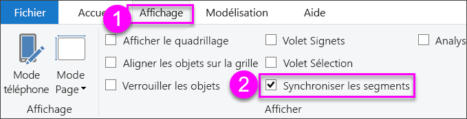

    Le volet **Synchroniser les segments** apparaît entre les volets **Filtres**et **Visualisations**.

    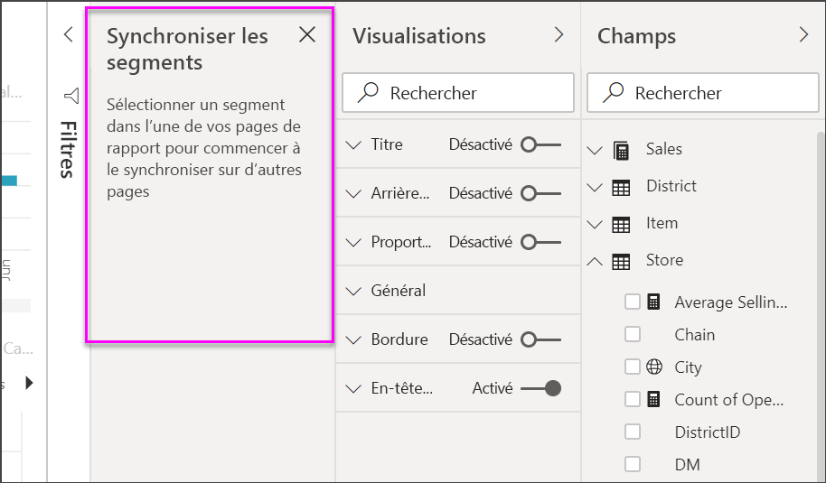

1. Dans la page **District Monthly Sales**, sélectionnez le segment **District Manager**. 

    Étant donné que vous avez déjà créé un segment **District Manager** (**DM**) dans la page **Overview**, le volet **Synchroniser les segments** apparaît comme ceci :
    
    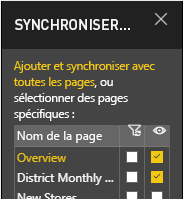
    
1. Dans la colonne **Synchronisation** du volet **Synchroniser les segments**, sélectionnez les pages **Overview**, **District Monthly Sales** et **New Stores**. 

    Après cette sélection, le segment **District Monthly Sales** est synchronisé sur ces trois pages. 
    
1. Dans la colonne **Visible** du volet **Synchroniser les segments**, sélectionnez la page **New Stores**. 

    Après cette sélection, le segment **District Monthly Sales** est visible dans ces trois pages. Le volet **Synchroniser les segments** se présente désormais comme ceci :

    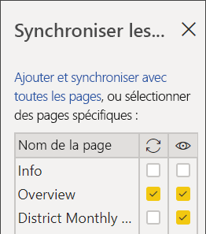

1. Observez les effets de la synchronisation du segment et de la visibilisation sur les autres pages. Dans la page **District Monthly Sales**, notez que le segment **District Manager** affiche désormais les mêmes sélections que la page **Overview**. Dans la page **New Stores**, le segment **District Manager** est désormais visible et sa sélection affecte les sélections visibles dans le segment **Store Name**. 
    
    >[!TIP]
    >Bien que le segment apparaisse initialement dans les pages synchronisées à la même taille et dans la même position que sur la page d’origine, vous pouvez déplacer, redimensionner et mettre en forme des segments synchronisés sur les différentes pages indépendamment. 

    >[!NOTE]
    >Si vous synchronisez un segment sur une page sans le rendre visible sur cette page, les sélections de segment effectuées sur les autres pages filtrent toujours les données sur la page.
 
## Filtrage des sélecteurs
Vous pouvez appliquer des filtres de niveau visuel aux sélecteurs pour réduire la liste des valeurs affichées dans les sélecteurs. Par exemple, vous pouvez exclure les valeurs vides d’un sélecteur de liste ou exclure certaines dates d’un sélecteur de plage. Ceci affecte seulement *les valeurs qui sont affichées dans le sélecteur*, et non pas *le filtre que le sélecteur applique à d’autres visuels* quand vous faites une sélection. Par exemple, supposons que vous appliquez un filtre à un sélecteur de plage pour montrer seulement certaines dates. La sélection sur le sélecteur montre seulement la première et la dernière date de cette plage, mais vous pouvez néanmoins encore voir d’autres dates dans vos autres visuels. Une fois que vous avez changé la plage sélectionnée dans le sélecteur, vous voyez que les autres visuels se mettent à jour. Effacer la sélection du sélecteur montre à nouveau toutes les dates.

Pour plus d’informations sur les filtres de niveau visuel, consultez [Types de filtres](../create-reports/power-bi-report-filter-types.md).

## Mettre en forme des segments
Différentes options de mise en forme sont disponibles selon le type de segment. À l’aide de l’orientation **Horizontal**, de la disposition **Dynamique** et de la coloration des **Éléments**, vous pouvez produire des boutons ou mosaïques, plutôt que des éléments de liste standard et redimensionner les éléments de segment pour s’adapter aux différentes tailles et dispositions d’écran.  

1. Une fois le segment **District Manager** sélectionné dans une page, dans le volet **Visualisations**, sélectionnez l’icône **Format** pour afficher les contrôles de mise en forme. 
    
    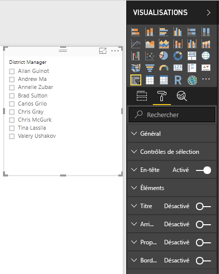
    
1. Sélectionnez les flèches de liste déroulante à côté de chaque catégorie pour afficher et modifier les options. 

### Options générales
1. Sous **Format**, sélectionnez **Général**, sélectionnez la couleur rouge sous **Couleur du contour**, puis définissez **Épaisseur du contour** avec la valeur *2*. 

    Ce paramètre change la couleur et l’épaisseur des traits de contour et de soulignement des en-têtes et des éléments.

1. Pour **Orientation**, **Vertical** est la valeur par défaut. Sélectionnez **Horizontal** pour produire un segment avec des titres ou des boutons organisés horizontalement et des flèches de défilement pour accéder aux éléments qui ne tiennent pas dans le segment.
    
    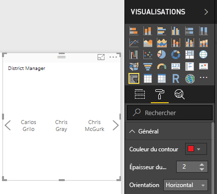
    
1. **Activez** la disposition **Dynamique** pour changer la taille et la disposition des éléments de segment en fonction de la taille de l’écran et des segments. 

    Pour les segments de liste, la disposition dynamique empêche la troncation des éléments sur de petits écrans. Elle est disponible uniquement dans les orientations horizontales. Pour les segments de curseurs de plages, la mise en forme dynamique modifie le style du curseur et fournit un redimensionnement plus flexible. Les deux types de segments deviennent des icônes de filtre dans les petites tailles.
    
    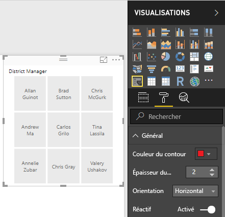
    
    >[!NOTE]
    >Les changements de disposition dynamique peuvent substituer la mise en forme spécifique du titre et des éléments que vous avez définie. 
    
1. Sous **Position X**, **Position Y**, **Largeur** et **Hauteur**, définissez la position et la taille du segment avec une précision numérique ou déplacez et redimensionnez le segment directement sur le canevas. 

    Faites des essais avec des tailles d’éléments et des dispositions différentes et notez les modifications de la mise en forme dynamique en conséquence. Ces options sont disponibles uniquement quand vous sélectionnez des orientations horizontales. 

    

Pour plus d’informations sur les orientations horizontales et les dispositions dynamiques, consultez [Créer un segment réactif que vous pouvez redimensionner dans Power BI](../create-reports/power-bi-slicer-filter-responsive.md).

### Options des contrôles de sélection (uniquement pour les segments de liste)
1. Sous **Contrôles de sélection**, **activez** l’option **Afficher l’option « Tout sélectionner »** pour ajouter un élément **Tout sélectionner** au segment. 

    L’option **Afficher l’option « Tout sélectionner »** est **désactivée** par défaut. Quand cette option est activée, vous pouvez sélectionner ou désélectionner tous les éléments. Si tous les éléments sont sélectionnés, le fait de sélectionner un élément le désélectionne, ce qui vous permet de définir un filtre de type *n’est pas*.
    
    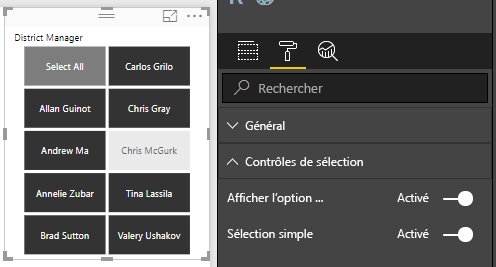
    
1. **Désactivez** l’option **Sélection simple** pour pouvoir sélectionner plusieurs éléments sans avoir à maintenir la touche **Ctrl** enfoncée. 

    L’option **Sélection simple** est **activée** par défaut. Pour choisir un seul élément, il vous suffit de le sélectionner. Pour choisir plusieurs éléments, maintenez la touche **Ctrl** enfoncée. Le fait de resélectionner un élément le désélectionne.

### Options de titre
L’option **Titre** est **activée** par défaut. Cette sélection affiche le nom du champ de données dans la partie supérieure du segment. 
- Pour cet article, mettez en forme le texte du titre comme suit : 
   - **Couleur de police** : rouge
   - **Taille du texte** : **14 pt**
   - **Alignement** : **Centre**
   - **Famille de polices** : **Arial Black**

### Options de l’élément (uniquement pour les segments de liste)
1. Pour cet article, mettez en forme les options **Éléments** comme suit :
    - **Couleur de police** : noir
    - **Arrière-plan** : rouge clair
    - **Taille du texte** : **10 pt**
    - **Famille de polices** : **Arial**
 
1. Pour **Contour**, choisissez **Cadre** pour dessiner une bordure autour de chaque élément avec la taille et la couleur que vous avez définies dans les options **Général**. 
    
    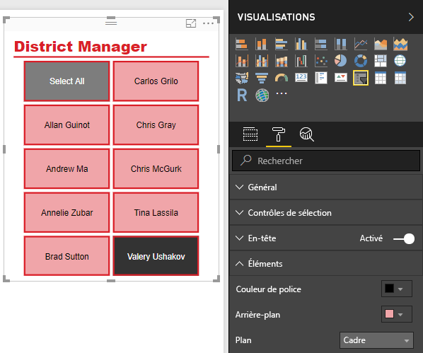
    
    >[!TIP]
    >- Si vous sélectionnez **Général** > **Orientation** > **Horizontale**, les éléments désélectionnés affichent le texte et l’arrière-plan dans les couleurs choisies, alors que les éléments sélectionnés utilisent les couleurs par défaut du système (généralement, les arrière-plans sont en noir et le texte est en blanc).
    >- Si vous sélectionnez **Général** > **Orientation > Vertical**, les éléments s’affichent toujours dans les couleurs définies et les cases à cocher s’affichent toujours en noir quand elles sont sélectionnées. 

### Entrées de date/numériques et options du curseur (segments des curseurs de plage uniquement)
- Pour les segments de liste, les options d’entrées de date/numériques sont les mêmes que les options **Éléments**, sauf s’il n’y a aucune option de contour ou de soulignement.
- Les options **Curseur** vous permettent de définir la couleur du curseur de la plage. Vous pouvez également **désactiver** le curseur pour laisser uniquement les entrées numériques.

### Autres options de mise en forme
Les autres options de mise en forme sont **désactivées** par défaut. **Activez** ces options pour les contrôler : 
- **Arrière-plan** : ajoutez une couleur d’arrière-plan au segment et définit sa transparence.
- **Verrouiller l’aspect** : conservez la forme du segment quand il est redimensionné.
- **Bordure** : ajoutez une bordure autour du segment et définissez sa couleur. (Cette bordure de segment est distincte et indépendante des paramètres de contour définis sous **Général**.) 

## Étapes suivantes
Pour plus d’informations, consultez les articles suivants :

- [Types de visualisation dans Power BI](power-bi-visualization-types-for-reports-and-q-and-a.md)

- [Tableaux dans Power BI](power-bi-visualization-tables.md)
