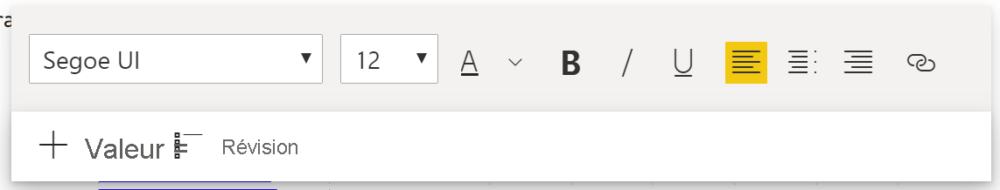
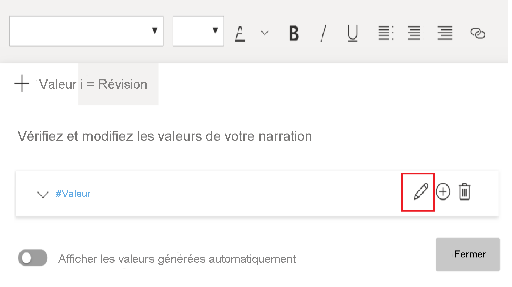

# Création de Narrations intelligentes (préversion)

[!INCLUDE[consumer-appliesto-nyyn](../includes/consumer-appliesto-nyyn.md)]    

[!INCLUDE [power-bi-visuals-desktop-banner](../includes/power-bi-visuals-desktop-banner.md)]

La visualisation Narration intelligente permet de résumer rapidement les visuels et les rapports en fournissant des insights prêts à l’emploi pertinents et personnalisables.

Cette fonctionnalité permet aux créateurs d’ajouter des narrations à leur rapport pour traiter les points importants, signaler des tendances, modifier la langue et le mettre en forme pour l’adapter à une audience spécifique. Au lieu de coller une capture d’écran de leur rapport dans PowerPoint en incluant les points importants, ils ont ainsi la possibilité d’ajouter au rapport des narrations qui sont mises à jour à chaque actualisation. Vos utilisateurs finaux peuvent utiliser les narrations pour comprendre leurs données, accéder aux points clés plus rapidement et expliquer les données à d’autres utilisateurs.

>[!NOTE]
> Cette fonctionnalité étant en préversion, vous devez d’abord activer le commutateur de fonctionnalité en accédant à Fichiers > Options et paramètres > Options > Fonctionnalité d’évaluation et veiller à ce que  **Visuel Narration intelligente**  soit activé :

Vous trouverez le pbix utilisé pour le scénario Online Sales dans [cette documentation](https://github.com/microsoft/powerbi-desktop-samples/blob/master/Monthly%20Desktop%20Blog%20Samples/2020/2020SU09%20Blog%20Demo%20-%20September.pbix).

## Bien démarrer 

Cliquez sur l’icône Nouvelles narrations intelligentes dans le volet Visualisation pour générer automatiquement un résumé.

 La narration qui apparaît est créée en fonction de tous les visuels de la page. Par exemple, vous pouvez cliquer sur l’icône pour générer automatiquement un résumé des visuels qui parlent du revenu, des visites de sites Web et des ventes dans ce rapport. Comme vous pouvez le constater, Power BI effectue automatiquement une analyse de tendances, indiquant que le revenu et les visites ont augmenté. Il calcule même le type de croissance observé, soit, dans ce cas, une augmentation de 72 %.
 
 
 
 Vous pouvez aussi cliquer avec le bouton droit sur le visuel et choisir **« résumer »** pour générer un résumé automatique de cette visualisation. Par exemple, lorsque vous cliquez avec le bouton droit > résumer sur le nuage de points montrant les différentes transactions, Power BI analyse les données et indique la ville/région affichant le revenu le plus élevé par transaction et le nombre le plus élevé de transactions. Il montre également la plage de valeurs attendue pour ces métriques, ce qui vous permet de comprendre que la plupart des villes se trouvaient au-dessous de 45 $ du point de vue du revenu par transaction et qu’elles comptaient moins de 10 transactions.
 
  
 
 
 ## Modification du résumé
 
 Le résumé est extrêmement **personnalisable** : il est possible d’ajouter un nouveau texte ou de modifier le texte existant à l’aide des mêmes contrôles que dans la zone de texte normale. Par exemple, vous pouvez mettre le texte en gras ou modifier sa couleur.
 
  
  
  Vous pouvez également personnaliser le résumé et ajouter vos propres insights en ajoutant des **valeurs dynamiques**. Le texte peut être associé à des champs et mesures existants, ou à une nouvelle mesure définie en langage naturel. Par exemple, si vous souhaitez ajouter des informations sur le nombre d’articles retournés, vous pouvez utiliser l’expérience Ajouter une valeur (cf. GIF). Nous avons intégré une expérience de Q&A pour ajouter des valeurs dynamiques. À mesure que vous tapez, des suggestions vous sont proposées dans une liste déroulante comme dans un visuel de Q&A. Il vous suffit de l’enregistrer comme valeur.  Ainsi, non seulement vous pouvez poser des questions sur vos données dans Q&A, mais sa portée a été étendue pour que vous puissiez créer vos propres calculs sans même utiliser DAX. 
  
   
  
  Vous pouvez mettre en forme les valeurs dynamiques, par exemple, pour qu’elles s’affichent sous forme de devises, spécifier le nombre de décimales, le séparateur des milliers, etc. 
   
   
   
   Cliquez directement sur la valeur dans le résumé pour la mettre en forme ou cliquez sur le bouton Modifier correspondant à la valeur dans l’onglet Révision du contrôle de la zone de texte. 
   
   
   
   L’onglet Révision permet également d’examiner, de supprimer ou de réutiliser des valeurs déjà définies.  Cliquez sur l’icône plus pour insérer la valeur dans le résumé. Vous pouvez également afficher les valeurs générées automatiquement en basculant l’option en bas.

Il peut arriver qu’un symbole de résumés cachés indique « Les données et les filtres actuels ne produisent aucun résultat pour cette valeur ». En effet, certains résumés peuvent être vides, car il n’y a rien d’intéressant à dire. Par exemple, un résumé qui examine les valeurs haute et basse d’un graphique en courbes peut être vide s’il s’agit d’une courbe constante, mais non vide dans d’autres conditions. Ces symboles ne sont visibles que lorsque vous essayez de modifier les résumés.

   
   
   ## Interactions entre les visuels
   Le résumé, dynamique, met automatiquement à jour le texte et les valeurs dynamiques générés en cas de filtre croisé. Par exemple, si vous sélectionnez les produits électroniques dans le graphique en anneau, un filtre croisé sera appliqué au reste du rapport ainsi qu’au résumé pour qu’ils se concentrent également sur les produits électroniques.  Dans ce cas, les visites et les revenus affichent des tendances différentes. Le texte est donc mis à jour pour en tenir compte. Par ailleurs, la valeur du nombre de retours que vous avez ajoutée devient 4 196 $. Certains résumés vides peuvent également être mis à jour en cas de filtre croisé.
   
   
   
   Un filtrage plus avancé est également possible. Par exemple, si la seule information qui vous intéresse est la tendance d’un certain trimestre dans ce visuel qui examine les tendances de plusieurs produits différents, il vous suffit de sélectionner les points de données pertinents : le résumé est ainsi mis à jour pour ce fragment.
   
   
   
   ## Limitations
   - L’action Épingler au tableau de bord n’est pas prise en charge.
   - L’utilisation de valeurs dynamiques et de la mise en forme conditionnelle (par exemple, titre lié aux données) n’est pas prise en charge.
   - Azure Analysis Services, AS local, n’est pas pris en charge.
   - Ni les visuels KPI, Carte, Carte multilignes, Cartographies, Tableau, Matrices, ni les visuels R/Python, ni les visuels personnalisés ne prennent pas en charge le résumé. Certains de ces visuels devraient être ajoutés à l’avenir.
   - Le résumé n’est pas pris en charge pour les visuels comportant des colonnes regroupées par d’autres colonnes ni basés sur un champ Groupe de données. 
   - Le filtrage croisé en dehors du visuel n’est pas pris en charge.
   - Ni le renommage des valeurs dynamiques ni la modification des valeurs dynamiques générées automatiquement ne sont pris en charge.
   - Le résumé des visuels contenant des calculs à la volée tels que l’arithmétique QnA, le pourcentage du total général, etc., n’est pas pris en charge.
   

