# Tableaux dans les rapports et les tableaux de bord Power BI

[!INCLUDE [power-bi-visuals-desktop-banner](../includes/power-bi-visuals-desktop-banner.md)]

Un tableau est une grille qui contient les données connexes dans une série logique de lignes et colonnes. Il peut également contenir des en-têtes et une ligne de totaux. Les tableaux fonctionnent correctement avec des comparaisons quantitatives où vous examinez de nombreuses valeurs pour une même catégorie. Par exemple, ce tableau montre cinq mesures différentes pour la **Catégorie**.

Créez des tables dans les rapports et mettez les éléments en surbrillance croisée dans la table avec d’autres visuels sur la même page de rapport. Vous pouvez également sélectionner des lignes, colonnes et cellules pour les mettre en évidence croisée. Vous pouvez aussi copier et coller des sélections de cellules individuelles et de plusieurs cellules dans d’autres applications.

## Quand utiliser un tableau ?

Les tableaux sont recommandés :

* pour afficher et comparer des données détaillées et des valeurs exactes (au lieu de représentations visuelles) ;

* pour afficher des données dans un format tabulaire ;

* pour afficher des données numériques par catégories.

## Prérequis

Ce tutoriel utilise le [fichier PBIX de l’exemple Analyse de la vente au détail](https://download.microsoft.com/download/9/6/D/96DDC2FF-2568-491D-AAFA-AFDD6F763AE3/Retail%20Analysis%20Sample%20PBIX.pbix).

1. Dans la section supérieure gauche de la barre de menus, sélectionnez **Fichier** > **Ouvrir**.
   
2. Rechercher votre copie du **fichier PBIX de l’exemple Analyse de la vente au détail**

1. Ouvrez le **fichier PBIX de l’exemple Analyse de la vente au détail** dans la vue Rapport .

1. Sélectionner  pour ajouter une nouvelle page.

## Créer un tableau

Vous allez créer le tableau illustré au début de cet article pour afficher les valeurs de ventes par catégorie d’article.

1. Dans le volet **Champs**, sélectionnez **Élément** > **Catégorie**.

    Power BI crée automatiquement un tableau qui répertorie toutes les catégories.

    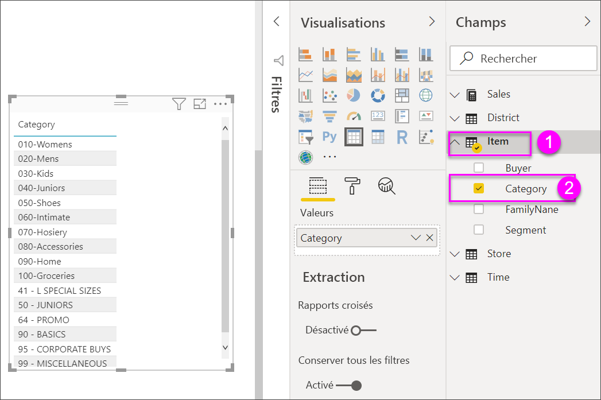

1. Sélectionnez **Ventes > Prix unitaire moyen** et **Ventes > Ventes de l’année dernière**

1. Puis sélectionnez **Ventes > Ventes de l’année** et choisissez les trois options : **Valeur**, **Objectif**, et **Statut**.

1. Dans le volet **Visualisations**, localisez la zone **Valeurs**, puis sélectionnez les valeurs jusqu’à ce que l’ordre des colonnes du graphique corresponde à la première image de cette page. Faites glisser les valeurs dans la zone si nécessaire. La zone **Valeurs** doit ressembler à ceci :

    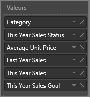

## Mettre en forme le tableau

Il existe de nombreuses façons de mettre en forme un tableau. Cet article n’en couvre que quelques-unes. Un excellent moyen d’en apprendre davantage sur les autres options de mise en forme consiste à ouvrir le volet **Mise en forme** (icône de ), puis à explorer les options.

* Essayez de mettre en forme la grille du tableau. Nous allons appliquer ici un quadrillage vertical de couleur bleue, ajouter de l’espace aux lignes, et augmenter la taille de contour et de texte.

    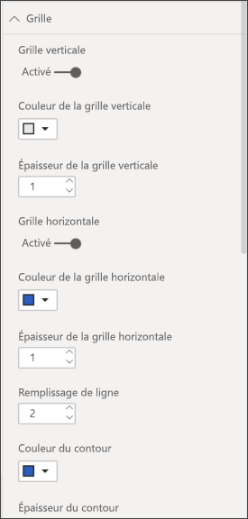

    

* Pour les en-têtes de colonne, modifiez la couleur d’arrière-plan, ajoutez un contour et augmentez la taille de la police.

    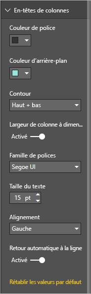

    

* Vous pouvez même appliquer la mise en forme aux colonnes individuelles et aux en-têtes de colonnes. Commencez par développer **Mise en forme des champs** et sélectionnez la colonne à mettre en forme dans la liste déroulante. Selon les valeurs des colonnes, **Mise en forme des champs** vous permet de définir des éléments tels que : unités d’affichage, couleur de police, nombre de places décimales, arrière-plan, alignement et bien plus encore. Une fois que vous avez ajusté les paramètres, décidez s’il faut appliquer ces paramètres à l’en-tête et à toutes les lignes également.

    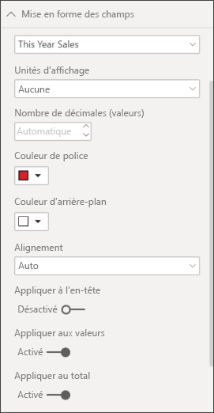

    

* Après quelques retouches supplémentaires de la mise en forme, voici notre tableau final.

    

### Mise en forme conditionnelle

*Mise en forme conditionnelle* est un type de mise en forme. Power BI peut appliquer une mise en forme conditionnelle à l’un des champs que vous avez ajoutés à la zone **Valeurs**  du volet **Visualisations**.

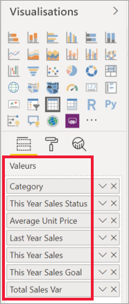

Dans le contexte des tables, la mise en forme conditionnelle vous permet de spécifier des icônes, des URL, des couleurs d’arrière-plan de cellule et des couleurs de police en fonction des valeurs de cellule, notamment en utilisant des couleurs de dégradé.

1. Dans le volet **Format**, ouvrez la carte **Mise en forme conditionnelle**.

    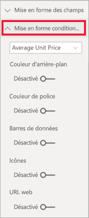

1. Sélectionnez le champ à mettre en forme, puis mettez le curseur **Couleur d’arrière-plan** sur la position Activé. Power BI applique un dégradé en fonction des valeurs de la colonne. Pour changer les couleurs par défaut, sélectionnez **Contrôles avancés**.

    Si vous sélectionnez l’option **Divergent**, vous pouvez également configurer une valeur **Centrale** en option.

    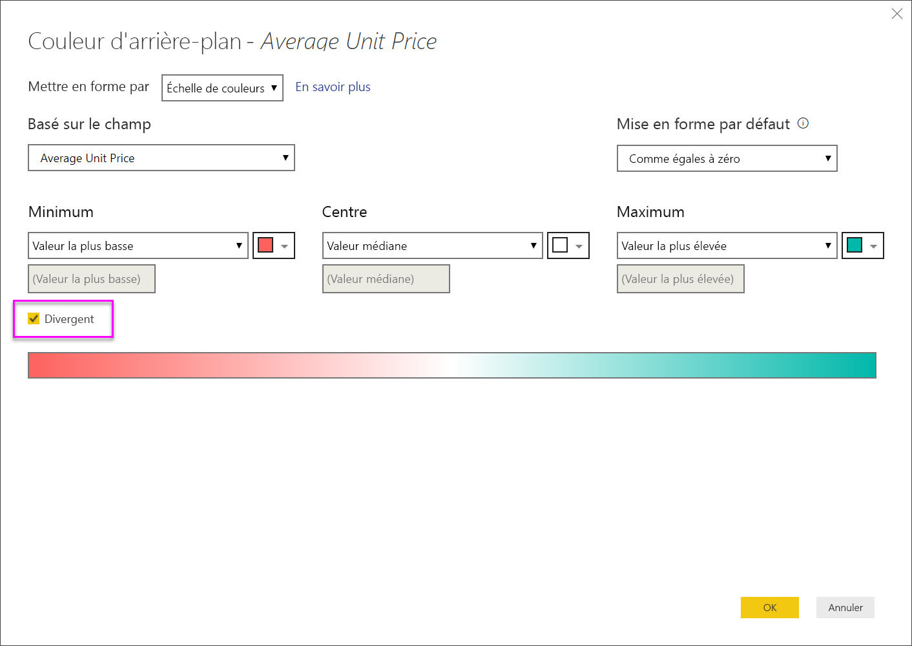

    Nous allons appliquer une mise en forme personnalisée à nos valeurs de prix unitaire moyen. Sélectionnez **Divergent**, ajoutez des couleurs, puis choisissez **OK**.

    
1. Ajoutez au tableau un nouveau champ contenant des valeurs positives et négatives. Sélectionnez **Sales > Total Sales Variance** (Ventes > Écart total sur les ventes).

    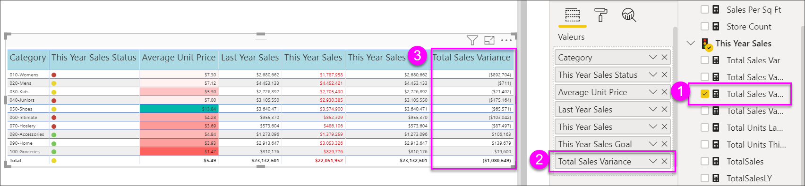

1. Ajoutez la mise en forme conditionnelle des barres de données en mettant le curseur **Barres de données** sur la position Activé.  

    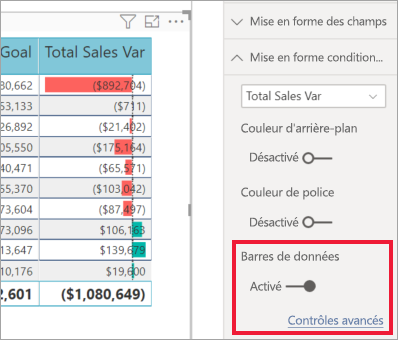

1. Pour personnaliser les barres de données, sélectionnez **Contrôles avancés**. Dans la boîte de dialogue qui s’affiche, définissez des couleurs pour la **Barre positive** et la **Barre négative**, sélectionnez l’option **Afficher seulement la barre**, puis apportez d’autres modifications souhaitées.

    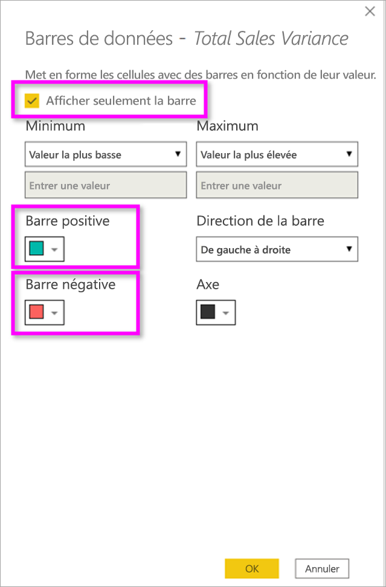

1. Sélectionnez **OK**.

    Des barres de données remplacent les valeurs numériques dans le tableau, rendant celui-ci plus lisible.

    

1. Ajoutez des signaux visuels à votre table avec des *icônes conditionnelles*.  Dans la carte **Mise en forme conditionnelle**, sélectionnez **This year sales** (Ventes de cette année) dans le menu déroulant. Mettez le curseur **Icônes** sur la position **Activé**.  Pour personnaliser les icônes, sélectionnez **Contrôles avancés**.

    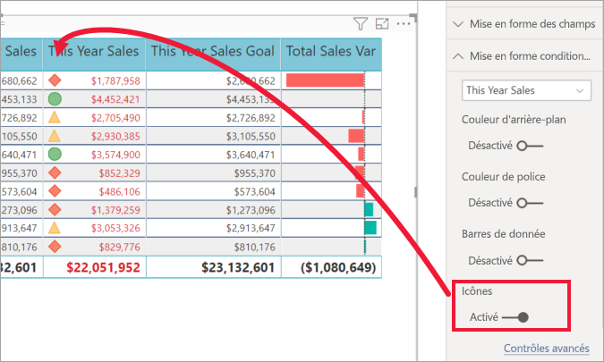

## Copier les valeurs à partir des tables Power BI pour une utilisation dans d’autres applications

Votre table ou matrice peut avoir un contenu que vous aimeriez utiliser dans d’autres applications, comme Dynamics CRM, Excel et même d’autres rapports Power BI. Dans Power BI, lorsque vous cliquez avec le bouton droit dans une cellule, vous pouvez copier les données d’une cellule unique ou d’une sélection de cellules dans votre Presse-papiers et les coller dans d’autres applications.

Pour copier la valeur d’une cellule unique :

1. Sélectionnez la cellule que vous voulez copier.

1. Cliquez avec le bouton droit de la souris dans la cellule.

1. Sélectionnez **Copier** > **Copier la valeur**.

    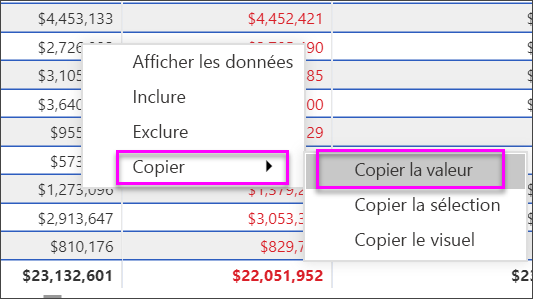

    Avec la valeur de cellule non mise en forme dans votre Presse-papiers, vous pouvez la coller dans une autre application.

Pour copier plusieurs cellules :

1. Sélectionnez une plage de cellules ou utilisez la touche **Ctrl** pour choisir une ou plusieurs cellules.

1. Cliquez avec le bouton droit de la souris à l’intérieur d’une des cellules que vous avez sélectionnées.

1. Sélectionnez **Copier** > **Copier la sélection**.

    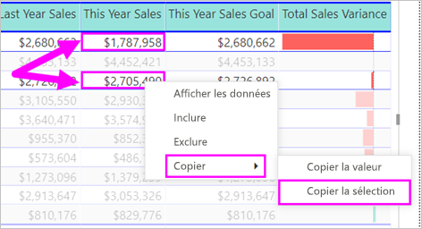

## Ajustez la largeur de colonne d’un tableau

Parfois, Power BI tronque l’en-tête d’une colonne dans un tableau de bord et sur un rapport. Pour afficher le nom entier de la colonne, placez le pointeur au-dessus de l’espace à droite de l’en-tête pour faire apparaître les doubles flèches, puis sélectionnez-les et faites-les glisser.

## Considérations et résolution des problèmes

* Quand vous appliquez une mise en forme de colonne, vous ne pouvez choisir qu’une option d’alignement par colonne : **Automatique**, **Gauche**, **Centre**, **Droite**. Habituellement, une colonne ne contient que du texte ou que des nombres, mais pas une combinaison des deux. Dans les cas où une colonne contient à la fois des nombres et du texte, **Automatique** aligne le texte à gauche et les nombres à droite. Ce comportement prend en charge les langues qui se lisent de gauche à droite.

* Si les données texte des en-têtes ou des cellules de votre table contiennent des caractères de nouvelle ligne, ces caractères sont ignorés, sauf si vous activez l’option « retour automatique à la ligne » dans la carte de volet de mise en forme associée à l’élément. 

## Étapes suivantes

* [Graphiques de compartimentage dans Power BI](power-bi-visualization-treemaps.md)

* [Types de visualisation dans Power BI](power-bi-visualization-types-for-reports-and-q-and-a.md)
