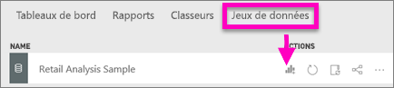
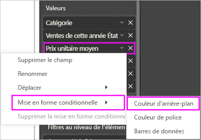
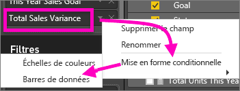
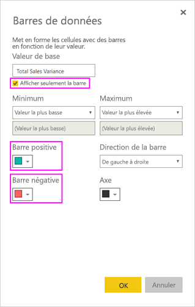

# Tableaux dans les rapports et les tableaux de bord Power BI
Un tableau est une grille qui contient les données connexes dans une série logique de lignes et colonnes. Il peut également contenir des en-têtes et une ligne de totaux. Les tableaux fonctionnent correctement avec des comparaisons quantitatives où vous examinez de nombreuses valeurs pour une même catégorie. Par exemple, ce tableau affiche 5 mesures différentes pour la **Catégorie**.

Créez des tables dans les rapports et mettez les éléments en surbrillance croisée dans la table avec d’autres visuels sur la même page de rapport.  Vous pouvez également sélectionner des lignes, colonnes et cellules pour les mettre en évidence croisée. Les sélections de cellules individuelles et de plusieurs cellules peuvent être copiées et collées dans d’autres applications.

## Quand utiliser un tableau ?
Les tableaux sont recommandés :

* pour afficher et comparer des données détaillées et des valeurs exactes (au lieu de représentations visuelles) ;
* pour afficher des données dans un format tabulaire ;
* pour afficher des données numériques par catégories.   

> [!NOTE]
> Si un tableau contient trop de valeurs, envisagez de le convertir en matrice et/ou d’utiliser la descente dans la hiérarchie. Un tableau affiche au maximum 3 500 points de données.

## Conditions préalables
- Service Power BI ou Power BI Desktop
- Exemple analyse de la vente au détail

## Créer un tableau
Vous allez créer le tableau illustré ci-dessus pour afficher les valeurs de ventes par catégorie d’article. Pour la suite, connectez-vous au service Power BI et sélectionnez **Obtenir des données \> Exemples \> Exemple Analyse de la vente au détail > Se connecter**, puis choisissez **Accéder au tableau de bord**. La création d’une visualisation nécessite des autorisations de modification du jeu de données et du rapport. Par chance, les exemples Power BI sont tous modifiables. Si le rapport a été partagé avec vous, vous ne pourrez pas y créer de visualisations.

1. Dans le volet de navigation gauche, sélectionnez **Espaces de travail > Mon espace de travail**.    
2. Sélectionnez l’onglet Jeux de données, puis faites défiler la page vers le bas jusqu’au jeu de données d’exemple Analyse de la vente au détail que vous venez d’ajouter.  Sélectionnez l’icône **Créer un rapport**.

    
2. Dans l’Éditeur de rapport, sélectionnez **Élément** > **Catégorie**.  Power BI crée automatiquement un tableau qui répertorie toutes les catégories.

    
3. Sélectionnez **Sales > Average Unit Price** (Ventes > Prix unitaire moyen), **Sales > Last Year Sales** (Ventes > Ventes de l’année dernière) et **Sales > This Year Sales** (Ventes > Ventes de cette année), puis choisissez les 3 options : Value, Goal, Status (Valeur, Objectif, Statut).   
4. Dans le volet Visualisations, localisez la zone **Valeurs** et glissez-déplacez les valeurs jusqu’à ce que l’ordre des colonnes de graphique corresponde à la première image de cette page.  La zone Valeurs doit ressembler à ceci.

    
5. Épinglez le tableau au tableau de bord en sélectionnant l’icône d’épingle.  

     

## Mettre en forme le tableau
Il existe diverses manières de mettre en forme un tableau. Nous en abordons ici quelques-unes. Si vous souhaitez explorer les autres options de mise en forme, ouvrez le volet Mise en forme (icône de rouleau à peinture ).

* Essayez de mettre en forme la grille du tableau. Nous avons appliqué ici un quadrillage vertical de couleur bleue, ajouté de l’espace aux lignes, ainsi qu’augmenté légèrement la taille de contour et de texte.

    

    
* Pour les en-têtes de colonne, nous avons modifié la couleur d’arrière-plan, ajouté un contour et augmenté la taille de la police. 

    

    

* Vous pouvez même appliquer la mise en forme aux colonnes individuelles et aux en-têtes de colonnes. Commencez par développer **Mise en forme des champs** et sélectionnez la colonne à mettre en forme dans la liste déroulante. Selon les valeurs des colonnes, Mise en forme des champs vous permet de définir des éléments tels que : unités d’affichage, couleur de police, nombre de places décimales, arrière-plan, alignement et bien plus encore. Une fois que vous avez ajusté les paramètres, décidez s’il faut appliquer ces paramètres à l’en-tête et à toutes les lignes également.

    

* Après quelques retouches supplémentaires de la mise en forme, voici notre tableau final. Compte tenu du nombre d’options de mise en forme, la meilleure façon d’apprendre consiste à commencer par la mise en forme par défaut, à ouvrir le volet Mise en forme , puis à démarrer l’exploration. 

    

### Mise en forme conditionnelle
L’un des types de mises en forme est appelé *mise en forme conditionnelle*. Celle-ci est appliquée aux champs de la zone de configuration **Valeurs** du volet **Visualisations** dans le service Power BI ou Power BI Desktop. 

Dans le contexte des tables, la mise en forme conditionnelle vous permet de spécifier des couleurs personnalisées d’arrière-plan et de police de cellule en fonction des valeurs de cellule, notamment en utilisant des couleurs de dégradé. 

1. Dans le volet **Visualisations** du service Power BI ou de Power BI Desktop, sélectionnez la flèche vers le bas en regard de la valeur dans la zone de configuration **Valeurs** que vous voulez mettre en forme (ou cliquez avec le bouton droit sur le champ). Vous pouvez uniquement gérer la mise en forme conditionnelle des champs dans la zone **Valeurs** de la zone **Champs**.

    
2. Sélectionnez **Échelles de couleurs de l’arrière-plan**. Dans la boîte de dialogue qui s’affiche, vous pouvez configurer la couleur, ainsi que les valeurs *Minimum* et *Maximum*. Si vous sélectionnez la zone **Divergent**, vous pouvez également configurer une valeur *Centrale* en option.

    

    Nous allons appliquer une mise en forme personnalisée à nos valeurs de prix unitaire moyen. Sélectionnez **Divergent**, ajoutez des couleurs, puis choisissez **OK**. 

    
3. Ajoutez au tableau un nouveau champ contenant des valeurs positives et négatives.  Sélectionnez **Sales > Total Sales Variance** (Ventes > Écart total sur les ventes). 

    
4. Ajoutez à la barre de données une mise en forme conditionnelle en sélectionnant la flèche vers le bas en regard de **Total Sales Variance**, puis en choisissant **Mise en forme conditionnelle > Barres de données**.

    
5. Dans la boîte de dialogue qui s’affiche, définissez des couleurs pour la **Barre positive** et la **Barre négative**. Cochez la case à côté de l’option **Afficher seulement la barre**, puis apportez d’autres modifications souhaitées.

    

    Lorsque vous sélectionnez **OK**, des barres de données remplacent les valeurs numériques dans le tableau, rendant celui-ci plus lisible.

    
6. Pour supprimer la mise en forme conditionnelle d’une visualisation, il suffit de cliquer à nouveau avec le bouton droit sur le champ et de sélectionner **Supprimer la mise en forme conditionnelle**.

> [!TIP]
> L’option Mise en forme conditionnelle est également disponible dans le volet Mise en forme (icône de rouleau à peindre). Sélectionnez la valeur à mettre en forme, puis **activez** les options **Échelles de couleurs** ou **Barres de données** pour appliquer les paramètres par défaut. Ou bien, pour personnaliser les paramètres, sélectionnez **Contrôles avancés**.
> 
## Copier les valeurs à partir des tables Power BI pour une utilisation dans d’autres applications

Votre table ou matrice peut avoir un contenu que vous aimeriez utiliser dans d’autres applications, comme Dynamics CRM, Excel et même d’autres rapports Power BI. Avec le clic droit Power BI, vous pouvez copier une cellule unique ou une sélection de cellules dans votre Presse-papiers et les coller dans l’autre application.

* Pour copier la valeur d’une cellule unique, sélectionnez la cellule, cliquez avec le bouton droit, puis choisissez **Copier la valeur**. Avec la valeur de cellule non mise en forme dans votre Presse-papiers, vous pouvez maintenant la coller dans une autre application.

    

* Pour copier plusieurs cellules, sélectionnez une plage de cellules ou utilisez la touche CTRL pour sélectionner une ou plusieurs cellules. La copie inclut les en-têtes de colonne et de ligne.

    

    La copie inclut les en-têtes de colonne et de ligne.

    

## Ajustez la largeur de colonne d’un tableau
Parfois, Power BI tronque l’en-tête d’une colonne dans un tableau de bord et sur un rapport. Pour afficher le nom entier de la colonne, placez le pointeur au-dessus de l’espace à droite de l’en-tête pour faire apparaître les doubles flèches, puis sélectionnez-les et faites-les glisser.

## Considérations et résolution des problèmes
* Quand vous appliquez une mise en forme de colonne, vous ne pouvez choisir qu’une option d’alignement par colonne : Automatique, Gauche, Centre, Droite. Habituellement, une colonne ne contient que du texte ou que des nombres, mais pas une combinaison des deux. Dans les cas où une colonne contient à la fois des nombres et du texte, **Automatique** aligne le texte à gauche et les nombres à droite. Ce comportement prend en charge les langues qui se lisent de gauche à droite.   

## Étapes suivantes

[Treemap dans Power BI](power-bi-visualization-treemaps.md)

[Types de visualisation dans Power BI](power-bi-visualization-types-for-reports-and-q-and-a.md)