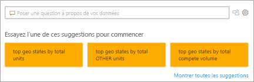

# Types de visualisations dans Power BI
## Visualisations Power BI
Nous allons ajouter de nouvelles visualisations, tenez-vous informé !

Consultez [Microsoft AppSource](https://appsource.microsoft.com/marketplace/apps?product=power-bi-visuals), qui propose une liste croissante de [visuels personnalisés](../developer/power-bi-custom-visuals.md) que vous pouvez télécharger et utiliser dans vos propres tableaux de bord et rapports. Vous vous sentez créatif ? [Découvrez comment créer et ajouter vos propres visuels au site de la communauté](../developer/office-store.md).  

## Liste des visualisations disponibles dans Power BI
Toutes ces visualisations peuvent être ajoutées à des rapports Power BI, spécifiées dans Questions et réponses, et épinglées à des tableaux de bord.

### Graphiques en aires : De base (superposées) et empilées

>[!TIP]
>Le graphique en aires de base est basé sur le graphique en courbes, avec la zone comprise entre l’axe et la ligne remplie.

Pour plus d’informations, consultez [Graphique en aires de base](power-bi-visualization-basic-area-chart.md).

### Graphiques à barres et histogrammes

 

>[!TIP]
>Les graphiques à barres sont la norme pour la recherche d’une valeur spécifique dans différentes catégories.

### Cartes : Plusieurs lignes

### Cartes : Numéro unique

Pour plus d’informations, consultez [Créer une vignette représentant un grand nombre](power-bi-visualization-card.md).

### Graphiques combinés

>[!TIP]
>Un graphique combiné associe un histogramme et un graphique en courbes. Choisissez *Graphique en courbes et histogramme empilé* ou *Graphique en courbes et histogramme groupé*.

Pour plus d’informations, consultez [Graphiques combinés dans Power BI](power-bi-visualization-combo-chart.md).

### Graphiques en anneau

>[!TIP]
>Les graphiques en anneau sont similaires aux graphiques en secteurs.  Ils affichent la relation de parties par rapport à un tout.

Pour plus d’informations, consultez [Graphiques en anneau dans Power BI](power-bi-visualization-doughnut-charts.md).

### Graphiques en entonnoir

>[!TIP]
>Les entonnoirs permettent de visualiser un processus comprenant des étapes et des éléments qui passent de manière séquentielle d’une étape à la suivante.  Utilisez un entonnoir lorsqu’il existe un flux séquentiel entre des étapes, par exemple un processus de vente qui commence par des prospects et se termine par un achat.

Pour plus d’informations, consultez [Graphiques en entonnoir dans Power BI](power-bi-visualization-funnel-charts.md).

### Graphiques en jauge

>[!TIP]
>Ils affichent l’état actuel dans le contexte d’un objectif.

Pour plus d’informations, consultez [Graphiques en jauge dans Power BI](power-bi-visualization-radial-gauge-charts.md).

### Graphique des influenceurs clés

Un graphique d’influenceurs clés affiche les principaux contributeurs à une valeur ou un résultat sélectionné.

Pour plus d’informations, consultez [Graphiques des influenceurs clés dans Power BI](power-bi-visualization-influencers.md)

### Indicateurs de performance clés

>[!TIP]
>Affiche la progression vers un objectif mesurable.

Pour plus d’informations, consultez [Indicateurs de performance clés dans Power BI](power-bi-visualization-kpi.md).

### Graphiques en courbes

>[!TIP]
>Mettez en évidence la forme générale de l’ensemble d’une série de valeurs, normalement au fil du temps.

### Cartes : Cartes simples

>[!TIP]
>Elles sont utilisées pour associer des informations quantitatives et relatives aux catégories à des emplacements spatiaux.

Pour plus d’informations, consultez [Trucs et astuces pour les éléments visuels de la carte](power-bi-map-tips-and-tricks.md).

### Cartes : ArcGIS Maps

Pour plus d’informations, consultez [Cartes ArcGIS dans Power BI](power-bi-visualization-arcgis.md).

### Cartes : Cartes choroplèthes (thématiques)

>[!TIP]
>Plus la couleur est intense, plus la valeur est grande.

Pour plus d’informations, consultez [Cartes choroplèthes dans Power BI](power-bi-visualization-filled-maps-choropleths.md).

### Cartes : Cartes de formes

>[!TIP]
>Compare les régions par couleur.

Pour plus d’informations, consultez [Cartes de formes dans Power BI](desktop-shape-map.md).

### Matrice

>[!TIP]
>Une table prend en charge deux dimensions, mais une matrice facilite l’affichage des données de manière claire entre plusieurs dimensions : elle prend en charge une disposition échelonnée. La matrice agrège automatiquement les données automatiquement et permet une exploration au niveau du détail. 

Pour plus d’informations, consultez [Visuels Matrice dans Power BI](desktop-matrix-visual.md).

### Graphiques en secteurs

>[!TIP]
>Ils montrent la relation des parties par rapport à un tout. 

### Visuel de Questions et réponses

>[!TIP]
>À l’instar de [Questions et réponses dans les tableaux de bord](../power-bi-tutorial-q-and-a.md), le visuel Questions et réponses vous permet de poser des questions sur vos données en langage naturel. 

Pour plus d’informations, consultez [Visuels Questions et réponses dans Power BI](power-bi-visualization-q-and-a.md).

### Visuels de script R

>[!TIP]
>Les éléments visuels créés avec des scripts R, communément appelés *éléments visuels R*, peuvent présenter une analyse et une mise en forme avancées des données (des prévisions par exemple) à l’aide des puissantes et riches fonctionnalités d’analyse et de visualisation de R. Des visuels R peuvent être créés dans Power BI Desktop et publiés dans le service Power BI.   

Pour plus d’informations, consultez [Visuels R dans Power BI](service-r-visuals.md).

### Graphique de ruban

>[!TIP]
>Ils montrent la catégorie de données qui a le rang le plus élevé (la plus grande valeur). Les graphiques de ruban sont efficaces pour l’affichage de changements de rangs, la plage (valeur) la plus élevée étant toujours affichée en première position pour chaque période de temps.

Pour plus d’informations, consultez [Graphiques de ruban dans Power BI](desktop-ribbon-charts.md).

### Graphiques en nuages de points et graphiques à bulles

>[!TIP]
>Affichez les relations entre 2 (nuages de point) ou 3 (bulles) mesures quantitatives (ordre, etc.).

Pour plus d’informations, consultez [Nuages de points dans Power BI](power-bi-visualization-scatter.md).

### Nuage de points à haute densité

>[!TIP]
>Trop de points de données sur un visuel peuvent le ralentir. Un algorithme d’échantillonnage sophistiqué est donc utilisé pour garantir la précision de la visualisation.

Pour plus d’informations, consultez [Nuages de points à haute densité dans Power BI](desktop-high-density-scatter-charts.md).

### Segments

Pour plus d’informations, consultez [Segments dans Power BI](power-bi-visualization-slicers.md).

### Images autonomes

Pour plus d’informations, consultez [Ajouter un widget d’image à un tableau de bord](../service-dashboard-add-widget.md).

### Tables

>[!TIP]
>Fonctionnent correctement avec des comparaisons quantitatives entre des éléments représentant de nombreuses catégories.

Pour plus d’informations, consultez [Utilisation des tableaux dans Power BI](power-bi-visualization-tables.md).

### Treemaps

Pour plus d’informations, consultez [Treemaps dans Power BI](power-bi-visualization-treemaps.md).

>[!TIP]
>Graphiques de rectangles de couleur, dont la taille représente une valeur.  Ils peuvent être hiérarchiques, avec les rectangles imbriqués dans les rectangles principaux.

### Graphiques en cascade

>[!TIP]
>Les graphiques en cascade affichent un résultat cumulé lorsque des valeurs sont ajoutées ou soustraites.

Pour plus d’informations, consultez [Graphiques en cascade dans Power BI](power-bi-visualization-waterfall-charts.md).

## Indiquer dans Questions et réponses la visualisation à utiliser
Lorsque vous tapez des requêtes en langage naturel avec le service Questions et réponses de Power BI, vous pouvez spécifier le type de visualisation dans votre requête.  Par exemple :

***sales by state as a treemap*** (ventes par région sous forme de compartimentage

## Étapes suivantes
[Visualisations dans des rapports Power BI](power-bi-report-visualizations.md)    
[La bonne référence visuelle dans sqlbi.com](https://www.sqlbi.com/wp-content/uploads/videotrainings/dashboarddesign/visuals-reference-may2017-A3.pdf)