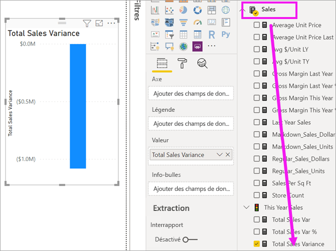
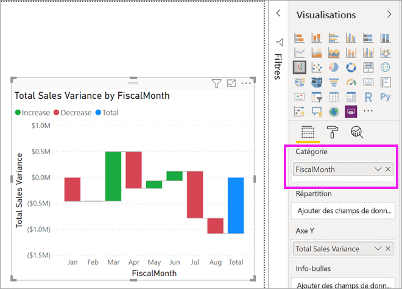
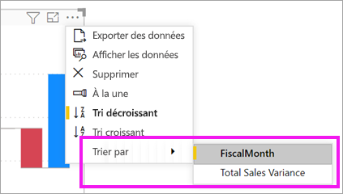
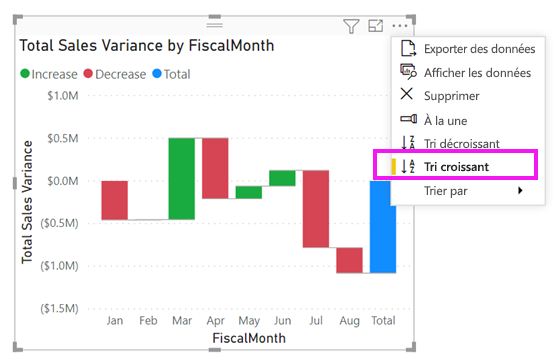
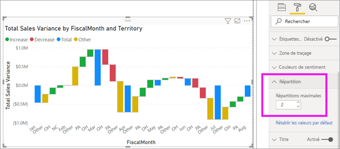

# Graphiques en cascade dans Power BI

[!INCLUDE[consumer-appliesto-nyyn](../includes/consumer-appliesto-nyyn.md)]

[!INCLUDE [power-bi-visuals-desktop-banner](../includes/power-bi-visuals-desktop-banner.md)]

Les graphiques en cascade affichent un résultat cumulé à mesure que Power BI ajoute et soustrait des valeurs. Ces graphiques sont utiles pour comprendre de quelle façon une valeur initiale (par exemple, un revenu net) est affectée par une série de variations positives et négatives.

Grâce au codage par couleur des colonnes, vous repérez rapidement les hausses et les baisses. Les colonnes des valeurs initiales et finales [commencent généralement sur l’axe horizontal](https://support.office.com/article/Create-a-waterfall-chart-in-Office-2016-for-Windows-8de1ece4-ff21-4d37-acd7-546f5527f185#BKMK_Float "commencer sur l’axe horizontal"), alors que les valeurs intermédiaires sont représentées par des colonnes flottantes. Les graphiques en cascade sont également appelés graphiques « bridge » (pont) en raison de leur forme.

## Quand faut-il utiliser un graphique en cascade ?

Les graphiques en cascade sont conseillés pour :

* représenter les variations de la mesure sur plusieurs séries chronologiques ou des catégories différentes ;

* analyser les variations majeures qui ont un impact sur la valeur totale ;

* tracer le bénéfice annuel de votre société en affichant les différentes sources de revenus et indiquer le résultat net (gains ou pertes) ;

* illustrer l’évolution annuelle de l’effectif global de votre société ;

* visualiser vos revenus et vos dépenses par mois, et le solde courant de votre compte.

## Prérequis

Ce tutoriel utilise le [fichier PBIX de l’exemple Analyse de la vente au détail](https://download.microsoft.com/download/9/6/D/96DDC2FF-2568-491D-AAFA-AFDD6F763AE3/Retail%20Analysis%20Sample%20PBIX.pbix).

1. Dans la section supérieure gauche de la barre de menus, sélectionnez **Fichier** > **Ouvrir**.
   
2. Rechercher votre copie du **fichier PBIX de l’exemple Analyse de la vente au détail**

1. Ouvrez le **fichier PBIX de l’exemple Analyse de la vente au détail** dans la vue Rapport .

1. Sélectionner  pour ajouter une nouvelle page.

> [!NOTE]
> Pour que vous puissiez partager votre rapport avec un collègue Power BI, il faut que vous disposiez tous deux de licences individuelles Power BI Pro ou que le rapport soit enregistré dans une capacité Premium.    

## Créer un graphique en cascade

Vous allez créer un graphique en cascade qui affiche un écart sur les ventes (ventes estimées par rapport aux ventes réelles) par mois.

### Générer un graphique en cascade

1. Dans le volet **Champs**, sélectionnez **Ventes** > **Écart sur volume des ventes totales**.

   

1. Sélectionnez l’icône cascade 

    

1. Sélectionnez **Time** > **FiscalMonth** (Période > Mois fiscal) pour l’ajouter à **Catégorie**.

    

### Trier un graphique en cascade

1. Vérifiez que Power BI trie le graphique en cascade dans l’ordre chronologique par mois. En haut à droite du graphique, sélectionnez **Autres options** (...).

    Pour cet exemple, sélectionnez **Trier par**, puis choisissez **FiscalMonth** (MoisFiscal). Un indicateur jaune à côté de votre sélection indique que l’option de sélection est appliquée.

    
    
    Pour afficher les mois dans l’ordre chronologique, sélectionnez **Tri croissant**. Comme avec l’étape précédente, vérifiez la présence d’un indicateur jaune à gauche de **Tri croissant**. Ceci indique que l’option sélectionnée est en cours d’application.

    

    

    Notez que votre graphique est trié de Janvier à Août pour FiscalMonth (MoisFiscal).  

### Explorer un graphique en cascade

Approfondissez un peu plus pour voir ce qui contribue le plus aux changements mois après mois.

1.  Sélectionnez **Store** (Magasin) > **Territory**  (Territoire), ce qui ajoute **Territory** au compartiment **Breakdown** (Répartition).

    

    Power BI utilise la valeur figurant dans **Répartition** pour ajouter des données supplémentaires à la visualisation. Il ajoute les cinq premiers contributeurs aux augmentations ou diminutions pour chaque mois fiscal. Cela signifie que, par exemple, Février a désormais six points de données au lieu d’un seul.  

    

    Supposons que nous ne nous intéressons qu’aux deux premiers contributeurs.

1. Dans le volet **Mise en forme**, sélectionnez **Répartition**, puis définissez **Décompositions maximales** sur **2**.

    

    Un examen rapide révèle que les territoires de l’Ohio et de la Pennsylvanie sont les principaux contributeurs aux mouvements négatifs et positifs dans votre graphique en cascade.

    

## Étapes suivantes

* [Modifier l’interaction des visuels dans un rapport Power BI](../create-reports/service-reports-visual-interactions.md)

* [Types de visualisation dans Power BI](power-bi-visualization-types-for-reports-and-q-and-a.md)

