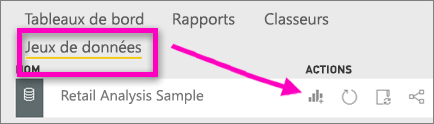
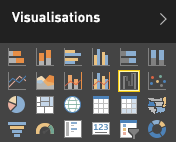
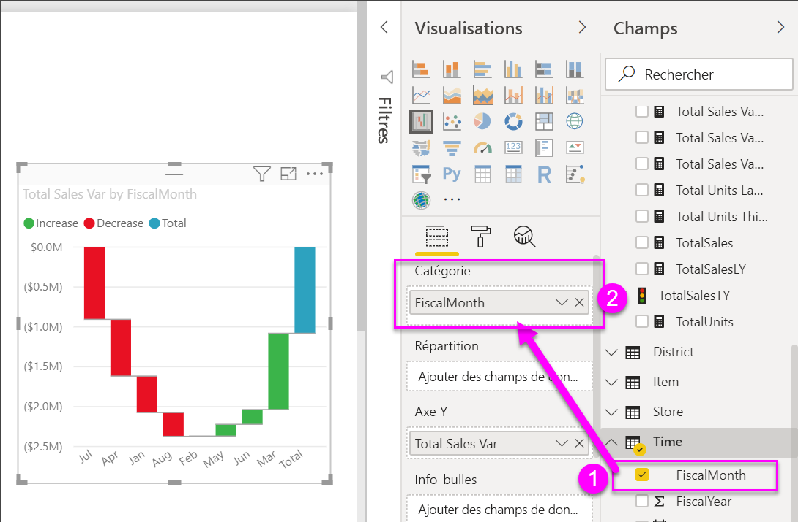
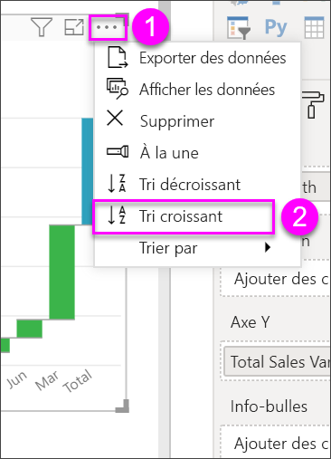
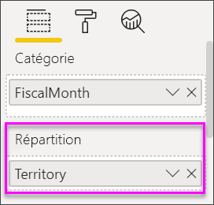
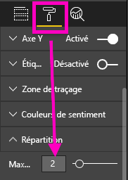

# Graphiques en cascade dans Power BI
Un graphique en cascade affiche un résultat cumulé à mesure que les valeurs sont additionnées ou soustraites. Ce type de graphique est utile pour comprendre de quelle façon une valeur initiale (par exemple, un revenu net) est affectée par une série de variations positives et négatives.

Grâce au codage par couleur des colonnes, vous repérez rapidement les hausses et les baisses. Les colonnes des valeurs initiales et finales [démarrer sur l’axe horizontal](https://support.office.com/article/Create-a-waterfall-chart-in-Office-2016-for-Windows-8de1ece4-ff21-4d37-acd7-546f5527f185#BKMK_Float "démarrent généralement sur l’axe horizontal"), alors que les valeurs intermédiaires sont représentées par des colonnes flottantes. Les graphiques en cascade sont également appelés graphiques « bridge » (pont) en raison de leur forme.

<iframe width="560" height="315" src="https://www.youtube.com/embed/qKRZPBnaUXM" frameborder="0" allow="autoplay; encrypted-media" allowfullscreen></iframe>

## Quand faut-il utiliser un graphique en cascade ?
Les graphiques en cascade sont conseillés pour :

* représenter les variations de la mesure sur plusieurs séries chronologiques ou des catégories différentes ;
* analyser les variations majeures qui ont un impact sur la valeur totale ;
* tracer le bénéfice annuel de votre société en affichant les différentes sources de revenus et indiquer le résultat net (gains ou pertes).
* illustrer l’évolution annuelle de l’effectif global de votre société ;
* visualiser vos revenus et vos dépenses par mois, et le solde courant de votre compte. 

## Créer un graphique en cascade
Nous allons créer un graphique en cascade qui affiche un écart sur les ventes (ventes estimées par rapport aux ventes réelles) par mois. Pour effectuer la procédure, connectez-vous à Power BI et sélectionnez **Obtenir des données \> Exemples \> Exemple Analyse de la vente au détail**. 

1. Sélectionnez l’onglet **Jeux de données**, puis faites défiler vers le nouveau jeu de données « Exemple analyse de vente au détail ».  Sélectionnez l’icône **Créer un rapport** pour ouvrir le jeu de données en mode d’édition de rapport. 
   
    
2. Dans le volet **Champs**, sélectionnez **Sales \> Total Sales Variance** (Ventes > Écart sur volume des ventes totales). 
3. Convertissez le graphique en graphique **en cascade**. Si **Total Sales Variance** (Écart sur volume des ventes totales) ne figure pas dans la zone **Axe Y** , faites-le glisser vers cette zone.
   
    
4. Sélectionnez **Time** \> **FiscalMonth** (Période > Mois fiscal) pour l’ajouter à **Catégorie**. 
   
    
5. Triez le graphique en cascade dans l’ordre chronologique. Dans l’angle supérieur droit du graphique, sélectionnez les points de suspension (...), puis choisissez **MoisFiscal**.
   
    
   
    
6. Approfondissez un peu plus pour voir ce qui contribue le plus aux changements mois après mois. Faites glisser **Magasin** > **Territoire** vers le compartiment **Répartition**.
   
    
7. Par défaut, Power BI ajoute les 5 premiers contributeurs aux augmentations ou diminutions par mois. Mais nous ne nous intéressons qu’aux 2 premiers contributeurs.  Dans le volet Mise en forme, sélectionnez **Répartition**, puis définissez **Maximum** sur 2.
   
    
   
    Un examen rapide révèle que les territoires de l’Ohio et de la Pennsylvanie sont les principaux contributeurs aux mouvements négatifs et positifs dans notre graphique en cascade. 
   
    
8. Le constat est intéressant. Les territoires de l’Ohio et de la Pennsylvanie ont-ils un tel impact parce que les ventes y sont beaucoup plus élevées que dans les autres territoires ?  Nous pouvons vérifier cela. Créons une carte présentant la valeur des ventes de cette année et les ventes de l’année dernière par territoire.  
   
    
   
    Notre carte étaie notre théorie.  Elle révèle que ces 2 territoires sont ceux qui ont réalisé le plus de ventes l’année dernière (taille des bulles) et cette année (ombrage des bulles).

## Mise en surbrillance et filtrage croisé
Pour plus d’informations sur le volet Filtres, consultez [Ajouter un filtre à un rapport](../power-bi-report-add-filter.md).

La mise en surbrillance d’une colonne dans un graphique en cascade entraîne le filtrage croisé des autres visualisations sur la page du rapport, et inversement. Toutefois, la colonne Total ne déclenche pas la mise en surbrillance et ne répond pas à un filtrage croisé.

## Étapes suivantes

[Interactions des visuels](../service-reports-visual-interactions.md)

[Types de visualisation dans Power BI](power-bi-visualization-types-for-reports-and-q-and-a.md)