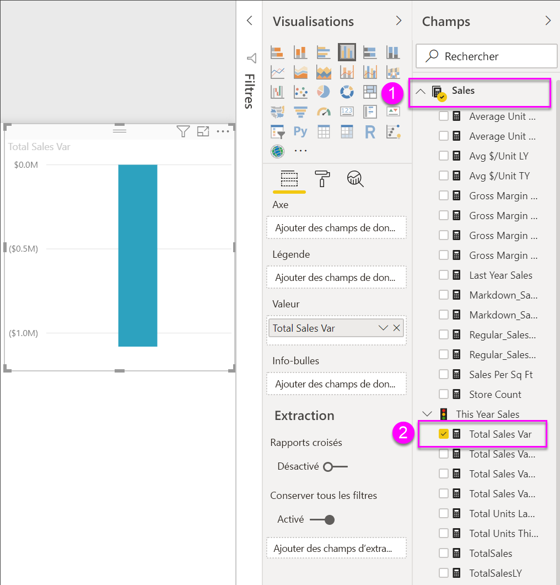

# Graphiques en cascade dans Power BI

Les graphiques en cascade affichent un résultat cumulé à mesure que Power BI ajoute et soustrait des valeurs. Ces graphiques sont utiles pour comprendre de quelle façon une valeur initiale (par exemple, un revenu net) est affectée par une série de variations positives et négatives.

Grâce au codage par couleur des colonnes, vous repérez rapidement les hausses et les baisses. Les colonnes des valeurs initiales et finales [démarrer sur l’axe horizontal](https://support.office.com/article/Create-a-waterfall-chart-in-Office-2016-for-Windows-8de1ece4-ff21-4d37-acd7-546f5527f185#BKMK_Float "démarrent généralement sur l’axe horizontal"), alors que les valeurs intermédiaires sont représentées par des colonnes flottantes. Les graphiques en cascade sont également appelés graphiques « bridge » (pont) en raison de leur forme.

<iframe width="560" height="315" src="https://www.youtube.com/embed/qKRZPBnaUXM" frameborder="0" allow="autoplay; encrypted-media" allowfullscreen></iframe>

## Quand faut-il utiliser un graphique en cascade ?

Les graphiques en cascade sont conseillés pour :

* représenter les variations de la mesure sur plusieurs séries chronologiques ou des catégories différentes ;

* analyser les variations majeures qui ont un impact sur la valeur totale ;

* tracer le bénéfice annuel de votre société en affichant les différentes sources de revenus et indiquer le résultat net (gains ou pertes) ;

* illustrer l’évolution annuelle de l’effectif global de votre société ;

* visualiser vos revenus et vos dépenses par mois, et le solde courant de votre compte.

## Conditions préalables

* Service Power BI ou Power BI Desktop

* Exemple de rapport Analyse de la vente au détail

## Obtenir l’exemple de rapport Retail Analysis (Analyse de la vente au détail)

Ces instructions s’appliquent à l’exemple Analyse de la vente au détail. La création d’une visualisation nécessite des autorisations de modification du jeu de données et du rapport. Par chance, les exemples Power BI sont tous modifiables. Si quelqu’un partage un rapport avec vous, vous ne pourrez pas créer de visualisations dans les rapports. Pour suivre la procédure, obtenez l’[exemple de rapport Retail Analysis Sample (Analyse de la vente au détail)](../sample-datasets.md).

Une fois que vous obtenez le jeu de données **Retail Analysis Sample (Analyse de la vente au détail)** , vous pouvez commencer.

## Créer un graphique en cascade

Vous allez créer un graphique en cascade qui affiche un écart sur les ventes (ventes estimées par rapport aux ventes réelles) par mois.

1. À partir de **Mon espace de travail**, sélectionnez l’onglet **Jeux de données** > **Créer un rapport**.

    

1. Dans le volet **Champs**, sélectionnez **Ventes** > **Écart sur volume des ventes totales**.

   

1. Sélectionnez l’icône cascade  pour convertir le graphique en treemap.

    Si **Total Sales Variance** (Écart sur volume des ventes totales) ne figure pas dans la zone **Axe Y** , faites-le glisser vers cette zone.

    

1. Sélectionnez **Time** > **FiscalMonth** (Période > Mois fiscal) pour l’ajouter à **Catégorie**.

    

1. Vérifiez que Power BI a trié le graphique en cascade dans l’ordre chronologique. Dans l’angle supérieur droit du graphique, sélectionnez les points de suspension (...).

    Vérifiez la présence d’un indicateur jaune à gauche des options **Tri croissant** et **MoisFiscal**

    

    Vous pouvez également examiner les valeurs de l’axe X et voir qu’elles apparaissent dans l’ordre de **Jan** à **Aoû**.

    Approfondissez un peu plus pour voir ce qui contribue le plus aux changements mois après mois.

1. Faites glisser **Magasin** > **Territoire** vers le compartiment **Répartition**.

    

    Par défaut, Power BI ajoute les cinq premiers contributeurs aux augmentations ou diminutions par mois.

    

    Nous ne nous intéressons qu’aux deux premiers contributeurs.

1. Dans le volet **Mise en forme**, sélectionnez **Répartition**, puis définissez **Décompositions maximales** sur **2**.

    

    Un examen rapide révèle que les territoires de l’Ohio et de la Pennsylvanie sont les principaux contributeurs aux mouvements négatifs et positifs dans votre graphique en cascade.

    

    Le constat est intéressant. Les territoires de l’Ohio et de la Pennsylvanie ont-ils un tel impact parce que les ventes y sont beaucoup plus élevées que dans les autres territoires ? Vous pouvez vérifier cela.

1. Créons une carte présentant la valeur des ventes de cette année et les ventes de l’année dernière par territoire.

    

    La carte étaie notre théorie. Elle révèle que ces deux territoires sont ceux qui ont réalisé le plus de ventes l’année dernière (taille des bulles) et cette année (ombrage des bulles).

## Mise en surbrillance et filtrage croisé

Pour plus d’informations sur l’utilisation du volet **Filtres**, consultez [Ajouter un filtre à un rapport en mode Édition](../power-bi-report-add-filter.md).

La mise en surbrillance d’une colonne dans un graphique en cascade entraîne le filtrage croisé des autres visualisations sur la page du rapport, et inversement. Toutefois, la colonne **Total** ne déclenche pas la mise en surbrillance et ne répond pas à un filtrage croisé.

## Étapes suivantes

* [Modifier l’interaction des visuels dans un rapport Power BI](../service-reports-visual-interactions.md)

* [Types de visualisation dans Power BI](power-bi-visualization-types-for-reports-and-q-and-a.md)
