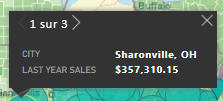
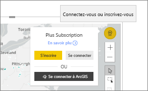

# Interagir avec des cartes ArcGIS dans Power BI
Cette rubrique est écrite du point de vue d’une personne qui utilise une carte ArcGIS dans le service Power BI, dans Power BI Desktop ou dans la version mobile de Power BI. Quand un concepteur partage un visuel ArcGIS Maps for Power BI avec vous, il existe de nombreuses façons d’interagir avec celui-ci.  Pour en savoir plus sur la création d’une carte ArcGIS, consultez le [tutoriel sur les cartes ArcGIS par Esri](../visuals/power-bi-visualization-arcgis.md).

L’association des cartes ArcGIS et de Power BI porte la cartographie au-delà de la simple présentation de points sur une carte, pour accéder à un nouveau niveau. Les concepteurs de rapports commencent par sélectionner une carte à laquelle ils attachent des couches de données démographiques. L’association des couches de données basées sur la localisation (comme des données de recensement) sur une carte avec l’analyse spatiale permet une compréhension approfondie des données dans vos visualisations.

> [!TIP]
> GIS signifie système d’information géographique.
> 

Ce visuel ArcGIS Maps for Power BI affiche les ventes de l’année dernière par ville, avec un plan des rues comme carte de base et le revenu moyen des ménages comme couche de référence. La carte contient deux repères (rouge et jaune) et un rayon indiquant le temps de trajet (en violet).

> [!TIP]
> Visitez la [page d’Esri sur Power BI](https://www.esri.com/powerbi) pour découvrir de nombreux exemples et lire des témoignages. Consultez ensuite la [page d’Esri pour bien démarrer avec ArcGIS Maps for Power BI](https://doc.arcgis.com/en/maps-for-powerbi/get-started/about-maps-for-power-bi.htm).
> 
> 

## Consentement de l’utilisateur

La première fois qu’un collègue partage une carte ArcGIS avec vous, Power BI affiche une invite de consentement. ArcGIS Maps for Power BI étant fourni par Esri (https://www.esri.com), son utilisation est soumise aux conditions générales et à la politique de confidentialité d’Esri. Les utilisateurs Power BI désireux d’utiliser les visuels ArcGIS Maps pour Power BI doivent valider la boîte de dialogue de consentement.

## Comprendre les couches

Un visuel ArcGIS Maps for Power BI peut avoir plusieurs types de couches contenant des informations démographiques sur des localisations.

### Cartes de base

Chaque visuel ArcGIS Maps for Power BI repose sur une carte de base. Considérez une carte de base comme un canevas sur lequel les données sont présentées. Une carte de base peut se composer d’un canevas élémentaire sombre ou foncé

 

ou d’un canevas détaillé indiquant les rues et les transports. 

  

La carte de base est appliquée entièrement au canevas : à mesure que vous effectuez un panoramique et un zoom, la carte se met à jour. Effectuez un zoom avant pour voir des informations plus détaillées sur les rues et les transports. Si vous effectuez un panoramique d’un continent à un autre, le niveau de détail reste constant. Ici, nous avons effectué un panoramique de Porto à Beijing.

  

### Couches de référence

Un *concepteur* de rapports peut ajouter une couche de référence. Les couches de référence sont hébergées par Esri et fournissent une couche supplémentaire d’informations démographiques sur une localisation. L’exemple ci-dessous comprend une couche de référence pour la densité de population. Les couleurs plus sombres indiquent des densités plus élevées.

  

### Infographie

Un *concepteur* de rapports peut ajouter de nombreuses couches d’infographie. Les infographies sont des indicateurs visuels rapides qui s’affichent à droite du canevas visuel. Les infographies sont hébergées par Esri et fournissent une couche supplémentaire d’informations démographiques sur une localisation. Trois infographies sont appliqués à l’exemple ci-dessous. Elles ne s’affichent pas sur la carte elle-même, mais sur des cartes. Les cartes d’infographie sont mises à jour à mesure que vous effectuez des zooms, des panoramiques et des sélections sur la carte.

  

### Épingles

Les repères représentent des localisations précises, comme une ville ou une adresse. Parfois, les *concepteurs* de rapports utilisent des repères avec des rayons pour indiquer le temps de trajet. Cet exemple montre des magasins dans un rayon de 80 km autour de Charlotte, en Caroline du Nord.

 

## Interagir avec un visuel ArcGIS Maps for Power BI
Les fonctionnalités disponibles dépendent de la façon dont le rapport a été partagé avec vous et de votre type de compte Power BI. Si vous avez des questions, contactez votre administrateur système. Les visuels ArcGIS Maps for Power BI se comportent de manière semblable aux autres visuels dans un rapport. Vous pouvez [afficher les données utilisées pour créer la visualisation](../consumer/end-user-show-data.md), voir la carte [en mode Focus et en mode Plein écran](../consumer/end-user-focus.md), [ajouter des commentaires](../consumer/end-user-comment.md), [interagir avec les filtres](../consumer/end-user-report-filter.md) définis par le *concepteur* de rapport, etc. Les visuels ArcGIS peuvent appliquer un filtrage croisé à d’autres visuels sur la page du rapport et vice versa.

Placez le curseur sur une localisation de la carte de base (par exemple, une bulle) pour afficher une info-bulle. Vous pouvez également utiliser les outils de sélection du visuel ArcGIS pour afficher des info-bulles supplémentaires et effectuer des sélections spécifiques sur la carte de base ou la couche de référence.  

### Outils de sélection

ArcGIS Maps for Power BI offre cinq modes de sélection. Il n’est pas possible de sélectionner plus de 250 points de données à la fois.

#### Outil de sélection simple

 

Sélectionnez un point de données, une bulle, un repère ou un point de données individuel dans la couche de référence. Power BI affiche une info-bulle avec des détails sur votre sélection. Une sélection simple entraîne le filtrage croisé des autres visuels de la page du rapport en fonction de votre sélection et met à jour les cartes d’infographie pour la zone sélectionnée. 

Ici, nous avons sélectionné un point de données indiqué par une bulle marron sur notre carte de base. Power BI :
- Met en surbrillance la sélection
- Affiche une info-bulle pour ce point de données 
- Met à jour les cartes d’infographie pour afficher uniquement les données de notre sélection
- Entraîne la mise en surbrillance croisée de l’histogramme

Si la carte a une couche de référence, sélectionnez des localisations pour afficher des détails dans une info-bulle. Ici, après avoir sélectionné Seneca County, nous voyons les données de la couche de référence (densité de population) que le *concepteur* de rapport a ajouté à la carte. Dans cet exemple, comme notre point de données inclut deux comtés différents, notre info-bulle comporte deux pages. Chaque page a un graphique. Sélectionnez une barre dans le graphique pour afficher des détails supplémentaires. 

> [!TIP]
  > Parfois, vous pouvez réduire le nombre de pages d’info-bulle en effectuant un zoom avant pour sélectionner une localisation spécifique.  Sinon, si des emplacements se chevauchent, Power BI peut présenter plusieurs info-bulles. Sélectionnez les flèches pour vous déplacer entre les info-bulles.
  > 
  > 

#### Outil de sélection multiple

 

Dessine un rectangle sur la carte, et sélectionne les points de données qu’il contient. Utilisez la touche Ctrl pour sélectionner plusieurs zones rectangulaires. Une sélection multiple met à jour les cartes d’infographie pour la zone sélectionnée et entraîne la mise en surbrillance croisée des autres visuels sur la page du rapport en fonction de votre sélection.

 

#### Outil de couche de référence

 

Autorise l’utilisation de limites ou de polygones dans les couches de référence pour sélectionner des points de données. C’est difficile à voir, mais un contour jaune est dessiné sur la couche de référence. Contrairement à l’outil de sélection simple, nous n’obtenons pas d’info-bulle. Au lieu de cela, nous obtenons des données sur les points de données contenus à l’intérieur de ce contour. Dans cet exemple, notre sélection contient un point de données. Il s’agit d’un magasin Lindseys situé à Winston Salem.

 

#### Outil de mémoire tampon

 

Cet outil vous permet de sélectionner des points de données à l’aide d’une couche en mémoire tampon. Vous pouvez par exemple l’utiliser pour sélectionner un rayon de temps de trajet et continuer à interagir avec le reste du rapport. Le rayon de temps de trajet reste actif et les cartes d’infographie continuent à refléter le rayon de temps de trajet, mais la sélection d’autres points de données sur la carte entraîne le filtrage croisé des autres visuels sur la page du rapport.

 

#### Outil de recherche de similarités

 

Cet outil vous permet de trouver des localisations avec des attributs similaires. Commencez par sélectionner un ou plusieurs points d’intérêt, ou localisations de référence. Définissez jusqu’à cinq dimensions à utiliser dans l’analyse. L’outil de recherche de similarités calcule alors les 10 localisations de votre carte qui ressemblent le plus aux localisations de référence que vous avez définies. Vous pouvez ensuite utiliser des cartes d’infographie pour en savoir plus sur les données démographiques autour de chacun de vos résultats, créer des zones de temps de trajet en voiture pour vous faire une idée de ce qui se trouve à proximité de ces localisations, ou même utiliser l’outil de recherche de similarités pour filtrer votre rapport et obtenir davantage d’insights. Mais le plus important, c’est que tous les calculs sont effectués localement sur votre ordinateur, garantissant ainsi la protection de vos données confidentielles.

## Considérations et limitations
ArcGIS Maps pour Power BI est disponible dans les applications et services suivants :

|Service/application  |Disponibilité  |
|---------|---------|
|Power BI Desktop     |     Oui    |
|Service Power BI (app.powerbi.com)     |    Oui     |
|Applications mobiles Power BI     |  Oui      |
|Publication Power BI sur le web     |  Non       |
|Power BI Embedded     |     Non    |
|Incorporation au service Power BI (PowerBI.com)  | Non |

## Comment fonctionne ArcGIS Maps for Power BI ?
ArcGIS Maps for Power BI est fourni par Esri (https://www.esri.com). L’utilisation d’ArcGIS Maps for Power BI est soumise aux [conditions générales](https://go.microsoft.com/fwlink/?LinkID=8263222) et à la [politique de confidentialité](https://go.microsoft.com/fwlink/?LinkID=826323) d’Esri. Les utilisateurs Power BI désireux d’utiliser les visuels d’ArcGIS Maps for Power BI doivent confirmer leur acceptation dans la boîte de dialogue de consentement (voir Consentement de l’utilisateur pour plus de détails).  L’utilisation d’ArcGIS Maps for Power BI est soumise aux conditions générales et à la politique de confidentialité d’Esri, auxquelles vous pouvez accéder à partir des liens dans la boîte de dialogue de consentement. Chaque utilisateur doit donner son consentement avant d’utiliser ArcGIS Maps for Power BI pour la première fois. Une fois que l’utilisateur accepte le consentement, les données liées au visuel sont envoyées aux services d’Esri au moins pour le géocodage, c’est-à-dire la transformation des informations de localisation en latitude et longitude qui peuvent être représentées sur une carte. Prenez en compte que toutes les données liées à la visualisation des données peuvent être envoyées aux services d’Esri. Esri fournit des services comme les cartes de base, l’analytique spatiale, le géocodage, etc. Le visuel ArcGIS Maps for Power BI interagit avec ces services à l’aide d’une connexion SSL protégée par un certificat fourni et géré par Esri. Des informations supplémentaires sur ArcGIS Maps for Power BI peuvent être obtenues dans la [page de produit ArcGIS Maps for Power BI](https://www.esri.com/powerbi) d’Esri.

### Power BI Plus

Quand un utilisateur s’inscrit à un abonnement Plus offert par Esri via ArcGIS Maps for Power BI, il entre dans une relation directe avec Esri. Power BI n’envoie pas à Esri d’informations personnelles sur l’utilisateur. L’utilisateur se connecte à une application AAD fournie par Esri avec sa propre identité AAD et l’approuve. De cette façon, l’utilisateur partage ses informations personnelles directement avec Esri. Dès que l’utilisateur ajoute du contenu Plus à un visuel ArcGIS Maps for Power BI, ses collègues qui veulent afficher ou modifier ce visuel doivent également avoir un abonnement Plus d’Esri. 

Pour des questions techniques détaillées sur le fonctionnement d’ArcGIS Maps for Power BI d’Esri, contactez Esri via leur site de support.

## Considérations et résolution des problèmes

**La carte ArcGIS ne s’affiche pas**    
Dans les services ou applications où ArcGIS Maps pour Power BI n’est pas disponible, la visualisation affiche un visuel vide avec le logo Power BI.

**Je ne vois pas toutes mes informations sur la carte**    
Quand vous géocodez la latitude/longitude sur la carte, jusqu’à 30 000 points de données peuvent s’afficher. Quand vous géocodez des points de données comme des codes postaux ou des adresses postales, seuls les 15 000 premiers points de données sont géocodés. Le géocodage des pays ou noms de lieux n’est pas soumis à la limite de 1500 adresses.

**L’utilisation d’ArcGIS Maps pour Power BI a-t-elle un coût ?**

ArcGIS Maps pour Power BI est disponible gratuitement pour tous les utilisateurs de Power BI. Il s’agit d’un composant fourni par **Esri**, dont l’utilisation est régie par les conditions générales et la politique de confidentialité établies par **Esri** comme indiqué précédemment dans cet article. Si vous vous abonnez à ArcGIS **Plus**, vous êtes soumis à des frais.

**J’obtiens un message d’erreur indiquant que mon cache est saturé**

Il s’agit d’un bogue qui est en cours de traitement.  En attendant, sélectionnez le lien qui apparaît dans le message d’erreur pour obtenir des instructions sur l’effacement de votre cache Power BI.

**Puis-je afficher mes cartes ArcGIS hors connexion ?**

Non, Power BI nécessite une connexion au réseau pour afficher les cartes.

## Étapes suivantes
Obtention d’aide : **Esri** fournit une [documentation complète](https://go.microsoft.com/fwlink/?LinkID=828772) sur l’ensemble des fonctionnalités d’**ArcGIS Maps pour Power BI**.

Vous pouvez poser des questions, accéder aux informations les plus récentes, signaler des problèmes et trouver des réponses sur le [fil de discussion de la communauté Power BI consacré à **ArcGIS Maps pour Power BI**](https://go.microsoft.com/fwlink/?LinkID=828771).

[Page du produit ArcGIS Maps pour Power BI](https://www.esri.com/powerbi)
