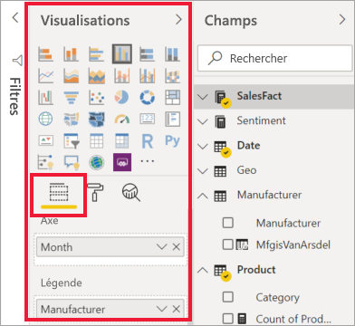
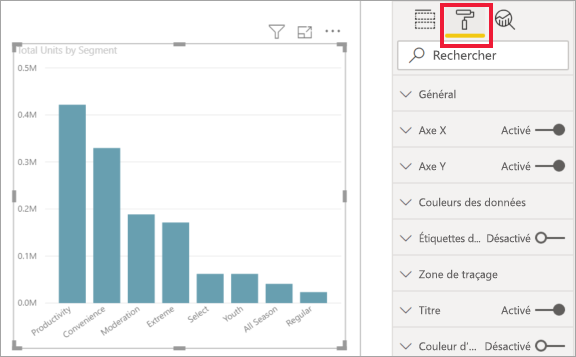
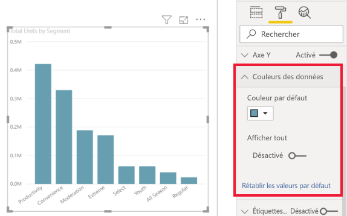
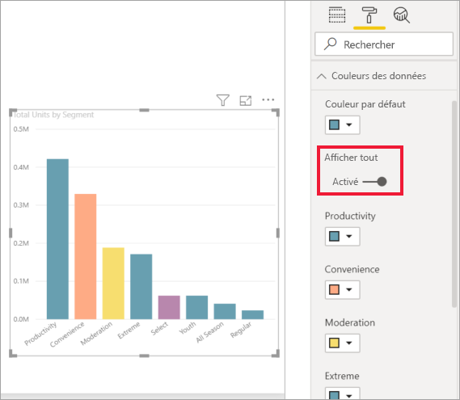
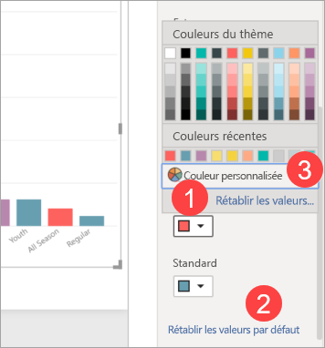
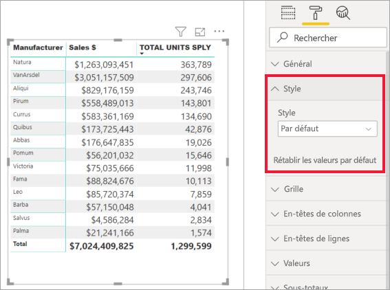
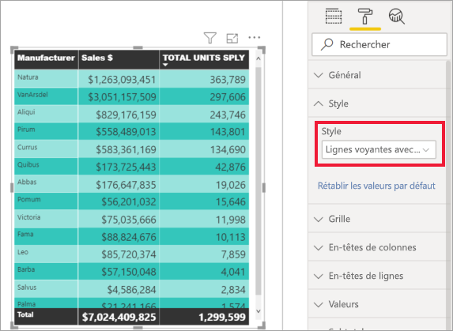
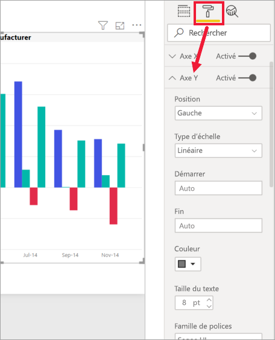
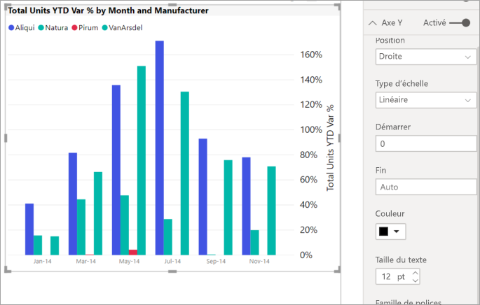
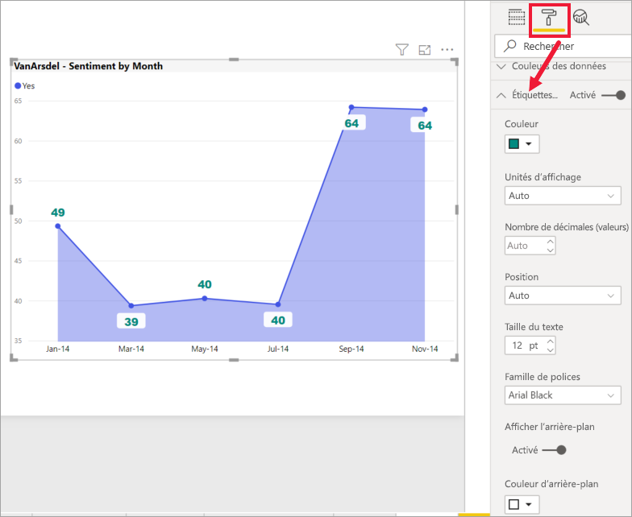

# Bien démarrer avec le volet de mise en forme

[!INCLUDE[consumer-appliesto-nyyn](../includes/consumer-appliesto-nyyn.md)]    

Si vous avez des autorisations de modification sur un rapport, vous avez de nombreuses options de mise en forme à disposition. Dans les rapports Power BI, vous pouvez changer la couleur des séries de données et des points de données, et même l’arrière-plan des visualisations. Vous pouvez changer la présentation de l’axe x et de l’axe y. Vous pouvez même mettre en forme les propriétés de police des visualisations, des formes et des titres. Power BI vous donne un contrôle total sur l’apparence de vos rapports.

Pour commencer, ouvrez un rapport dans Power BI Desktop ou dans le service Power BI. Les deux offrent des options de mise en forme quasiment identiques. Quand vous ouvrez un rapport dans le service Power BI, veillez à sélectionner **Modifier** dans la barre de menus. 

Si vous modifiez un rapport alors qu’une visualisation est sélectionnée, le volet **Visualisations** s’affiche. Utilisez-le pour modifier les visualisations. Sous le volet **Visualisations** se trouvent trois icônes : l’icône **Champs** (barres empilées), l’icône **Mettre en forme** (pinceau) et l’icône **Analytique** (loupe). Dans l’image ci-dessous, l’icône **Champs** est sélectionnée, ce qu’indique une barre jaune située sous l’icône.

Si vous sélectionnez **Mettre en forme**, la zone située sous l’icône affiche les personnalisations applicables à la visualisation sélectionnée.  

Il est possible de personnaliser de nombreux éléments de chaque visualisation. Les options disponibles varient selon le visuel sélectionné. En voici quelques exemples :

* Légende
* Axe X
* Axe Y
* Couleurs des données
* Étiquettes de données
* Formes
* Zone de traçage
* Titre
* Arrière-plan
* Les proportions
* Bordure
* Info-bulles
* En-têtes de visuel
* Formes
* Position    
et bien plus.

> [!NOTE]
>  
> ces éléments n’apparaissent pas pour tous les types de visualisations. La disponibilité des personnalisations dépend de la visualisation que vous sélectionnez. Par exemple, vous ne verrez pas un axe X si vous avez sélectionné un graphique à secteurs, car ce type de graphique ne comprend pas d’axe X.

Notez également que, si vous n’avez sélectionné aucune visualisation, le volet **Filtres** apparaît à la place des icônes, ce qui vous permet d’appliquer des filtres à toutes les visualisations de la page.

La meilleure façon d’apprendre à utiliser les options de mise en forme consiste à les tester. Vous pourrez toujours annuler vos modifications ou rétablir les valeurs par défaut. Il existe une quantité incroyable d’options disponibles, et de nouvelles sont ajoutées en permanence. Il n’est tout simplement pas possible de décrire toutes les options de mise en forme en un article. Pour vous aider à commencer, examinons-en néanmoins quelques-unes ensemble. 

1. Modifier les couleurs utilisées dans le visuel   
2. Appliquer un style    
3. Modifier les propriétés d’axe    
4. Ajouter des étiquettes de données    

## Utilisation des couleurs

Voyons les étapes nécessaires à la personnalisation des couleurs d’une visualisation.

1. Sélectionnez une visualisation pour l’activer.

2. Sélectionnez l’icône représentant un rouleau pour ouvrir l’onglet Mise en forme, qui affiche tous les éléments de mise en forme applicables au visuel sélectionné.

    

3. Sélectionnez **Couleurs des données** pour développer les personnalisations disponibles.  

    

4. Passez **Tout afficher** sur Activé et sélectionnez différentes couleurs pour les colonnes.

    

Voici quelques conseils utiles pour travailler avec les couleurs. Les nombres de la liste suivante figurent également sur l’écran suivant, indiquant l’endroit où ces éléments utiles sont accessibles ou peuvent être modifiés.

1. Vous n’aimez pas la couleur ? Il vous suffit de sélectionner **Rétablir les valeurs par défaut** pour que votre sélection revienne au paramètre par défaut. 

2. Vous n’aimez aucune des modifications de couleur ? Sélectionnez **Rétablir les valeurs par défaut** en bas de la section **Couleur des données** pour que vos couleurs reviennent aux paramètres par défaut. 

3. Vous voulez appliquer une couleur que vous ne voyez pas dans la palette ? Sélectionnez **Custom Color**(Couleur personnalisée), puis choisissez une couleur du spectre.  

   

Vous n’êtes pas satisfait de votre changement ? Utilisez **CTRL + Z** pour annuler votre modification.

## Appliquer un style à un tableau
Certaines visualisations Power BI comportent une option **Style**. En un clic, un ensemble complet d’options de mise en forme s’applique à votre visualisation. 

1. Sélectionnez un tableau ou une matrice pour l’activer.   
1. Ouvrez le volet Mise en forme et sélectionnez **Style**.

   

1. Sélectionnez un style dans la liste déroulante. 

   

Même après avoir appliqué un style, vous pouvez continuer à mettre en forme les propriétés, y compris la couleur, de cette visualisation.

## Modification des propriétés d’axe

Il est souvent utile de modifier l’axe X ou l’axe Y. Comme pour l’utilisation des couleurs, vous pouvez modifier un axe en sélectionnant l’icône de flèche vers le bas située à gauche de l’axe que vous voulez modifier, comme illustré dans l’image suivante.  

Dans l’exemple ci-dessous, nous avons mis en forme l’axe Y de différentes manières :
- déplacement des étiquettes du côté droit de la visualisation ;

- valeur de départ : zéro ;

- couleur de police des étiquettes : noir ;

- taille de police des étiquettes : 12 ;

- ajout d’un titre à l’axe Y.

    

Vous pouvez supprimer l’ensemble des étiquettes des axes en cochant ou en décochant la case d’option située à côté de **Axe X** ou **Axe Y**. Vous pouvez également choisir d’activer ou de désactiver les titres des axes en cochant la case d’option **Title**(Titre).  

## Ajouter des étiquettes de données    

Prenons un dernier exemple de mise en forme avant que vous ne commenciez à explorer par vous-même.  Nous allons ajouter des étiquettes de données à un graphique en aires. 

Voici l’image *avant*. 

Voici maintenant l’image *après*.

Nous avons sélectionné la visualisation pour l’activer et ouvert l’onglet Mise en forme.  Nous avons sélectionné **Étiquettes de données** et les avons activées. Nous avons ensuite choisi la police 12, la famille de polices Arial Black, activé **Afficher l’arrière-plan** et sélectionné la couleur d’arrière-plan blanc avec une transparence de 5 %.

Il ne s’agit que de quelques-unes des tâches de mise en forme possibles. Ouvrez un rapport en mode Édition et amusez-vous à explorer le volet Mise en forme pour créer des visualisations attrayantes et instructives.

## Étapes suivantes
Pour plus d’informations, consultez l’article suivant : 

* [Partage des rapports](../collaborate-share/service-share-reports.md)

* [Trucs et astuces pour la mise en forme des couleurs dans Power BI](service-tips-and-tricks-for-color-formatting.md)  
* [Mise en forme conditionnelle dans les tables](../create-reports/desktop-conditional-table-formatting.md)

