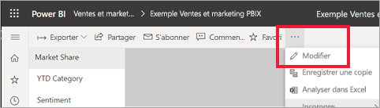
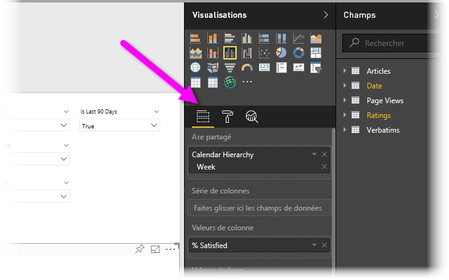
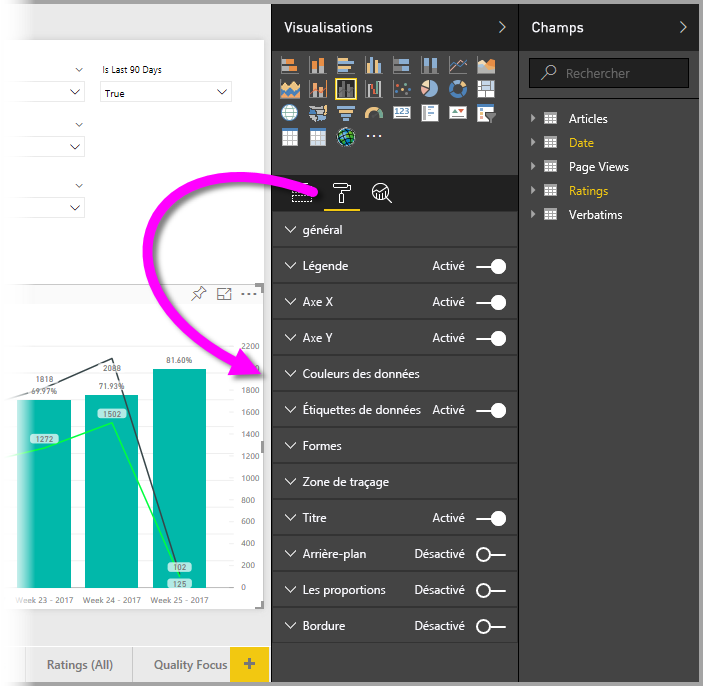
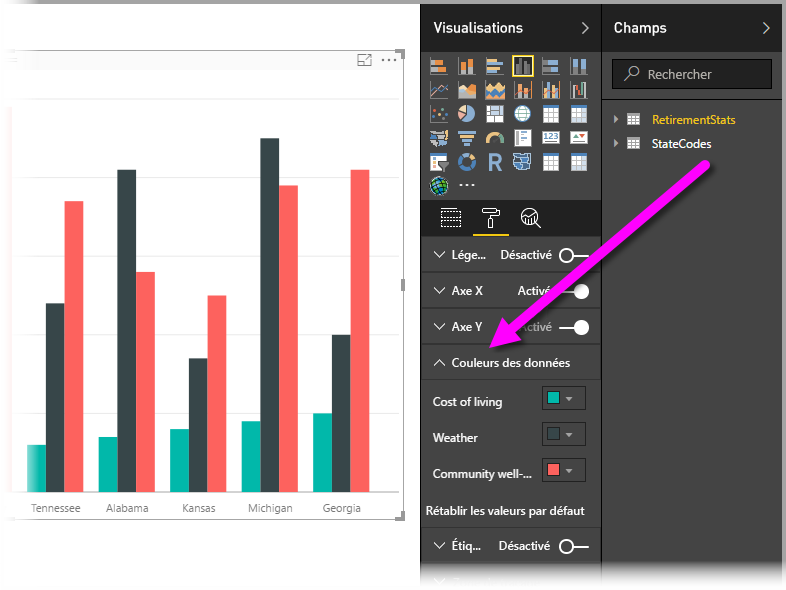
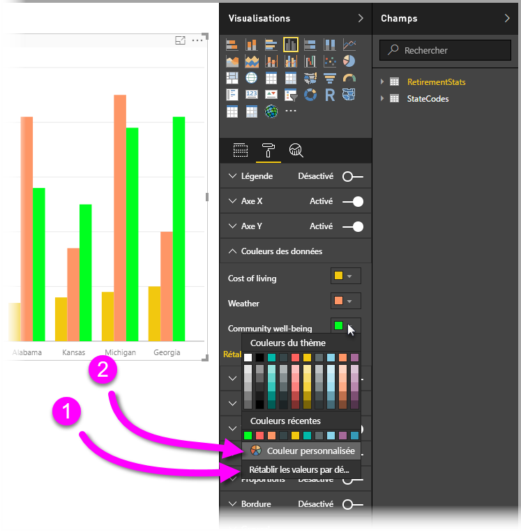
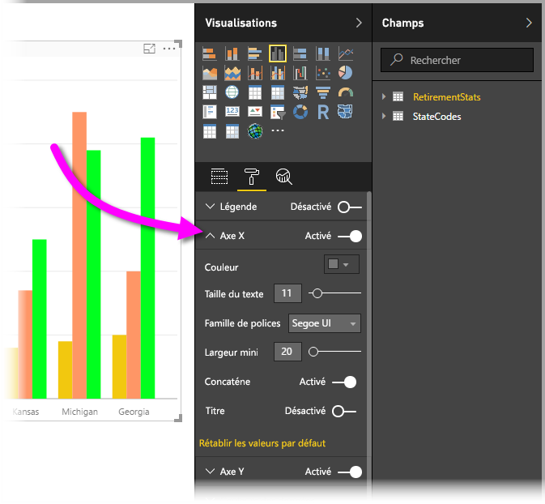

# Bien démarrer avec le volet de mise en forme
Si vous avez des autorisations de modification sur un rapport, vous avez de nombreuses options de mise en forme à disposition. Dans les rapports **Power BI**, vous pouvez changer la couleur des séries de données, des points de données et même l’arrière-plan des visualisations. Vous pouvez changer la présentation de l’axe x et de l’axe y. Vous pouvez même mettre en forme les propriétés de police des visualisations, des formes et des titres, ce qui vous donne un contrôle total sur l’apparence de vos rapports.

Pour commencer, ouvrez un rapport dans Power BI Desktop ou dans le service Power BI. Les deux offrent des options de mise en forme quasiment identiques. Quand vous ouvrez un rapport dans le service Power BI, veillez à sélectionner **Modifier le rapport** dans la barre de menus.  

Quand vous modifiez un rapport alors qu’une visualisation est sélectionnée, le volet **Visualisations** s’affiche, ce qui vous permet d’ajouter ou de modifier des visualisations. Sous les visualisations disponibles se trouvent trois icônes : l’icône **Champs** (représentant des barres les unes sur les autres), l’icône **Format** (représentant un pinceau) et l’icône **Analytique** (représentant une loupe). Dans l’image ci-dessous, l’icône **Champs** est sélectionnée, ce qu’indique une barre jaune située sous l’icône.

Quand vous sélectionnez **Format**, la zone située sous l’icône affiche les personnalisations applicables aux couleurs et aux axes de la visualisation actuellement sélectionnée.  

Vous pouvez personnaliser de nombreux éléments de ces visualisations :

* Légende
* Axe X
* Axe Y
* Couleurs des données
* Étiquettes de données
* Formes
* Zone de traçage
* Titre
* Arrière-plan
* Les proportions
* Bordure

> [!NOTE]
>  
> ces éléments n’apparaissent pas pour tous les types de visualisations. La disponibilité des personnalisations dépend de la visualisation que vous sélectionnez. Par exemple, vous ne verrez pas un axe X si vous avez sélectionné un graphique à secteurs, car ce type de graphique ne comprend pas d’axe X.

Notez également que, si vous n’avez sélectionné aucune visualisation, le volet **Filtres** apparaît à la place des icônes, ce qui vous permet d’appliquer des filtres à toutes les visualisations de la page.

Nous allons montrer deux exemples. Le premier illustre comment utiliser des couleurs et le deuxième comment modifier les propriétés d’un axe. Grâce à ces exemples, vous serez capable de personnaliser des couleurs, des axes et des étiquettes.

## Utilisation des couleurs

Voyons les étapes nécessaires à la personnalisation des couleurs d’un graphique.

1. Sélectionnez un **histogramme groupé** dans le canevas de rapport.
2. Ensuite, choisissez l’icône **Format** pour afficher les personnalisations disponibles.
3. Sélectionnez la petite flèche bas située à gauche de la personnalisation **Couleurs des données** . Cette action affiche les options de personnalisation de la couleur des données spécifiques à la visualisation sélectionnée.
4. L’option **Couleurs des données** peut être développée pour afficher les personnalisations disponibles.  
   

Apportons quelques modifications. Nous pouvons sélectionner la flèche bas en regard de la couleur à modifier pour chaque série de données disponible. Nous voulons que la catégorie **Cost of living (coût de la vie)** soit jaune, que **Weather (Météo)** soit orange et que **Community well-being (Bien-être communautaire)** soit vert. L’écran suivant montre la dernière étape, dans laquelle nous modifions la couleur de **Cost of living**(Coût de la vie).  

Les modifications sont indiquées dans l’image ci-dessous. Les couleurs de notre graphique sont vives. Voici quelques informations utiles sur l’utilisation des couleurs. Les nombres de la liste suivante figurent également sur l’écran suivant, indiquant l’endroit où ces éléments utiles sont accessibles ou peuvent être modifiés.

1. Vous n’aimez pas les couleurs que vous avez choisies ? Il vous suffit de sélectionner **Rétablir les valeurs par défaut** pour rétablir les paramètres par défaut. Vous pouvez aussi bien rétablir une seule couleur que l’ensemble d’une visualisation.
2. Vous voulez appliquer une couleur que vous ne voyez pas dans la palette ? Sélectionnez **Custom Color**(Couleur personnalisée), puis choisissez une couleur du spectre.  
   

Vous n’êtes pas satisfait de votre changement ? Utilisez **CTRL + Z** pour annuler votre modification.

## Modification des propriétés d’axe

Il est souvent utile de modifier l’axe X ou l’axe Y. Comme pour l’utilisation des couleurs, vous pouvez modifier un axe en sélectionnant l’icône de flèche vers le bas située à gauche de l’axe que vous voulez modifier, comme illustré dans l’image suivante.  

Si vous voulez réduire les options de l’ **axe X** , sélectionnez l’icône de flèche haut à côté d’ **Axe X**.

Vous pouvez supprimer l’ensemble des étiquettes de l’axe X en cochant ou en décochant la case d’option située à côté de **Axe X**. Vous pouvez également choisir d’activer ou de désactiver les titres des axes en cochant la case d’option **Title**(Titre).  

Il existe un grand nombre de couleurs et de personnalisations à appliquer à vos rapports et tableaux de bord Power BI.

> [!NOTE]
>  
> Les personnalisations des couleurs, des axes et autres qui sont disponibles quand l’icône **Format** est sélectionnée sont également disponibles dans Power BI Desktop.

## Définition de couleur à partir de valeurs de texte

À compter la mise à jour d’août 2018 de **Power BI Desktop**, vous pouvez définir des couleurs en fonction d’une valeur de texte, ou un code hexadécimal, pour un élément donné d’un rapport. Pour plus d’informations, consultez [Mise en forme conditionnelle dans les tables](../desktop-conditional-table-formatting.md).

## Étapes suivantes
Pour plus d’informations, consultez l’article suivant :  

* [Trucs et astuces pour la mise en forme des couleurs dans Power BI](service-tips-and-tricks-for-color-formatting.md)  
* [Mise en forme conditionnelle dans les tables](../desktop-conditional-table-formatting.md)

