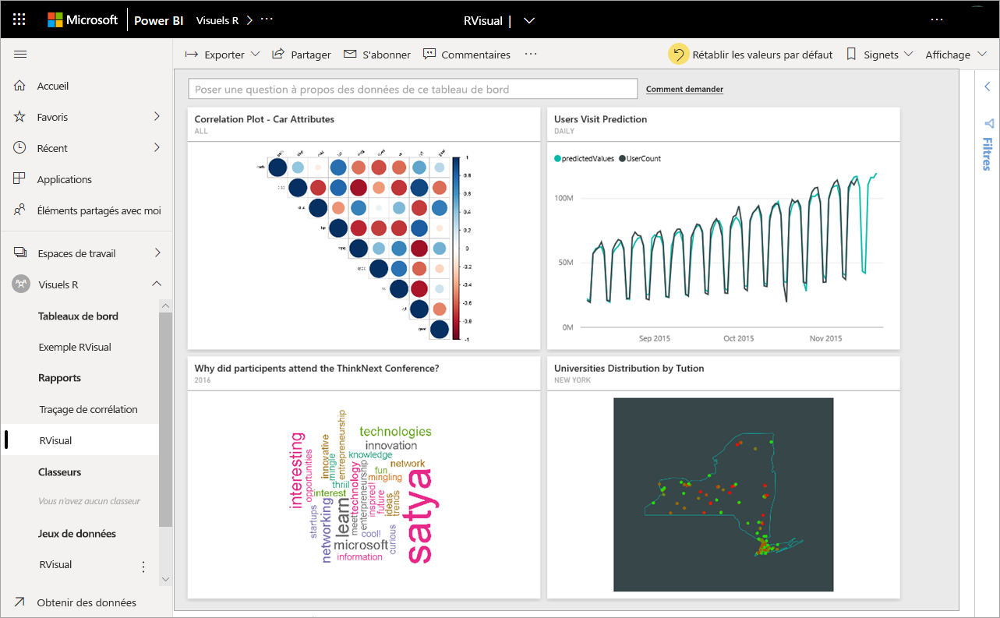
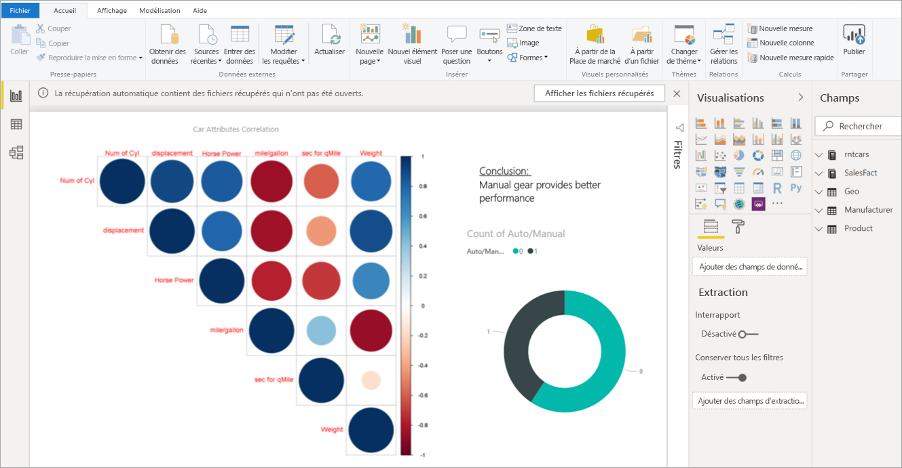
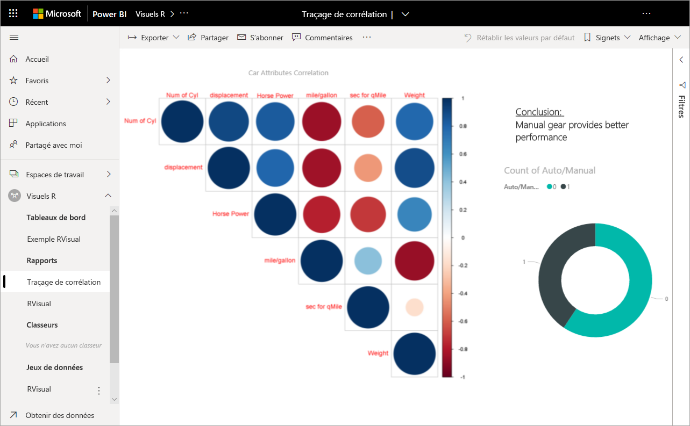
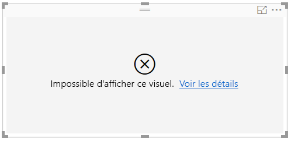
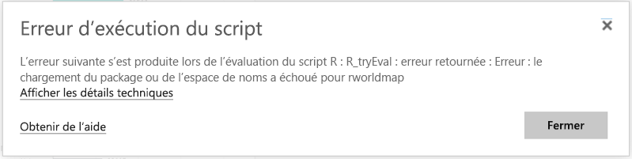

# Visuels R dans Power BI
Pour l’instant, les visuels doivent être créés à l’aide de **Power BI Desktop** avant d’être publiés dans le service Power BI. Pour plus d’informations sur la création de visuels R, consultez [Créer des visuels Power BI avec R ](../desktop-r-visuals.md).

## Affichage de visuels R dans le service Power BI
Le service Power BI prend en charge l’affichage et l’utilisation des éléments visuels créés avec des scripts R. Les éléments visuels créés avec des scripts R, communément appelés *éléments visuels R*, peuvent présenter une analyse et une mise en forme avancées des données (des prévisions par exemple) à l’aide des puissantes et riches fonctionnalités d’analyse et de visualisation de R.

> [!NOTE]
> Le [langage de programmation R](https://www.r-project.org/) est l’un des langages de programmation les plus largement utilisés par les statisticiens, les scientifiques et les analystes d’entreprise. Le langage R a une communauté open source qui offre plus de 7 000 packages de composants additionnels, ainsi que des groupes d’utilisateurs R utilisés à grande échelle. La version de R déployée dans le service Power BI est *Microsoft R 3.4.4.*
> 
> 

L’illustration suivante montre un tableau de bord Power BI avec une collection d’éléments visuels R utilisés pour l’analyse avancée.

Les éléments visuels R sont créés dans un [rapport Power BI Desktop](../desktop-get-the-desktop.md), comme le rapport affiché dans l’image suivante.

Une fois que le rapport est créé dans **Power BI Desktop**, vous pouvez le publier avec un ou plusieurs visuels R dans le service Power BI. 

 Dans le service, tous les packages R ne sont pas pris en charge. Pour obtenir la liste des packages actuellement pris en charge dans le service Power BI, consultez les packages pris en charge à la fin de cet article.

Vous pouvez télécharger cet [exemple de fichier Power BI Desktop](https://download.microsoft.com/download/D/9/A/D9A65269-D1FC-49F8-8EC3-1217E3A4390F/RVisual_correlation_plot_sample%20SL.pbix) (.pbix) qui contient quelques éléments visuels R pour voir comment cela fonctionne et faire des essais.

Les visuels R créés dans **Power BI Desktop** puis publiés dans le service Power BI se comportent la plupart du temps comme n’importe quel autre visuel dans le service Power BI. Vous pouvez les utiliser, les filtrer, les découper et les épingler à un tableau de bord ou les partager avec d’autres utilisateurs. Pour plus d’informations sur le partage de tableaux de bord et d’éléments visuels, consultez [Partager un tableau de bord avec vos collègues et les autres utilisateurs](../service-share-dashboards.md). Contrairement aux autres éléments visuels, les éléments visuels R ne peuvent pas afficher d’info-bulles ni être utilisés pour filtrer d’autres éléments visuels.

Comme vous pouvez le voir dans l’image suivante, que ce soit dans des tableaux de bord ou des rapports, les éléments visuels R du service Power BI, s’affichent et se comportent en grande partie comme les autres types d’élément visuel. En outre, les utilisateurs n’ont pas besoin de connaître le script R sous-jacent qui a créé l’élément visuel.

## Sécurité des scripts R
Les éléments visuels R sont créés à partir de scripts R, qui peuvent contenir du code qui présente des risques éventuels pour la sécurité ou la confidentialité.

Ces risques existent principalement lors de l’étape de création quand l’auteur exécute son script sur son propre ordinateur.

Le service Power BI applique une technologie de type *sandbox* pour protéger les utilisateurs et le service contre les risques de sécurité.

Cette technologie *sandbox* impose certaines restrictions sur les scripts R exécutés dans le service Power BI, comme l’accès à Internet ou à d’autres ressources qui ne sont pas nécessaires à la création d’un élément visuel R.

## Erreurs dans les scripts R
Quand un script R génère une erreur, l’élément visuel R n’est pas tracé et un message d’erreur s’affiche. Pour obtenir plus d’informations sur l’erreur, sélectionnez **Voir les détails** dans l’erreur se rapportant à l’élément visuel R sur le canevas, comme indiqué dans l’image suivante.

Voici un autre exemple : l’illustration suivante montre le message d’erreur qui s’affiche lorsqu’un script R n’a pas pu s’exécuter correctement en raison d’un package R manquant dans Azure.

## Licensing
Les visuels R nécessitent une licence [Power BI Pro](../service-self-service-signup-for-power-bi.md) pour afficher des rapports, les actualisations, les filtres et les filtres croisés. Pour plus d’informations sur les licences Power BI Pro et pour savoir en quoi elles diffèrent des licences gratuites, consultez [Contenu Power BI Pro - De quoi s’agit-il ?](../service-admin-purchasing-power-bi-pro.md)

Les utilisateurs gratuits de Power BI peuvent uniquement utiliser les vignettes partagées avec eux dans les espaces de travail Premium. Pour plus d’informations, consultez [Achat de Power BI Pro](../service-admin-purchasing-power-bi-pro.md).

Le tableau suivant décrit les fonctionnalités des éléments visuels R en fonction de la licence.

|  |Créer des visuels R dans Power BI Desktop  | Créer des rapports de service PBI avec des visuels R |Afficher des visuels R dans les rapports  | Afficher des vignettes R dans les tableaux de bord |
|---------|---------|---------|---------|--------|
|**Invité**(Power BI Embedded)     |  Pris en charge|  Non pris en charge      | Prise en charge dans la capacité Premium/Azure uniquement  | Prise en charge dans la capacité Premium/Azure uniquement |
|**Locataire non géré** (domaine non vérifié) | Pris en charge | Non pris en charge |  Non pris en charge |Prise en charge (scénario B2B) |
|**Locataire géré** avec licence gratuite    |  Pris en charge       |  Non pris en charge       |    Prise en charge dans la capacité Premium uniquement    | Pris en charge |
**Locataire géré** avec licence Pro     |   Pris en charge      | Pris en charge      | Pris en charge    |Pris en charge|

## Limites connues
Les éléments visuels R du service Power BI ont quelques limitations :

* La prise en charge des visuels R est limitée aux packages identifiés [dans Découvrez quels packages R sont pris en charge](../service-r-packages-support.md). Il n’existe actuellement aucune prise en charge des packages personnalisés.
* Limites concernant la taille des données : les données utilisées par les éléments visuels R pour le traçage sont limitées à 150 000 lignes. Si plus de 150 000 lignes sont sélectionnées, seules les 150 000 premières lignes sont utilisées et un message s’affiche sur l’image.
* Limite concernant la durée du calcul : si le calcul d’un élément visuel R prend plus de 60 secondes, le délai d’exécution est dépassé et une erreur est générée.
* Les éléments visuels R sont actualisés lors de la mise à jour, du filtrage et de la mise en surbrillance des données. Toutefois, l’image elle-même n’est pas interactive et ne prend pas en charge les info-bulles.
* Les éléments visuels R répondent à la mise en surbrillance d’autres éléments visuels, mais vous ne pouvez pas cliquer sur des éléments dans l’élément visuel R pour appliquer un filtre croisé à d’autres éléments.
* Les éléments visuels R ne sont pas actuellement pris en charge pour le type de données *Time*. Utilisez plutôt Date/heure.
* Les éléments visuels R ne s’affichent pas lorsque vous utilisez **Publier sur le web**.
* Les éléments visuels R ne s’impriment pas pour le moment lors de l’impression de tableaux de bord et rapports.
* Les éléments visuels R ne sont actuellement pas pris en charge dans le mode DirectQuery d’Analysis Services.
* Les visuels R ont la possibilité de convertir des étiquettes de texte en éléments graphiques. Cette opération dans le service Power BI demande d’effectuer l’étape supplémentaire suivante :
  
  * Ajoutez la ligne suivante au début du script R :
    
        powerbi_rEnableShowText =  1
* Pour que les polices chinoise, japonaise et coréenne fonctionnent correctement dans le service Power BI, vous devez suivre toutes les étapes supplémentaires suivantes :
  
  * Tout d’abord, installez le package R *showtext* et toutes ses dépendances. Vous pouvez le faire en exécutant le script suivant :
    
        *install.packages("showtext")*
  * Ensuite, ajoutez la ligne suivante au début du script R :
    
        powerbi_rEnableShowTextForCJKLanguages =  1

## Vue d’ensemble des packages R
Les packages R sont des ensembles de fonctions, de données et de code compilé R qui sont combinés dans un format bien défini. Quand R est installé, il est fourni avec un ensemble standard de packages et d’autres packages sont disponibles pour le téléchargement et l’installation. Une fois installé, un package R doit être chargé dans la session à utiliser. La principale source de packages R gratuits est CRAN ([Comprehensive R Archive Network](https://cran.r-project.org/web/packages/available_packages_by_name.html)).

**Power BI Desktop** peut utiliser n’importe quel type de package R sans limitation. Vous pouvez installer manuellement des packages R pour une utilisation dans **Power BI Desktop** (à l’aide de l’[IDE RStudio](https://www.rstudio.com/) par exemple).

Les visuels R dans le **service Power BI** sont pris en charge par les packages qui se trouvent dans la section **Packages pris en charge** dans [cet article](../service-r-packages-support.md). Si vous ne trouvez pas le package qui vous intéresse dans la liste des packages pris en charge, vous pouvez demander la prise en charge du package. Pour en savoir plus sur la demande de prise en charge, consultez la page [Packages R dans le service Power BI](../service-r-packages-support.md).

### Spécifications et limitations des packages R
Il existe quelques spécifications et limitations concernant les packages R :

* Le service Power BI, pour l’essentiel, prend en charge les packages R avec des licences logicielles gratuites et open source comme GPL-2, 3-GPL, MIT+, etc.
* Le service Power BI prend en charge les packages publiés dans CRAN. Le service ne prend pas en charge les packages R privés ou personnalisés. Nous invitons les utilisateurs à mettre à disposition leurs packages privés sur le site CRAN avant de demander à ce que le package soit disponible dans le service Power BI.
* **Power BI Desktop** a deux variantes des packages R :
  
  * Pour les visuels R, vous pouvez installer n’importe quel package, y compris les packages R personnalisés.
  * Pour les visuels R personnalisés, seuls les packages CRAN publics sont pris en charge pour l’installation automatique.
* Pour des raisons de confidentialité et de sécurité, nous ne prenons actuellement pas en charge les packages R qui fournissent des requêtes client-serveur sur le web (par exemple RgoogleMaps) dans le service. La mise en réseau est bloquée lors de ces tentatives. Pour obtenir une liste des packages R pris en charge et non pris en charge, consultez la page [Packages R du service Power BI](../service-r-packages-support.md).
* Le processus d’approbation visant à inclure un nouveau package R implique un certain nombre de dépendances. Certaines dépendances qui doivent être installées dans le service ne sont pas prises en charge.

### Packages pris en charge :
Pour obtenir une longue liste de packages R pris en charge (et une brève liste de packages non pris en charge), consultez l’article suivant :

* [Packages R du service Power BI](../service-r-packages-support.md)

