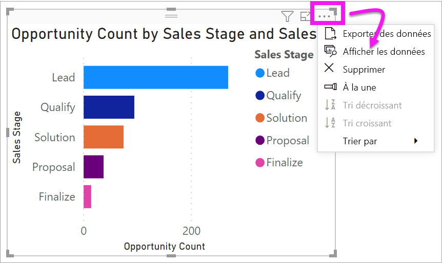
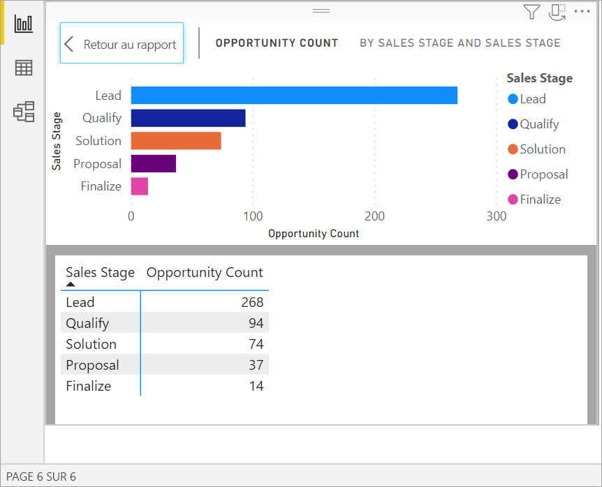
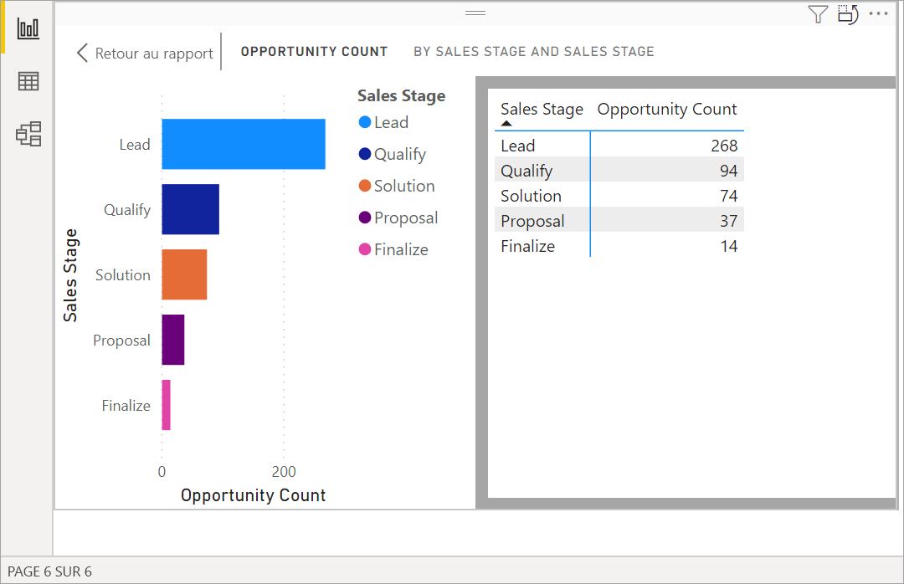
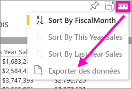
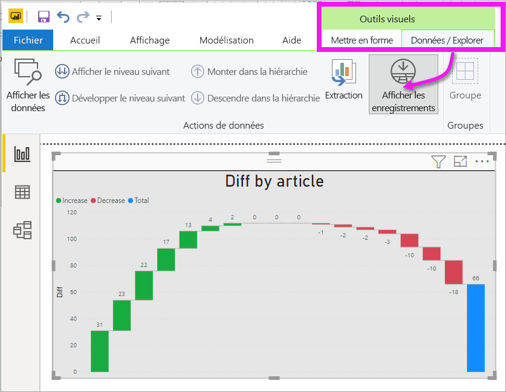
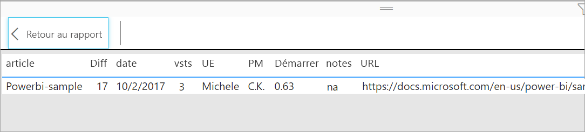

# Afficher les données utilisées pour créer la visualisation
## Afficher les données
Une visualisation Power BI est construite à l’aide des données de vos jeux de données. Si vous voulez voir les calculs sous-jacents, Power BI vous permet d’*afficher* les données utilisées pour créer le visuel. Lorsque vous sélectionnez **Afficher les données**, Power BI affiche les données sous (ou à côté de) la visualisation.

Vous pouvez également exporter les données utilisées pour créer la visualisation au format .xlsx ou .csv et les afficher dans Excel. Pour plus d’informations, consultez [Exporter des données à partir des visualisations Power BI](power-bi-visualization-export-data.md).

> [!NOTE]
> Les options *Afficher les données* et *Exporter les données* sont disponibles dans le service Power BI et dans Power BI Desktop. Toutefois, Power BI Desktop offre un niveau de détails supplémentaire. [*Afficher les enregistrements* affiche les lignes réelles du jeu de données](../desktop-see-data-see-records.md).
> 
> 

## Utiliser *Afficher les données* 
1. Dans Power BI Desktop, sélectionnez une visualisation pour l’activer.

2. Sélectionnez **Autres actions** (...) et choisissez **Afficher les données**. 
    

3. Par défaut, les données s’affichent sous l’élément visuel.
   
   

4. Pour modifier l’orientation, sélectionnez la disposition verticale  dans l’angle supérieur droit de la visualisation.
   
   
5. Pour exporter les données vers un fichier .csv, sélectionnez les points de suspension, puis choisissez **Exporter des données**.
   
    
   
    Pour plus d’informations sur l’exportation des données vers Excel, voir [Exporter les données de visualisations Power BI](power-bi-visualization-export-data.md).
6. Pour masquer les données, désélectionnez **Explorer** > **Afficher les données**.

## Utiliser Afficher les enregistrements
Vous pouvez également vous concentrer sur un enregistrement de données et explorer les données qui se trouvent derrière. 

1. Pour utiliser **Afficher les enregistrements**, sélectionnez une visualisation pour l’activer. 

2. Dans le ruban Desktop, sélectionnez l’onglet **Outils pour les visuels** > **Données/Explorer** > **Afficher les enregistrements**. 

    

3. Sélectionnez un point de données ou une ligne dans la visualisation. Dans cet exemple, nous avons sélectionné la quatrième colonne à partir de la gauche. Power BI montre l’enregistrement du jeu de données correspondant à ce point de données.

    

4. Sélectionnez **Retour au rapport** pour revenir au canevas de rapport Desktop. 

## Considérations et résolution des problèmes

- Si le bouton **Afficher les enregistrements** du ruban est désactivé et grisé, cela signifie que la visualisation sélectionnée ne prend pas en charge l’affichage des enregistrements.
- Vous ne pouvez pas modifier les données dans la vue Afficher les enregistrements et les enregistrer dans le rapport.
- Vous ne pouvez pas utiliser l’option Afficher les enregistrements si votre visuel utilise une mesure calculée.
- Vous ne pouvez pas utiliser l’option Afficher les enregistrements quand vous êtes connecté à un modèle multidimensionnel (MD) actif.  

## Étapes suivantes
[Exporter des données à partir des visualisations Power BI](power-bi-visualization-export-data.md)    

D’autres questions ? [Posez vos questions à la communauté Power BI](https://community.powerbi.com/)

