# Trucs et astuces pour la mise en forme des couleurs dans Power BI
Power BI vous propose de nombreuses façons de personnaliser vos tableaux de bord et vos rapports. Cet article fournit des astuces pour rendre vos visualisations Power BI plus attrayantes, plus intéressantes et mieux adaptées à vos besoins.

Ces astuces sont répertoriées ci-dessous. Vous en avez une autre à proposer ? Excellent ! Envoyez-la nous et nous verrons si nous pouvons l’ajouter à notre liste.

* Modifier la couleur d’un seul point de données
* Baser les couleurs du graphique sur une valeur numérique
* Baser la couleur des points de données sur une valeur de champ
* Personnaliser les couleurs de l’échelle de couleurs
* Utiliser des échelles de couleurs divergentes
* Comment annuler dans Power BI

Pour apporter des modifications, vous devez être en mode Edition : sélectionnez votre **Rapport** depuis le volet **Mon espace de travail** , puis sélectionnez **Modifier le rapport** dans la zone de menu supérieure, comme illustré dans l’image suivante. Cet exemple utilise l’**exemple Human Resources** (Ressources humaines).

Quand le volet **Visualisations** s’affiche à droite du canevas de **rapport** , vous pouvez commencer la personnalisation.

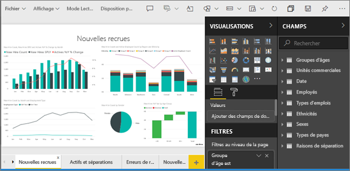

## Modifier la couleur d’un seul point de données
Parfois, il peut être nécessaire de mettre en évidence un point de données particulier. Il peut s’agir de chiffres de ventes pour le lancement d’un nouveau produit ou de l’amélioration de la qualité après le lancement d’un nouveau programme. Avec Power BI, et pour la plupart des types de visuels, vous pouvez mettre en surbrillance un point de données particulier en modifiant sa couleur.

La visualisation suivante présente les marges de ventes par employé avec les couleurs par défaut. 

La zone correspondant à Annelie est difficile à voir, nous allons donc utiliser une autre couleur pour la faire ressortir davantage. Voici les étapes à suivre :

Développez la section **Couleurs des données** . Voici ce qui s’affiche :

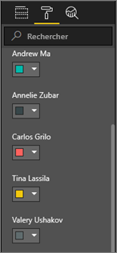

Dans cet exemple, nous allons sélectionner une couleur foncée mais vive qui ne ressemble pas à la couleur utilisée pour Valery. Sélectionnez la flèche vers le bas dans la zone de couleur d’Annelie, sélectionnez **Couleur personnalisée** et choisissez un bleu vif.

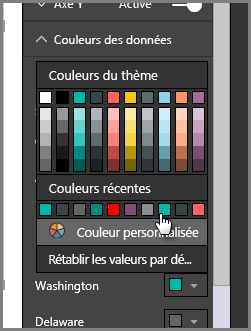

Une fois sélectionnée, la zone d’Annelie est beaucoup plus facile à distinguer de celle des autres employés. 

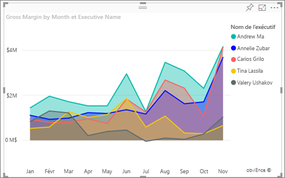

Même si vous modifiez les types de visualisations, puis revenez, Power BI se souvient de votre sélection et conserve la couleur verte pour **Washington** .

Vous pouvez également modifier la couleur d’un point de données pour plusieurs éléments de données. Dans l’image suivante, **Arizona** est associé à la couleur rouge, et **Washington** est toujours vert.

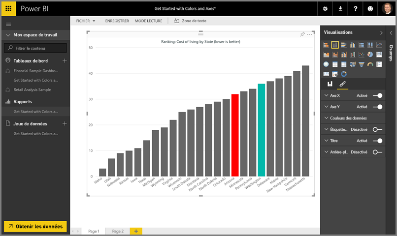

Vous pouvez réaliser toutes sortes de choses avec les couleurs. Dans la section suivante, nous parlerons des dégradés.

## Baser les couleurs du graphique sur une valeur numérique
Il est souvent utile de définir les couleurs d’un graphique de façon dynamique, en fonction de la valeur numérique d’un champ. Cela vous permet, par exemple, d’afficher une valeur différente pour la taille d’une barre, ou d’afficher deux valeurs sur un même graphique. Vous pouvez également utiliser cette méthode pour mettre en évidence des points de données supérieurs (ou inférieurs) à une certaine valeur (par exemple, en mettant en surbrillance les régions à faible rentabilité).

Les sections suivantes présentent différentes manières de baser les couleurs sur une valeur numérique.

## Baser la couleur des points de données sur une valeur
Pour modifier la couleur en fonction d’une valeur, faites glisser le champ sur lequel vous voulez baser les couleurs dans la zone **Saturation de la couleur** du volet **Champ** . Dans l’image suivante, **Profit before tax (Bénéfices avant impôts)** a été déplacé dans la zone **Saturation de la couleur**. Comme vous pouvez le voir, bien que **Velo** possède une valeur supérieure pour **Gross Sales (Ventes brutes)** (sa colonne est plus haute), **Amarilla** possède une valeur plus élevée pour **Profit before tax (Bénéfices avant impôts)** (la couleur de sa colonne est plus foncée).

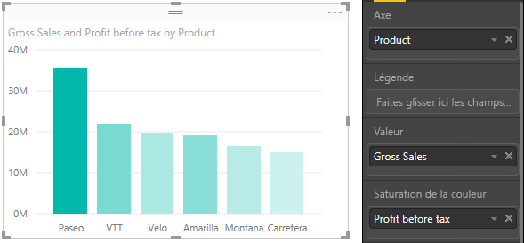

## Personnaliser les couleurs de l’échelle de couleurs
Vous pouvez personnaliser les couleurs de l’échelle de couleurs. Développez **Couleurs des données** pour afficher le dégradé de couleurs utilisé pour visualiser vos données. Par défaut, la valeur la moins élevée de vos données est mappée sur la couleur la moins saturée (la plus claire) et la valeur la plus élevée est mappée sur la couleur la plus saturée (la plus foncée).

La plage de couleurs est indiquée dans la barre de dégradé qui affiche le spectre de la valeur **Minimum** à la valeur **Maximum**. La valeur **Minimum** se trouve à gauche et la valeur **Maximum** se trouve à droite.

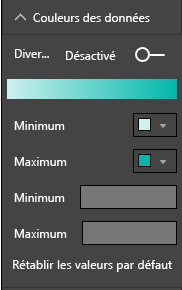

Pour modifier l’échelle de manière à utiliser une autre plage de couleurs, sélectionnez la liste déroulante en regard de **Minimum** ou **Maximum**, puis sélectionnez une couleur. L’illustration suivante montre l’attribution de la couleur noir à la valeur **Maximum** et la barre de dégradé montrant le nouveau spectre des couleurs entre les valeurs **Minimum** et **Maximum**.

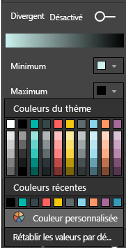

Vous pouvez également modifier la façon dont les valeurs sont mappées aux couleurs. Dans l’image suivante, les couleurs des valeurs **Minimum** et **Maximum** sont définies respectivement sur orange et vert.

Dans cette première image, notez comment les barres du graphique reflètent le dégradé. La valeur la plus élevée est verte, la plus basse est orange, et chacune des barres situées entre ces deux extrêmes possède une nuance du spectre allant du vert à l’orange.

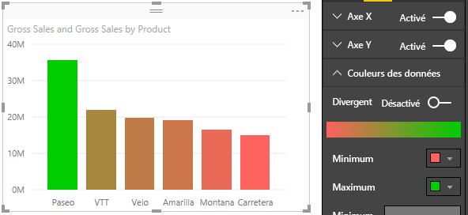

Voyons maintenant ce qui se passe quand nous définissons des valeurs numériques dans les zones des valeurs **Minimum** et **Maximum** situées sous les sélecteurs de couleurs **Minimum** et **Maximum** (illustrés dans l’image suivante). Nous allons définir **Minimum** sur 20 000 000 et **Maximum** sur 20 000 001.

Quand nous définissons ces valeurs, le dégradé n’est plus appliqué aux valeurs du graphique qui sont inférieures à la valeur **Minimum** ou supérieures à la valeur **Maximum**. Toute barre ayant une valeur supérieure à la valeur **Maximum** est de couleur verte et toute barre dont la valeur est inférieure à la valeur **Minimum** est de couleur rouge.

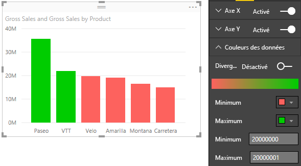

## Utiliser des échelles de couleurs divergentes
Parfois, vos données peuvent avoir une échelle naturellement divergente. Par exemple, une plage de températures dispose d’un centre naturel qui correspond au point de congélation et un score de rentabilité possède un milieu naturel (zéro).

Pour utiliser des échelles de couleurs divergentes, faites glisser le curseur **Divergent** vers **Activé**. Quand **Divergent** est activé, un autre sélecteur de couleurs et une autre zone de valeur (tous deux appelés **Centre**), s’affichent, comme indiqué dans l’image suivante.

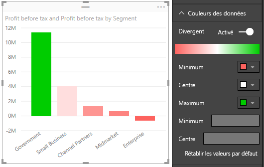

Quand le curseur **Divergent** est activé, vous pouvez définir séparément les couleurs des valeurs **Minimum**, **Maximum** et **Centre**. Dans l’image suivante, **Centre** est défini sur 1. Par conséquent, les barres dont la valeur est supérieure à 1 seront d’une nuance de vert et les barres dont la valeur est inférieure à 1 seront d’une nuance de rouge.

## Comment annuler dans Power BI
Comme de nombreux autres services et logiciels Microsoft, Power BI permet d’annuler facilement la dernière commande. Par exemple, supposons que vous ayez modifié la couleur d’un point de données ou d’une série de points de données, et que vous n’aimiez pas la couleur une fois que vous la voyez dans la visualisation. Vous voulez rétablir la couleur précédente, mais vous ne vous souvenez pas exactement de quelle couleur il s’agissait.

Pour **Annuler** votre dernière action ou les quelques actions précédentes, procédez comme suit :

- Tapez CTRL + Z

## Commentaires
Vous avez une astuce que vous aimeriez partager ? Envoyez-la nous et nous verrons si nous pouvons l’inclure dans notre rubrique.

>[!NOTE]
>Les personnalisations des couleurs, des axes et autres qui sont disponibles quand l’icône **Format** est sélectionnée sont également disponibles dans Power BI Desktop.

## Étapes suivantes
[Prise en main de la mise en forme des couleurs et des propriétés d’axe](service-getting-started-with-color-formatting-and-axis-properties.md)

