# Distribuer du contenu Power BI à des utilisateurs invités externes à l’aide d’Azure Active Directory B2B

**Résumé :** Il s’agit d’un livre blanc technique qui explique comment distribuer du contenu à des utilisateurs extérieurs à l’organisation à l’aide de l’intégration de Azure Active Directory interentreprises (Azure AD B2B).

**Enregistreurs :** Lukasz Pawlowski, Kasper de Jonge

**Réviseurs techniques :** Adam Wilson, Sheng Liu, Qian Liang, Sergei Gundorov, Jacob Grimm, Adam Saxton, Maya Shenhav, Nimrod Shalit, Elisabeth Olson

> [!NOTE]
> Vous pouvez enregistrer ou imprimer ce livre blanc en sélectionnant **Imprimer** dans votre navigateur, puis **Enregistrer au format PDF**.

## Introduction

Power BI offre aux organisations 360 une vue d’ensemble de l’entreprise et permet à tous les membres de ces organisations de prendre des décisions intelligentes en utilisant des données. La plupart de ces organisations ont des relations solides et fiables avec des partenaires, des clients et des fournisseurs externes. Ces organisations doivent fournir un accès sécurisé à Power BI des tableaux de bord et des rapports aux utilisateurs de ces partenaires externes.

Power BI s’intègre à [Azure Active Directory b2b Azure ad (Business-to-Business)](https://docs.microsoft.com/azure/active-directory/b2b/what-is-b2b) pour permettre une distribution sécurisée de contenu Power bi aux utilisateurs invités en dehors de l’organisation, tout en conservant le contrôle et en contrôlant l’accès aux données internes.

Ce livre blanc couvre tous les détails dont vous avez besoin pour comprendre l’intégration de Power BI à Azure Active Directory B2B. Nous abordons le cas d’usage le plus courant, l’installation, la gestion des licences et la sécurité au niveau des lignes.

> [!NOTE]
> Tout au long de ce livre blanc, nous faisons référence à Azure Active Directory en tant que Azure AD et Azure Active Directory entreprise en tant que Azure AD B2B.

## Scénario

Contoso est un constructeur automobile et travaille avec de nombreux fournisseurs divers qui lui fournissent tous les composants, documents et services nécessaires pour exécuter ses opérations de fabrication. Contoso souhaite simplifier sa logistique de chaîne logistique et envisage d’utiliser Power BI pour surveiller les principales mesures de performance de sa chaîne logistique. Contoso souhaite partager des analyses avec les partenaires de la chaîne logistique externe de manière sécurisée et gérable.

Contoso peut activer les expériences suivantes pour les utilisateurs externes qui utilisent Power BI et Azure AD B2B.

### Partage ad hoc par élément

Contoso travaille avec un fournisseur qui crée des radiateurs pour les voitures de contoso. Souvent, ils doivent optimiser la fiabilité des radiateurs à l’aide des données de toutes les voitures de contoso. Un analyste de Contoso utilise Power BI pour partager un rapport de fiabilité du radiateur avec un ingénieur du fournisseur. L’ingénieur reçoit un message électronique contenant un lien pour afficher le rapport.

Comme décrit ci-dessus, ce partage ad hoc est effectué par les utilisateurs professionnels en fonction des besoins. Le lien envoyé par Power BI à l’utilisateur externe est un lien Azure AD invitation B2B. Lorsque l’utilisateur externe ouvre le lien, il est invité à rejoindre l’organisation Azure AD de contoso en tant qu’utilisateur invité. Une fois l’invitation acceptée, le lien ouvre le rapport ou le tableau de bord spécifique. Le Azure Active Directory administrateur délègue l’autorisation d’inviter des utilisateurs externes à l’organisation et choisit ce que ces utilisateurs peuvent faire une fois qu’ils ont accepté l’invitation, comme décrit dans la section gouvernance de ce document. L’analyste contoso peut inviter l’utilisateur invité uniquement parce que le Azure AD administrateur a autorisé cette action et que le Power BI administrateur permettait aux utilisateurs d’inviter des invités à afficher du contenu dans les paramètres du locataire de Power BI.

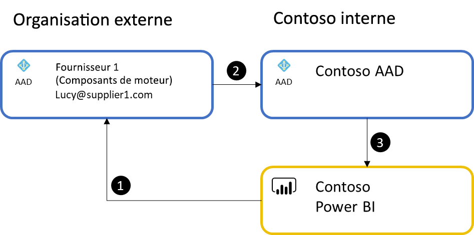

1. Le processus démarre avec un utilisateur interne Contoso qui partage un tableau de bord ou un rapport avec un utilisateur externe. Si l’utilisateur externe n’est pas déjà un invité dans le Azure AD de contoso, il est invité. Un courrier électronique est envoyé à son adresse e-mail qui comprend une invitation à la Azure AD de contoso
2. Le destinataire accepte l’invitation à la Azure AD de contoso et est ajouté en tant qu’utilisateur invité dans le Azure AD de contoso.
3. Le destinataire est ensuite redirigé vers le tableau de bord, le rapport ou l’application Power BI, qui sont en lecture seule pour l’utilisateur.

Le processus est considéré comme ad hoc, car les utilisateurs professionnels de contoso effectuent l’action d’invitation en fonction des besoins de leur entreprise. Chaque élément partagé est un lien unique auquel l’utilisateur externe peut accéder pour afficher le contenu.

Une fois que l’utilisateur externe a été invité à accéder aux ressources contoso, un compte Shadow peut être créé pour eux dans contoso Azure AD et il n’a pas besoin d’être invité à nouveau.  La première fois qu’ils essaient d’accéder à une ressource contoso comme un Power BI tableau de bord, ils passent par un processus de consentement qui échange l’invitation.  S’ils ne terminent pas le consentement, ils ne peuvent pas accéder au contenu de contoso.  S’ils ont des difficultés à échanger leur invitation via le lien d’origine fourni, un administrateur Azure AD peut renvoyer un lien d’invitation spécifique pour qu’il puisse l’échanger.

### Partage planifié par élément

Contoso travaille avec un sous-traitant pour effectuer une analyse de la fiabilité des radiateurs. Le sous-traitant a une équipe de 10 personnes qui doivent accéder aux données dans l’environnement de Power BI de contoso. L’administrateur Azure AD contoso est chargé d’inviter tous les utilisateurs et de gérer les ajouts/modifications en tant que personnel au changement de sous-traitance. L’administrateur Azure AD crée un groupe de sécurité pour tous les employés du sous-traitance. À l’aide du groupe de sécurité, les employés de contoso peuvent facilement gérer l’accès aux rapports et s’assurer que tous les membres du personnel de sous-traitance ont accès à tous les rapports, tableaux de bord et applications de Power BI requis. Le Azure AD administrateur peut également éviter d’être impliqué dans le processus d’invitation en choisissant de déléguer les droits d’invitation à un employé approuvé chez Contoso ou au sous-traitant pour garantir la gestion du personnel en temps utile.

Certaines organisations ont besoin de davantage de contrôle sur l’ajout d’utilisateurs externes, qui invitent de nombreux utilisateurs dans une organisation externe ou de nombreuses organisations externes. Dans ce cas, le partage planifié peut être utilisé pour gérer l’échelle du partage, pour appliquer des stratégies organisationnelles et même pour déléguer des droits à des personnes de confiance pour inviter et gérer des utilisateurs externes. Azure AD B2B prend en charge l’envoi des invitations planifiées directement [à partir de la portail Azure par un administrateur informatique](https://docs.microsoft.com/azure/active-directory/b2b/add-users-administrator)ou via [PowerShell à l’aide de l’API du gestionnaire d’invitations](https://docs.microsoft.com/azure/active-directory/b2b/customize-invitation-api) dans laquelle un ensemble d’utilisateurs peut être invité en une seule action. À l’aide de l’approche des invitations planifiées, l’organisation peut contrôler qui peut inviter des utilisateurs et implémenter des processus d’approbation. Les fonctionnalités avancées de Azure AD comme les groupes dynamiques peuvent faciliter la gestion automatique de l’appartenance aux groupes de sécurité.

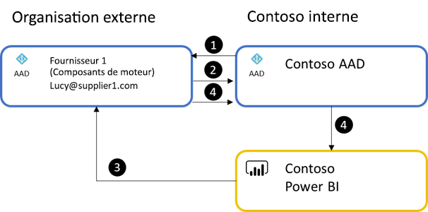

1. Le processus étoiles à un administrateur informatique invite l’utilisateur invité manuellement ou via l’API fournie par Azure Active Directory
2. L’utilisateur accepte l’invitation à l’organisation.
3. Une fois que l’utilisateur a accepté l’invitation, un utilisateur Power BI peut partager un rapport ou un tableau de bord avec l’utilisateur externe, ou un groupe de sécurité dans lequel il se trouve. Tout comme avec le partage normal dans Power BI l’utilisateur externe reçoit un message électronique contenant le lien vers l’élément.
4. Lorsque l’utilisateur externe accède au lien, son authentification dans son répertoire est transmise à la Azure AD de contoso et utilisée pour accéder au contenu Power BI.

### Partage ad hoc ou planifié d’applications Power BI

Contoso possède un ensemble de rapports et de tableaux de bord qu’il doit partager avec un ou plusieurs fournisseurs. Pour garantir que tous les utilisateurs externes requis ont accès à ce contenu, ils sont empaquetés en tant qu’application Power BI. Les utilisateurs externes sont ajoutés directement à la liste d’accès à l’application ou par le biais de groupes de sécurité. Une personne de contoso envoie ensuite l’URL de l’application à tous les utilisateurs externes, par exemple dans un message électronique. Lorsque les utilisateurs externes ouvrent le lien, ils voient tout le contenu dans une expérience unique et facile à parcourir.

L’utilisation d’une application Power BI permet à contoso de créer facilement un portail BI pour ses fournisseurs. Une liste d’accès unique contrôle l’accès à tout le contenu requis en réduisant le temps perdu et en définissant les autorisations au niveau de l’élément. Azure AD B2B gère l’accès à la sécurité à l’aide de l’identité native du fournisseur, de sorte que les utilisateurs n’ont pas besoin d’informations d’identification supplémentaires. Si vous utilisez des invitations planifiées avec des groupes de sécurité, la gestion de l’accès à l’application à mesure que le personnel pivote dans ou hors du projet est simplifiée. Appartenance à des groupes de sécurité manuellement ou à l’aide de [groupes dynamiques](https://docs.microsoft.com/azure/active-directory/b2b/use-dynamic-groups), afin que tous les utilisateurs externes d’un fournisseur soient automatiquement ajoutés au groupe de sécurité approprié.

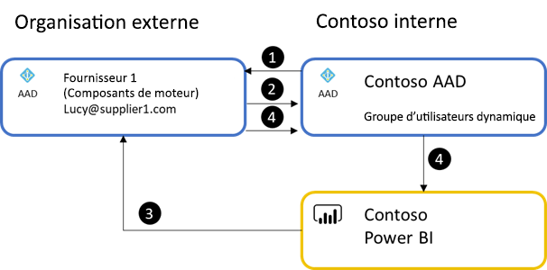

1. Le processus démarre par l’utilisateur qui est invité à l’organisation Azure AD de contoso via le Portail Azure ou PowerShell
2. L’utilisateur peut être ajouté à un groupe d’utilisateurs dans Azure AD. Un groupe d’utilisateurs statique ou dynamique peut être utilisé, mais les groupes dynamiques permettent de réduire le travail manuel.
3. Les utilisateurs externes disposent de l’accès à l’application Power BI via le groupe d’utilisateurs. L’URL de l’application doit être envoyée directement à l’utilisateur externe ou placée sur un site auquel elle a accès. Power BI fait de son mieux pour envoyer un e-mail avec le lien de l’application à des utilisateurs externes, mais lorsque vous utilisez des groupes d’utilisateurs dont l’appartenance peut changer, Power BI n’est pas en mesure d’envoyer à tous les utilisateurs externes gérés par le biais de groupes d’utilisateurs.
4. Lorsque l’utilisateur externe accède à l’URL de l’application Power BI, il est authentifié par le Azure AD de contoso, l’application est installée pour l’utilisateur et l’utilisateur peut voir tous les rapports et tableaux de bord contenus dans l’application.

Les applications ont également une fonctionnalité unique qui permet aux auteurs d’applications d’installer l’application automatiquement pour l’utilisateur, afin qu’elle soit disponible lorsque l’utilisateur se connecte. Cette fonctionnalité s’installe automatiquement uniquement pour les utilisateurs externes qui font déjà partie de l’organisation de contoso au moment où l’application est publiée ou mise à jour. Par conséquent, il est préférable d’utiliser l’approche des invitations planifiées et dépend de l’application qui est publiée ou mise à jour une fois que les utilisateurs ont été ajoutés à la Azure AD de contoso. Les utilisateurs externes peuvent toujours installer l’application à l’aide du lien de l’application.

### Commenter et s’abonner à du contenu au sein d’organisations

Contoso continue de fonctionner avec ses sous-traitants ou ses fournisseurs, les ingénieurs externes doivent travailler en étroite collaboration avec les analystes de contoso. Power BI fournit plusieurs fonctionnalités de collaboration qui permettent aux utilisateurs de communiquer sur le contenu qu’ils peuvent consommer. Les commentaires du tableau de bord (et bientôt les commentaires des rapports) permettent aux utilisateurs de discuter des points de données qu’ils voient et de communiquer avec les auteurs de rapports pour poser des questions.

Actuellement, les utilisateurs invités externes peuvent participer aux commentaires en laissant des commentaires et en lisant les réponses. Toutefois, contrairement aux utilisateurs internes, les utilisateurs invités ne peuvent pas être @mentioned et ne reçoivent pas de notifications indiquant qu’ils ont reçu un commentaire. Les utilisateurs invités ne peuvent pas utiliser la fonctionnalité d’abonnements dans Power BI au moment de l’écriture. Dans une version à venir, ces restrictions seront levées et l’utilisateur invité recevra un e-mail lorsqu’un commentaire l' @mentions, ou lorsqu’un abonnement est remis à son adresse e-mail contenant un lien vers le contenu dans Power BI.

### Accéder au contenu dans les applications mobiles Power BI

Dans une prochaine version, lorsque les utilisateurs de contoso partagent des rapports ou des tableaux de bord avec leurs équivalents invités externes, Power BI envoie un e-mail de notification à l’invité. Lorsque l’utilisateur invité ouvre le lien vers le rapport ou le tableau de bord sur son appareil mobile, le contenu s’ouvre dans les applications Power BI mobiles natives sur son appareil, s’il est installé. L’utilisateur invité sera alors en mesure de naviguer entre le contenu partagé avec lui dans le locataire externe, puis de revenir à son propre contenu à partir de son locataire d’hébergement.

> [!NOTE]
> L’utilisateur invité ne peut pas ouvrir le Power BI application mobile et accéder immédiatement au locataire externe, il doit commencer par un lien vers un élément dans le locataire externe. Les solutions de contournement courantes sont décrites dans la section [distribution de liens vers du contenu de la Power bi de l’organisation parente](#distributing-links-to-content-in-the-parent-organizations-power-bi) , plus loin dans ce document.

### Édition et gestion inter-organisations du contenu Power BI

Contoso et ses fournisseurs et sous-traitants fonctionnent de plus en plus étroitement ensemble. Souvent, un analyste du sous-traitant a besoin d’ajouter des mesures ou des visualisations de données supplémentaires à un rapport partagé avec eux. Les données doivent résider dans le locataire Power BI de contoso, mais les utilisateurs externes doivent pouvoir les modifier, créer du contenu et même les distribuer aux personnes appropriées.

Power BI fournit une option qui permet **aux utilisateurs invités externes de modifier et de gérer le contenu** de l’organisation. Par défaut, les utilisateurs externes ont une expérience axée sur la consommation en lecture seule. Toutefois, ce nouveau paramètre permet au Power BI administrateur de choisir les utilisateurs externes qui peuvent modifier et gérer le contenu au sein de leur propre organisation. Une fois autorisé, l’utilisateur externe peut modifier des rapports, des tableaux de bord, publier ou mettre à jour des applications, travailler dans des espaces de travail et se connecter à des données qu’il est autorisé à utiliser.

Ce scénario est décrit en détail dans la section activation des utilisateurs externes pour modifier et gérer le contenu dans Power BI plus loin dans ce document.

## Relations organisationnelles avec Power BI et Azure AD B2B

Lorsque tous les utilisateurs de Power BI sont internes à l’organisation, il n’est pas nécessaire d’utiliser Azure AD B2B. Toutefois, une fois que deux organisations ou plus veulent collaborer sur des données et des informations, la prise en charge de Power BI pour Azure AD B2B facilite et réduit les coûts.

Vous trouverez ci-dessous des structures organisationnelles particulièrement adaptées à la collaboration inter-organisations de type B2B Azure AD dans Power BI. Azure AD B2B fonctionne bien dans la plupart des cas, mais dans certains cas, les autres approches courantes couvertes à la fin de ce document méritent d’être envisagées.

### Cas 1 : collaboration directe entre les organisations

La relation entre contoso et son fournisseur de radiateur est un exemple de collaboration directe entre les organisations. Dans la mesure où il y a relativement peu d’utilisateurs chez contoso et son fournisseur qui a besoin d’accéder aux informations de fiabilité du radiateur, l’utilisation de Azure AD partage externe basé sur B2B est idéale. Il est facile à utiliser et simple à administrer. Il s’agit également d’un modèle courant dans les services de Conseil où un consultant peut avoir besoin de créer du contenu pour une organisation.

En règle générale, ce partage se produit initialement à l’aide du partage ad hoc par élément. Toutefois, à mesure que les équipes évoluent ou que les relations s’exposent, l’approche de partage planifié par élément devient la méthode préférée pour réduire les frais de gestion. En outre, le partage ad hoc ou planifié des applications Power BI, la mise en commentaire et l’abonnement au contenu au sein des organisations, l’accès au contenu dans les applications mobiles peuvent également être joués, ainsi que la modification et la gestion inter-organisations du contenu Power BI. Important, si les utilisateurs de l’entreprise ont Power BI Pro licences dans leurs organisations respectives, ils peuvent utiliser ces licences Pro dans les environnements Power BI des autres. Cela fournit une licence avantageuse, car l’organisation à l’invite peut ne pas avoir à payer une licence Power BI Pro pour les utilisateurs externes. Ce sujet est abordé plus en détail dans la section relative aux licences plus loin dans ce document.

### Cas 2 : parent et ses filiales ou affiliés

Certaines structures de l’organisation sont plus complexes, notamment les filiales appartenant à une partie ou à l’intégralité, les sociétés affiliées ou les relations de fournisseurs de services gérés. Ces organisations ont une organisation parente telle qu’une société holding, mais les organisations sous-jacentes opèrent de façon semi-autonome, parfois sous des exigences régionales différentes. Cela permet à chaque organisation ayant son propre Azure AD environnement et de séparer Power BI locataires.

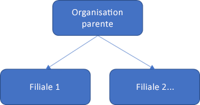

Dans cette structure, l’organisation parente doit généralement distribuer des Insights normalisés à ses filiales. En règle générale, ce partage se produit à l’aide du partage ad hoc ou planifié de l’approche des applications Power BI, comme illustré dans l’image suivante, car il permet la distribution de contenu de référence standardisé à un large public. Dans la pratique, une combinaison de tous les scénarios mentionnés précédemment dans ce document est utilisée.

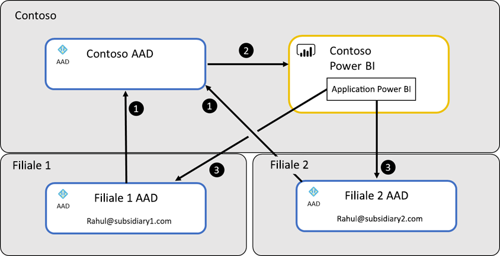

Cela suit le processus suivant :

1. Les utilisateurs de chaque filiale sont invités à la Azure AD de contoso
2. L’application Power BI est ensuite publiée pour permettre à ces utilisateurs d’accéder aux données requises.
3. Enfin, les utilisateurs ouvrent l’application via un lien qui leur a été attribué pour voir les rapports

Plusieurs défis importants sont confrontés aux organisations dans cette structure :

- Comment distribuer des liens vers du contenu dans le Power BI de l’organisation parente
- Comment autoriser les utilisateurs des filiales à accéder à la source de données hébergée par l’organisation parente

#### Distribution de liens vers du contenu dans le Power BI de l’organisation parente

Trois approches sont couramment utilisées pour distribuer des liens vers le contenu. Le premier et le plus basique consiste à envoyer le lien vers l’application aux utilisateurs requis ou à le placer dans un site SharePoint Online à partir duquel il peut être ouvert. Les utilisateurs peuvent ensuite marquer le lien dans leurs navigateurs pour un accès plus rapide aux données dont ils ont besoin.

La deuxième approche repose sur la modification et la gestion inter-organisations de la fonctionnalité de contenu Power BI. L’organisation parente autorise les utilisateurs des filiales à accéder à son Power BI et contrôle ce à quoi ils peuvent accéder via l’autorisation. Cela donne accès à Power BI origine où l’utilisateur de la filiale voit une liste complète de contenu partagé avec eux dans le locataire de l’organisation parente. L’URL de l’environnement d’Power BI des organisations parents est ensuite donnée aux utilisateurs des filiales.

La dernière approche utilise une application Power BI créée au sein du locataire Power BI pour chaque filiale. L’application Power BI comprend un tableau de bord avec des [vignettes configurées avec l’option de liaison externe](https://docs.microsoft.com/power-bi/service-dashboard-edit-tile#hyperlink). Quand l’utilisateur appuie sur la vignette, elle est dirigé vers le rapport, le tableau de bord ou l’application appropriés dans le Power BI de l’organisation parente. Cette approche présente l’avantage supplémentaire que l’application peut être installée automatiquement pour tous les utilisateurs de la filiale et qu’elle est disponible à chaque fois qu’elle se connecte à son propre Power BI environnement. L’un des avantages de cette approche est qu’elle fonctionne bien avec les applications mobiles Power BI qui peuvent ouvrir le lien en mode natif. Vous pouvez également combiner cela avec la deuxième approche pour faciliter le basculement entre les environnements Power BI.

#### Autoriser les utilisateurs des filiales à accéder aux sources de données hébergées par l’organisation parente

Souvent, les analystes d’une filiale doivent créer leurs propres analyses à l’aide des données fournies par l’organisation parente. Dans ce cas, les sources de données courantes du Cloud sont utilisées pour résoudre le problème.

La première approche s’appuie sur [Azure Analysis Services](https://docs.microsoft.com/azure/analysis-services/analysis-services-overview) pour créer un entrepôt de données d’entreprise qui répond aux besoins des analystes sur le parent et ses filiales, comme illustré dans l’image suivante. Contoso peut héberger les données et utiliser des fonctionnalités telles que la sécurité au niveau des lignes pour s’assurer que les utilisateurs de chaque filiale ne peuvent accéder qu’à leurs données. Les analystes de chaque organisation peuvent accéder à l’entrepôt de données via Power BI Desktop et publier des analyses résultantes sur leurs locataires Power BI respectifs.

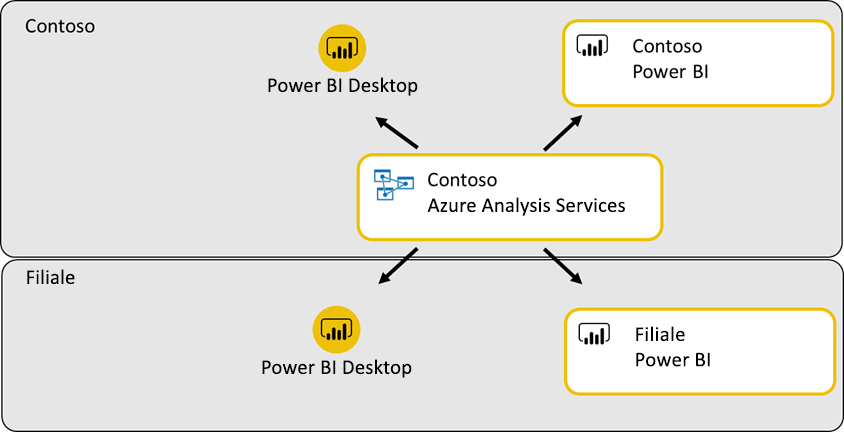

La deuxième approche s’appuie sur [Azure SQL Database](https://azure.microsoft.com/services/sql-database/) pour créer un entrepôt de données relationnelles afin de fournir l’accès aux données. Cela fonctionne de la même façon que l’approche Azure Analysis Services, bien que certaines fonctionnalités telles que la sécurité au niveau des lignes puissent être difficiles à déployer et à gérer dans les filiales.

Des approches plus sophistiquées sont également possibles, mais les plus courantes sont les plus courantes.

### Cas 3 : environnement partagé entre partenaires

Contoso peut entrer en partenariat avec un concurrent pour créer conjointement une voiture sur une ligne d’assemblage partagée, mais pour distribuer le véhicule sous des marques différentes ou dans des régions différentes. Cela nécessite une collaboration et une copropriété étendues des données, de l’intelligence et des analyses au sein des organisations. Cette structure est également courante dans le secteur des services de Conseil où une équipe de consultants peut effectuer des analyses basées sur des projets pour un client.

Dans la pratique, ces structures sont complexes, comme illustré dans l’image suivante, et nécessitent que le personnel gère. Pour être efficace, cette structure s’appuie sur la modification et la gestion inter-organisations de la fonctionnalité de contenu Power BI, car elle permet aux organisations de réutiliser Power BI Pro licences achetées pour leurs locataires Power BI respectifs.

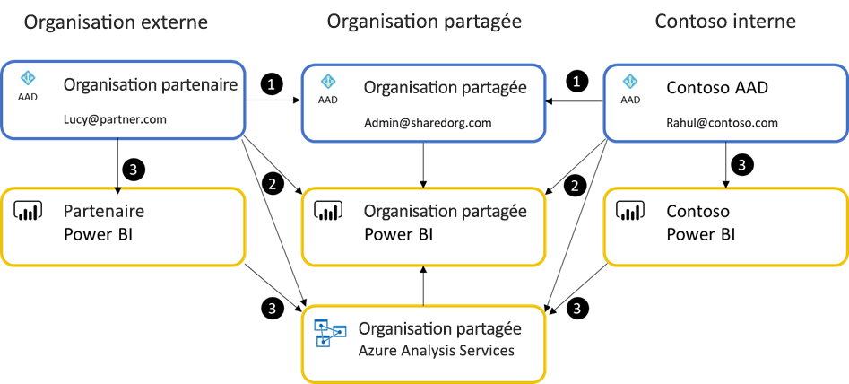

Pour établir un client Power BI partagé, un Azure Active Directory doit être créé et au moins un compte d’utilisateur Power BI Pro doit être acheté pour un utilisateur dans ce répertoire Active Directory. Cet utilisateur invite les utilisateurs requis à l’organisation partagée. Important, dans ce scénario, les utilisateurs de Contoso sont considérés comme des utilisateurs externes lorsqu’ils opèrent au sein de la Power BI de l’organisation partagée.

Le processus est le suivant :

1. L’organisation partagée est établie en tant que nouvelle Azure Active Directory et au moins un compte d’utilisateur est créé dans la nouvelle organisation. Cet utilisateur doit disposer d’une licence Power BI Pro qui lui est assignée.
2. Cet utilisateur établit ensuite un locataire Power BI et invite les utilisateurs requis de contoso et de l’organisation partenaire. L’utilisateur établit également toutes les ressources de données partagées comme Azure Analysis Services. Contoso et les utilisateurs du partenaire peuvent accéder aux Power BI de l’organisation partagée en tant qu’utilisateurs invités. Si vous êtes autorisé à modifier et à gérer du contenu dans Power BI les utilisateurs externes peuvent utiliser Power BI famille, utiliser des espaces de travail, télécharger ou modifier le contenu et partager des rapports. En règle générale, toutes les ressources partagées sont stockées et accessibles à partir de l’organisation partagée.
3. Selon la façon dont les parties conviennent de collaborer, il est possible pour chaque organisation de développer leurs propres données et analytiques propriétaires à l’aide de ressources d’entrepôt de données partagées. Ils peuvent distribuer ceux-ci à leurs utilisateurs internes respectifs à l’aide de leurs locataires Power BI internes.

### Cas 4 : distribution à des centaines ou des milliers de partenaires externes

Alors que contoso a créé un rapport de fiabilité de radiateur pour un fournisseur, contoso souhaite créer un ensemble de rapports standardisés pour des centaines de fournisseurs. Cela permet à contoso de s’assurer que tous les fournisseurs disposent de l’analyse dont ils ont besoin pour apporter des améliorations ou corriger les défauts de fabrication.

Lorsqu’une organisation a besoin de distribuer des données et des informations standardisées à de nombreux utilisateurs/organisations externes, ils peuvent utiliser le partage ad hoc ou planifié du scénario des applications Power BI pour créer un portail BI rapidement et sans coûts de développement étendus. Le processus de création d’un tel portail à l’aide d’une application Power BI est abordé dans l’étude de cas : création d’un portail BI à l’aide de Power BI + Azure AD B2B – instructions pas à pas plus loin dans ce document.

Une variante courante de ce cas de figure est lorsqu’une organisation tente de partager des Insights avec les consommateurs, en particulier lors de l’utilisation d’Azure B2C avec Power BI. Power BI ne prend pas en charge Azure B2C en mode natif. Si vous évaluez des options pour ce cas, envisagez d’utiliser une autre option 2 dans l’alternative courante approche de la section plus loin dans ce document.

## Étude de cas : création d’un portail décisionnel à l’aide de Power BI + Azure AD B2B – instructions pas à pas

L’intégration de Power BI à Azure AD B2B offre à contoso un moyen simple et sans soucis de fournir aux utilisateurs invités un accès sécurisé à son portail BI. Contoso peut configurer ceci en trois étapes :

1. Créer un portail BI dans Power BI

    La première tâche pour Contoso est de créer son portail BI dans Power BI. Le portail BI de contoso se compose d’un ensemble de tableaux de bord et de rapports spécialement conçus qui seront mis à la disposition de nombreux utilisateurs internes et invités. La méthode recommandée pour effectuer cette tâche dans Power BI consiste à créer une application Power BI. En savoir plus sur les [applications dans Power bi](https://powerbi.microsoft.com/blog/distribute-to-large-audiences-with-power-bi-apps/).

- L’équipe BI de contoso crée un espace de travail dans Power BI

    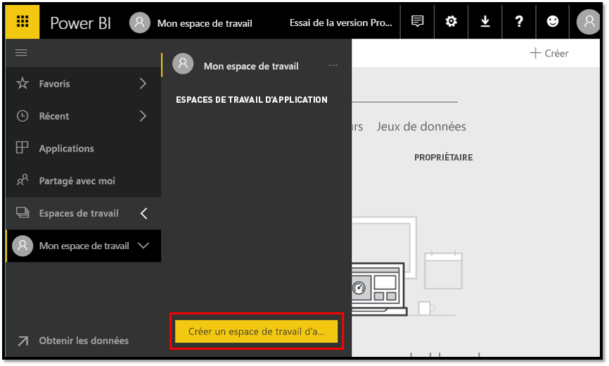
    

- D’autres auteurs sont ajoutés à l’espace de travail

    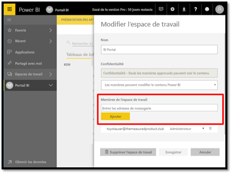

- Le contenu est créé dans l’espace de travail

    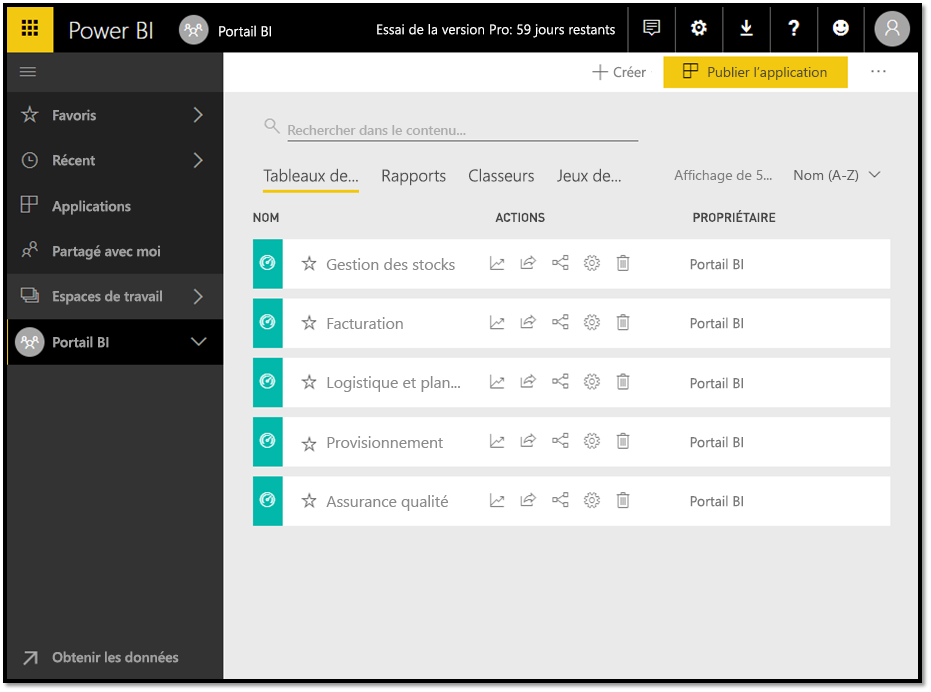

    Maintenant que le contenu est créé dans un espace de travail, contoso est prêt à inviter les utilisateurs invités de l’organisation partenaire à utiliser ce contenu.

2. Convier des utilisateurs invités

    Contoso peut inviter des utilisateurs invités sur son portail BI dans Power BI de deux manières :

    * Invitations planifiées
    * Invitations ad hoc

    **Invitations planifiées**

    Dans cette approche, contoso invite les utilisateurs invités à Azure AD à l’avance, puis distribue leur contenu Power BI. Contoso peut inviter des utilisateurs invités à partir de la Portail Azure ou à l’aide de PowerShell. Voici les étapes permettant d’inviter des utilisateurs invités à partir de la Portail Azure :

    - L’administrateur Azure AD de contoso accède à **Portail Azure > Azure Active Directory > utilisateurs et groupes > tous les utilisateurs > nouvel utilisateur invité**

    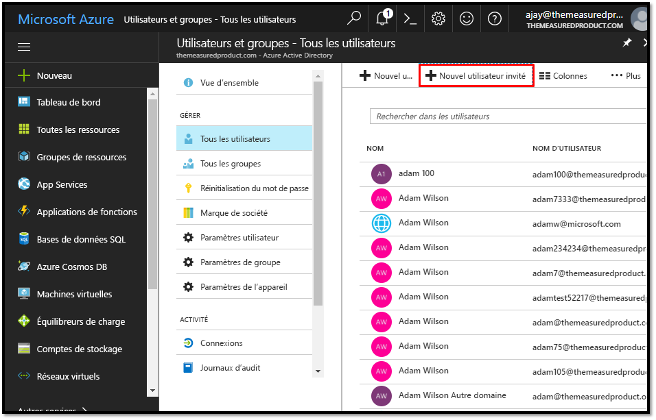

    - Ajouter un message d’invitation pour les utilisateurs invités et cliquer sur inviter

    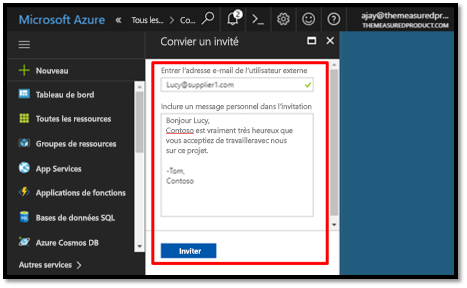

    > [!NOTE]
    > Pour inviter des utilisateurs invités à partir du Portail Azure, vous devez disposer d’un administrateur pour la Azure Active Directory de votre locataire.

    Si contoso souhaite inviter de nombreux utilisateurs invités, ils peuvent le faire à l’aide de PowerShell. L’administrateur Azure AD de contoso stocke les adresses de messagerie de tous les utilisateurs invités dans un fichier CSV. Voici [Azure Active Directory du code B2B collaboration et des exemples](https://docs.microsoft.com/azure/active-directory/b2b/code-samples) et des instructions PowerShell.

    Après l’invitation, les utilisateurs invités reçoivent un e-mail contenant le lien d’invitation.

    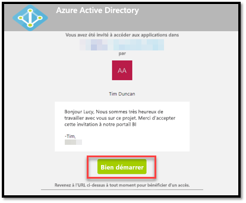

    Une fois que les utilisateurs invités cliquent sur le lien, ils peuvent accéder au contenu du locataire contoso Azure AD.

    > [!NOTE]
    > Il est possible de modifier la disposition de l’e-mail d’invitation à l’aide de la fonctionnalité de personnalisation de la Azure AD, comme décrit [ici](https://docs.microsoft.com/azure/active-directory/active-directory-b2b-invitation-email).

    **Invitations ad hoc**

    Que se passe-t-il si contoso ne connaît pas tous les utilisateurs invités qu’il souhaite inviter avant le temps ? Ou, que se passe-t-il si l’analyste de Contoso qui a créé le portail décisionnel souhaite distribuer du contenu aux utilisateurs invités eux-mêmes ? Nous prenons également en charge ce scénario dans Power BI avec des invitations ad hoc.

    L’analyste peut simplement ajouter les utilisateurs externes à la liste d’accès de l’application lors de sa publication. Les utilisateurs invités reçoivent une invitation et, une fois qu’ils l’acceptent, ils sont automatiquement redirigés vers le contenu Power BI.

    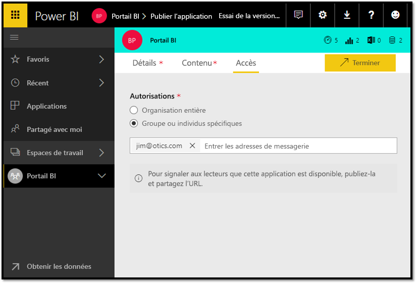

    > [!NOTE]
    > Les invitations ne sont nécessaires que la première fois qu’un utilisateur externe est invité à votre organisation.

3. Distribuer du contenu

    Maintenant que l’équipe BI de Contoso a créé le portail BI et invité les utilisateurs invités, ils peuvent distribuer leur portail à leurs utilisateurs finaux en donnant aux utilisateurs invités un accès à l’application et en la publiant. Power BI complète automatiquement les noms des utilisateurs invités qui ont été précédemment ajoutés au locataire contoso. Des invitations ad hoc à d’autres utilisateurs invités peuvent également être ajoutées à ce stade.

    > [!NOTE]
    > Si vous utilisez des groupes de sécurité pour gérer l’accès à l’application pour les utilisateurs externes, utilisez l’approche des invitations planifiées et partagez le lien de l’application directement avec chaque utilisateur externe qui doit y accéder. Dans le cas contraire, l’utilisateur externe risque de ne pas pouvoir installer ou afficher le contenu à partir de l’application. _

    Les utilisateurs invités reçoivent un message électronique contenant un lien vers l’application.

    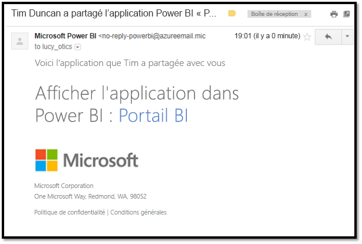

    Lorsque vous cliquez sur ce lien, les utilisateurs invités sont invités à s’authentifier avec l’identité de leur propre organisation.

    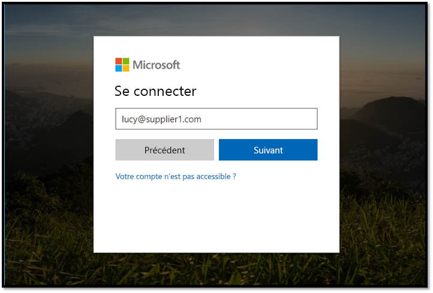

    Une fois qu’ils ont été authentifiés, ils sont redirigés vers l’application BI de contoso.

    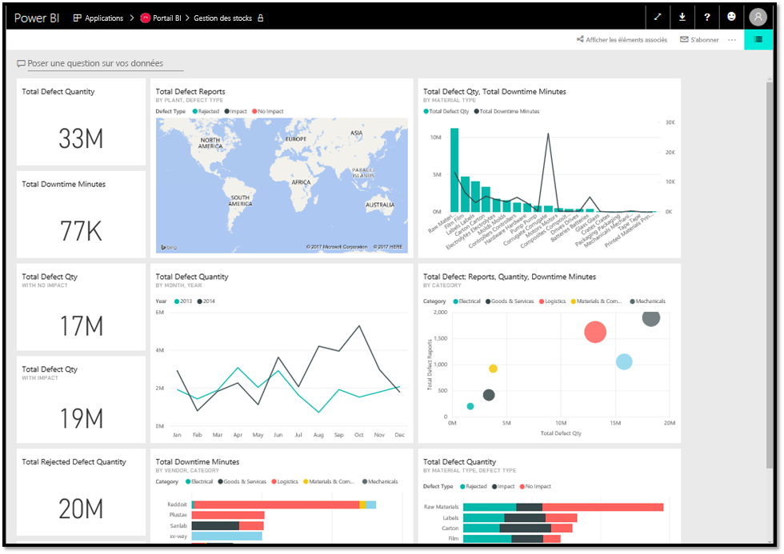

    Les utilisateurs invités peuvent ensuite accéder à l’application de contoso en cliquant sur le lien dans le message électronique ou en signet le lien. Contoso peut également faciliter l’utilisation des utilisateurs invités en ajoutant ce lien à n’importe quel portail extranet existant déjà utilisé par les utilisateurs invités.

4. Étapes suivantes

    À l’aide d’une application Power BI et Azure AD B2B, Contoso a pu créer rapidement un portail BI pour ses fournisseurs sans code. Cela simplifie considérablement la distribution d’analyses standardisées à tous les fournisseurs qui en ont besoin.

    Bien que l’exemple ait montré comment un rapport commun unique pouvait être distribué entre les fournisseurs, Power BI peut aller encore plus loin. Pour vous assurer que chaque partenaire voit uniquement les données qui s’y rapportent, Sécurité au niveau des lignes pouvez facilement l’ajouter au rapport et au modèle de données. La section sécurité des données pour les partenaires externes, plus loin dans ce document, décrit ce processus en détail.

    Souvent, les rapports et les tableaux de bord individuels doivent être incorporés dans un portail existant. Cela peut également être accompli en réutilisant un grand nombre des techniques présentées dans l’exemple. Toutefois, dans ces situations, il peut être plus facile d’incorporer des rapports ou des tableaux de bord directement à partir d’un espace de travail. Le processus d’invitation et d’attribution de l’autorisation de sécurité aux utilisateurs doivent rester les mêmes.

## En coulisses : Lucy de Supplier1 peut-il accéder au contenu Power BI du locataire de contoso ?

Maintenant que nous avons vu comment contoso peut distribuer en toute transparence du contenu Power BI à des utilisateurs invités dans des organisations partenaires, voyons comment cela fonctionne en coulisses.

Quand Contoso a invité [lucy@supplier1.com](mailto:lucy@supplier1.com) à son annuaire, Azure ad crée un lien entre [Lucy@supplier1.com](mailto:Lucy@supplier1.com) et le locataire contoso Azure ad. Ce lien permet Azure AD savoir que Lucy@supplier1.com peut accéder au contenu du locataire contoso.

Quand Lucy tente d’accéder à l’application Power BI de contoso, Azure AD vérifie que Lucy peut accéder au locataire contoso, puis fournit Power BI un jeton qui indique que Lucy est authentifié pour accéder au contenu dans le locataire contoso. Power BI utilise ce jeton pour autoriser et s’assurer que Lucy a accès à l’application Power BI de contoso.

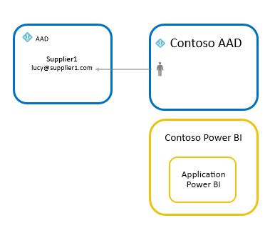

L’intégration de Power BI avec Azure AD B2B fonctionne avec toutes les adresses de messagerie professionnelles. Si l’utilisateur n’a pas d’identité Azure AD, il peut être invité à en créer un. L’illustration suivante montre le déroulement détaillé :

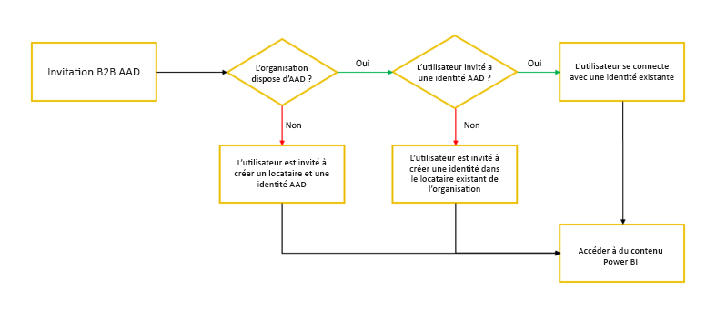

Il est important de reconnaître que le compte de Azure AD est utilisé ou créé dans le Azure AD du tiers externe, ce qui permet à Lucy d’utiliser leurs propres nom d’utilisateur et mot de passe et leurs informations d’identification cessent de fonctionner dans d’autres locataires quand Lucy quitte l’entreprise quand son organisation utilise également Azure AD.

## Licensing

Contoso peut choisir l’une des trois approches suivantes : les utilisateurs invités titulaires d’une licence de leurs fournisseurs et organisations partenaires ont accès au contenu Power BI.

> [!NOTE]
> _Le niveau gratuit Azure ad B2B’s est suffisant pour utiliser Power bi avec Azure ad B2B. Certaines fonctionnalités avancées Azure AD B2B comme les groupes dynamiques requièrent des licences supplémentaires. Pour plus d’informations, reportez-vous à la documentation Azure ad B2B :_ [ _https://docs.microsoft.com/azure/active-directory/b2b/licensing-guidance_ ](https://docs.microsoft.com/azure/active-directory/b2b/licensing-guidance)

### Approche 1 : Contoso utilise Power BI Premium

Avec cette approche, contoso achète Power BI Premium capacité et attribue son contenu de portail BI à cette capacité. Cela permet aux utilisateurs invités des organisations partenaires d’accéder à l’application Power BI de contoso sans licence Power BI.

Les utilisateurs externes sont également soumis aux expériences de consommation offertes uniquement par les utilisateurs « libres » dans Power BI lors de la consommation de contenu dans Power BI Premium.

Contoso peut également tirer parti d’autres fonctionnalités Power BI Premium pour ses applications, telles que des taux de rafraîchissement accrus, une capacité dédiée et des tailles de modèle volumineuses.

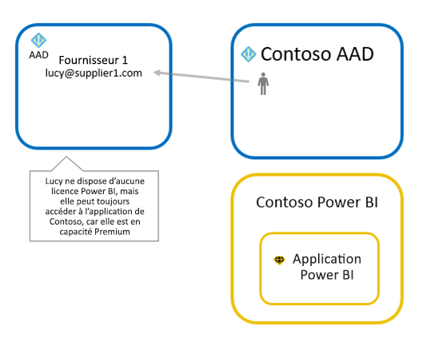

### Approche 2 : contoso affecte des licences Power BI Pro aux utilisateurs invités

Avec cette approche, contoso attribue des licences Pro aux utilisateurs invités des organisations partenaires. cette opération peut être effectuée à partir du centre d’administration Microsoft 365 de contoso. Cela permet aux utilisateurs invités des organisations partenaires d’accéder à l’application Power BI de contoso sans acheter de licence proprement dit. Cela peut être approprié pour le partage avec des utilisateurs externes dont l’organisation n’a pas encore adopté Power BI.

> [!NOTE]
> La licence Pro de contoso s’applique aux utilisateurs invités uniquement lorsqu’ils accèdent au contenu du locataire contoso. Les licences Pro permettent d’accéder à du contenu qui n’est pas dans une capacité Power BI Premium. Toutefois, les utilisateurs externes disposant d’une licence Pro sont limités par défaut à une expérience de consommation uniquement. Cela peut être modifié à l’aide de l’approche décrite dans la section _activation des utilisateurs externes pour modifier et gérer le contenu dans Power bi_ plus loin dans ce document.

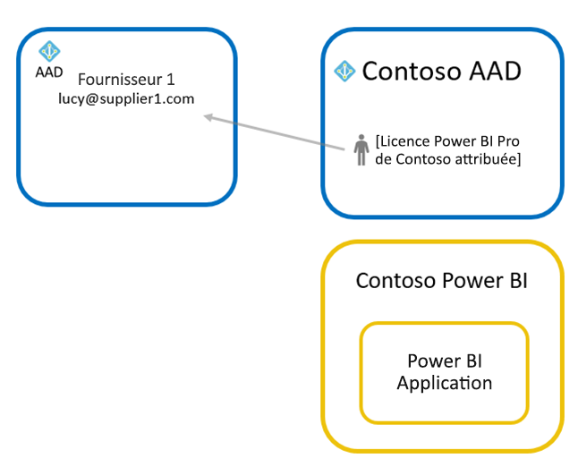

### Approche 3 : les utilisateurs invités apportent leur propre licence Power BI Pro

Avec cette approche, le fournisseur 1 affecte une licence Power BI Pro à Lucy. Ils peuvent ensuite accéder à l’application Power BI de contoso avec cette licence. Étant donné que Lucy peut utiliser sa licence Pro de sa propre organisation lors de l’accès à un environnement de Power BI externe, cette approche est parfois appelée « _apporter votre propre licence_ » (BYOL). Si les deux organisations utilisent Power BI, cela offre des licences avantageuses pour la solution d’analyse globale et minimise la surcharge liée à l’attribution de licences aux utilisateurs externes.

> [!NOTE]
> La licence Pro accordée à Lucy par Supplier 1 s’applique à tous les Power BI locataires où Lucy est un utilisateur invité. Les licences Pro permettent d’accéder à du contenu qui n’est pas dans une capacité Power BI Premium. Toutefois, les utilisateurs externes disposant d’une licence Pro sont limités par défaut à une expérience de consommation uniquement. Cela peut être modifié à l’aide de l’approche décrite dans la section _activation des utilisateurs externes pour modifier et gérer le contenu dans Power bi_ plus loin dans ce document.

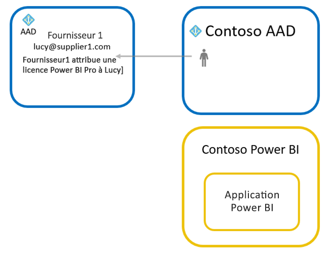

## Sécurité des données pour les partenaires externes

En général, lorsque vous travaillez avec plusieurs fournisseurs externes, contoso doit s’assurer que chaque fournisseur ne voit des données que sur ses propres produits. La sécurité basée sur l’utilisateur et la sécurité dynamique au niveau des lignes facilitent cette tâche avec Power BI.

### Sécurité basée sur l’utilisateur

L’une des fonctionnalités les plus puissantes de Power BI est Sécurité au niveau des lignes. Cette fonctionnalité permet à contoso de créer un rapport et un jeu de données uniques, tout en appliquant des règles de sécurité différentes pour chaque utilisateur. Pour une explication détaillée, consultez [sécurité au niveau des lignes (RLS)](https://powerbi.microsoft.com/documentation/powerbi-admin-rls/).

L’intégration de Power BI à Azure AD B2B permet à contoso d’attribuer des règles de Sécurité au niveau des lignes aux utilisateurs invités dès qu’ils sont invités au locataire contoso. Comme nous l’avons vu précédemment, contoso peut ajouter des utilisateurs invités par le biais d’invitations planifiées ou ad hoc. Si contoso souhaite appliquer la sécurité au niveau des lignes, il est fortement recommandé d’utiliser des invitations planifiées pour ajouter les utilisateurs invités à l’avance et de les assigner aux rôles de sécurité avant de partager le contenu. Si Contoso utilise à la place des invitations ad hoc, il peut y avoir un bref laps de temps pendant lequel les utilisateurs invités ne seront pas en mesure de voir les données.

> [!NOTE]
> Ce délai d’accès aux données protégées par la sécurité au niveau des lignes lors de l’utilisation d’invitations ad hoc peut entraîner la prise en charge des demandes à votre équipe informatique, car les utilisateurs voient les rapports/tableaux de bord vides ou cassés lors de l’ouverture d’un lien de partage dans l’e-mail qu’ils reçoivent. Par conséquent, il est fortement recommandé d’utiliser des invitations planifiées dans ce scénario. * *

Commençons par un exemple.

Comme mentionné précédemment, Contoso a des fournisseurs dans le monde entier et il souhaite s’assurer que les utilisateurs de leurs fournisseurs peuvent obtenir des informations à partir des données de leur territoire uniquement.  Toutefois, les utilisateurs de contoso peuvent accéder à toutes les données. Au lieu de créer plusieurs rapports différents, contoso crée un rapport unique et filtre les données en fonction de l’utilisateur qui l’affiche.

Pour vous assurer que contoso peut filtrer les données en fonction de la personne qui se connecte, deux rôles sont créés dans Power BI Desktop. Une pour filtrer toutes les données de l’SalesTerritory « Europe » et une autre pour « Amérique du Nord ».

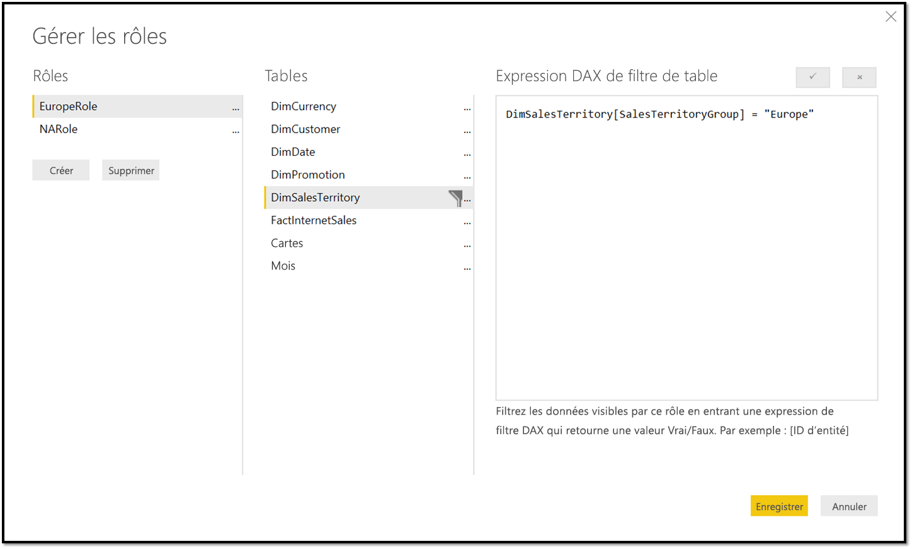

Chaque fois que des rôles sont définis dans le rapport, un utilisateur doit être affecté à un rôle spécifique pour lui permettre d’accéder à toutes les données. L’affectation des rôles se produit à l’intérieur du service Power BI ( **jeux de données > la sécurité** )

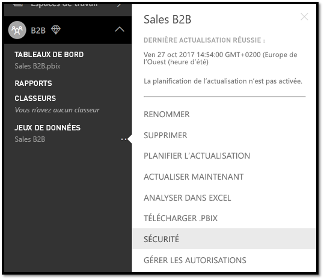

Cela ouvre une page dans laquelle l’équipe BI de contoso peut voir les deux rôles qu’elle a créés.  Désormais, l’équipe BI de contoso peut affecter des utilisateurs aux rôles.

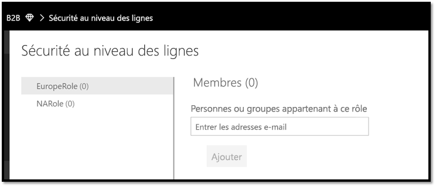

Dans l’exemple Contoso ajoute un utilisateur dans une organisation partenaire avec l’adresse de messagerie «[adam@themeasuredproduct.com](mailto:adam@themeasuredproduct.com)» au rôle Europe :

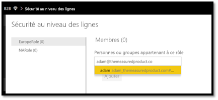

Lorsque cette valeur est résolue par Azure AD, contoso peut voir le nom s’afficher dans la fenêtre prête à être ajoutée :

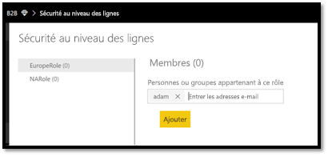

Désormais, lorsque cet utilisateur ouvre l’application qui a été partagée avec lui, il ne voit qu’un rapport avec des données en Europe :

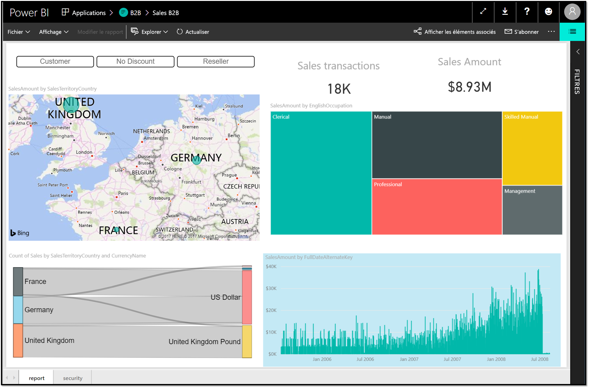

### Sécurité dynamique au niveau des lignes

Une autre rubrique intéressante consiste à voir comment la sécurité au niveau des lignes (RLS) dynamique fonctionne avec Azure AD B2B.

En résumé, la sécurité dynamique au niveau des lignes fonctionne en filtrant les données du modèle en fonction du nom d’utilisateur de la personne qui se connecte à Power BI. Au lieu d’ajouter plusieurs rôles pour des groupes d’utilisateurs, vous définissez les utilisateurs dans le modèle. Nous ne décrirons pas le modèle en détail ici. Kasper de Jong offre une écriture détaillée sur toutes les versions de la sécurité au niveau des lignes dans Power BI Desktop aide-mémoire sur la [sécurité dynamique](https://www.kasperonbi.com/power-bi-desktop-dynamic-security-cheat-sheet/), et dans [ce livre blanc](https://msdn.microsoft.com/library/jj127437.aspx) .

Examinons un petit exemple : contoso dispose d’un rapport simple sur les ventes par groupes :

Ce rapport doit maintenant être partagé avec deux utilisateurs invités et un utilisateur interne. l’utilisateur interne peut tout voir, mais les utilisateurs invités peuvent uniquement voir les groupes auxquels ils ont accès. Cela signifie que vous devez filtrer les données uniquement pour les utilisateurs invités. Pour filtrer les données de manière appropriée, Contoso utilise le modèle RLS dynamique comme décrit dans le livre blanc et le billet de blog. Cela signifie que contoso ajoute les noms d’utilisateur aux données elles-mêmes :

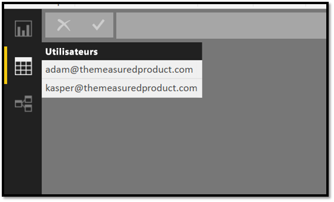

Contoso crée ensuite le bon modèle de données qui filtre les données en fonction des bonnes relations :

Pour filtrer les données automatiquement en fonction de la personne qui est connectée, contoso doit créer un rôle qui transmet l’utilisateur qui se connecte. Dans ce cas, contoso crée deux rôles : le premier est le « SecurityRole » qui filtre la table users avec le nom d’utilisateur actuel de l’utilisateur connecté à Power BI (cela fonctionne même pour les utilisateurs invités d’Azure AD B2B).

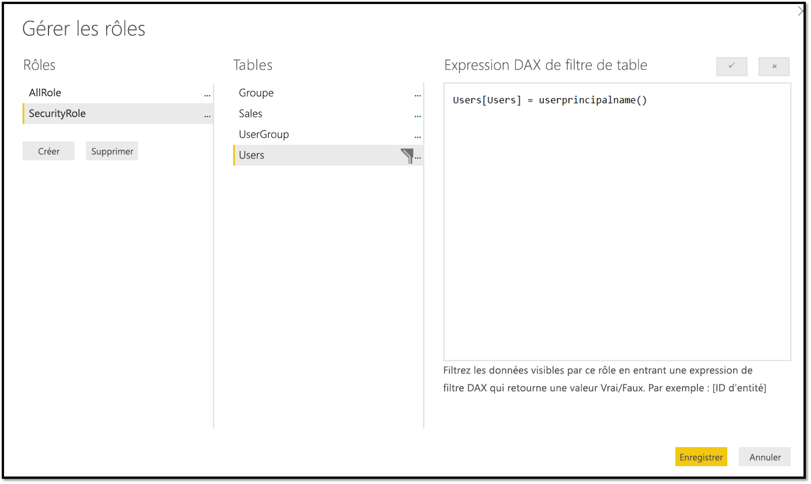

Contoso crée également un autre « AllRole » pour ses utilisateurs internes qui peuvent voir tout : ce rôle n’a aucun prédicat de sécurité.

Après avoir chargé le fichier de bureau Power BI dans le service, contoso peut affecter des utilisateurs invités au « SecurityRole » et des utilisateurs internes au « AllRole »

Désormais, lorsque les utilisateurs invités ouvrent le rapport, ils voient uniquement les ventes du groupe A :

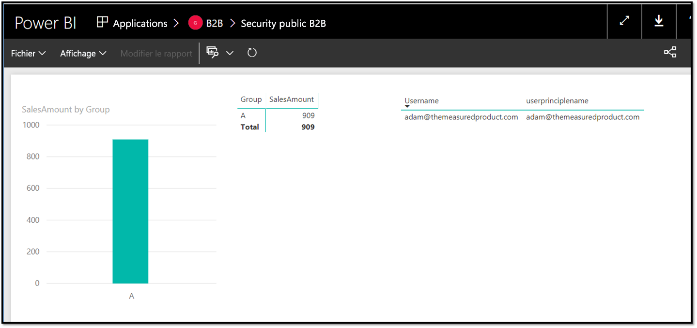

Dans la matrice à droite, vous pouvez voir le résultat de la fonction USERNAME () et USERPRINCIPALNAME () renvoyer l’adresse de messagerie des utilisateurs invités.

Désormais, l’utilisateur interne voit toutes les données :

Comme vous pouvez le voir, le RLS dynamique fonctionne avec les utilisateurs internes ou invités.

> [!NOTE]
> Ce scénario fonctionne également lorsque vous utilisez un modèle dans Azure Analysis Services. En règle générale, votre service Azure Analysis Services est connecté au même Azure AD que votre Power BI. dans ce cas, Azure Analysis Services connaît également les utilisateurs invités par Azure AD B2B.

## Connexion à des sources de données locales

Power BI offre à contoso la possibilité de tirer parti des sources de données locales comme [SQL Server Analysis Services](https://powerbi.microsoft.com/documentation/powerbi-gateway-enterprise-manage-ssas/) ou [SQL Server](https://powerbi.microsoft.com/documentation/powerbi-gateway-kerberos-for-sso-pbi-to-on-premises-data/) grâce à la [passerelle de données locale](https://powerbi.microsoft.com/documentation/powerbi-gateway-onprem/). Il est même possible de se connecter à ces sources de données avec les mêmes informations d’identification que celles utilisées avec Power BI.

> [!NOTE]
> Lors de l’installation d’une passerelle pour se connecter à votre locataire Power BI, vous devez utiliser un utilisateur créé dans votre locataire. Les utilisateurs externes ne peuvent pas installer une passerelle et la connecter à votre locataire. _

Pour les utilisateurs externes, cela peut être plus compliqué, car les utilisateurs externes ne sont généralement pas connus de l’annuaire Active Directory local. Power BI offre une solution de contournement en permettant aux administrateurs contoso de mapper les noms d’utilisateur externes aux noms d’utilisateur internes, comme décrit dans [gérer votre source de données-Analysis Services](https://powerbi.microsoft.com/documentation/powerbi-gateway-enterprise-manage-ssas/). Par exemple, [lucy@supplier1.com](mailto:lucy@supplier1.com) peut être mappé à [lucy\_supplier1\_com #EXT@contoso.com](mailto:lucy_supplier1_com).

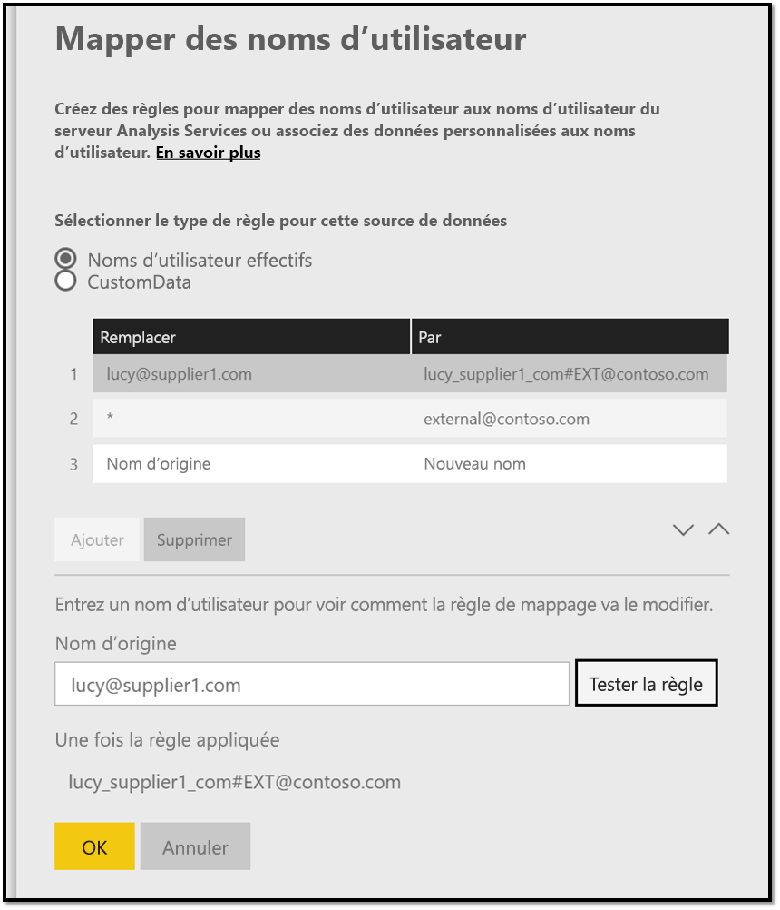

Cette méthode est correcte si contoso ne possède que quelques utilisateurs ou si contoso peut mapper tous les utilisateurs externes à un seul compte interne. Pour les scénarios plus complexes où chaque utilisateur a besoin de ses propres informations d’identification, il existe une approche plus avancée qui utilise des [attributs ad personnalisés](https://technet.microsoft.com/library/cc961737.aspx) pour effectuer le mappage, comme décrit dans [gérer votre source de données-Analysis Services](https://powerbi.microsoft.com/documentation/powerbi-gateway-enterprise-manage-ssas/). Cela permettrait à l’administrateur contoso de définir un mappage pour chaque utilisateur de votre Azure AD (également des utilisateurs B2B externes).  Ces attributs peuvent être définis par le biais du modèle objet AD à l’aide de scripts ou de code afin que contoso puisse automatiser entièrement le mappage sur l’invitation ou sur une cadence planifiée.

## Permettre aux utilisateurs externes de modifier et de gérer le contenu dans Power BI

Contoso peut autoriser les utilisateurs externes à contribuer au contenu au sein de l’organisation, comme décrit précédemment dans la section relative à la modification et à la gestion inter-organisations de Power BI content.

> [!NOTE]
> Pour modifier et gérer le contenu au sein de la Power BI de votre organisation, l’utilisateur doit disposer d’une licence Power BI Pro dans un espace de travail autre que mon espace de travail. Les utilisateurs peuvent obtenir des licences Pro comme décrit dans la section relative aux _licences_ de ce document.

Le Power BI le portail d’administration permet aux **utilisateurs invités externes de modifier et de gérer le contenu du paramètre de l’organisation dans les** paramètres du locataire. Par défaut, le paramètre est défini sur désactivé, ce qui signifie que les utilisateurs externes obtiennent une expérience en lecture seule restreinte par défaut. Le paramètre s’applique aux utilisateurs avec UserType défini sur invité dans Azure AD. Le tableau ci-dessous décrit les comportements de l’expérience des utilisateurs en fonction de leur UserType et de la façon dont les paramètres sont configurés.

| **Type d’utilisateur dans Azure AD** | **Autoriser les utilisateurs invités externes à modifier et à gérer le contenu** | **Comportement** |
| --- | --- | --- |
| Invité | Désactivé pour l’utilisateur (par défaut) | Affichage de la consommation par article uniquement. Autorise l’accès en lecture seule aux rapports, aux tableaux de bord et aux applications lorsqu’ils sont affichés via une URL envoyée à l’utilisateur invité. Les applications Power BI Mobile fournissent une vue en lecture seule à l’utilisateur invité. |
| Invité | Activé pour l’utilisateur | L’utilisateur externe a accès à l’expérience Power BI complète, bien que certaines fonctionnalités ne soient pas disponibles. L’utilisateur externe doit se connecter à Power BI à l’aide de l’URL du service Power BI avec les informations du locataire incluses. L’utilisateur obtient l’expérience, un espace de travail My et, en fonction des autorisations, il peut parcourir, afficher et créer du contenu.    Les applications Power BI Mobile fournissent une vue en lecture seule à l’utilisateur invité. |

> [!NOTE]
> Les utilisateurs externes dans Azure AD peuvent également être définis sur le membre UserType. Cela n’est actuellement pas pris en charge dans Power BI.

Dans le portail d’administration Power BI, le paramètre est affiché dans l’image suivante.

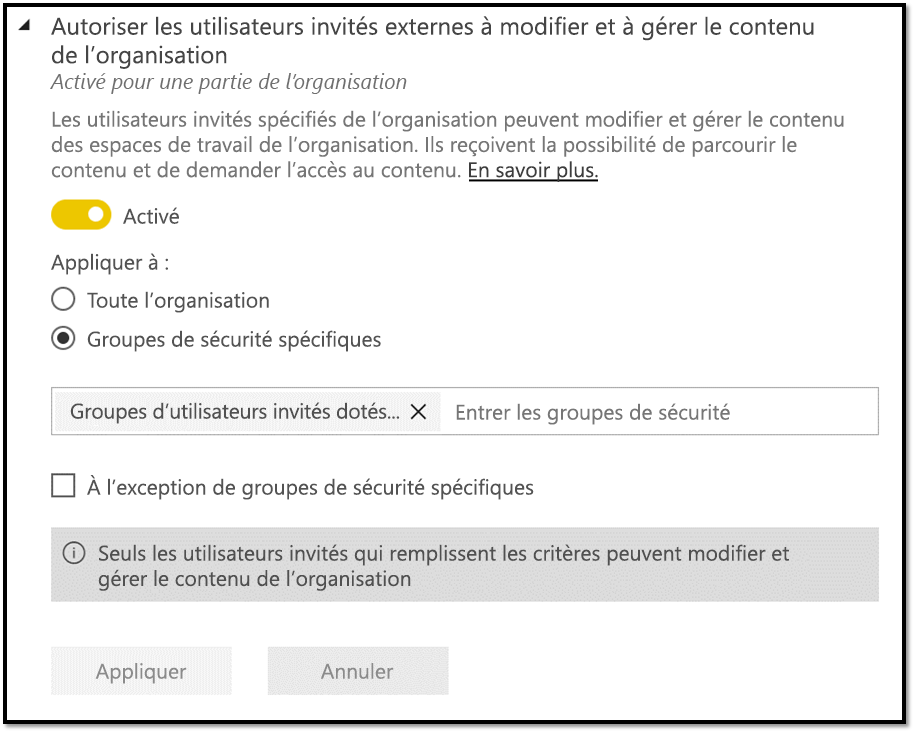

Les utilisateurs invités bénéficient de l’expérience par défaut en lecture seule et peuvent modifier et gérer le contenu. La valeur par défaut est Disabled, ce qui signifie que tous les utilisateurs invités disposent de l’expérience en lecture seule. L’administrateur Power BI peut activer le paramètre pour tous les utilisateurs invités de l’organisation ou pour des groupes de sécurité spécifiques définis dans Azure AD. Dans l’image suivante, l’administrateur contoso Power BI a créé un groupe de sécurité dans Azure AD pour gérer les utilisateurs externes qui peuvent modifier et gérer le contenu dans le locataire contoso.

Pour permettre à ces utilisateurs de se connecter à Power BI, fournissez-leur l’URL du locataire. Pour trouver l’URL de locataire, effectuez les étapes suivantes.

1. Dans le service Power BI, dans le menu supérieur, sélectionnez aide ( **?** ), puis **à propos de Power bi**.
2. Recherchez la valeur en regard de **URL de locataire**. Il s’agit de l’URL de locataire que vous pouvez partager avec vos utilisateurs invités.

    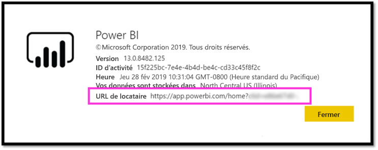

Lors de l’utilisation de l’autorisation autoriser les utilisateurs invités externes à modifier et gérer le contenu de l’organisation, les utilisateurs invités spécifiés ont accès au Power BI de votre organisation et voient tout contenu auquel ils sont autorisés. Ils peuvent accéder au contenu d’origine, parcourir et contribuer aux espaces de travail, installer des applications là où ils se trouvent dans la liste d’accès et disposer d’un espace de travail My. Ils peuvent créer ou être des administrateurs d’espaces de travail qui utilisent la nouvelle expérience d’espace de travail.

> [!NOTE]
> Quand vous utilisez cette option, veillez à consulter la section gouvernance de ce document, car les paramètres de Azure AD par défaut empêchent les utilisateurs invités d’utiliser certaines fonctionnalités comme les sélecteurs de personnes qui peuvent entraîner une expérience réduite. * *

Certaines expériences ne sont pas disponibles pour les utilisateurs invités autorisés par le biais du paramètre autoriser les utilisateurs invités externes à modifier et gérer le contenu du locataire de l’organisation. Pour mettre à jour ou publier des rapports, les utilisateurs invités doivent utiliser l’interface utilisateur Web service Power BI, notamment récupérer des données pour charger des fichiers Power BI Desktop. Les expériences suivantes ne sont pas prises en charge :

- Diriger la publication de Power BI Desktop vers le service Power BI
- Les utilisateurs invités ne peuvent pas utiliser Power BI Desktop pour se connecter à des jeux de données du service dans le service Power BI
- Espaces de travail classiques liés aux groupes Office 365 : l’utilisateur invité ne peut pas créer ou être administrateur de ces espaces de travail. Ils peuvent être membres.
- L’envoi d’invitations ad hoc n’est pas pris en charge pour les listes d’accès aux espaces de travail
- Power BI Publisher pour Excel n’est pas pris en charge pour les utilisateurs invités
- Les utilisateurs invités ne peuvent pas installer une passerelle Power BI Gateway et la connecter à votre organisation
- Les utilisateurs invités ne peuvent pas installer d’applications à publier dans toute l’organisation
- Les utilisateurs invités ne peuvent pas utiliser, créer, mettre à jour ou installer des packs de contenu d’organisation
- Les utilisateurs invités ne peuvent pas utiliser la fonctionnalité Analyser dans Excel
- Les utilisateurs invités ne peuvent pas être @mentioneds dans des commentaires (cette fonctionnalité sera ajoutée dans une prochaine version)
- Les utilisateurs invités ne peuvent pas utiliser les abonnements (cette fonctionnalité sera ajoutée dans une prochaine version)
- Les utilisateurs invités qui utilisent cette fonctionnalité doivent disposer d’un compte professionnel ou scolaire. Les utilisateurs invités utilisant des comptes personnels ont davantage de limitations en raison des restrictions de connexion.

## Governance

### Paramètres de Azure AD supplémentaires qui affectent les expériences de Power BI relatives à Azure AD B2B

Lorsque vous utilisez Azure AD le partage B2B, le Azure Active Directory administrateur contrôle les aspects de l’expérience de l’utilisateur externe. Celles-ci sont contrôlées sur la page Paramètres de collaboration externe dans les paramètres de Azure Active Directory de votre locataire.

Des détails sur les paramètres sont disponibles ici :

[https://docs.microsoft.com/azure/active-directory/b2b/delegate-invitations](https://docs.microsoft.com/azure/active-directory/b2b/delegate-invitations)

> [!NOTE]
> Par défaut, l’option les autorisations utilisateurs invités sont limitées est définie sur Oui, donc les utilisateurs invités au sein de Power BI ont des expériences limitées, en particulier le partage d’entourage où les interfaces utilisateur du sélecteur de personnes ne fonctionnent pas pour ces utilisateurs. Il est important de collaborer avec votre administrateur Azure AD pour lui attribuer la valeur non, comme indiqué ci-dessous, afin de garantir une bonne expérience. * *

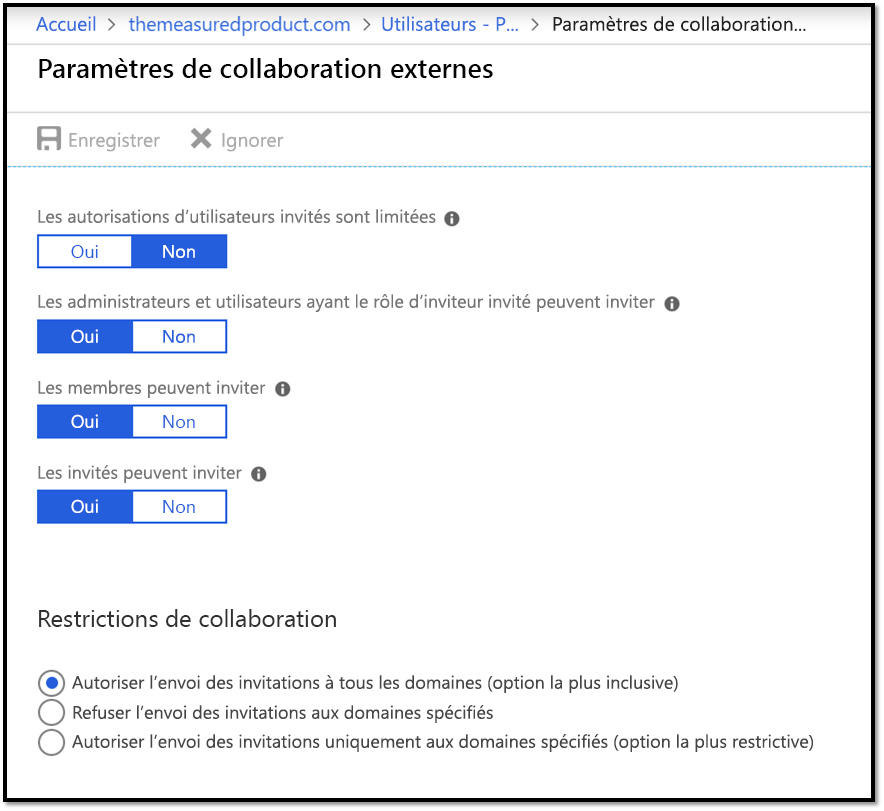

### Contrôler les invitations invitées

Power BI administrateurs peuvent contrôler le partage externe uniquement pour les Power BIen visitant le portail d’administration Power BI. Toutefois, les administrateurs clients peuvent également contrôler le partage externe avec différentes stratégies de Azure AD.  Ces stratégies permettent aux administrateurs clients de

- Désactiver les invitations par les utilisateurs finaux
- Seuls les administrateurs et les utilisateurs du rôle inviteur d’invités peuvent inviter
- Les administrateurs, le rôle inviteur d’invités et les membres peuvent inviter
- Tous les utilisateurs, y compris les invités, peuvent inviter

Pour plus d’informations sur ces stratégies, consultez [invitations aux délégués pour Azure Active Directory B2B collaboration](https://docs.microsoft.com/azure/active-directory/active-directory-b2b-delegate-invitations).

Toutes les Power BI actions effectuées par des utilisateurs externes sont également [auditées dans notre portail d’audit](https://powerbi.microsoft.com/documentation/powerbi-admin-auditing/).

### Stratégies d’accès conditionnel pour les utilisateurs invités

Contoso peut appliquer des stratégies d’accès conditionnel pour les utilisateurs invités qui accèdent au contenu à partir du locataire contoso. Vous trouverez des instructions détaillées dans [accès conditionnel pour les utilisateurs B2B collaboration](https://docs.microsoft.com/azure/active-directory/active-directory-b2b-mfa-instructions).

## Autres approches courantes

Bien que Azure AD B2B facilite le partage de données et de rapports entre les organisations, il existe plusieurs autres approches couramment utilisées et qui peuvent être supérieures dans certains cas.

### Autre option 1 : créer des identités dupliquées pour les utilisateurs partenaires

Avec cette option, contoso devait créer manuellement des identités dupliquées pour chaque utilisateur partenaire dans le locataire contoso, comme illustré dans l’image suivante. Ensuite, dans Power BI, contoso peut partager avec les identités affectées les rapports, les tableaux de bord ou les applications appropriés.

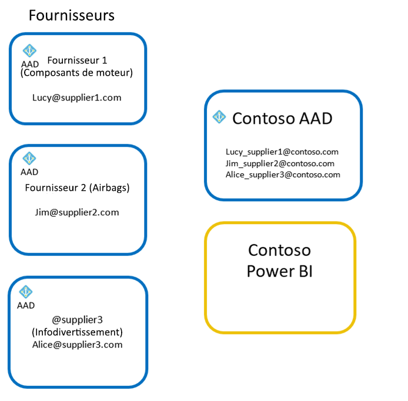

Pourquoi choisir cette alternative :

- Étant donné que l’identité de l’utilisateur est contrôlée par votre organisation, tout service associé, tel que le courrier électronique, SharePoint, etc., est également dans le contrôle de votre organisation. Vos administrateurs informatiques peuvent réinitialiser les mots de passe, désactiver l’accès aux comptes ou auditer les activités dans ces services.
- Les utilisateurs qui utilisent des comptes personnels pour leur entreprise sont souvent limités à l’accès à certains services, ce qui peut nécessiter un compte professionnel.
- Certains services fonctionnent uniquement sur les utilisateurs de votre organisation. Par exemple, l’utilisation d’Intune pour gérer du contenu sur les appareils personnels/mobiles d’utilisateurs externes à l’aide d’Azure B2B peut ne pas être possible.

Pourquoi ne pas choisir cette alternative :

- Les utilisateurs des organisations partenaires doivent se souvenir de deux jeux d’informations d’identification : l’un pour accéder au contenu de leur propre organisation et l’autre pour accéder au contenu de contoso. Il s’agit d’une embarras pour ces utilisateurs invités et de nombreux utilisateurs invités ne sont pas confondus par cette expérience.
- Contoso doit acheter et attribuer des licences par utilisateur à ces utilisateurs. Si un utilisateur doit recevoir des courriers électroniques ou utiliser des applications Office, il a besoin des licences appropriées, y compris Power BI Pro pour modifier et partager du contenu dans Power BI.
- Contoso peut souhaiter appliquer des stratégies d’autorisation et de gouvernance plus rigoureuses pour les utilisateurs externes, par rapport aux utilisateurs internes. Pour y parvenir, contoso doit créer une nomenclature interne pour les utilisateurs externes et tous les utilisateurs de contoso doivent être informés de cette nomenclature.
- Lorsque l’utilisateur quitte son organisation, il continue à avoir accès aux ressources de contoso jusqu’à ce que l’administrateur contoso supprime manuellement son compte
- Les administrateurs contoso doivent gérer l’identité de l’invité, y compris la création, les réinitialisations de mot de passe, etc.

### Autre option 2 : créer une application de Power BI Embedded personnalisée à l’aide de l’authentification personnalisée

Une autre option pour Contoso consiste à créer sa propre application Power BI incorporée personnalisée avec l’authentification personnalisée ([« l’application possède les données »](https://docs.microsoft.com/power-bi/developer/embed-sample-for-customers)). Si de nombreuses organisations n’ont pas le temps ou les ressources nécessaires pour créer une application personnalisée pour distribuer le contenu Power BI à leurs partenaires externes, il s’agit de la meilleure approche pour certaines organisations.

Souvent, les organisations ont des portails partenaires existants qui centralisent l’accès à toutes les ressources de l’Organisation pour les partenaires, permettent d’isoler des ressources organisationnelles internes et offrent aux partenaires des expériences rationalisées pour prendre en charge de nombreux partenaires et leurs utilisateurs individuels.

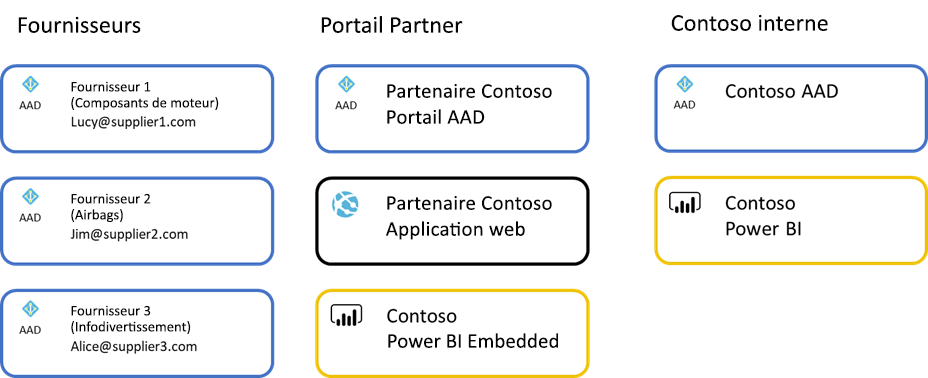

Dans l’exemple ci-dessus, les utilisateurs de chaque fournisseur se connectent au portail partenaires de Contoso qui utilise AAD comme fournisseur d’identité. Il peut utiliser AAD B2B, Azure B2C, des identités natives ou fédérer avec un nombre quelconque d’autres fournisseurs d’identité. L’utilisateur se connecte et accède à une version du portail partenaires à l’aide d’Azure Web App ou d’une infrastructure similaire.

Dans l’application Web, Power BI rapports sont incorporés à partir d’un déploiement Power BI Embedded. L’application Web permet de rationaliser l’accès aux rapports et aux services associés dans une expérience cohérente visant à faciliter l’interaction des fournisseurs avec contoso. Cet environnement de portail est isolé des environnements Azure Internal AAD et de l’environnement de Power BI interne de contoso pour s’assurer que les fournisseurs n’ont pas pu accéder à ces ressources. En règle générale, les données sont stockées dans un entrepôt de données partenaire distinct pour assurer également l’isolation des données. Cette isolation présente des avantages, car elle limite le nombre d’utilisateurs externes avec un accès direct aux données de votre organisation, en limitant les données susceptibles d’être disponibles pour l’utilisateur externe et en limitant le partage accidentel avec les utilisateurs externes.

À l’aide de Power BI Embedded, le portail peut tirer parti d’une licence avantageuse, à l’aide d’un jeton d’application ou de l’utilisateur principal, ainsi que de la capacité Premium achetée dans le modèle Azure, ce qui simplifie l’attribution de licences aux utilisateurs finaux et peut être mis à l’échelle en fonction des attentes syntaxe. Le portail peut offrir une meilleure qualité et une expérience cohérente dans la mesure où les partenaires accèdent à un portail unique, conçu pour répondre à tous les besoins d’un partenaire. Enfin, étant donné que les solutions Power BI Embedded sont généralement conçues pour être multi-locataires, il est plus facile de garantir l’isolation entre les organisations partenaires.

Pourquoi choisir cette alternative :

- Plus facile à gérer à mesure que le nombre d’organisations partenaires augmente. Étant donné que les partenaires sont ajoutés à un répertoire distinct isolé du répertoire AAD interne de contoso, ils simplifient ses tâches de gouvernance et aident à empêcher le partage accidentel de données internes vers des utilisateurs externes.
- Les portails de partenaires standard sont des expériences de très grande échelle avec des expériences cohérentes entre les partenaires et rationalisées pour répondre aux besoins des partenaires classiques. Contoso peut donc offrir une meilleure expérience globale aux partenaires en intégrant tous les services requis dans un portail unique.
- Les coûts de licence pour des scénarios avancés tels que la modification du contenu dans le Power BI Embedded sont couverts par la Power BI Premium achetée par Azure et ne nécessitent pas l’attribution de licences Power BI Pro à ces utilisateurs.
- Offre une meilleure isolation entre les partenaires s’ils sont conçus en tant que solution mutualisée.
- Le portail partenaires comprend souvent d’autres outils pour le partenaire au-delà des Power BI rapports, des tableaux de bord et des applications.

Pourquoi ne pas choisir cette alternative :

- Un effort important est nécessaire pour créer, exploiter et entretenir un tel portail, ce qui en fait un investissement significatif en ressources et en temps.
- La durée de la solution est beaucoup plus longue que l’utilisation du partage B2B, car une planification et une exécution soignées sur plusieurs flux de flux sont requises.
- Lorsqu’il y a un plus petit nombre de partenaires, l’effort requis pour cette alternative est probablement trop élevé pour être justifié.
- La collaboration avec le partage ad hoc est le scénario principal auquel votre organisation est confrontée.
- Les rapports et les tableaux de bord sont différents pour chaque partenaire. Cette alternative introduit une surcharge de gestion au-delà du simple partage direct avec les partenaires.

## FORUM AUX QUESTIONS

**Est-ce que contoso peut envoyer une invitation qui est automatiquement échangée, de sorte que l’utilisateur soit simplement « prêt à l’emploi » ? Ou l’utilisateur doit-il toujours cliquer sur l’URL d’échange ?**

L’utilisateur final doit toujours cliquer sur l’expérience de consentement pour pouvoir accéder au contenu.

Si vous souhaitez inviter de nombreux utilisateurs invités, nous vous recommandons de les déléguer à partir de vos administrateurs de Azure AD de base en [ajoutant un utilisateur au rôle inviteur d’invités dans l’organisation de ressources](https://docs.microsoft.com/azure/active-directory/active-directory-b2b-add-guest-to-role). Cet utilisateur peut inviter d’autres utilisateurs de l’organisation partenaire à l’aide de l’interface utilisateur de connexion, de scripts PowerShell ou d’API. Cela réduit la charge administrative de vos administrateurs de Azure AD pour inviter ou renvoyer des invitations aux utilisateurs de l’organisation partenaire.

**Contoso peut-il forcer l’authentification multifacteur pour les utilisateurs invités si ses partenaires n’ont pas d’authentification multifacteur ?**

Oui. Pour plus d’informations, consultez [accès conditionnel pour les utilisateurs B2B collaboration](https://docs.microsoft.com/azure/active-directory/active-directory-b2b-mfa-instructions).

**Comment fonctionne la collaboration B2B lorsque le partenaire invité utilise la Fédération pour ajouter sa propre authentification locale ?**

Si le partenaire possède un locataire Azure AD qui est fédéré à l’infrastructure d’authentification locale, l’authentification unique (SSO) locale est effectuée automatiquement. Si le partenaire n’a pas de locataire Azure AD, un compte Azure AD peut être créé pour les nouveaux utilisateurs.

**Puis-je inviter des utilisateurs invités avec des comptes de messagerie de consommateurs ?**

L’invitation d’utilisateurs invités avec des comptes de messagerie de consommateurs est prise en charge dans Power BI. Cela comprend les domaines tels que hotmail.com, outlook.com et gmail.com. Toutefois, ces utilisateurs peuvent rencontrer des limitations au-delà de ce que rencontrent les utilisateurs avec des comptes professionnels ou scolaires.
