# Déploiement et gestion des capacités de Power BI Premium

**Résumé :** Power BI Premium fournit des performances plus cohérentes, prise en charge de grands volumes de données et la souplesse d’une plate-forme unifiée de BI libre-service et d’entreprise pour tous les membres de votre organisation. Ce livre blanc technique de niveau 300 a été écrit spécifiquement pour les administrateurs Power BI et les auteurs de contenu et les serveurs de publication. Il vise à les aider à comprendre le potentiel de Power BI Premium et d’expliquer comment concevoir, déployer, surveiller et résoudre les problèmes des solutions évolutives.

**Auteur :** [Peter Myers](https://www.linkedin.com/in/peterjsmyers) (données plateforme MVP et expert BI indépendant avec les Solutions au niveau du bit)

**Réviseurs techniques :** ADAM Saxton, Akshai Mirchandani, Bhavik marchand, David Magar, Josh Caplan, Michael Blythe, Nimrod Shalit, Olivier Matrat, Swati Gupta

**S’applique à :** Service Power BI, Power BI Premium et capacités Azure Power BI Embedded

> [!NOTE]
> Vous pouvez enregistrer ou imprimer ce livre blanc en sélectionnant **Imprimer** dans votre navigateur, puis **Enregistrer au format PDF**.

## Présentation de Power BI

Power BI est un service d’analytique métier conçu pour fournir des informations permettant de prendre des décisions rapides et éclairées. Depuis sa publication en 2015, il est rapidement devenu un service populaire utilisé pour fournir des solutions pour la plus petite organisation au plus grand des entreprises.

Il est mis à disposition de deux manières : Sous la forme d’un service cloud et un local reporting solution nommé **Power BI Report Server**. \[[1](#endnote-01)\]

Power BI comme un service cloud est Software-as-a-Service (SaaS) \[ [2](#endnote-02)\]. Il représente un ensemble de services et applications qui permettent aux organisations de développer, déployer, gérer, partager des solutions pour surveiller leur activité.

Il n’est pas l’intention de ce livre blanc pour fournir une description complète du service Power BI. Au lieu de cela, il se concentre sur des sujets pertinents au sujet de Power BI Premium. Pour obtenir des informations générales sur Power BI, reportez-vous à la complète [Documentation Power BI](service-admin-premium-multi-geo.md). Pour obtenir une explication plus détaillée du service Power BI en se concentrant sur l’obtention de déploiements d’entreprise performantes, reportez-vous à la complète [planification d’un déploiement de Power BI entreprise](https://aka.ms/pbienterprisedeploy) livre blanc.

Dans le contexte d’objet de ce livre blanc, cette section présente et décrit les capacités Power BI des types de contenu, les modes de stockage de modèle et Gestionnaire de licences. Une compréhension de ces rubriques est essentielle au déploiement et à la gestion de Power BI Premium.

### Capacités

**Capacités** est un concept de Power BI core représentant un ensemble de ressources (stockage, processeur et mémoire) utilisées pour héberger et transmettre Power BI contenu. Capacités sont partagées ou dédiées. Un **capacité partagée** est partagé avec d’autres clients Microsoft, tandis qu’un **capacité dédiée** s’engage à un client unique. Capacités dédiées sont introduites dans le [capacités Premium](#premium-capacities) rubrique.

Dans une capacité partagée, les charges de travail exécutées sur les ressources de calcul partagées avec d’autres clients. Comme la capacité doit partager des ressources, les limitations sont imposées pour vous assurer de « lecture équitable », telles que la taille maximale du modèle (1 Go) et la fréquence d’actualisation quotidienne maximale (huit fois par jour).

### Espaces de travail

Espaces de travail Power BI résident dans les capacités et qu’ils représentent les conteneurs de sécurité, de collaboration et de déploiement. Chaque utilisateur Power BI dispose d’un espace de travail personnel appelé **mon espace de travail**. Espaces de travail supplémentaires peuvent être créées pour permettre la collaboration et déploiement, et ils sont appelés **espaces de travail application**. Par défaut, les espaces de travail, y compris les espaces de travail personnels - sont créés dans une capacité partagée.

### Types de contenu BI Power

Pour présenter les rubriques de Power BI Premium, il est important de commencer avec une discussion détaillée de l’architecture de Power BI, y compris les types de contenu fondamentaux.

Tout le contenu Power BI est stocké et géré dans les espaces de travail qui sont des conteneurs pour le contenu de Power BI. Chaque utilisateur de Power BI a son propre espace de travail personnel, mais la meilleure pratique générale consiste à créer des espaces de travail d’application. Espaces de travail application activer copropriété de contenu et la capacité de collaborer sur le contenu. Ils offrent également la possibilité pour organiser et de distribuer le contenu à un large public en tant qu’applications.

Le contenu de Power BI suivant est stocké dans les espaces de travail :

- Flux de données
- Jeux de données
- Classeurs
- Rapports
- Tableaux de bord

#### Flux de données

Flux de données Power BI permettent aux organisations d’unifier des données provenant de sources disparates. Ils peuvent être considérées comme des données préparé et préparé pour une utilisation dans les modèles, mais ils ne peuvent pas être utilisés directement en tant que source de création de rapports. Ils bénéficient de la collection complète des connecteurs de données de Microsoft, l’activation de l’ingestion de données à partir de locaux et les sources de données basée sur le cloud.

Flux de données peut uniquement être créées et gérées dans les espaces de travail d’application, et ils sont stockés en tant qu’entités dans le modèle de données courantes (CDM) dans Azure Data Lake Storage Gen2. En règle générale, elles sont planifiées pour actualiser régulièrement pour stocker les données à jour.

Pour plus d’informations, reportez-vous à la [de préparation des données en libre-service dans Power BI (version préliminaire)](service-dataflows-overview.md) document.

#### Jeux de données

Jeux de données Power BI représente une source de données prêtes pour la création de rapports et de visualisation. Il existe de nombreux types de jeux de données, créé par :

- Connexion à un modèle de données existant qui n’est pas hébergé dans une capacité Power BI
- Téléchargement d’un fichier Power BI Desktop qui contient un modèle
- Chargement d’un classeur Excel (contenant une ou plusieurs tables Excel et/ou un modèle de données du classeur) ou le téléchargement d’un fichier de valeurs séparées par des virgules (CSV)
- À l’aide du service Power BI pour créer une notification push, diffusion en continu ou hybride de jeu de données de diffusion en continu

À l’exception des jeux de données de diffusion en continu \[ [3](#endnote-03)\], le jeu de données représente un modèle de données qui s’appuie sur les technologies de modélisation mature d’Analysis Services.

Notez que dans la documentation, parfois, les modèles et les jeux de données de termes sont interchangeables. En règle générale, un point de vue du service Power BI il est appelé un **dataset** et à partir d’un point de vue du développement il est appelé un **modèle**. Dans le contexte de ce livre blanc ils beaucoup la même signifient.

##### Modèles hébergé en externe

Connexion à un modèle hébergé en externe implique l’installation de la [On-Premises Data Gateway](service-gateway-onprem.md) pour se connecter à SQL Server Analysis Services, qu’il soit local ou hébergé à la machine virtuelle Infrastructure-as-a-Service (IaaS). Azure Analysis Services ne nécessite pas d’une passerelle. Ce scénario est souvent judicieux lorsque les investissements existants du modèle existent, faisant généralement partie de l’entrepôt de données de l’entreprise (EDW). Il permet à Power BI effectuer un **connexion Live** (LC) à Analysis Services et pour ce faire, appliquez des autorisations de données à l’aide de l’identité de l’utilisateur du rapport Power BI. Pour SQL Server Analysis Services, les modèles multidimensionnels (cubes) et les modèles tabulaires sont pris en charge. Comme indiqué dans l’image suivante, un jeu de données de connexion Live transmet les requêtes aux modèles hébergés en externe.

##### Modèles de développé de bureau Power BI

Power BI Desktop - une application cliente destinée au développement de Power BI - peut être utilisé pour développer un modèle qui est en fait un modèle tabulaire Analysis Services. Les modèles peuvent être développés par l’importation de données à partir de flux de données, qui peut ensuite être intégré aux autres sources de données. Lors de l’obtenir des détails sur la modélisation peut être obtenue est en dehors de la portée de ce livre blanc, il est important de comprendre qu’il existe trois différents types - ou modes - de modèles qui peuvent être développées à l’aide de Power BI Desktop. Ces modes de déterminent si les données sont importées dans le modèle, ou si elle reste dans la source de données. Les trois modes sont : Import, DirectQuery et Composite. Une description complète de chaque mode est abordée dans le [les Modes de stockage de modèle](#model-storage-modes) rubrique.

Sécurité au niveau des lignes (RLS) pour limiter les données qui peuvent être extraites d’un utilisateur donné peuvent être assurée par hébergé en externe des modèles et des modèles développés dans Power BI desktop. Par exemple, les utilisateurs affectés au groupe de sécurité vendeurs peuvent uniquement afficher des données de rapport pour les régions de ventes auquel ils sont assignés. Rôles RLS peuvent être statique ou dynamique. **Les rôles dynamiques** filtrer par l’utilisateur du rapport, tandis que **rôles statiques** appliquer les mêmes filtres pour tous les utilisateurs affectés au rôle.

##### Modèles de classeur Excel

Création de jeux de données basé sur des classeurs Excel ou CSV fichiers entraîne la création automatique d’un modèle. Tables Excel et des données CSV seront importées pour créer des tables de modèle, tandis qu’un modèle de données du classeur Excel sera être transposé pour créer un modèle Power BI. Dans tous les cas, les données de fichier sont importées dans un modèle.

Ensuite, les distinctions de peuvent être effectuées concernant les jeux de données Power BI qui représentent des modèles :

- Elles sont hébergées dans le service Power BI, ou sont en externe par Analysis Services
- Ils peuvent stocker des données importées, ou ils peuvent émettre les demandes de requête passthrough pour les sources de données sous-jacentes, ou une combinaison des deux

Voici un résumé des faits importants sur les jeux de données Power BI qui représentent des modèles :

- Modèles SQL Server Analysis Services hébergé nécessitent une passerelle pour effectuer des requêtes de LC
- Modèles Power BI-hébergé qui importent des données
  - Doit être entièrement chargées en mémoire afin qu’elles peuvent être interrogées
  - Nécessitent l’actualisation de conserver les données en cours et impliquent passerelles lors de la source de données n’est pas accessible directement via Internet
- Power BI hébergés les modèles qui utilisent le mode de stockage DirectQuery (DQ) nécessitent une connectivité vers la source de données. Lorsque le modèle est interrogé, Power BI émet des requêtes à la source de données pour récupérer des données en cours. Ce mode doit impliquer des passerelles lors de la source de données n’est pas accessible directement via Internet.
- Les modèles peuvent appliquer des règles RLS, en appliquant des filtres pour limiter l’accès aux données à certains utilisateurs

Pour déployer et gérer Power BI Premium, il est important de comprendre où se trouvent les modèles, leur mode de stockage, toutes les dépendances sur les passerelles, taille des données importées et le type et la fréquence d’actualisation. Ils peuvent tous avoir un impact significatif sur les ressources de Power BI Premium. En outre, la conception de modèle, y compris ses requêtes de préparation des données et les calculs permettre ajouter à la combinaison de considérations.

Il est également important de comprendre que Power BI-hébergé importation modèles peuvent en fonction de la planification d’actualisation ou être déclenché à la demande par un utilisateur dans le service Power BI.

Conception de modèles optimisés est abordée plus loin dans cet article technique dans le [optimisation des modèles](#optimizing-models) rubrique.

#### Classeurs

Les classeurs Power BI sont un type de contenu Power BI \[ [4](#endnote-04)\]. Il s’agit des classeurs Excel qui ont été téléchargées vers le service Power BI et ne doivent pas être confondu avec les classeurs Excel téléchargés qui créent des jeux de données (modèles). Le type de contenu du classeur représente une connexion à un classeur, ce qui peut soit être téléchargé vers le service Power BI ou reste dans le stockage cloud sur OneDrive ou SharePoint Online.

Il est important de comprendre que ce type de contenu n’est pas disponible comme source de données pour les visualisations de données Power BI. Au lieu de cela, il peut être ouverte en tant que classeur dans le service Power BI en utilisant Excel Online. L’objectif principal de ce type de contenu est hérité de rapports de classeur Excel pour être accessible à partir du service Power BI et permettre de ses visualisations de données être épinglés aux tableaux de bord Power BI.

Pour plus d’informations, reportez-vous à la [obtenir des données à partir de fichiers de classeur Excel](service-excel-workbook-files.md) document.

#### Rapports

Il existe deux types de rapports : Les rapports Power BI et les rapports paginés.

**Rapports Power BI** d’assurer une visualisation interactive des données qui se connecte à uniquement un seul dataset. Les rapports sont souvent conçus pour encourager la participation des utilisateurs leur permettant d’interagir avec un tableau extraordinaire de fonctionnalités, dont le filtrage, le découpage, cross-filtrage et mise en surbrillance, ascendante, l’exploration vers le bas, Parcourir, de Q & r un naturel langage en question, en mettant l’accent, navigation entre les pages, coups de projecteur, signets de l’affichage et bien plus encore.

Dans le contexte de ce livre blanc, il est important de comprendre comment l’architecture de Power BI, interactions utilisateur et de conception du rapport Power BI peuvent tous avoir un impact sur les ressources de service Power BI :

- Pour charger et interagir avec des rapports basés sur des modèles d’importation, le modèle doit être entièrement chargé en mémoire (qu’il soit dans le service Power BI ou être hébergé en externe)
- Chaque visuel de rapport émet une requête pour récupérer des données en interrogeant le modèle
- En règle générale, les interactions de filtre et segment impliquent interrogeant le modèle. Par exemple, modification d’une sélection de segment - par défaut - nécessitera rechargement chaque visuel sur la page \[ [5](#endnote-05)\]
- Les rapports Power BI ne garantissent pas l’affichage des données en cours et peuvent nécessiter l’utilisateur actualiser le rapport pour recharger la page de rapport et ses éléments visuels
- Les utilisateurs peuvent collaborer avec Q & autorise une fonctionnalité de langage naturel pour poser des questions, en fournissant la conception du rapport Power BI et le jeu de données représente un modèle d’importation de données hébergée de Power BI ou un jeu de données LC configurés pour activer les Q & r

**Rapports paginés** permettant la publication et le rendu des rapports SQL Server Reporting Services (SSRS) (\*format .rdl). Comme leur nom l’indique, les rapports paginés sont couramment utilisées lors de l’exigent une nécessité pour l’impression sur une taille de page fixe, ou lorsqu’il existe des listes de variables de données doivent être complètement étendues. Par exemple, une facture conçue pour le rendu multi-page (plutôt que le défilement dans un élément visuel) et d’impression.

Les deux types de rapport pris en charge fournissent des choix pour les auteurs de rapports, ce qui leur permet de sélectionner le type en fonction de besoins et utilisation prévue. En règle générale, les rapports Power BI sont idéales pour des expériences interactives permettant à l’utilisateur Explorer et découvrir des informations à partir de données, tandis que les rapports paginés sont mieux adaptées aux dispositions de page gérée par le paramètre.

Quel que soit le type de rapport, rapport réactive charge données mises à jour et (lorsque les filtres ou les paramètres sont modifiés) est impérative pour offrir une expérience utilisateur performantes et fiables.

#### Tableaux de bord

Tableaux de bord Power BI est destinés à offrir des expériences de surveillance et est conceptuellement très différents à partir de rapports Power BI. Tableaux de bord est conçus pour l’affichage sur un seul volet en verre pour exprimer des visualisations de données et de valeurs dans les vignettes. En règle générale, des tableaux de bord offre des expériences interaction moins que des rapports Power BI, avec certaines conceptions de tableau de bord n’attend aucune interaction. Par exemple, un tableau de bord sans assistance présentée sur un écran non tactile dans une salle de serveurs. Une autre différence importante est que les tableaux de bord peut-être présenter des vignettes qui recueillent des données sources à partir de plusieurs jeux de données, tout en un Power BI peut seulement jamais être basé sur un jeu de données unique.

Il est important de comprendre qu’un tableau de bord est conçu pour charger rapidement et pour exprimer les données les plus récentes (connues du service Power BI) à tout moment. Pour cela, en mettant en cache les résultats de requête de vignette, et il effectue cette opération pour chaque tableau de bord. En fait, il doit faire pour chaque utilisateur qui a accès à un tableau de bord est basé sur des modèles qui appliquent des lignes dynamiques.

Le service Power BI met automatiquement à jour les caches de requête de tableau de bord immédiatement après l’actualisation des modèles d’importation hébergé de Power BI. Dans le cas de modèles LC et DQ, le propriétaire de jeu de données a un degré de contrôle sur la fréquence à laquelle le service Power BI met à jour le cache, qui peut être configuré comme fréquemment en tant que toutes les 15 minutes, ou très rarement une fois par semaine. Notez que les mises à jour de cache de requête LC seront interroger tout d’abord les métadonnées de modèle pour déterminer si une actualisation de modèle a eu lieu depuis la dernière mise à jour du cache, et il ne passera pas à mettre à jour le cache lorsqu’une actualisation n’a pas depuis s’est produite. Cette vérification n’est pas possible pour les modèles DQ, et par conséquent, les mises à jour du cache seront produit si la source de données a changé ou non.

Cache de requête de tableau de bord DQ en fonction des mises à jour et les modèles LC ressentiront considérablement sur les ressources du service Power BI et les sources de données externes. Envisagez un tableau de bord avec 20 vignettes, tous basés sur un modèle Azure Analysis Services qui applique la RLS dynamique qui est actualisé toutes les heures, et que ce tableau de bord est partagé avec 100 utilisateurs. Si le jeu de données est configuré pour s’actualiser toutes les heures, cela se traduirait au moins 2000 (20 x 100) des requêtes de LC. Cela a pu placer une charge considérable sur le service Power BI et les sources de données externes, et il peut également dépasser les limites imposées sur les ressources disponibles. Ressources de capacité et limites sont décrits dans le [nœuds de capacité](#capacity-nodes) rubrique.

Les utilisateurs peuvent interagir avec un tableau de bord de différentes manières, qui nécessitent des ressources du service Power BI. Plus précisément, ils peuvent :

- Déclencher une actualisation des vignettes de tableaux de bord, ce qui peut entraîner une actualisation à la demande sur toutes les Power BI-hébergé importation de modèles de données
- Collaborer avec le Forum aux questions une fonctionnalité de langage naturel pour poser des questions (à condition qu’il permet à la conception du tableau de bord et le jeu de données est un modèle d’importation de données hébergée de Power BI ou un jeu de données LC configurés pour activer les Q & R)
- Utilisez la fonctionnalité d’aperçu rapide pour que Power BI découvrir des informations à partir d’un jeu de données sous-jacente et répondre avec les éléments visuels qui affichent et les décrire (à condition que la vignette est basée sur un jeu de données qui est le modèle importation de données hébergée de Power BI)
- Configurer des alertes sur les vignettes de tableau de bord, nécessiter que le service Power BI pour comparer des seuils à la vignette éventuellement aussi souvent que toutes les heures - les valeurs - et pour avertir les utilisateurs lorsque les seuils sont dépassés (fournissant que la vignette affiche une valeur numérique unique et est basée sur un jeu de données modèle importation de données hébergée de Power BI)

### Modes de stockage de modèle

Rappelez-vous que Power BI Desktop permet le développement d’un modèle dans un des trois modes. Il est important de bien comprendre la logique pour chaque mode de stockage de modèle de données et des impacts sur les ressources du service Power BI. Cette section présente les trois modes. Ces points sont abordés plus en détail plus loin dans ce livre blanc dans la rubrique de l’optimisation des modèles.

#### Mode d’importation

Mode d’importation est le mode courant utilisé pour développer des modèles en raison des performances extrêmement rapides associé d’interrogation, la flexibilité de conception disponible pour les modeleurs, en mémoire et la prise en charge des fonctionnalités du service Power BI spécifiques (questions et réponses, informations rapides etc.). Il est le mode par défaut lors de la création d’une nouvelle solution Power BI Desktop.

Il est important de comprendre que les données importées sont toujours stockées à disque et doit être entièrement chargées en mémoire à interroger ou actualisé. Une fois en mémoire, les modèles d’importation obtenir des résultats de requête extrêmement rapides. Il est également important de comprendre qu’il n’existe aucun concept d’un modèle d’importation en cours de chargement partiellement en mémoire.

Lors de l’actualisation, données sont compressées et optimisées et puis stockées sur le disque par le moteur de stockage VertiPaq. Lors du chargement à partir du disque dans la mémoire, il est possible de voir la compression 10 x, et il est donc raisonnable de penser que 10 Go de données source peut compresser à environ 1 Go. Taille de stockage sur le disque peut parvenir une réduction de 20 % sur le haut. \[[6](#endnote-06)\]

Flexibilité de conception peut être obtenue de trois façons. Modélisateurs de données peuvent :

- Intégrer des données en mettant en cache des données à partir de plusieurs sources de données - quel que soit le type de source de données et de format
- Tirez parti de l’ensemble des fonctions de langage de formule Power Query (appelés de façon informelle M) lors de la création de requêtes de préparation des données
- Tirer parti de l’ensemble des fonctions d’Expressions DAX (Data Analysis) pour améliorer le modèle avec une logique métier, obtenue avec les colonnes calculées, les tables calculées et mesures

Comme indiqué dans l’image suivante, un modèle d’importation peut intégrer des données à partir de n’importe quel nombre de types de sources de données prises en charge.

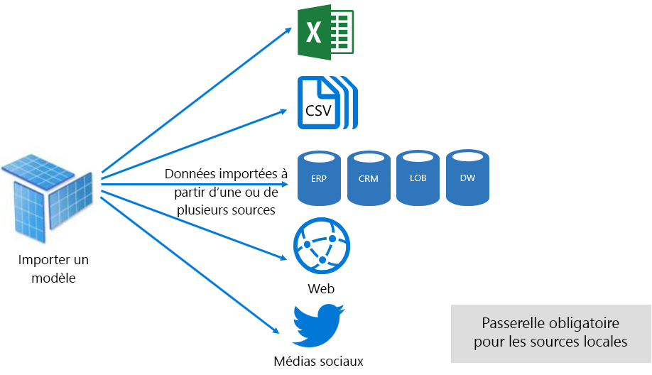

Toutefois, bien qu’il existe des avantages associés aux modèles d’importation, voici les inconvénients trop :

- Le modèle entier doit être chargé dans la mémoire avant de Power BI puisse interroger le modèle, qui peut placer les pression sur les ressources disponibles à mesure que le nombre et la taille des modèles augmentent
- Les données de modèle ne sont plus aussi actuelles que la dernière actualisation, et par conséquent, les modèles d’importation doivent être actualisées, de préférence selon une planification
- Une actualisation complète supprime toutes les données de toutes les tables et recharger à partir de la source de données. Cela peut être très coûteux en termes de temps et des ressources pour le service Power BI et les sources de données. Power BI ne prend en charge l’actualisation incrémentielle qui permet d’éviter tronquer et recharger des tables entières, et cela est couvert dans le [Optimizing Power BI-Hosted modèles](#optimizing-power-bi-hosted-models) rubrique.

À partir d’une perspective de ressource du service Power BI, les modèles d’importation nécessitent :

- Suffisamment de mémoire pour charger le modèle lorsqu’elle est interrogée ou actualisé
- Ressources de traitement et des ressources de mémoire supplémentaire pour actualiser les données

#### Mode DirectQuery

Modèles développés en mode de DirectQuery (DQ) ne pas importent des données. Au lieu de cela, ils se composent uniquement de métadonnées que quand interrogées requêtes natives de problèmes liés à la source de données sous-jacente.

Il existe deux raisons principales à prendre en compte le développement d’un modèle DQ. La première raison est lorsque les volumes de données sont trop volumineux - même lorsque les méthodes de réduction de données sont appliquées - à charger dans un modèle ou actualiser pratiquement. La deuxième raison est lorsque les rapports et tableaux de bord ont besoin pour fournir des données « quasi en temps réel », au-delà de ce qui peut être obtenu dans les limites de l’actualisation planifiée (48 fois par jour pour une capacité dédiée).

Il existe plusieurs avantages associés aux modèles DQ :

- Limites de taille du modèle Importer ne s’appliquent pas
- Les modèles ne nécessitent pas d’actualisation
- Les utilisateurs de rapport seront affiche les données les plus récentes lors de l’interaction avec les filtres de rapport et des segments et vous pouvez actualiser l’intégralité du rapport pour récupérer des données en cours
- Vignettes de tableau de bord, lorsque basés sur des modèles DQ, peuvent automatiquement mettre à jour aussi souvent que toutes les 15 minutes

Toutefois, il existe plusieurs limitations associées aux modèles DQ et des inconvénients :

- Le modèle doit être basé sur une source de données pris en charge, et par conséquent une intégration de données doit déjà être atteints dans la source de données. Sources de données prises en charge sont les systèmes relationnels et d’analyse, avec prise en charge de nombreux magasins de données courants \[ [7](#endnote-07)\].
- Performances peuvent être lente, affecter potentiellement avoir un impact négatif sur le service Power BI (les requêtes peuvent être très sollicitant beaucoup le processeur) et sur la source de données (qui ne peut-être pas être optimisée pour les requêtes analytiques)
- Requêtes de Power Query ne peut pas être trop complexes et sont limités aux expressions M et aux fonctions qui peuvent être transposées à des requêtes natives interprétés par la source de données
- Les fonctions DAX sont limitées à ceux qui peuvent être transposées à des requêtes natives interprétés par la source de données, et il n’existe aucune prise en charge pour les tables calculées ou des fonctionnalités Time Intelligence intégrées
- Par défaut, les requêtes de modèle nécessitant une récupération de plus d’un million de lignes échouent
- Rapports et tableaux de bord avec plusieurs éléments visuels peut afficher des résultats incohérents, en particulier lorsque la source de données est volatile
- Q & r et informations rapides ne sont pas pris en charge.

À partir d’une perspective de ressource du service Power BI, les modèles DQ requièrent :

- Quantité minimale de mémoire pour charger le modèle (métadonnées uniquement) quand il est interrogé
- Ressources de processeur parfois non négligeable pour générer et de traiter les requêtes envoyées à la source de données

Pour plus d’informations, reportez-vous à la [utiliser la requête directe dans Power BI Desktop](desktop-use-directquery.md) document.

#### Mode composite

Modèles développés en mode Composite autoriser la configuration du mode de stockage pour les tables de modèle individuel. Par conséquent, il prend en charge un mélange d’importation et de tables DQ. Il prend également en charge les tables calculées (définis comme étant DAX) et plusieurs sources de données DQ.

Mode de stockage de table peut être configuré en tant que Import, DirectQuery ou double. Une table configurée en tant que mode de stockage double est importation et DirectQuery, et cela permet au service Power BI déterminer le mode le plus efficace d’utiliser une requête par requête façon.

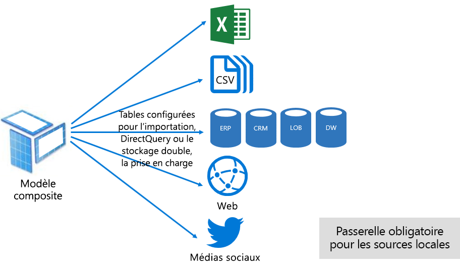

Modèles composites s’efforcent d’atteindre le meilleur des modes d’importation et DirectQuery. Lorsque configuré de manière appropriée qu’ils peuvent combiner des performances élevées pour les requêtes de modèles en mémoire avec la possibilité de récupérer des données en quasi-temps réel à partir de sources de données.

Les modélisateurs de données qui développent des modèles composites sont susceptibles de configurer les tables de type de dimension dans importer ou double mode et le type de fait tables de stockage en mode DirectQuery. Par exemple, considérez un modèle avec une table de type de la dimension Product dans en mode double et une table de type de fait de ventes en mode DirectQuery. La table Product pourrait être interrogée rapidement et efficacement à partir de la mémoire pour restituer un segment de rapport. La table Sales peut ensuite être interrogée en mode DirectQuery joint à la table de produits connexe. La requête de ce dernier pourrait permettre la génération d’une seule requête native efficace pour joindre des tables Product et Sales et le filtrage par les valeurs de segment.

En règle générale, les avantages et inconvénients, associées à chaque mode de modèle peuvent être considéré comme à appliquer au mode de stockage de table dans les modèles composites.

Pour plus d’informations, reportez-vous à la [utiliser des modèles composites dans Power BI Desktop](desktop-composite-models.md) document.

### Licensing

Power BI a trois licences :

- Power BI (version gratuite)
- Power BI Pro
- Power BI Premium

Le **Power BI gratuit** licence permet à une personne pour se connecter au service Power BI et travailler dans leur espace de travail personnel en publiant des modèles et rapports. Il est important de comprendre qu’il n’est pas possible de partager du contenu de Power BI à l’aide de cette licence. Cette licence, comme son nom l’indique, est gratuite.

Le **Power BI Pro** licence permet une personne à créer et de collaborer au sein d’espaces de travail d’application et de partager et de distribuer les Power BI de contenu. Ils peuvent également configurer l’actualisation de leurs jeux de données conserver automatiquement les données en cours, y compris à partir de sources de données locales. En outre, ils peuvent auditer et régissent la façon dont les données sont accessibles et utilisées. Cette licence est nécessaire pour recevoir le contenu partagé à partir d’autres sauf si l’utilisateur est associé à une capacité dédiée Power BI Premium.

Le **Power BI Premium** licence est une licence au niveau du locataire, et il est décrit dans la [présentation de Power BI Premium](#introducing-power-bi-premium) section.

Pour plus d’informations sur les licences Power BI, reportez-vous à la [tarification de Power BI](https://powerbi.microsoft.com/pricing/) page.

## Présentation de Power BI Premium

Power BI Premium offre une plate-forme unifiée de BI en libre-service et d’entreprise avec mise à l’échelle, des performances fiables et des coûts prévisibles. Principalement pour cela, en fournissant des ressources dédiées pour exécuter le service Power BI pour votre organisation.

En outre, Power BI Premium offre de nombreuses fonctionnalités d’entreprise :

- Distribution de contenu rentable, permettant le partage de contenu Power BI à un nombre illimité d’utilisateurs Power BI gratuit, y compris les utilisateurs externes
- Prise en charge des tailles de jeu de données plus grandes \[ [8](#endnote-08)\]
- Taux de rafraîchissement plus élevée de flux de données et des jeux de données (jusqu'à 48 fois par jour)
- Actualisation incrémentielle de flux de données et des jeux de données
- Les entités de flux de données lié et exécution en parallèle des transformations
- Rapports paginés
- Power BI Report Server, pour les rapports locaux
- Possibilité d’incorporer du contenu dans les applications pour le compte d’utilisateurs de l’application (PaaS)

Nombre de ces fonctionnalités peuvent être exploitées pour offrir des solutions d’entreprise efficace et évolutive et sont traités dans le [optimisation des capacités Premium](#optimizing-premium-capacities) section.

### Abonnements et licences

Power BI Premium est un abonnement à Office 365 au niveau du client disponible dans deux familles de références SKU (Stock-Keeping Unit) :

- **EM** références (SKU) (EM1-EM3) pour l’incorporation, nécessitant un engagement annuel, avec facturation mensuelle
- **P** références (SKU) (P1-P3) pour les fonctionnalités d’incorporation et d’entreprise, nécessitant un engagement mensuel ou annuel, facturés tous les mois et inclut une licence pour installer Power BI Report Server en local

Une autre approche consiste à acheter un abonnement Azure Power BI Embedded qui a une seule famille de référence (SKU) : **Un** références (SKU) (A1-A6) pour l’incorporation et la capacité à des fins de test.

Toutes les références SKU remettre v-cores pour créer des capacités \[ [9](#endnote-09)\], mais les références SKU EM sont limitées pour l’incorporation de la plus petite échelle. Bien que ce livre blanc porte sur les références SKU P, une grande partie des sujets abordés concerne également également les références SKU A.

Contrairement à l’abonnement Premium références (SKU), les références SKU Azure ne nécessitent aucune durée d’engagement et sont facturées par heure. Ils offrir élasticité complète l’activation de la mise à l’échelle des, mettre à l’échelle vers le bas, pause, reprendre et suppriment.

Azure Power BI Embedded est en grande partie hors de portée pour ce livre blanc, mais elle est décrite dans la rubrique d’approches de test comme une option pratique et économique pour tester et mesurer les charges de travail.

Pour plus d’informations sur les références SKU Azure, reportez-vous à la [Azure Power BI Embedded Documentation](/azure/power-bi-embedded/).

Les abonnements de Power BI Premium peuvent être achetés par les administrateurs dans le centre d’administration Microsoft 365. Plus précisément, uniquement les administrateurs généraux Office 365 ou les administrateurs de facturation peut acheter des références (SKU).

Une fois achetées, le client reçoit un nombre correspondant de v-cores pour affecter aux capacités - il s’agit **regroupement v-core**. Par exemple, l’achat d’une référence SKU P3 fournit au locataire 32 v-cores.

Pour plus d’informations, reportez-vous à la [comment acheter Power BI Premium](service-admin-premium-purchase.md) document.

### Capacités Premium

Contrairement à une capacité partagée où des charges de travail exécutant sur les ressources de calcul partagées avec d’autres clients, un **une capacité dédiée** est pour une utilisation exclusive par une organisation. Il est isolé avec des ressources de calcul dédiés qui offrent des performances fiables et cohérents pour le contenu hébergé.

L’objectif de ce livre blanc est **capacité Premium** , ce qui signifie qu’il est associé à aucun des références (SKU) P EM.

#### Nœuds de capacité

Comme décrit dans les abonnements et licences de rubrique, il existe deux familles de référence (SKU) de Power BI Premium : EM et P. Toutes les références SKU Power BI Premium sont disponibles en tant que nœuds de capacité, chacun représentant une quantité définie de ressources constitué de processeur, mémoire et stockage. En plus de ressources, chaque référence (SKU) a des limites opérationnelles sur le nombre de connexions DirectQuery (DQ) et connexion Live (LC) par seconde et le nombre de modèle parallèle s’actualise.

Le traitement s’effectue par un nombre défini de v-cores, répartis entre les principales et frontales.

**V-cores principaux** sont responsables de la fonctionnalité de Power BI core, y compris le traitement de requêtes, gestion du cache, en cours d’exécution R services, actualisation de modèle, traitement en langage naturel (Q & A) et rendu côté serveur de rapports et d’images. V-cores principaux sont affectés à une quantité fixe de mémoire principale utilisé pour héberger les modèles qui sont également appelés jeux de données active.

**V-cores du serveur frontal** sont responsables pour le web service, tableau de bord et rapport de gestion de documents, gestion de droits d’accès, planification, API, chargements et téléchargements et généralement pour tous les éléments liés à l’utilisateur des expériences.

Stockage est défini sur 100 To par nœud de capacité.

Les ressources et les limites de chaque référence (SKU) Premium (et dimensionnés de façon équivalente une référence (SKU)) sont décrites dans le tableau suivant.

| Nœuds de capacité | Total des v-cores | Cœurs virtuels backend | RAM (GO) | Cœurs virtuels frontend | DQ/LC (par seconde) | Parallélisme de l’actualisation de modèle |
| --- | --- | --- | --- | --- | --- | --- |
| EM1/A1 | 1 | 0.5 | 2.5 | 0.5 | 3.75 | 1 |
| EM2/A2 | 2 | 1 | 5 | 1 | 7.5 | 2 |
| EM3/A3 | 4 | 2 | 10 | 2 | 15 | 3 |
| P1/A4 | 8 | 4 | 25 | 4 | 30 | 6 |
| P2/A5 | 16 | 8 | 50 | 8 | 60 | 12 |
| P3/A6 | 32 | 16 | 100 | 16 | 120 | 24 |
| | | | | | | |

#### Charges de travail de la capacité

Charges de travail de la capacité sont accessibles aux utilisateurs des services. Par défaut, les capacités Premium et Azure prend en charge uniquement un jeu de données la charge de travail associé en cours d’exécution des requêtes de Power BI qui ne peut pas être désactivés.

Charges de travail supplémentaires peuvent être activées pour les rapports paginés, flux de données et l’intelligence artificielle. Chaque charge de travail supplémentaire nécessite la configuration de la mémoire maximale (en pourcentage de mémoire totale disponible) qui peut être utilisée par la charge de travail.

#### Fonctionnement des capacités

À tout moment, le service Power BI s’efforce de tirer le meilleur parti de ressources de capacité tandis que ne dépassant ne pas les limites imposées sur la capacité.

Opérations de la capacité sont classées comme étant interactif ou en arrière-plan. Opérations interactives incluent les demandes de rendu et de répondre aux interactions de l’utilisateur (filtrage, Q & r l’interrogation, etc.). En règle générale, l’interrogation de modèle Importer la mémoire est gourmandes en ressources, tandis que l’interrogation de modèles de LC/DQ est sollicitant beaucoup le processeur. Opérations d’arrière-plan incluent de flux de données et importer des actualisations de modèle et la mise en cache de requête de tableau de bord.

Il est important de comprendre qu’opérations interactives toujours auront la priorité sur les opérations d’arrière-plan pour garantir la meilleure expérience utilisateur possible. Si les ressources sont insuffisantes, les opérations d’arrière-plan sont ajoutées à une file d’attente pour le traitement lors de la libérer des ressources. Opérations d’arrière-plan, telles que les actualisations du jeu de données et les fonctions d’intelligence artificielle, peuvent être un processus intermédiaire arrêté par le service Power BI et ajouté à une file d’attente.

Modèles d’importation doivent être entièrement chargées en mémoire afin qu’ils peuvent être interrogés ou actualisés. Le service Power BI gère la mémoire à l’aide de l’utilisation de sophistiqué des algorithmes pour garantir une utilisation maximale de mémoire disponible et peut aller de sollicitation excessive de la capacité : S’il est possible pour une capacité pour stocker l’importation de nombreux modèles (jusqu'à 100 To par capacité Premium), lors de leur stockage sur disque combiné dépasse la mémoire pris en charge (et de mémoire supplémentaire est nécessaire pour l’interrogation et l’actualisation), puis ils ne peuvent pas tous être chargées en mémoire à le même temps.

Modèles d’importation sont par conséquent chargés dans - et retirés - mémoire en fonction de l’utilisation. Un modèle d’importation est chargé lorsqu’il est interrogée (opération interactive) et ne sont pas encore en mémoire, ou quand il doit être actualisé (opération d’arrière-plan).

La suppression d’un modèle à partir de la mémoire est appelée **éviction** , et c’est une opération Power BI peut effectuer rapidement selon la taille des modèles. Si la capacité ne rencontre pas de toute pression de mémoire, les modèles sont simplement chargés en mémoire et y restent. \[[10](#endnote-10) \] Toutefois, lors de la mémoire disponible est insuffisante pour charger un modèle, le service Power BI devez d’abord libérer la mémoire. Elle libère la mémoire en détectant les modèles qui sont devenus inactifs en recherchant des modèles qui n’ont pas été utilisés au cours des trois dernières minutes \[ [11](#endnote-11)\]et ensuite supprimer les. S’il n’y a aucun modèle inactif à supprimer, le service Power BI cherche à supprimer les modèles chargés pour les opérations d’arrière-plan. Cela peut inclure l’éviction des charges de travail en arrière-plan, comme la charge de travail d’intelligence artificielle. En dernier recours, après 30 secondes de tentatives ayant échoué \[ [11](#endnote-11)\], consiste à faire échouer l’opération interactive. Dans ce cas, l’utilisateur du rapport est normalement averti de l’échec avec une suggestion pour essayer à nouveau peu de temps.

Il est important de souligner qu’éviction du jeu de données est un comportement normal et prévu. Il s’efforce d’optimiser l’utilisation de mémoire par le chargement et le déchargement des modèles dont les tailles combinées peuvent dépasser la mémoire disponible. Il s’agit par conception et totalement transparente pour les utilisateurs de rapport. Taux d’éviction haute ne signifie pas nécessairement que la capacité est insuffisamment allocation des ressources. Ils peuvent, toutefois, constituer un problème si la victime de réactivité de l’actualisation ou de la requête en raison des taux d’éviction haute.

Les actualisations de modèles d’importation sont toujours beaucoup de mémoire comme modèles doivent être chargées en mémoire et de mémoire supplémentaire est requise pour le traitement. Une actualisation complète peut utiliser environ double la quantité de mémoire requise par le modèle. Cela garantit que le modèle peut être interrogé même lors du traitement (les requêtes sont envoyées au modèle existant, jusqu'à ce que l’actualisation est terminée et les nouvelles données de modèle seront disponibles). Notez, actualisation incrémentielle nécessitera moins de mémoire et peut se terminer plus rapidement et par conséquent, peut réduire considérablement la pression sur les ressources de capacité. Actualisations peuvent également être sollicitant beaucoup le processeur pour les modèles, en particulier ceux avec des transformations complexes de Power Query, ou des tables ou des colonnes calculées qui sont complexes ou sont basées sur des tables volumineuses.

Actualisations - comme les requêtes - nécessitent que le modèle est chargé en mémoire. Si la mémoire est insuffisante, le service Power BI va tenter de suppression de modèles inactifs, et si cela n’est pas possible (comme tous les modèles sont actifs), le travail d’actualisation est en file d’attente. Les actualisations sont généralement très sollicitant beaucoup le processeur, voire plus encore que les requêtes. Pour cette raison, il existe des limites de capacité sur le nombre d’actualisations simultanées, la valeur est 1,5 fois le nombre de v-cores principaux, arrondi par excès. S’il existe des actualisations simultanées trop nombreuses, une actualisation planifiée est mises en attente. Lorsque ces situations se produisent, il est plus long pour l’actualisation soit terminée. Notez que les actualisations de la demande (déclenchées par une demande de l’utilisateur ou d’un appel d’API) réessaiera trois fois \[ [11](#endnote-11)\], puis échouent s’il reste pas suffisamment de ressources.

## La gestion de Power BI Premium

La gestion de Power BI Premium implique l’achetant des abonnements et la création, la gestion et surveillance des capacités Premium.

### Création et la gestion des capacités

Le **les paramètres de capacité** page de la **administrateur Power BI** portail affiche le nombre de v-cores achetés et disponible (autrement dit, encore à assigner à une capacité) et répertorie les capacités Premium. La page permet d’administrateurs de service les administrateurs généraux Office 365 ou Power BI pour créer des capacités Premium à partir de v-cores disponibles, ou pour modifier les capacités Premium existantes.

Lorsque vous créez une capacité Premium, l’administrateur est requis pour définir :

- Nom de capacité (unique au sein du client)
- Aux administrateurs de capacité
- Taille de la capacité
- Région de résidence des données \[ [12](#endnote-12)\]

Au moins un administrateur de capacité doit être affecté. Les utilisateurs désignés comme administrateurs de capacité peuvent :

- Affecter des espaces de travail à la capacité
- Gérer les autorisations utilisateur, pour ajouter des administrateurs de capacité ou des utilisateurs avec des autorisations d’affectation (pour leur permettre d’affecter des espaces de travail à la capacité) supplémentaires
- Gérer les charges de travail, pour configurer l’utilisation de mémoire maximale pour les charges de travail de flux de données et les rapports paginés
- Redémarrez la capacité, pour réinitialiser toutes les opérations en cas de surcharge du système \[ [13](#endnote-13)\]

Administrateurs de capacité ne peut pas accéder aux contenu de l’espace de travail (sauf s’il est explicitement affectées d’autorisations de l’espace de travail), et ils n’ont pas accès à toutes les zones d’administration Power BI (sauf s’il est explicitement affectée) tels que les métriques d’utilisation, les journaux d’audit ou les paramètres du locataire. Plus important encore, les administrateurs de capacité n’avez pas les autorisations pour créer des nouvelles capacités ou de mettre à l’échelle des capacités actuelles. En outre, elles sont affectées sur une chaque capacité-, s’assurer qu’ils peuvent uniquement afficher et gérer les capacités auxquels elles sont affectées.

Taille de la capacité doit être sélectionnée à partir d’une liste des options de la référence (SKU) disponibles qui est limitée par le nombre de v-cores disponibles dans le pool. Il est possible de créer plusieurs capacités à partir du pool qui peut provenir d’une ou plusieurs acheté références (SKU). Par exemple, une référence SKU P3 (32 cœurs) peut servir à créer des capacités de trois : une P2 (16 cœurs) et P1 deux (2 x 8 v-cores). Amélioration des performances et mise à l’échelle peuvent être obtenus en créant des plus petite taille capacités, et ce sujet est abordé dans le [optimisation des capacités Premium](#optimizing-premium-capacities) section. L’illustration suivante montre un exemple de configuration de l’organisation Contoso fictive composée de cinq capacités Premium (3 x P1 et 2 x P3) avec chaque espace de travail d’application conteneur et plusieurs espaces de travail dans une capacité partagée.

Une capacité Premium peut être affectée à une région autre que la région d’origine du client Power BI, en fournissant un contrôle administratif sur les centres de données (dans les régions géographiques définies) se trouve le contenu Power BI. \[[12](#endnote-12)\]

Les administrateurs de service Power BI et les administrateurs généraux Office 365 peuvent modifier les capacités Premium. Plus précisément, ils peuvent :

- Modifier la taille de la capacité pour augmenter ou diminuer les ressources. Toutefois, il n’est pas possible de passer une référence (SKU) P à une référence SKU EM, ou vice versa la mise à niveau.
- Ajouter ou supprimer des administrateurs de capacité
- Ajouter ou supprimer des utilisateurs qui ont des autorisations d’affectation
- Ajouter ou supprimer des charges de travail supplémentaires
- Modifier les régions

Autorisations d’affectation sont nécessaires pour affecter un espace de travail à une capacité Premium spécifique. Les autorisations peuvent être accordées à l’ensemble de l’organisation, utilisateurs ou groupes spécifiques.

Par défaut, les capacités Premium prend en charge les charges de travail associées de l’exécution de requêtes de Power BI. Il prend également en charge les trois charges de travail supplémentaires : **Rapports paginés**, **flux de données**, et **AI**. Chaque charge de travail nécessite la configuration de la mémoire maximale (en pourcentage de mémoire totale disponible) qui peut être utilisée par la charge de travail. Il est important de comprendre qu’augmenter les allocations de mémoire maximale peut avoir un impact sur le nombre de modèles actifs qui peut être hébergé, et le débit des actualisations.

La mémoire est allouée dynamiquement aux flux de données, mais elle est allouée statiquement aux rapports paginés. Pour allouer de la mémoire maximale la statiquement parce que les rapports paginés s’exécutent dans un espace de relation contenant-contenu sécurisé de la capacité. Être vigilant lorsque paramètre paginé rapports mémoire car il réduit la mémoire disponible pour le chargement des modèles.

|                     | EM3                      | P1                       | P2                      | P3                       |
|---------------------|--------------------------|--------------------------|-------------------------|--------------------------|
| Rapports paginés | Non applicable | 20 % par défaut ; 10 % minimum | 20 % par défaut ; 5 % minimum | 20 % par défaut ; 2,5 % minimum |
| Flux de données | 20 % par défaut ; 8 % minimum  | 20 % par défaut ; 4 % minimum  | 20 % par défaut ; 2 % minimum | 20 % par défaut ; 1 % minimum  |
| AI | Non applicable | par défaut de 20 % ; minimale de 20 %  | 20 % par défaut ; 10 % minimum | 20 % par défaut ; 5 % minimum  |
| | | | | |

Suppression d’une capacité Premium est possible et n’entraîne pas la suppression de ses espaces de travail et de contenu. Au lieu de cela, il va passer des espaces de travail affectés à une capacité partagée. Lorsque la capacité Premium a été créée dans une autre région, l’espace de travail sera déplacé vers une capacité partagée de la région d’origine.

### Affectation d’espaces de travail à des capacités

Espaces de travail peuvent être affectés à une capacité Premium dans le **administrateur Power BI** **Portal** ou - pour un espace de travail d’application : dans le **espace de travail** volet.

Les administrateurs de capacité, ainsi que les administrateurs généraux Office 365 ou les administrateurs de service Power BI, peuvent en bloc affecter des espaces de travail dans le **administrateur Power BI** **Portal**. En bloc affecté peut s’appliquent à :

- **Espaces de travail par les utilisateurs** : Tous les espaces de travail appartenant à ces utilisateurs, y compris les espaces de travail personnels, sont affectés à la capacité Premium. Cela inclura la réaffectation des espaces de travail lorsqu’ils sont déjà attribués à une autre capacité Premium. En outre, les utilisateurs sont affectés également les autorisations d’affectation espace de travail.

- **Espaces de travail spécifiques**
- **Espaces de travail de toute l’organisation** : Tous les espaces de travail, y compris les espaces de travail personnels, sont affectés à la capacité Premium. De plus, tous les utilisateurs actuels et futurs sont affectées des autorisations d’affectation espace de travail. \[[14](#endnote-14)\]

Un espace de travail peut être ajouté à une capacité Premium à l’aide de la **espace de travail** volet fournissant l’utilisateur est à la fois un administrateur de l’espace de travail et dispose des autorisations d’attribution.

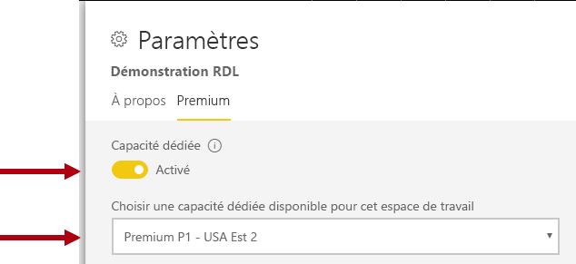

Administrateurs de l’espace de travail peuvent supprimer un espace de travail à partir d’une capacité (capacité partagée) sans nécessiter d’autorisation de l’affectation. Suppression des espaces de travail à partir des capacités dédiées efficacement déplace l’espace de travail à une capacité partagée. Notez que la suppression d’un espace de travail à partir d’une capacité Premium peut avoir des conséquences négatives résultant, par exemple, dans le contenu partagé indisponible à Power BI gratuit d’une licence aux utilisateurs, ou l’interruption d’une actualisation planifiée lorsqu’ils dépassent les allocations pris en charge capacités de partagé.

Dans le service Power BI, un espace de travail affecté à une capacité Premium est facilement identifié par l’icône en forme de losange qui orne le nom de l’espace de travail.

### Capacités de surveillance

Surveillance des capacités Premium fournit aux administrateurs le fonctionnement de la façon dont fonctionnent les capacités. Capacités peuvent être surveillées à l’aide de la [métriques de capacité Power BI Premium application](service-admin-premium-monitor-capacity.md) ou [portail d’administration Power BI](service-admin-premium-monitor-portal.md).

#### L’interprétation de mesures

Mesures doivent être surveillés pour établir une compréhension de base de l’activité des ressources de l’utilisation et la charge de travail. Si la capacité est lente, il est important de comprendre les mesures à surveiller, et les conclusions que vous pouvez apporter.

Dans l’idéal, les requêtes doivent s’exécuter au sein d’une seconde pour offrir des expériences réactives aux utilisateurs des rapports et de permettre un débit plus élevé requête. Il est généralement moindre problème lorsque les processus en arrière-plan, y compris les actualisations - prennent fois plus de temps pour terminer.

En général, les rapports lentes peuvent être une indication d’une capacité de surchauffe. Lors de l’échouent du chargement des rapports, il s’agit d’une indication d’une capacité excédentaire animée. Dans chacune de ces situations, la cause peut être imputable à nombreux facteurs, notamment :

- **Requêtes ayant échoué** certainement indiquer une sollicitation de la mémoire et d’un modèle n’a pas pu être chargé en mémoire. Le service Power BI tente de charger un modèle pendant 30 secondes avant d’échouer.

- **Temps d’attente de requête excessif** peut être dû à plusieurs raisons :
  - La nécessité pour le service Power BI d’abord supprimer l’ou les modèles et puis charger le modèle à interroger (n’oubliez pas que plus élevées taux d’éviction jeu de données autonomes ne sont pas une indication de la contrainte de capacité, sauf si accompagné par requête temps d’attente qui indiquent l’écroulement de la mémoire)
  - Charge du modèle heures (en particulier l’attente pour charger un modèle de grande taille en mémoire)
  - Requêtes longues
  - Trop de connexions LC\DQ (dépassement des limites de capacité)
  - Saturation de l’UC
  - Conceptions de rapport complexe avec un nombre excessif d’éléments visuels sur une page (n’oubliez pas que chaque visuel est une requête)
- **Des requêtes longues durées** peut indiquer que les conceptions de modèle ne sont pas optimisées, en particulier lorsque plusieurs jeux de données est actives dans une capacité, et qu’un seul jeu de données produit longue durée des requêtes. Cela suggère que la capacité est suffisamment petite, et que le jeu de données en question est optimale ou tout simplement lent. Requêtes longues peuvent être problématique car ils peuvent bloquer l’accès aux ressources requises par d’autres processus.
- **Actualisation de longue temps d’attente ou l’appel de l’intelligence artificielle temps d’attente** indiquer une mémoire insuffisante en raison des nombreux modèles actives consomment de la mémoire, ou qu’une actualisation de la problématique ne bloque autres actualise (dépassant actualisation parallèle limites).

Une explication plus détaillée de l’utilisation de la métrique est ensuite traitée dans le [optimisation des capacités Premium](#optimizing-premium-capacities) section.

## Optimisation des capacités Premium

En cas de problèmes de performances de capacité Premium, une première approche commune consiste à optimiser ou régler déjà déployé des solutions pour restaurer les temps de réponse acceptable. La logique de substitution qui consiste à éviter d’acheter une capacité Premium supplémentaire sauf s’il peut être justifié.

Quand une capacité Premium supplémentaire est nécessaire, il existe deux options qui seront abordées plus loin dans cette section :

- Augmenter la capacité Premium
- Ajouter une nouvelle capacité Premium

Enfin, le test des approches et dimensionnement de capacité Premium conclura cette section.

### Meilleures pratiques générales

Lorsque vous efforcez d’obtenir mieux il les performances et l’utilisation sont quelques meilleures pratiques qui peuvent être pris à bord comme des recommandations générales. Il s’agit des tables suivantes :

- À l’aide des espaces de travail d’application au lieu d’espaces de travail personnels
- La séparation des critique pour l’entreprise et analyse Décisionnelle libre-service (SSBI) en différentes capacités

  

- Si le partage de contenu uniquement avec les utilisateurs de Power BI Pro, il est peut-être pas nécessaire de stocker le contenu dans une capacité dédiée
- Utiliser les capacités dédiées lors de la recherche pour obtenir une durée spécifique d’actualisation, ou lorsque des fonctionnalités spécifiques sont requis, par exemple grands jeux de données ou paginé reporting

### Adressage des Questions courantes

Optimisation des déploiements de Power BI Premium est un sujet complexe impliquant une compréhension des exigences de charge de travail, les ressources disponibles et leur utilisation efficace.

Cette rubrique traite des sept questions courantes de prise en charge, décrivant les problèmes possibles et des explications et des informations sur la façon d’identifier et de les résoudre.

#### Pourquoi est la capacité lente, et que puis-je faire ?

Il existe de nombreuses raisons qui peuvent contribuer à une capacité Premium lente. Cette question requiert davantage d’informations pour comprendre ce que signifie le terme lente. Rapports de chargement est lent ? Ou ils échouent à charger ? Visuels de rapport sont lentes à charger ou mettre à jour lorsque les utilisateurs interagissent avec le rapport ? Actualisations prennent plues de temps que prévu ou rencontré au préalable des ?

Avoir acquis une compréhension de la raison, vous pouvez ensuite commencer à examiner. Réponses aux questions suivantes six vous aidera à résoudre plusieurs problèmes spécifiques.

#### Le contenu qui est à l’aide de ma capacité ?

Vous pouvez utiliser la **métriques de capacité Power BI Premium** application à filtrer par capacité et consulter les mesures de performances pour le contenu de l’espace de travail. Il est possible passer en revue l’utilisation de métriques et les ressources de performances par heure au cours des sept derniers jours pour tout le contenu stocké au sein d’une capacité Premium. Il s’agit souvent la première action à effectuer lors du dépannage d’une inquiétude d’ordre général sur les performances de capacité Premium.

Les métriques clés à surveiller sont les suivantes :

- Utilisation moyenne du processeur et nombre d’une utilisation élevée
- Moyenne de mémoire et une utilisation élevée du nombre et utilisation de la mémoire pour les jeux de données spécifiques, les flux de données et les rapports paginés
- Jeux de données Active chargée en mémoire
- Durées moyennes et maximales de requête
- Temps d’attente moyenne des requêtes
- Flux de données et le jeu de données moyen actualiser fois
- Intelligence artificielle moyenne appeler fois et temps d’attente

En outre, dans l’application de métriques de capacité de Power BI Premium, mémoire active affiche la quantité totale de mémoire allouée à un rapport qui ne peut pas être supprimé, car il est en cours d’utilisation au cours des trois dernières minutes. Un pic élevé dans le temps d’attente de l’actualisation peut être mis en corrélation avec un jeu de données de grande taille et/ou très active.

Le graphique Top 5 par durée moyenne » » met en évidence les cinq jeux de données, les rapports paginés, les flux de données et les appels de AI consomme des ressources de capacité. Contenu dans les listes des cinq premiers sont des candidats pour l’optimisation d’investigation et possible.

#### Pourquoi les rapports lent ?

Les tableaux suivants indiquent les problèmes potentiels et les façons d’identifier et de les gérer.

##### Ressources de capacité insuffisante

| Explications possibles | Comment identifier | Comment résoudre |
| --- | --- | --- |
| Total élevée de la mémoire active (modèle ne peut pas être supprimé, car il est en cours d’utilisation au cours des trois dernières minutes)   Plusieurs pics élevés dans le temps d’attente de requête   Temps d’attente plusieurs pics élevés dans l’actualisation | Surveiller les métriques de la mémoire \[ [18](#endnote-18)\]et le nombre d’éviction \[ [19](#endnote-19)\] | Diminuer la taille du modèle, ou convertir en mode DirectQuery, consultez le [optimisation des modèles](#optimizing-models) rubrique dans cette section   Augmenter la capacité   Affecter le contenu à une autre capacité |

##### Conceptions de rapport inefficace

| Explications possibles | Comment identifier | Comment résoudre |
| --- | --- | --- |
| Pages de rapport contiennent de nombreux éléments visuels (filtrage interactif peut déclencher au moins une requête par visuel)   Éléments visuels récupérer plus de données que nécessaire | Passez en revue les conceptions de rapport   Entretien avec les utilisateurs de rapport pour comprendre la façon dont ils interagissent avec les rapports   Surveiller les métriques de requête de dataset \[ [20](#endnote-20)\] | Nouvelle conception des rapports avec moins de visuels par page |

##### Jeu de données lente (en particulier lorsque les rapports précédemment suffi)

| Explications possibles | Comment identifier | Comment résoudre |
| --- | --- | --- |
| Plus en plus grands volumes de données d’importation   Logique de calcul complexe ou inefficace, y compris les rôles SNL   Modèle pas complètement optimisé   (DQ/LC) Latence de la passerelle   DQ source requête réponse lents | Passez en revue les conceptions de modèle   Surveiller les compteurs de performances de passerelle | Consultez le [optimisation des modèles](#optimizing-models) rubrique dans cette section |

##### Utilisation des rapports simultanées haute

| Explications possibles | Comment identifier | Comment résoudre |
| --- | --- | --- |
| Temps d’attente élevées pour les requêtes   Saturation de l’UC   Limites de connexion DQ/LC dépassées | Surveiller l’utilisation du processeur \[ [21](#endnote-21)\], temps d’attente de requête et l’utilisation de DQ/LC \[ [22](#endnote-22) \] métriques + durée des requêtes – si fluctue peut indiquer des problèmes d’accès concurrentiel | Augmenter la capacité ou affecter le contenu à une autre capacité   Nouvelle conception des rapports avec moins de visuels par page |

#### Pourquoi les rapports n’est ne pas chargé ?

Lorsque les rapports ne parviennent pas à charger est pire des scénarios et un signe vraiment que la capacité a une mémoire insuffisante et qu’il est trop chauffe. Cela peut se produire lorsque tous les modèles chargés sont interrogés activement et par conséquent, ne peut pas être supprimés, et toute opération d’actualisation ont été suspendue ou retardée. Le service Power BI tente de charger le jeu de données pendant 30 secondes, et l’utilisateur est prévenu normalement de l’échec avec une suggestion pour essayer à nouveau peu de temps.

Il n’existe actuellement aucune métrique pour surveiller les échecs de chargement des rapports. Vous pouvez identifier le risque de ce problème en analyse mémoire système, en particulier la plus élevée l’utilisation et l’heure de la plus forte utilisation. Évictions de jeu de données haute et la durée pendant laquelle les temps d’attente moyen dataset actualisation peuvent suggérer que ce problème se produit.

Si cela se produit très occasionnellement, cela n’est pas un problème prioritaire. Les utilisateurs de rapport sont informés que le service est occupé et qu’ils doivent retenter après une courte période. Si cela se produit trop souvent, le problème peut être résolu en augmentant la capacité Premium ou en assignant le contenu à une autre capacité.

La capacité administrateurs (Power BI et les administrateurs de service) peut surveiller le **échecs de requêtes** métrique pour déterminer quand cela se produit. Ils peuvent également redémarrer la capacité, la réinitialisation de toutes les opérations en cas de surcharge du système.

#### Pourquoi sont actualisations ne démarre pas sur la planification ?

Heures de début de l’actualisation planifiée ne sont pas garantis. Rappelez-vous que le service Power BI sera toujours donner la priorité opérations interactives sur des opérations d’arrière-plan. L’actualisation est une opération d’arrière-plan qui peut se produire lorsque les deux conditions sont remplies :

- Il existe suffisamment de mémoire
- Le nombre d’actualisations de simultanées prises en charge pour la capacité Premium n’est pas dépassé

Lorsque les conditions ne sont pas remplies, l’actualisation est en file d’attente jusqu'à ce que les conditions sont favorables.

Pour une actualisation complète, rappelez-vous qu’au moins le double la taille de mémoire de jeu de données actuelle est requise. Si suffisamment de mémoire n’est pas disponible, l’actualisation ne peut pas commencer tant que l’éviction de modèle libère la mémoire : cela signifie que des délais jusqu'à ce qu’un ou plusieurs jeux de données devient inactive et peut être supprimée.

Rappelez-vous que le nombre pris en charge des actualisations simultanées maximales est défini à 1,5 fois les v-cores principaux, arrondis par excès.

Une actualisation planifiée échoue lorsqu’il ne peut pas commencer avant l’échéance de commencer la prochaine actualisation planifiée. Une actualisation à la demande déclenchée manuellement à partir de l’interface utilisateur tente d’exécuter jusqu'à trois fois avant d’échouer.

La capacité administrateurs (Power BI et les administrateurs de service) peut surveiller le **actualiser les temps d’attente moyen (en minutes)** métrique pour déterminer la moyenne décalage entre l’heure planifiée et le début de l’opération.

Pendant que ne sont généralement pas une priorité d’administration, avoir une influence sur les données à l’heure actualise, assurez-vous que suffisamment de mémoire est disponible. Cela peut impliquer d’isoler les jeux de données à des capacités avec suffisamment de ressources connus. Il est également possible que les administrateurs peuvent coordonner avec les propriétaires de jeu de données pour aider à échelonner ou de réduire les temps d’actualisation planifiée des données afin de réduire les collisions. Notez qu’il n’est pas possible pour un administrateur pour afficher la file d’attente de l’actualisation, ou pour récupérer des planifications de jeu de données.

#### Pourquoi les actualisations lente ?

Actualisations peuvent être lente - ou perçues lente (comme les adresses de question commune précédente).

Lorsque l’actualisation est en fait lente, il peut être dû à plusieurs raisons :

- Processeur insuffisantes (actualisation peut être très sollicitant beaucoup le processeur)
- Insuffisance de mémoire, entraînant la suspension d’actualisation (qui nécessite l’actualisation de repartir de zéro lorsque les conditions sont favorables de recommencer)
- Capacité non raisons, y compris la réactivité de source de données, latence du réseau, des autorisations non valides ou le débit de passerelle
- Volume de données - une bonne raison pour configurer incrémentielle d’actualisation, comme indiqué ci-dessous

La capacité administrateurs (Power BI et les administrateurs de service) peut surveiller le **durée moyenne d’actualisation (minutes)** métrique pour déterminer un point de référence pour la comparaison au fil du temps et le **actualiser les temps d’attente moyen (en minutes)** mesures pour déterminer le délai moyen entre moyenne de décalage entre l’heure planifiée et le début de l’opération.

Actualisation incrémentielle peut réduire considérablement la durée d’actualisation des données, en particulier pour les tables de modèle de grande taille. Il existe quatre avantages associés à l’actualisation incrémentielle :

- **Actualisations sont plus rapides** : Uniquement un sous-ensemble d’une table doit réduire le chargement utilisation du processeur et mémoire, et parallélisme peut être plus élevé lors de l’actualisation de plusieurs partitions
- **Actualisations ont lieu uniquement lorsque nécessaire** : Stratégies d’actualisation incrémentielle peuvent être configurés pour charger uniquement lorsque les données ont changé
- **Actualisations sont plus fiables** : Les connexions en cours d’exécution plus courtes pour les systèmes de sources de données volatiles sont moins vulnérables à une déconnexion
- **Modèles restent trim** : Stratégies d’actualisation incrémentielle peuvent être configurés pour supprimer automatiquement l’historique au-delà d’une fenêtre glissante de temps

Pour plus d’informations, reportez-vous à la [incrémentiel d’actualisation dans Power BI Premium](service-premium-incremental-refresh.md) document.

#### Pourquoi sont données actualise se terminent ne pas ?

Lorsque l’actualisation des données commence, mais ne parvient pas à terminer, il peut être dû à plusieurs raisons :

- Insuffisance de mémoire, même s’il existe un seul modèle de la capacité Premium, par exemple, la taille du modèle est très volumineuse
- Capacité non raisons, y compris les données de source de la déconnexion du système, des autorisations non valides ou erreur de passerelle

La capacité administrateurs (Power BI et les administrateurs de service) peut surveiller le **actualiser échecs en raison de mémoire insuffisante** métrique.

#### Pourquoi sont des appels de l’intelligence artificielle échouent ?

Appels de l’intelligence artificielle peuvent échouer pour plusieurs raisons. La mémoire minimale requise pour démarrer l’intelligence artificielle charge de travail est de 5 Go, mais cela peut ne pas suffire pour certains jeux de données d’entrée. Par exemple, les apprentissage automatisé d’apprentissage du modèle requiert au moins deux fois et parfois plusieurs fois la taille du jeu de données d’entrée. En outre, un appel de l’intelligence artificielle est arrêté si elle prend plu de deux heures. Appels de formation de modèle qui ne terminent pas dans les deux heures, le meilleur modèle trouvé dans ces deux heures de formation machine automatisée est renvoyée.  Appels de l’intelligence artificielle peuvent également être interrompus par des requêtes interactives, qui sont prioritaires.

Administrateurs doivent surveiller les temps d’attente intelligence artificielle pour rechercher des signes d’autres demandes prioritaires. Les administrateurs peuvent également vous assurer que suffisamment de mémoire est disponible pour la charge de travail d’intelligence artificielle par rapport aux tailles de données d’entrée. Cela peut impliquer d’isoler les charges de travail AI capacités connu pour avoir suffisamment de ressources. Il est également possible que les administrateurs peuvent coordonner avec les propriétaires de flux de données afin d’échelonner ou de réduire les temps d’actualisation de flux de données afin de réduire les collisions. Notez qu’il n’est pas possible pour un administrateur pour afficher la file d’attente des appels intelligence artificielle.

### Optimisation des modèles

Conception de modèle optimal est cruciale pour fournir une solution efficace et évolutive. Toutefois, il est dépasse le cadre de ce livre blanc pour fournir une description complète. Au lieu de cela, cette section fournit les zones clés à prendre en compte lors de l’optimisation des modèles.

#### Optimisation des modèles de Power BI-hébergé

Optimisation de modèles hébergés dans une capacité Premium peuvent être obtenus au niveau des couches de source (s) et le modèle de données.

Prenez en compte les possibilités d’optimisation pour un modèle d’importation :

À la couche de source de données :

- Sources de données relationnelles peuvent être optimisés pour garantir l’actualisation possible le plus rapide en avant l’intégration des données, l’appliquant des index appropriés, définition des partitions de table qui correspondent aux périodes d’actualisation incrémentielle et matérialisation des calculs (à la place de calculées tables et colonnes de modèle) ou l’ajout de la logique de calcul à des vues
- Sources de données non relationnelles peuvent être intégrées préalablement avec des magasins relationnels
- Assurez-vous que les passerelles ont suffisamment de ressources, de préférence sur des ordinateurs dédiés, avec suffisamment de bande passante réseau et à proximité les sources de données

Au niveau de la couche de modèle :

- Conceptions de requête de Power Query peuvent réduire ou supprimer des transformations complexes et en particulier ceux qui fusionnent les différentes sources de données (entrepôts de données parvenir pendant leur étape d’extraction, transformation et chargement). En outre, s’assurer que les niveaux de confidentialité de source de données appropriées sont définies, cela peut éviter nécessitant Power BI charger les résultats complets pour produire un résultat combiné entre les requêtes.
- La structure du modèle détermine les données à charger et a un impact direct sur la taille du modèle. Il peut être conçu pour éviter de charger les données inutiles en supprimant des colonnes, en supprimant les lignes (en particulier les données historiques) ou en chargeant des données résumées (aux dépens de chargement des données détaillées). Réduction de taille considérable peut être obtenue en supprimant des colonnes de cardinalité élevée (en particulier les colonnes de texte) qui ne pas stocker ou compresser très efficacement.
- Performances des requêtes de modèle peuvent être améliorées en configurant les relations de direction à sens unique, sauf s’il existe une bonne raison pour permettre le filtrage bidirectionnel. Utilisez également la fonction CROSSFILTER au lieu de filtrage bidirectionnel.
- Tables d’agrégation peuvent atteindre des requêtes plus rapide des réponses en chargeant préalable des données synthétisées, mais cela augmentera la taille du modèle et du résultat dans le temps d’actualisation. En règle générale, les tables d’agrégation doivent être réservés pour les modèles très volumineux ou des conceptions de modèle Composite.
- Colonnes et des tables calculées augmenter la taille du modèle et entraînent des temps longs d’actualisation. En règle générale, une plus petite taille de stockage et le temps d’actualisation plus rapide est possible lorsque les données sont matérialisées ou calculées dans la source de données. Si ce n’est pas possible, à l’aide de colonnes personnalisées Power Query peut offrir la compression de stockage améliorée.
- Il peut être possible d’ajuster les expressions DAX pour les mesures et des règles RLS, peut-être logique pour éviter les formules coûteux de réécriture
- Actualisation incrémentielle peut considérablement réduire le temps d’actualisation et économiser la mémoire et processeur. L’actualisation incrémentielle peut également être configurée pour supprimer les données historiques en conservant les tailles de modèle trim.
- Un modèle peut être remanié comme deux modèles lorsqu’il existe des modèles de requête différents et en conflit. Par exemple, certains rapports présentes agrégats de haut niveau sur tous les historique et peut tolérer une latence de 24 heures. Autres rapports sont concernés par les données d’aujourd'hui et avez besoin d’un accès précis aux transactions individuelles. Au lieu de concevoir un modèle unique pour répondre à tous les rapports, créer deux modèles optimisés pour chaque exigence.

Envisagez les possibilités d’optimisation pour un modèle DirectQuery. Comme le modèle émet des demandes de requête à la source de données sous-jacente, l’optimisation de source de données est essentielle pour fournir des requêtes de modèle réactif.

 

À la couche de source de données :

- La source de données peut être optimisée pour garantir l’interrogation possible le plus rapide en intégrant des données (ce qui ne sont pas possibles au niveau de la couche de modèle), appliquer des index appropriés, définir des partitions de table, la matérialisation des données (avec des vues indexées), synthétisées et Pour réduire la quantité de calcul. La meilleure expérience est obtenue lorsque les requêtes de relais doivent uniquement filtrer et effectuer des jointures internes entre les tables indexées ou des vues.
- Assurez-vous que les passerelles ont suffisamment de ressources, de préférence sur des ordinateurs dédiés, avec suffisamment de bande passante réseau et à proximité de la source de données

Au niveau de la couche de modèle :

- Power Query query conceptions doivent appliquer, de préférence, sans transformation - essayer de conserver les transformations au strict minimum
- Performances des requêtes de modèle peuvent être améliorées en configurant les relations de direction à sens unique, sauf s’il existe une bonne raison pour permettre le filtrage bidirectionnel. En outre, les relations de modèle doivent être configurées pour supposer l’intégrité référentielle est appliquée (quand c’est le cas), puis entraîne dans les requêtes de source de données à l’aide de jointures internes plus efficaces (au lieu de jointures externes).
- Évitez de créer des colonnes personnalisées de requête de Power Query ou une colonne calculée de modèle - matérialiser ces éléments dans la source de données, lorsque cela est possible
- Il peut être possible d’ajuster les expressions DAX pour les mesures et des règles RLS, peut-être logique pour éviter les formules coûteux de réécriture

Envisagez les possibilités d’optimisation pour un modèle Composite. Rappelez-vous qu’un modèle Composite permet une combinaison d’importation et de tables de DirectQuery.

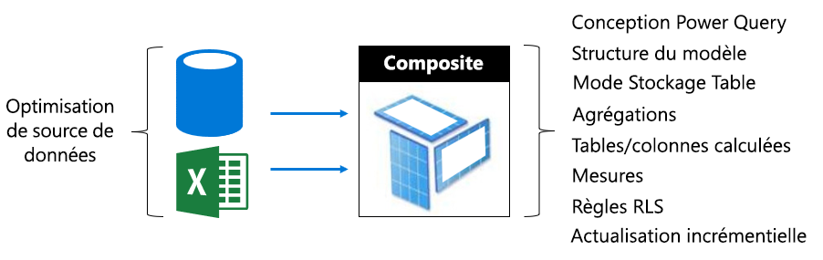

- En règle générale, les rubriques de l’optimisation pour les modèles d’importation et DirectQuery s’appliquent aux tables de modèle Composite qui utilisent ces modes de stockage.
- En règle générale, cherchent à obtenir une conception à charge équilibrée en configurant des tables de dimension de type (représentant des entités métier) en tant que double mode et le type de fait tables de stockage (souvent des tables volumineuses, représentant les faits opérationnels) en tant que mode de stockage DirectQuery. Mode de stockage double signifie que les deux importer et modes de stockage DirectQuery et cela permet au service de Power BI déterminer le mode de stockage plus efficace à utiliser lors de la génération d’une requête native pour le transfert.
- Assurez-vous que les passerelles ont suffisamment de ressources, de préférence sur des ordinateurs dédiés, avec suffisamment de bande passante réseau et à proximité les sources de données
- Les tables d’agrégations configurées comme mode de stockage d’importation peut fournir des améliorations des performances considérables requête lorsqu’il est utilisé pour résumer les tables de faits-type de mode de stockage DirectQuery. Dans ce cas, les tables d’agrégation augmentera la taille du modèle et augmenter le temps d’actualisation, et il s’agit souvent d’un compromis acceptable pour les requêtes plus rapides.

#### Optimisation des modèles hébergé en externe

Nombreuses possibilités d’optimisation décrites dans le [Optimizing Power BI-Hosted modèles](#optimizing-power-bi-hosted-models) rubrique s’appliquent également aux modèles développés avec Azure Analysis Services et SQL Server Analysis Services. Exceptions clair sont certaines fonctionnalités qui ne sont pas actuellement pris en charge, y compris des modèles composites et des tables d’agrégation.

Une considération supplémentaire pour les jeux de données hébergé en externe est la base de données d’hébergement en relation avec le service Power BI. Pour Azure Analysis Services, cela implique la création de la ressource Azure dans la même région que le locataire Power BI (région d’accueil). Pour SQL Server Analysis Services pour IaaS, cela signifie que la machine virtuelle dans la même région d’hébergement, et en local, il consiste à s’assurer une installation de la passerelle efficace.

À part cela, il peut être d’intérêt de noter que les bases de données Azure Analysis Services et bases de données tabulaires SQL Server Analysis Services nécessitent que leurs modèles d’être entièrement chargé en mémoire et qu’ils y restent à tout moment pour prendre en charge l’interrogation. Telles que le service Power BI, il doit être suffisamment de mémoire pour l’actualisation si le modèle doit rester en ligne lors de l’actualisation. Contrairement au service Power BI, il n’existe aucun concept âgés automatiquement des modèles en mémoire en fonction de l’utilisation. Power BI Premium, offre par conséquent, une approche plus efficace pour optimiser l’interrogation de modèle avec l’utilisation de mémoire inférieure.

### Planification de la capacité

La taille d’une capacité Premium détermine sa mémoire disponible et les ressources du processeur et les limites imposées sur la capacité. Le nombre de capacités Premium est également un facteur important, que vous la créez Premium plusieurs capacités peuvent aider à isoler les charges de travail entre eux. Notez que le stockage est de 100 To par nœud de capacité, et il est susceptible d’être plus que suffisant pour toute charge de travail.

Déterminer la taille et le nombre de capacités Premium peut être difficile, en particulier pour la capacité initiale, que vous créez. La première étape de dimensionnement de capacité est de comprendre la charge de travail moyenne représentant l’usage quotidien attendu. Il est important de comprendre que certaines charges de travail sont égales. Par exemple, à l’extrémité d’une gamme - 100 utilisateurs simultanés, l’accès à une page de rapport unique qui contient un seul visuel est facilement réalisable. Encore - à l’autre extrémité du spectre - 100 utilisateurs simultanés qui accèdent aux 100 rapports différents, chacun avec 100 visuels sur la page de rapport, va rendre très différentes demandes de ressources de capacité.

Administrateurs de capacité seront donc à prendre en compte plusieurs facteurs spécifiques à votre environnement, le contenu et l’utilisation attendue. L’objectif de substitution est de maximiser l’utilisation de la capacité tout en offrant des temps de requête cohérents, temps d’attente acceptable et taux d’éviction. Facteurs à prendre en compte peuvent inclure :

- **Caractéristiques de taille et les données de modèle** : Modèles d’importation doivent être entièrement chargés dans la mémoire pour permettre l’interrogation ou d’actualisation. LC/DQ de jeux de données peut nécessiter significative de temps processeur et mémoire éventuellement importante pour évaluer les mesures complexes ou des règles RLS. Mémoire et de taille du processeur et de débit des requêtes LC/DQ sont limitées par la taille de la capacité.
- **Modèles actifs simultanés** : L’interrogation simultanées des modèles d’importation différente offrira de meilleures performances et la réactivité quand elles restent en mémoire. Il doit exister une mémoire suffisante pour héberger tous les modèles fréquemment consultés, avec plus de mémoire pour permettre son actualisation.
- **Actualisation de modèle d’importation** : Le type d’actualisation (complet ou incrémentiel), la durée et la complexité des requêtes Power Query et logique de la table/colonne calculée peuvent avoir un impact sur mémoire et l’utilisation du processeur en particulier. Actualisations simultanées sont limitées par la taille de la capacité (1,5 x backend v-cores, arrondis).
- **Requêtes simultanées** : Plusieurs requêtes simultanées peuvent entraîner dans les rapports ne répond pas quand processeur ou LC/DQ connexions dépasse la limite de capacité. Cela est particulièrement vrai pour les pages de rapport qui incluent de nombreux visuels.
- **Paginé de flux de données, rapports et les fonctions d’intelligence artificielle** : La capacité peut être configurée pour prendre en charge des flux de données, les rapports paginés et les fonctions d’intelligence artificielle, chacun nécessitant un pourcentage maximal configurable de capacité de mémoire. Mémoire est allouée dynamiquement à un flux de données, mais elle est allouée de façon statique pour les rapports paginés et de la charge de travail d’intelligence artificielle.

En plus de ces facteurs, les administrateurs de capacité peuvent envisager de créer des plusieurs capacités. Plusieurs capacités permettant l’isolation des charges de travail et peuvent être configurées pour vous assurer de charges de travail de priorité ont garanti des ressources. Par exemple, deux capacités peuvent être créées pour séparer les charges de travail critiques en libre-service des charges de travail BI (SSBI). La capacité critique pour l’entreprise peut être utilisée pour isoler les modèles d’entreprise volumineux leur fournissant des ressources garantis, avec accès accordé uniquement au service informatique de création. La capacité SSBI peut être utilisée pour héberger un nombre croissant de modèles plus petits, avec un accès accordé pour les analystes d’entreprise. La capacité SSBI pouvez rencontrer parfois les attentes de requête ou d’actualisation sont inacceptables.

Au fil du temps, les administrateurs de capacité peut équilibrer des espaces de travail sur capacités en déplacement du contenu entre des espaces de travail, ou des espaces de travail entre les capacités et en adaptant capacités. En règle générale, pour héberger la plus grande modèles vous évoluer pour une simultanéité plus élevée et de vous faire évoluer.

Rappelez-vous que l’achat d’une licence fournit au locataire v-cores. L’achat d’un **P3** abonnement peut être utilisé pour créer un, ou jusqu'à quatre capacités Premium, par exemple, 1 x P3, ou 2 x P2 ou 4 x P1. En outre, avant la migration d’une capacité de P2 à une capacité P3, pouvez considération à fractionner les v-cores pour créer deux capacités P1.

### Approches de test

Une fois une taille de la capacité est choisie, le test peut être effectué en créant un environnement contrôlé. Une option pratique et économique consiste à créer une capacité de Azure (références SKU A), en notant qu’une capacité de P1 est la même taille qu’une capacité A4, avec le P2 et P3 capacités la même taille que les capacités de A5 et A6, respectivement. Capacités Azure peuvent être rapidement créées et sont facturées sur une base horaire. Par conséquent, une fois le test terminé, ils peuvent être facilement supprimés pour interrompre les frais de coûts.

Le contenu de test peut être ajouté aux espaces de travail créés sur la capacité d’Azure et en tant qu’un seul utilisateur peut exécuter des rapports pour générer une charge de travail réaliste et représentatif des requêtes. S’il existe des modèles d’importation, une actualisation pour chaque modèle doit être effectuée également. Outils d’analyse peut ensuite être utilisé pour passer en revue toutes les mesures pour comprendre l’utilisation des ressources.

Il est important que les tests sont renouvelables : Tests doivent être exécutés plusieurs fois et ils doivent fournir environ le même résultat chaque fois. Une moyenne de ces résultats peut être utilisée pour extrapoler et estimer une charge de travail dans des conditions de production true.

Pour générer un test de stress, envisagez de développer une application pour simuler une charge de travail de test de charge. Les spécificités de la procédure à suivre sont en dehors de la portée de ce livre blanc. Pour plus d’informations, y compris un exemple de code, reportez-vous à la [charge test des Applications Power BI avec le Test de charge Visual Studio](https://blogs.msdn.microsoft.com/charles_sterling/2018/04/04/webinar-load-testing-power-bi-applications-with-visual-studio-load-test/) webinaire.

## Explorer des scénarios réels

Dans cette section, plusieurs scénarios réels seront présentées pour décrire comment aider à résoudre les problèmes courants ou défis et comment les identifier :

- [Conservation des jeux de données à jour](#keeping-datasets-up-to-date)
- [Identification des jeux de données lente de répondre](#identifying-slow-responding-datasets)
- [Identification des causes pour sporadique ralentir la réponse des jeux de données](#identifying-causes-for-sporadically-slow-responding-datasets)
- [Déterminant s’il existe suffisamment de mémoire](#determining-whether-there-is-enough-memory)
- [Déterminant s’il existe suffisamment d’UC](#determining-whether-there-is-enough-cpu)

Les étapes, ainsi que des exemples de graphique et tableau sont issues les **application de métriques de capacité Power BI Premium** (application) qu’un administrateur de Power BI aura accès à.

### Conservation des jeux de données à distance à ce jour

Dans ce scénario, une enquête a été déclenchée lorsque les utilisateurs plaignent du fait que les données du rapport apparaissent parfois ancien ou « obsolètes ».

Dans l’application, l’administrateur interagit avec le **actualise** visuel, le tri des jeux de données par le **le temps d’attente maximal** statistiques dans l’ordre décroissant. Cela leur permet de révéler les jeux de données qui ont le plus de temps d’attente, regroupées par nom de l’espace de travail.

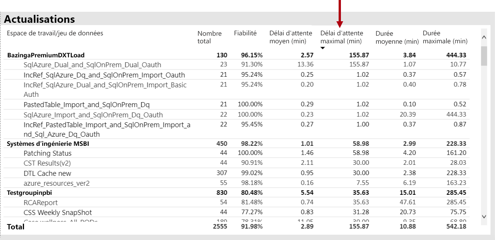

En outre, dans le **horaire actualiser attendre durées moyennes** visual, il remarque que les temps d’actualisation des pics de manière cohérente environ 16 h 00 chaque jour.

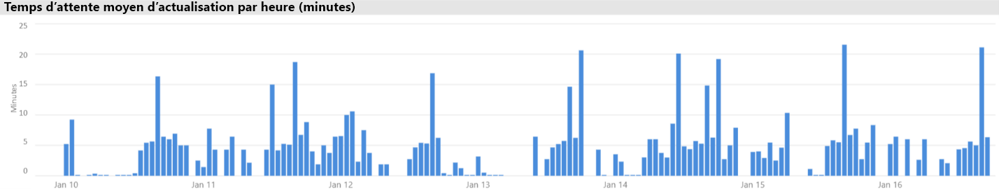

Il existe plusieurs explications possibles pour ces résultats :

- Trop de tentatives d’actualisation peut prendre place dans le même temps, dépassant les limites imposées par le nœud de capacité (six actualisations simultanées sur une P1 avec allocation de mémoire par défaut)

- Jeux de données à actualiser est peut-être trop grand pour tenir en mémoire disponible (ce qui nécessite au moins 2 x la mémoire requise pour l’actualisation complète)
- Logique de Power Query inefficace peut être ce qui entraîne un pic d’utilisation de mémoire pendant l’actualisation du jeu de données. Sur une capacité occupée, cela peut occasionnellement atteindre la limite physique, Échec de l’actualisation et potentiellement affecter d’autres opérations de vue de rapport sur la capacité.
- Jeux de données fréquemment interrogées qui ont besoin pour rester en mémoire peut-être affecter la capacité d’autres jeux de données à actualiser, en raison de la mémoire disponible limitée

Pour aider à étudier la question, l’administrateur de Power BI peut rechercher :

- Insuffisance de mémoire disponible au moment de l’actualisation des données, lorsque la mémoire disponible est inférieure à 2 fois la taille du jeu de données à actualiser
- Jeux de données qui ont été pas en cours d’actualisation et n’étaient pas dans la mémoire avant une actualisation, mais qui a démarré en afficher le trafic d’interactif pendant les heures d’actualisation lourd. Pour voir quels jeux de données ont été chargés en mémoire à tout moment un Power BI administrateur peut examiner la zone de jeux de données de **jeux de données** onglet dans le filtre d’application ou entre différents à un moment donné en cliquant sur une des barres dans la **toutes les heures Chargé les nombres de jeu de données**. Un pic local (illustré dans l’image ci-dessous) indique une heure lorsque plusieurs jeux de données ont été chargées en mémoire, ce qui risque de retarder le début de l’actualisation planifiée
- Évictions de jeu de données accrue en tenant placer lors des actualisations de données sont planifiées pour débuter, indiquant la pression de mémoire élevée provoquée en répondant à des rapports interactifs différents trop avant le délai d’actualisation est survenu. Le **horaire Évictions de jeu de données et la consommation de mémoire** visual peut indiquer clairement les pics de suppressions.

L’illustration suivante montre un pic local dans les jeux de données chargées, ce qui suggère des requêtes interactives retardée début des actualisations. Sélection d’une période de temps dans le **chargé Dataset compte toutes les heures** visual traversera filtre le **tailles de jeu de données** visual.

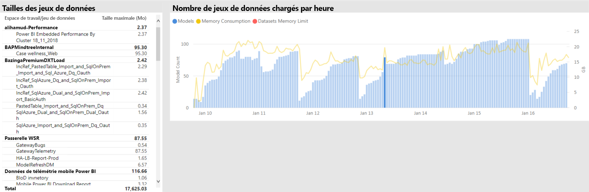

L’administrateur de Power BI peut tenter de résoudre le problème en prenant des mesures pour vous assurer que suffisamment de mémoire est disponible pour les actualisations des données de commencer par :

- Contacter le jeu de données propriétaires et demander à échelonner et espacer les données planifications d’actualisation
- Réduction du jeu de données charge de requête en supprimant des tableaux de bord inutiles ou tableau de bord dispose en mosaïque, en particulier ceux qui appliquent la sécurité de niveau ligne
- Accélérer les actualisations des données en optimisant la logique de Power Query, modèle des colonnes calculées ou actualiser des tables, ce qui réduit la taille du jeu de données ou de la configuration des jeux de données volumineux pour effectuer des données incrémentielles

### Identification des jeux de données lente de répondre

Dans ce scénario, une enquête a été déclenchée lorsque les utilisateurs plaignent du fait que certains rapports prenait beaucoup de temps à ouvrir et parfois se bloquait.

Dans l’application, l’administrateur de Power BI peut utiliser le **durées de requête** visual pour déterminer les jeux de données moins performant en triant les jeux de données par ordre décroissant **durée moyenne**. Cet élément visuel affiche également dataset les nombres de requêtes, afin que vous puissiez voir la fréquence d’interrogation des jeux de données.

L’administrateur de Power BI peut faire référence à la **Distribution de durée de requête** visual, qui montre une distribution globale des performances des requêtes compartimentées (< = 30 ms, 0-100 ms, etc.) pour la période filtrées. En règle générale, les requêtes que prennent une seconde ou moins sont considérés comme réactif par la plupart des utilisateurs ; les requêtes qui durent plus longtemps ont tendance à créer une perception de mauvaises performances.

Le **horaire Distribution de durée de requête** visual permet à l’administrateur de Power BI identifier les périodes d’une heure ont été perçue lorsque la capacité de performances faibles. Plus la barre segmente cette requête représentent durées une seconde, plue le risque que les utilisateurs constatent des performances médiocres.

L’élément visuel est interactif, et quand un segment de la barre est sélectionné, le correspondantes **durées de requête** visuel sur la page de rapport de table est le filtrage croisé pour afficher les jeux de données qu’il représente. Ce filtrage croisé permet de l’administrateur de Power BI identifier facilement ce qui répondre lentement des jeux de données.

L’illustration suivante montre un visuel filtré par **horaire Distributions de durée de requête**, focalisation sur les jeux de données moins performant des compartiments d’une heure. 

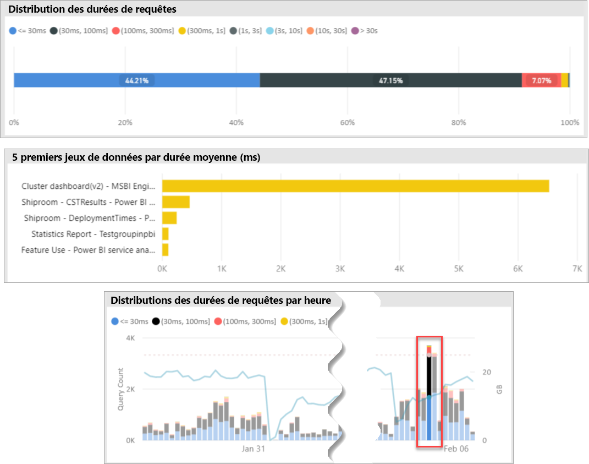

Une fois que le jeu de données de performance médiocre dans un intervalle de temps de 1 heure spécifique est identifié, l’administrateur de Power BI peut examiner si des performances médiocres sont dû à une capacité surchargée ou en raison de mal conçu le jeu de données ou un rapport. Pour ce faire, elles peuvent faire référence à la **temps d’attente de requêtes** visuel et des jeux de données de tri par ordre décroissant du temps d’attente moyenne des requêtes. Si un grand pourcentage des requêtes en attente, une demande élevée pour le jeu de données est probablement la cause de nombreuses attentes de requête. Si le temps d’attente de la requête moyenne est importante (> 100 ms), il peut être nécessaire de revoir le jeu de données et d’un rapport pour voir si les optimisations peuvent être effectuées. Par exemple, peut-être visuels moins de pages de rapport ou attribué une optimisation de l’expression DAX.

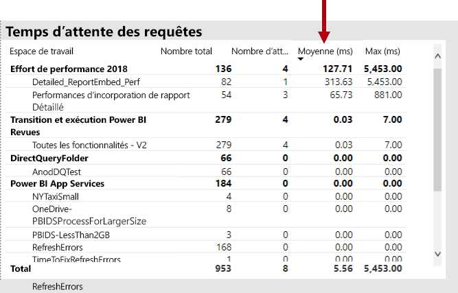

Il existe plusieurs raisons possibles pour la build de temps d’attente requête dans les jeux de données :

- Une conception de modèle optimaux, les expressions de mesure ou même conception de rapports - toutes les circonstances qui peuvent contribuer à long terme des requêtes qui consomment des niveaux élevés de processeur. Cela force les nouvelles requêtes à attendre jusqu'à ce que les threads d’UC devient disponibles et peuvent de créer un effet de convoi (réflexion embouteillage), plus fréquemment rencontré pendant les heures de pointe. Le **attentes de requête** page se trouve la ressource principale pour déterminer si des jeux de données ont des temps d’attente moyen élevées pour les requêtes.
- Un nombre élevé d’utilisateurs simultanés de capacité (des centaines de milliers) consommant le même rapport ou jeu de données. Jeux de données même bien conçu peut effectuer mal dépasse un seuil d’accès concurrentiel. Cela est généralement indiqué par un seul jeu de données indiquant une valeur nettement plus élevée pour la requête compte que les autres jeux de données apparaissent (autrement dit, 300K les requêtes pour un jeu de données par rapport à < 30K des requêtes pour toutes les autres jeux de données). À un moment donné la requête attend que ce jeu de données commenceront à échelonner, cela ne sera visible dans le **durées de requête** visual.
- Nombreux disparates des jeux de données interrogées simultanément, à l’origine écroulement comme jeux de données fréquemment cycle en mémoire. Ainsi, les utilisateurs qui rencontrent le ralentissement des performances lorsque le jeu de données est chargé en mémoire. Pour vérifier cela, l’administrateur de Power BI peut faire référence à la **horaire Évictions de jeu de données et la consommation de mémoire** visual, ce qui peut indiquer qu’un grand nombre de jeux de données est chargé en mémoire sont en cours exclue à plusieurs reprises.

### Identification des Causes pour sporadique ralentir la réponse des jeux de données

Dans ce scénario, une enquête a été déclenchée lorsque les utilisateurs décrit que rapports visuels sentis parfois ralentir pour répondre ou peut cesser de répondre, mais à d’autres moments, il s’agissait acceptable réactives.

Dans l’application, le **durées de requête** section a été utilisée pour rechercher le jeu de données coupable de la façon suivante :

- Dans le **durées de requête** visual l’administrateur filtré de jeu de données par jeu de données (à partir des principaux jeux de données interrogées) et examiné les barres filtrés croisées dans le **horaire Distributions de requête** visual.
- Quand une barre d’une heure unique a montré des modifications importantes dans le rapport entre tous les groupes de durée de requête et les autres barres d’une heure pour ce jeu de données (par exemple, les rapports entre les couleurs change radicalement), cela signifie que ce jeu de données illustré une modification sporadique dans performances.
- Les barres d’une heure affichant une partie anormale des requêtes peu performantes, indiqué un intervalle de temps dans laquelle ce jeu de données a été affecté par un effet de voisin bruyant, provoqué par les activités d’autres jeux de données.

L’image ci-dessous montre une heure sur le 30 janvier, où vraiment un handicap significatif des performances d’un jeu de données s’est produite, indiquée par la taille de la « (3,10s] « l’exécution du compartiment de durée. Cliquer sur cette barre d’une heure, vous affichez tous les jeux de données chargées en mémoire pendant ce temps, donc en exposant les jeux de données coupable candidat à l’origine de l’effet de voisin bruyant.

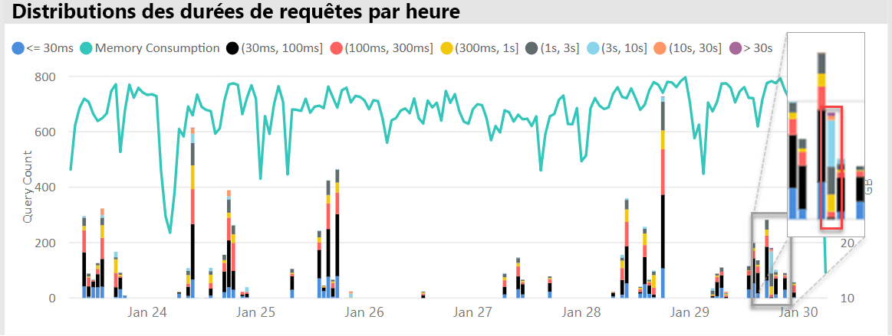

Une fois un intervalle de temps problématique identifié (c'est-à-dire pendant 30 janvier dans l’image ci-dessus) l’administrateur Power BI peut supprimer tous les filtres de dataset, puis filtrer uniquement par cet intervalle de temps pour déterminer quels jeux de données ont été interrogés activement pendant ce temps. Le coupable dataset pour l’effet de voisin bruyant est généralement le jeu de données interrogée supérieur soit celle présentant la durée moyenne des requêtes plus longue.

Une solution à ce problème peut consister à distribuer le coupable de jeux de données sur différents espaces de travail sur différentes capacités Premium, ou sur une capacité partagée si la taille du jeu de données, les exigences de la consommation et actualisation des données modèles est pris en charge.

L’inverse peut être true. L’administrateur de Power BI peut identifient les heures lorsque une performance de requête de jeu de données améliore considérablement et recherchez ce qui a disparu. Si certaines informations sont manquantes sur ce point, qui peut aider pour pointer vers le problème à l’origine.

### Déterminant si il existe suffisamment de mémoire

Pour déterminer s’il existe suffisamment de mémoire pour la capacité de terminer ses charges de travail, l’administrateur de Power BI peut faire référence à la **pourcentages de mémoire consommée** visuel dans le **jeux de données** onglet de l’application. **Tous les** mémoire (totale) représente la mémoire consommée par les jeux de données chargées en mémoire, qu’ils sont activement interrogées ou traitées. **Active** mémoire représente la mémoire consommée par les jeux de données qui est en cours de traitement.

Dans une capacité intègre l’élément visuel doit ressembler à cette, montrant un écart entre tous les (total) et de la mémoire Active :

Dans une capacité rencontre la sollicitation de la mémoire, le même élément visuel indique clairement mémoire active et la mémoire totale convergentes, ce qui signifie qu’il est impossible de charger les jeux de données supplémentaires dans la mémoire à ce stade dans le temps. Dans ce cas, l’administrateur de Power BI pouvez cliquer sur **capacité redémarrer** (dans **Options avancées** de la zone de paramètres de capacité du portail d’administration). Redémarrage les résultats de la capacité en cours de tous les jeux de données de la mémoire et de les autoriser à recharger en mémoire en fonction des besoins (par les requêtes ou actualisation des données).

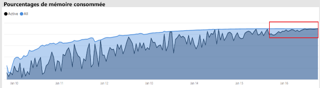

### Déterminant si il est suffisamment à l’UC

En règle générale, utilisation moyenne du processeur d’une capacité doit rester au-dessous de 80 %. En cas de dépassement signifie la que saturation de l’UC est proche de la capacité.

Effets de la saturation de l’UC sont exprimées par les opérations prend plus de temps qu’ils le devraient en raison de la capacité d’effectuer des nombreux changements de contexte du processeur, car il tente de traiter toutes les opérations. Temps d’attente dans une capacité Premium avec un grand nombre de requêtes simultanées, que cela est indiqué par la requête. Une conséquence élevées pour les requêtes des temps d’attente est le temps de réponse plus lent que d’habitude. L’administrateur de Power BI peut facilement identifier lors de l’UC est saturée en consultant le **horaire Distributions de temps attendre requête** visual. Nombres indiquent la saturation de l’UC potentielle des temps d’attente de pics périodiques de requête.

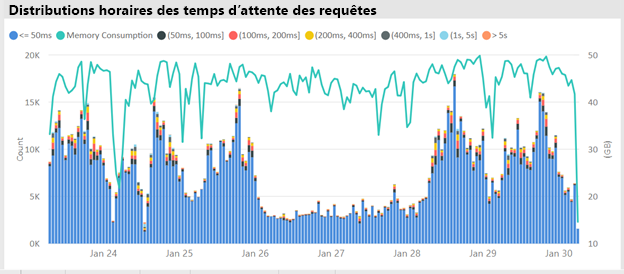

Un modèle similaire peut parfois être détecté dans les opérations d’arrière-plan si elles contribuent à la saturation de l’UC. Un administrateur Power BI peut rechercher une crête périodique dans le temps d’actualisation pour un jeu de données spécifique, ce qui peut indiquer la saturation de l’UC au moment (probablement en raison d’autres actualisations du jeu de données en continu et/ou de requêtes interactives). Dans cette instance, en faisant référence à la **système** vue dans l’application ne révèle pas nécessairement que le processeur est à 100 %. Le **système** vue affiche les moyennes de toutes les heures, mais l’UC peut être saturée pendant plusieurs minutes des opérations lourdes, qui s’affiche en tant que des pics dans le temps d’attente.

Il n’y a plus de nuances de voir l’effet de saturation de l’UC. Tandis que le nombre de requêtes qui attendent est important, les temps d’attente de requête se produira toujours dans une certaine mesure sans provoquer une dégradation des performances notable. Certains jeux de données (avec la plus longue durée des requêtes moyenne, indiquant la taille ou complexité) est plus susceptibles d’engendrer aux effets de la saturation de l’UC que d’autres. Pour identifier facilement ces jeux de données, l’administrateur de Power BI puisse rechercher des modifications dans la composition de la couleur des barres dans le **Distribution des durées d’attente toutes les heures** visual. Après la détection d’une barre de valeurs hors norme, ils peuvent rechercher les jeux de données ayant des attentes de requête pendant cette période et également consulter le temps d’attente moyenne des requêtes par rapport à la moyenne de durée de la requête. Lorsque ces deux mesures sont de la même ampleur et la charge de travail de requête pour le jeu de données est non négligeable, il est probable que le jeu de données est affecté par processeur insuffisantes.

Cet effet peut être particulièrement évident lorsqu’un jeu de données est consommé en rafales de courtes de requêtes de fréquence élevée par plusieurs utilisateurs (par exemple, dans une session de formation), ce qui entraîne une saturation de l’UC pendant chaque intégration. Dans ce cas, vous peuvent rencontrer des temps d’attente de requête significative sur ce jeu de données, ainsi que d’affecter les autres jeux de données de la capacité (effet de voisin bruyant).

Dans certains cas, les administrateurs Power BI peuvent demander que les propriétaires de jeu de données crée un inférieur charge de travail de requêtes volatile en créant un tableau de bord (Actualiser le qui interroge régulièrement avec n’importe quel jeu de données pour les vignettes mises en cache) au lieu d’un rapport. Cela peut aider à éviter des pics lors du chargement du tableau de bord. Cette solution n'est pas toujours possible pour étant donné les besoins de l’entreprise, cependant, elle peut être un moyen efficace pour éviter la saturation de l’UC, sans apporter de modification au jeu de données.

## Conclusion

Power BI Premium fournit des performances plus cohérentes, prise en charge de grands volumes de données et la souplesse d’une plate-forme unifiée de BI libre-service et d’entreprise pour tous les membres de votre organisation. Ce livre blanc technique de niveau 300 a été écrit spécifiquement pour les administrateurs Power BI et les auteurs de contenu et les serveurs de publication. Il vise à les aider à comprendre le potentiel de Power BI Premium et d’expliquer comment concevoir, déployer, surveiller et résoudre les problèmes des solutions évolutives.

Pour déployer et gérer les capacités de Power BI Premium, les administrateurs et les développeurs de modèles nécessite une très bonne compréhension de la fonction de capacités, comment ils peuvent être gérés et contrôlés, et comment les modèles peuvent être optimisées, afin de répondre correctement à problèmes de performances et les goulots d’étranglement ils surviennent.

## Notes de fin

\[1\] ce document vise à Power BI Premium, qui est uniquement pris en charge par le service de cloud Power BI et Power BI Report Server est donc pas dans la portée, à l’exception état de la licence requise pour installer Power BI Report Server est inclus avec certains Références (SKU) de Power BI Premium.

\[2\] power BI comme un service cloud lorsqu’il est utilisé pour incorporer du contenu pour le compte utilisateurs d’applications est Platform-as-a-Service (PaaS). Ce type d’incorporation est possible avec les deux produits différents, d'entre eux étant Power BI Premium.

\[3\] push, diffusion en continu et les jeux de données hybride ne sont pas stockées dans les capacités Premium et sont donc pas en considération lors du déploiement, la gestion et surveillance des capacités Premium.

\[4\] des classeurs Excel comme un type de contenu Power BI ne sont pas stockées dans les capacités Premium et sont donc pas en considération lors du déploiement, de la gestion ou de surveillance des capacités Premium.

\[5\] visuels peuvent être configurés pour ignorer les interactions de segments. Pour plus d’informations, reportez-vous à la [interactions de visualisation dans un rapport Power BI](service-reports-visual-interactions.md) document.

\[6\] la différence de taille peut être déterminée en comparant la taille du fichier Power BI Desktop avec le Gestionnaire des tâches de mémoire à l’aide du fichier.

\[7\] inclure de prise en charge des sources de données Microsoft SQL Server, briques de données Azure, Azure HDInsight Spark (bêta), Azure SQL Database et Azure SQL Data Warehouse. Pour plus d’informations sur les sources supplémentaires, reportez-vous à la [des sources de données pris en charge par la requête directe dans Power BI](desktop-directquery-data-sources.md) document.

\[8\] power BI Premium prend en charge le chargement d’un fichier Power BI Desktop (.pbix) avec un maximum de 10 Go de taille. Une fois chargé, un jeu de données peut croître jusqu'à 12 Go à la suite de l’actualisation. Taille maximale du téléchargement varie par référence (SKU). Pour plus d’informations, reportez-vous à la [prise en charge de Power BI Premium pour les jeux de données volumineux](service-premium-large-datasets.md) document.

\[9\] références (SKU) ayant moins de quatre cœurs ne s’exécutent pas sur une infrastructure dédiée. Cela inclut le EM1 EM2, A1 et A2 références (SKU).

\[10\] bien que rares, les modèles peuvent être déchargées de la mémoire en raison d’opérations de service.

\[11\] ces durées sont susceptibles de changer à tout moment.

\[12\] cela correspond à plusieurs zones géographiques, actuellement en version préliminaire. La logique pour un déploiement de plusieurs zones géographiques est généralement utilisé pour d’entreprise ou de respect des réglementations, plutôt que de performances et mise à l’échelle. Rapport et le chargement du tableau de bord implique tout de même les demandes vers la région d’origine pour les métadonnées. Pour plus d’informations, reportez-vous à la [prise en charge de plusieurs zones géographiques pour Power BI Premium (version préliminaire)](service-admin-premium-multi-geo.md) document.

\[13\] il est possible que les utilisateurs peuvent provoquer des problèmes de performances en surcharge le service Power BI avec les travaux, écriture de requêtes trop complexes, création de références circulaires, etc.

\[14\] la possibilité d’affecter des espaces de travail de toute l’organisation n’est pas recommandée, et une approche plus ciblée est préférée. En règle générale, il n’est pas recommandé d’utiliser des espaces de travail personnels pour le contenu de production.

\[15\] il est possible de surveiller les références SKU A dans l’application ou dans le portail Azure, mais pas dans le portail d’administration Power BI. Pour surveiller les références SKU A, actualisation du rapport échoue si l’application n’a pas été ajoutée au rôle de lecteur de la ressource. Pour plus d’informations, reportez-vous à la [capacités d’analyse Power BI Premium et Power BI Embedded](service-admin-premium-monitor-capacity.md) document.

\[16\] actualisations peuvent attendre quand il n’est pas suffisamment UC ou mémoire pour démarrer.

\[17\] la taille de jeu de données en mémoire peut être supérieure à la taille sur le disque jusqu'à 20 %.

\[18\] moyenne d’utilisation de la mémoire (Go) et la consommation de mémoire la plus élevée (en Go)

\[19\] Évictions de jeu de données

\[20\] requêtes de Dataset, durée moyenne de jeu de données de la requête (ms), jeu de données attendre le nombre et le temps d’attente moyenne du jeu de données (ms)

\[21\] nombre de l’utilisation du processeur élevé et de temps processeur de l’utilisation la plus élevée (sept derniers jours)

\[22\] DQ/LC haute l’utilisation du nombre et l’heure DQ/LC de meilleurs taux d’utilisation (sept derniers jours)