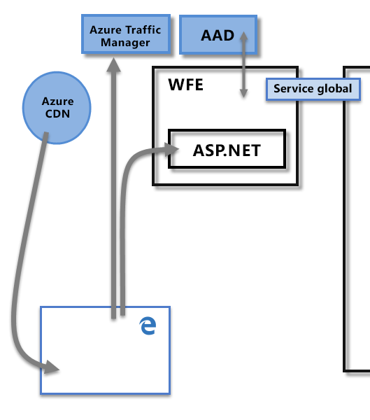
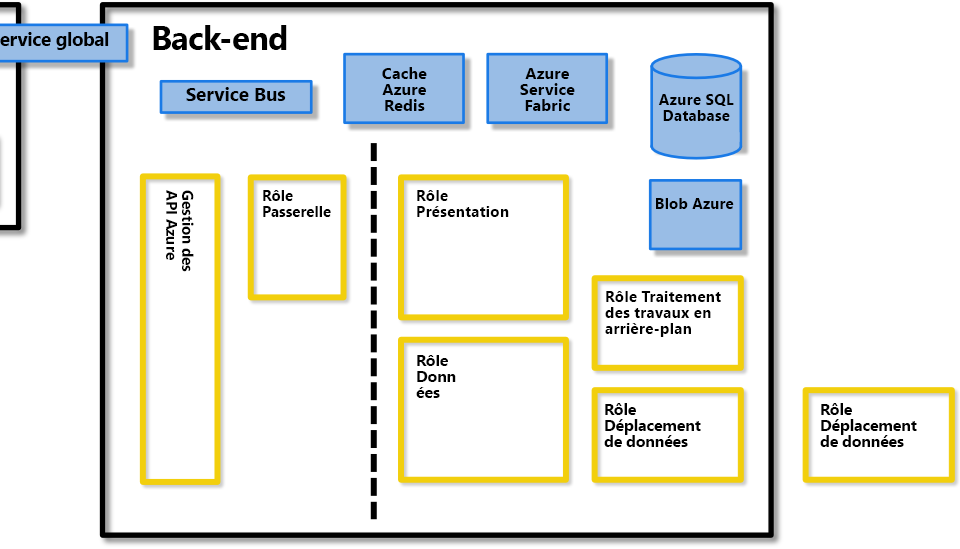
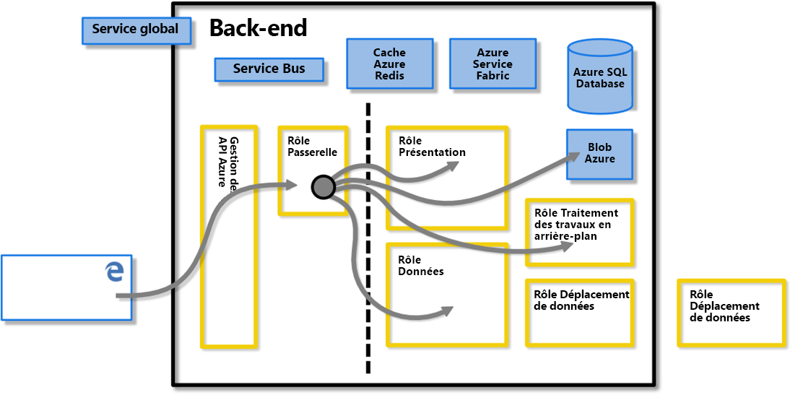
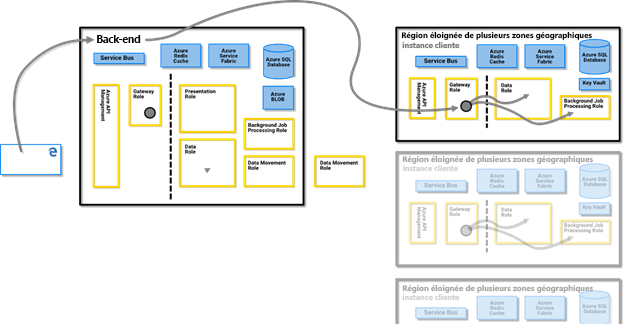
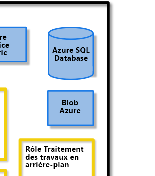
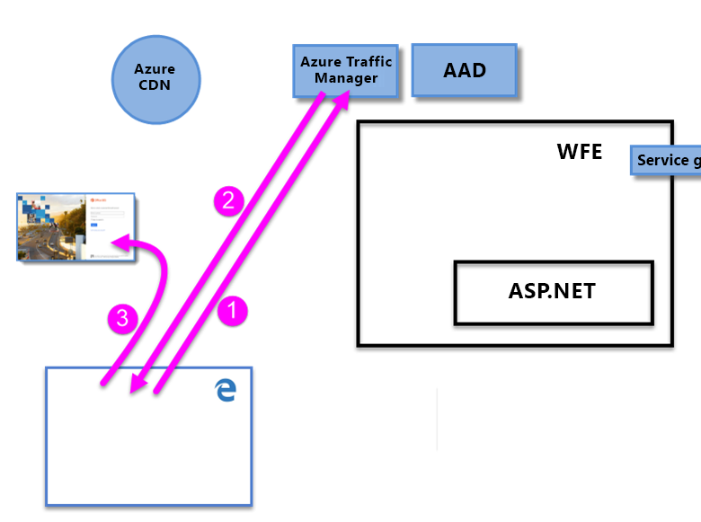
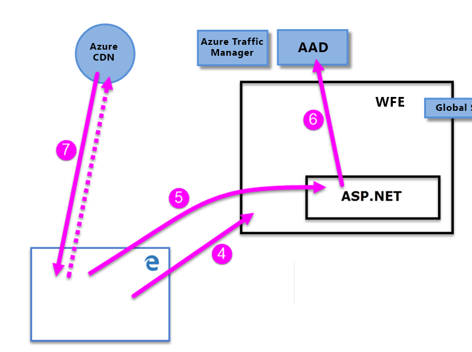

# Livre blanc sur la sécurité dans Power BI

**Résumé :** Power BI est une offre de service logiciel en ligne (*Saas*ou Software as a service) de Microsoft qui vous permet de créer facilement et rapidement des tableaux de bord, des rapports, des jeux de données et des visualisations en libre-service. Avec Power BI, vous pouvez vous connecter à de nombreuses sources de données différentes, combiner et mettre en forme les données à partir de ces connexions, puis créer des rapports et des tableaux de bord partageables.

**Enregistreur :** David Iseminger

**Réviseurs techniques :** Pedram Rezaei, Cristian Petculescu, Siva Harinath, Tod équipage, Haydn Richardson, Adam Wilson, Ben Childs, Robert Bruckner, Sergei Gundorov, Kasper de Jonge

**S’applique à :** Power BI SaaS, Power BI Desktop, Power BI Embedded, Power BI Premium

> [!NOTE]
> Vous pouvez enregistrer ou imprimer ce livre blanc en sélectionnant **Imprimer** dans votre navigateur, puis **Enregistrer au format PDF**.

## Introduction

**Power BI** est une offre de service logiciel en ligne (_SaaS_, ou Software as a Service) de Microsoft qui vous permet de créer facilement et rapidement des tableaux de bord, des rapports, des jeux de données et des visualisations de décisionnel en libre-service. Avec Power BI, vous pouvez vous connecter à de nombreuses sources de données différentes, combiner et mettre en forme les données à partir de ces connexions, puis créer des rapports et des tableaux de bord partageables.

Le service Power BI est régi par les [Conditions d’utilisation de Microsoft Online Services](https://www.microsoftvolumelicensing.com/DocumentSearch.aspx?Mode=3&amp;DocumentTypeId=31) et la [Déclaration de confidentialité de Microsoft Enterprise](https://www.microsoft.com/privacystatement/OnlineServices/Default.aspx). Pour l’emplacement du traitement des données, consultez les modalités relatives à l’emplacement de traitement des données dans les Conditions d’utilisation de Microsoft Online Services. Pour les informations sur la conformité, le [Centre de gestion de la confidentialité Microsoft](https://www.microsoft.com/trustcenter) est la ressource principale pour Power BI. L’équipe Power BI travaille sans relâche pour proposer à ses clients les dernières innovations et une meilleure productivité. Power BI se trouve actuellement dans le niveau D de l' [infrastructure de conformité Office 365](https://download.microsoft.com/download/1/4/3/1434ABAB-B8E9-412D-8C3A-187B5FCB7A2F/Compliance%20Framework%20document.pdf).

Cet article décrit la sécurité Power BI en fournissant une explication de l’architecture de Power BI, en expliquant comment les utilisateurs s’authentifient auprès de Power BI et comment sont établies les connexions de données, puis en décrivant comment Power BI stocke et déplace les données dans le service. La dernière section est consacrée aux questions liées à la sécurité.

## Architecture de Power BI

Le service **Power BI** repose sur **Azure**, qui est la [plateforme de cloud computing](https://azure.microsoft.com/overview/what-is-azure/) de Microsoft. Power BI est actuellement déployé dans un grand nombre de centres de données du monde entier. De nombreux déploiements actifs sont mis à la disposition des clients dans les régions prises en charge par ces centres de données, tandis qu’un nombre égal de déploiements passifs font office de sauvegarde pour chaque déploiement actif.

Chaque déploiement de Power BI est constitué de deux clusters : un cluster web frontal (**WFE**) et un cluster **principal**. Ces deux clusters sont présentés dans l’image suivante et constituent la toile de fond pour le reste de cet article. 

Power BI utilise Azure Active Directory (**AAD**) pour l’authentification et la gestion des comptes. Power BI utilise également **Azure Traffic Manager** (ATM) pour diriger le trafic utilisateur vers le centre de données le plus proche, déterminé en fonction de l’enregistrement DNS du client qui tente de se connecter, pour le processus d’authentification et le téléchargement des fichiers et du contenu statique. Power BI utilise le fichier WFE le plus proche de géographiquement pour distribuer efficacement les fichiers et le contenu statiques nécessaires aux utilisateurs, à l’exception des éléments visuels Power BI qui sont fournis à l’aide du **réseau de distribution de contenu (CDN) Azure**.

### Le cluster WFE

Le cluster **WFE** gère le processus d’authentification et de connexion initial pour Power BI. Il utilise AAD pour authentifier les clients et fournir des jetons pour les connexions clientes ultérieures au service Power BI.

Quand des utilisateurs tentent de se connecter au service Power BI, le service DNS du client peut communiquer avec **Azure Traffic Manager** pour trouver le centre de données le plus proche avec un déploiement de Power BI. Pour plus d’informations sur ce processus, consultez [Méthode de routage du trafic basé sur les performances pour Azure Traffic Manager](https://azure.microsoft.com/documentation/articles/traffic-manager-routing-methods/#performance-traffic-routing-method).

Le cluster WFE le plus proche de l’utilisateur gère la séquence de connexion et d’authentification (décrite plus loin dans cet article) et fournit un jeton AAD à l’utilisateur une fois que l’authentification a réussi. Le composant ASP.NET au sein du cluster WFE analyse la requête pour déterminer l’organisation à laquelle appartient l’utilisateur, puis consulte le **service mondial** Power BI. Le service mondial est une table Azure unique partagée par tous les clusters WFE et back-end du monde entier qui mappe les utilisateurs et les organisations clientes au centre de données hébergeant leur locataire Power BI. Le serveur WFE indique au navigateur quel cluster back-end héberge le locataire de l’organisation. Une fois qu’un utilisateur est authentifié, les interactions clientes suivantes se produisent directement avec le cluster back-end, sans que le serveur WFE serve d’intermédiaire pour ces requêtes.

### Cluster back-end Power BI

C’est par le biais du cluster **principal** que les clients authentifiés interagissent avec le service Power BI. Le cluster **principal** gère les visualisations, les tableaux de bord utilisateur, les jeux de données, les rapports, le stockage de données, les connexions de données, l’actualisation des données et d’autres aspects de l’interaction avec le service Power BI.

Le **rôle Passerelle** sert de passerelle entre les demandes des utilisateurs et le service Power BI. Les utilisateurs n’interagissent directement avec aucun rôle autre que le rôle Passerelle.

**Important :** Il est impératif de noter que _seuls_ les rôles Gestion des API Azure (**APIM**) et passerelle (**GW**) sont accessibles par le biais de l’Internet public. Ils fournissent entre autres des fonctionnalités d’authentification, d’autorisation, de protection DDoS, de limitation, d’équilibrage de charge et de routage.

La ligne en pointillés dans l’image de cluster **back-end**, ci-dessus, clarifie la limite entre les deux seuls rôles qui sont accessibles aux utilisateurs (à gauche de la ligne en pointillés) et les rôles qui sont accessibles uniquement au système. Quand un utilisateur authentifié se connecte au service Power BI, la connexion et toute requête du client sont acceptées et gérées par le **rôle Passerelle** et par le rôle **Gestion des API Azure**, qui interagit ensuite pour le compte de l’utilisateur avec le reste du service Power BI. Par exemple, quand un client tente d’afficher un tableau de bord, le **rôle Passerelle** accepte cette demande, puis envoie séparément une demande au **rôle Présentation** pour récupérer les données nécessaires au navigateur pour afficher le tableau de bord.

### Power BI Premium

**Power BI Premium** offre un espace de travail de service dédié, provisionné et partitionné aux abonnés ayant besoin de ressources dédiées pour leurs activités Power BI. Quand un client s’inscrit pour obtenir un abonnement Power BI Premium, la capacité Premium est créée par le biais d’**Azure Resource Manager**. Le déploiement de cet abonnement attribue un ensemble de machines virtuelles correspondant au niveau de l’abonnement, dans le centre de données où son locataire Power BI est hébergé (à l’exception des environnements multigéographiques, comme décrit plus loin dans ce document), lancé en tant que déploiement **Azure Service Fabric**.

Après la création, toutes les communications avec le cluster Premium sont acheminées par le biais du cluster back-end Power BI, où une connexion aux machines virtuelles dédiées de l’abonnement **Power BI Premium** du client est établie.

### Architecture de stockage de données

Power BI utilise deux principaux référentiels pour le stockage et la gestion des données : les données chargées à partir des utilisateurs sont généralement envoyées vers le stockage **Blob Azure**, et toutes les métadonnées et les artefacts pour le système proprement dit sont stockés derrière un pare-feu dans **Azure SQL Database**.

Par exemple, quand un utilisateur importe un classeur Excel dans le service Power BI, une base de données tabulaire Analysis Services en mémoire est créée, et les données sont stockées en mémoire pendant une durée allant jusqu’à une heure (ou jusqu’à ce qu’une pression de mémoire se produise sur le système). Les données sont également envoyées au stockage **Blob Azure**.

Les métadonnées relatives à l’abonnement Power BI d’un utilisateur, telles que les tableaux de bord, rapports, sources de données récentes, espaces de travail, informations de l’organisation, informations sur les locataires et autres métadonnées sur le système, sont stockées et mises à jour dans **Azure SQL Database**. Toutes les informations stockées dans Azure SQL Database sont entièrement chiffrées à l’aide de la technologie [TDE (Transparent Data Encryption) d’Azure SQL](https://msdn.microsoft.com/library/dn948096.aspx). Toutes les données stockées dans Stockage Blob Azure sont également chiffrées. Vous trouverez des informations supplémentaires sur le processus de chargement, de stockage et de déplacement des données dans la section **Stockage et déplacement de données**.

## Création de locataire

Un locataire est une instance dédiée du service Azure AD qu’une organisation reçoit et détient quand elle s’inscrit à un service cloud Microsoft tel qu’Azure, Microsoft Intune, Power BI ou Office 365. Chaque locataire Azure AD est distinct et indépendant des autres locataires Azure AD.

Un locataire héberge les utilisateurs d’une entreprise et les informations les concernant : leurs mots de passe, données de profil utilisateur, autorisations, et ainsi de suite. Il contient également des groupes, des applications et d’autres informations se rapportant à une organisation et à sa sécurité. Pour plus d’informations, consultez [Qu’est-ce qu’un client Azure AD ?](https://msdn.microsoft.com/library/azure/jj573650.aspx#BKMK_WhatIsAnAzureADTenant).

Un locataire Power BI est créé dans le centre de données jugé le plus proche du pays (ou de la région) fourni pour le locataire dans Azure Active Directory (ces informations ayant été fournies lors de la configuration initiale du service Office 365 ou Power BI). Le locataire Power BI ne bouge pas de cet emplacement de centre de données aujourd’hui.

### Zones géographiques multiples (Multi-Geo)

Certaines organisations ont besoin d’une présence Power BI dans plusieurs zones ou régions géographiques. Par exemple, une entreprise peut avoir son Power BI locataire dans le États-Unis mais peut également faire des affaires dans d’autres zones géographiques, telles que l’Australie, et nécessiter la conservation de certaines données Power BI au repos dans cette région distante pour se conformer aux réglementations locales. À partir de la seconde moitié de 2018, les organisations ayant leur propre locataire dans une zone géographique peuvent également approvisionner et accéder à Power BI ressources situées dans une autre zone géographique. Cette fonctionnalité est appelée **Multi-Geo** par souci pratique tout au long de ce document.

L’article le plus récent et le plus principal pour les informations sur les zones géographiques est l’article [configurer la prise en charge de plusieurs géo-géo pour Power bi Premium](service-admin-premium-multi-geo.md) . 

Il existe plusieurs détails techniques qui doivent être évalués dans le contexte des lois et réglementations locales lorsque vous travaillez dans différentes zones géographiques. Ces informations sont les suivantes :

- Une couche d’exécution de requête distante est hébergée dans la région de capacité à distance, afin de garantir que le modèle de données, les caches et le traitement de la plupart des données restent dans la région de capacité distante. Il existe quelques exceptions, comme indiqué dans l’article [multi-géo pour Power bi Premium](service-admin-premium-multi-geo.md) .
- Un texte de requête mis en cache et le résultat correspondant stocké dans une région distante restent dans cette région au repos, mais d’autres données en transit peuvent passer d’une zone géographique à une autre.
- Les fichiers PBIX ou XLSX qui sont publiés (téléchargés) vers une capacité multigéo du service Power BI peuvent entraîner le stockage temporaire d’une copie dans le stockage d’objets BLOB Azure dans la région du locataire de Power BI. Dans ce cas, les données sont chiffrées à l’aide d’Azure Storage Service Encryption (SSE), et la copie est planifiée pour garbage collection dès la fin du traitement et du transfert du contenu du fichier vers la région distante. 
- Lorsque vous déplacez des données entre des régions dans un environnement multi-géographique, l’instance des données dans la région source est supprimée dans un délai de 7-30 jours. 

### Centres de données et paramètres régionaux

Power BI est disponible dans certaines régions, en fonction de l’endroit où les clusters Power BI sont déployés dans les centres de données régionaux. Microsoft prévoit d’étendre son infrastructure Power BI dans des centres de données supplémentaires.

Les liens suivants fournissent des informations supplémentaires sur les centres de données Azure.

- [Régions Azure](https://azure.microsoft.com/regions/) : informations sur les emplacements et la présence mondiale d’Azure
- [Services Azure par région](https://azure.microsoft.com/regions/#services) : liste complète des services Azure (services d’infrastructure et services de plateforme) disponibles auprès de Microsoft dans chaque région.

Actuellement, les service Power BI sont disponibles dans des régions spécifiques, servies par les centres de donnés, comme décrit dans le centre de gestion de la [confidentialité Microsoft](https://www.microsoft.com/TrustCenter/CloudServices/business-application-platform/data-location). Le lien suivant affiche une carte des centres de données Power BI. Vous pouvez pointer sur une région pour voir les centres de données qui s’y trouvent :

* [Centres de données Power BI](https://www.microsoft.com/TrustCenter/CloudServices/business-application-platform/data-location)

Microsoft fournit également des centres de données pour des souverainetés. Pour plus d’informations sur la disponibilité du service Power BI pour les clouds nationaux, consultez [Clouds nationaux Power BI](https://powerbi.microsoft.com/clouds/).

Pour plus d’informations sur l’emplacement où sont stockées vos données et sur la façon dont elles sont utilisées, consultez le [Centre de gestion de la confidentialité Microsoft](https://www.microsoft.com/TrustCenter/Transparency/default.aspx#_You_know_where). Les engagements concernant l’emplacement des données des clients au repos sont spécifiés dans les **modalités relatives au traitement des données** dans les [Conditions d’utilisation de Microsoft Online Services](https://www.microsoftvolumelicensing.com/DocumentSearch.aspx?Mode=3&amp;DocumentTypeId=31).

## Authentification des utilisateurs

L’authentification utilisateur auprès du service Power BI se compose d’une série de requêtes, réponses et redirections entre le navigateur de l’utilisateur et le service Power BI ou les services Azure utilisés par Power BI. Cette séquence décrit le processus d’authentification utilisateur dans Power BI. Pour plus d’informations sur les options pour les modèles d’authentification utilisateur d’une organisation (modèles de connexion), consultez [Choosing a sign-in model for Office 365](https://blogs.office.com/2014/05/13/choosing-a-sign-in-model-for-office-365/) (Choix d’un modèle de connexion pour Office 365).

### Séquence d’authentification

La séquence d’authentification utilisateur pour le service Power BI se déroule comme décrit dans les étapes suivantes, qui sont illustrées dans les images suivantes.

1. Un utilisateur lance une connexion au service Power BI à partir d’un navigateur, soit en tapant l’adresse de Power BI dans la barre d’adresses (telle que https://app.powerbi.com), soit en sélectionnant _Se connecter_ dans la page d’accueil de Power BI (https://powerbi.microsoft.com). La connexion est établie à l’aide de TLS 1.2 et HTTPS, et toutes les communications ultérieures entre le navigateur et le service Power BI utilisent le protocole HTTPS. La requête est envoyée à **Azure Traffic Manager**.

2. **Azure Traffic Manager** vérifie l’enregistrement DNS de l’utilisateur afin de déterminer le centre de données le plus proche où Power BI est déployé, et il répond au système DNS avec l’adresse IP du cluster WFE à laquelle la requête de l’utilisateur doit être envoyée.

3. Le WFE redirige ensuite l’utilisateur vers la page de connexion Microsoft Online Services.

    

1. Une fois l’utilisateur authentifié, la page de connexion le redirige vers le **cluster WFE** du service Power BI le plus proche déterminé plus tôt.

2. Le navigateur envoie à Microsoft Online Services un cookie qui a été obtenu à partir de la connexion, et ce cookie est inspecté par le **service ASP.NET** dans le **cluster WFE**.

3. Le cluster WFE vérifie auprès du service **Azure Active Directory** (**AAD**) pour authentifier l’abonnement au service Power BI de l’utilisateur et pour obtenir un jeton de sécurité AAD. Quand AAD confirme que l’authentification de l’utilisateur a réussi et retourne un jeton de sécurité AAD, le cluster WFE consulte le **service mondial Power BI****** , qui tient à jour une liste des locataires et des emplacements de leurs clusters back-end Power BI, et il détermine quel cluster de service Power BI contient le locataire de l’utilisateur. Le cluster WFE dirige ensuite l’utilisateur vers le cluster Power BI où son locataire se trouve, et retourne une collection d’éléments au navigateur de l’utilisateur :

      - Le **jeton de sécurité AAD**
      - Les **informations de session**
      - L’adresse web du cluster **back-end** avec lequel l’utilisateur peut communiquer et interagir

1. Le navigateur de l’utilisateur contacte ensuite le CDN Azure spécifié, ou pour certains des fichiers le WFE, afin de télécharger la collection des fichiers communs spécifiés nécessaires pour permettre l’interaction entre le navigateur et le service Power BI. La page du navigateur inclut alors le jeton AAD, les informations de session, l’emplacement du cluster back-end associé et la collection de fichiers téléchargés à partir du cluster WFE et du CDN Azure, pour toute la durée de la session de navigateur du service Power BI.

Une fois ces étapes terminées, le navigateur entre en contact avec le cluster back-end spécifié et l’interaction entre l’utilisateur et le service Power BI débute. À partir de là, tous les appels au service Power BI s’effectuent avec le cluster back-end spécifié et tous les appels incluent le jeton AAD de l’utilisateur. Le jeton AAD a un délai d’expiration d’une heure. Le WFE actualise régulièrement le jeton si une session utilisateur reste ouverte, afin de préserver l’accès.

## Stockage et déplacement de données

Dans le service Power BI, les données sont soit _au repos_ (données accessibles à un utilisateur de Power BI qui ne sont pas en cours de traitement actuellement), soit _en cours de traitement_ (par exemple : requêtes en cours d’exécution, modèles et connexions de données en cours de traitement, données et/ou modèles en cours de chargement vers le service Power BI, et d’autres actions que les utilisateurs ou le service Power BI peuvent effectuer sur les données activement sollicitées ou mises à jour). Les données sur lesquelles des actions sont actuellement effectuées sont appelées _données en cours de traitement_. Les données au repos dans Power BI sont chiffrées. Les données en transit (c’est-à-dire qui sont en cours d’envoi ou de réception par le service Power BI) sont également chiffrées.

Le service Power BI gère aussi les données différemment selon qu’elles sont sollicitées avec **DirectQuery** ou une importation. Il existe donc deux catégories de données utilisateur pour Power BI : celles qui sont sollicitées par DirectQuery et celles qui ne le sont pas.

Une **DirectQuery** est une requête pour laquelle la requête d’un utilisateur Power BI a été traduite à partir du langage DAX (Data Analysis Expressions) de Microsoft (qui est le langage utilisé par Power BI et d’autres produits Microsoft pour créer des requêtes) dans le langage de données natif de la source de données (par exemple T-SQL ou d’autres langages de base de données natifs). Les données associées à une DirectQuery sont stockées par référence uniquement, ce qui signifie que la source de données n’est pas stockée dans Power BI quand la DirectQuery n’est pas active (sauf les données de visualisation permettant d’afficher des tableaux de bord et des rapports, comme décrit dans la section _Données en cours de traitement (déplacement des données)_ ci-dessous). Au lieu de cela, les références aux données DirectQuery sont stockées, ce qui autorise l’accès à ces données lors de l’exécution de DirectQuery. Une DirectQuery contient toutes les informations nécessaires pour exécuter la requête, notamment la chaîne de connexion et les informations d’identification permettant d’accéder aux sources de données, qui permettent à DirectQuery de se connecter aux sources de données incluses pour l’actualisation automatique. Avec une DirectQuery, les informations du modèle de données sous-jacent sont incorporées à la DirectQuery.

Une requête d’importation de jeu de données se compose d’une collection de requêtes DAX qui ne sont _pas_ traduites directement dans le langage natif de toute source de données sous-jacente. Les requêtes Import n’incluent pas d’informations d’identification pour les données sous-jacentes, et ces dernières sont chargées dans le service Power BI sauf s’il s’agit de données locales sollicitées par le biais d’une passerelle [Power BI Gateway](service-gateway-onprem.md), auquel cas la requête stocke uniquement des références aux données locales.

Le tableau suivant décrit les données Power BI en fonction du type de requête utilisé. Un **X** indique la présence de données Power BI quand vous utilisez le type de requête associé.

|  |Import  |DirectQuery  |Live Connect  |
|---------|---------|---------|---------|
|Schema     |     X    |    X     |         |
|Données de ligne     |    X     |         |         |
|Mise en cache de données de visuels     |    X     |     X    |    X     |

La distinction entre une DirectQuery et les autres requêtes détermine comment le service Power BI gère les données au repos, et si la requête proprement dite est chiffrée. Les sections suivantes décrivent les données au repos et en mouvement, et expliquent le processus de gestion des données, l’emplacement et le chiffrement.

### Données au repos

Quand les données sont au repos, le service Power BI stocke les jeux de données, les rapports et les vignettes de tableau de bord de la manière décrite dans les sous-sections suivantes. Comme mentionné plus haut, les données au repos dans Power BI sont chiffrées. Dans les sections suivantes, ETL signifie extraction, transformation et chargement.

#### Clés de chiffrement

- Les clés de chiffrement des clés d’objets blob Azure sont stockées et chiffrées dans Azure Key Vault.
- Les clés de chiffrement pour la technologie TDE Azure SQL Database sont gérées par SQL Azure lui-même.
- Les clés de chiffrement pour le service Déplacement de données et la passerelle de données locale sont stockées :
  - Dans la passerelle de données locale sur l’infrastructure du client, pour les sources de données locales
  - Dans le rôle Déplacement de données, pour les sources de données basées sur le cloud

La clé de chiffrement de contenu (clé CEK) utilisée pour chiffrer le stockage d’objets BLOB Microsoft Azure est une clé 256 bits générée de façon aléatoire. L’algorithme utilisé par la clé CEK pour chiffrer le contenu est AES\_CBC\_256.

La clé de chiffrement de clé (clé KEK) utilisée pour chiffrer ensuite la clé CEK est une clé de 256 bits prédéfinie. L’algorithme utilisé par la clé KEK pour chiffrer la clé CEK est A256KW.

Les clés de chiffrement de passerelle basées sur la clé de récupération ne quittent jamais une infrastructure locale. Power BI ne peut pas accéder aux valeurs d’informations d’identification locales chiffrées, et ne peut pas intercepter ces informations d’identification. Les clients web chiffrent les informations d’identification avec une clé publique qui est associée à la passerelle spécifique avec laquelle ils communiquent.

Pour les sources de données basées sur le cloud, le rôle Déplacement de données chiffre les clés de chiffrement à l’aide de méthodes [Always Encrypted](https://msdn.microsoft.com/library/mt163865.aspx). Apprenez-en davantage sur la [fonctionnalité de base de données Always Encrypted](https://msdn.microsoft.com/library/mt163865.aspx).

#### Groupes de données

1. Métadonnées (tables, colonnes, mesures, calculs, chaînes de connexion, etc.)

    a. Pour Analysis Services local, rien n’est stocké dans le service à l’exception d’une référence à cette base de données stockée chiffrée dans Azure SQL.

    b. Toutes les autres métadonnées pour ETL, DirectQuery et l’envoi de données (push) sont chiffrées et stockées dans Stockage Blob Azure.

1. Informations d’identification pour les sources de données d’origine
  
      a. Analysis Services local : aucune information d’identification n’étant nécessaire, aucune n’est stockée.

      b. DirectQuery : cela dépend selon que le modèle est créé directement dans le service, auquel cas il est stocké dans la chaîne de connexion et chiffré dans Stockage Blob Azure, ou s’il est importé à partir de Power BI Desktop, auquel cas les informations d’identification sont stockées chiffrées dans la base de données Azure SQL Database du rôle Déplacement de données. La clé de chiffrement est stockée sur l’ordinateur exécutant la passerelle sur l’infrastructure du client.

      c. Envoi de données (push) : non applicable

      d. ETL

      - Pour **Salesforce** ou **OneDrive**, les jetons d’actualisation sont chiffrés et stockés dans la base de données Azure SQL Database du service Power BI.
      - Autrement :
        - Si le jeu de données est configuré pour l’actualisation, les informations d’identification sont stockées chiffrées dans la base de données Azure SQL Database du rôle Déplacement de données. La clé de chiffrement est stockée sur l’ordinateur exécutant la passerelle sur l’infrastructure du client.
        - Si le jeu de données n’est pas configuré pour l’actualisation, aucune information d’identification n’est stockée pour les sources de données.

1. Données

    a. Analysis Services local et DirectQuery : rien n’est stocké dans le service Power BI.

    b. ETL : les données sont chiffrées dans Stockage Blob Azure, mais toutes les données actuellement dans Stockage Blob Azure pour le service Power BI utilisent [Azure Storage Service Encryption (SSE)](https://docs.microsoft.com/azure/storage/common/storage-service-encryption), également connu sous le nom de chiffrement côté serveur. Multi-Geo utilise également SSE.

    c. Envoi de données (push) v1 : les données sont chiffrées dans Stockage Blob Azure, mais toutes les données actuellement dans Stockage Blob Azure dans le service Power BI utilisent [Azure Storage Service Encryption (SSE)](https://docs.microsoft.com/azure/storage/common/storage-service-encryption), également connu sous le nom de chiffrement côté serveur. Multi-Geo utilise également SSE. Les données push v1 ont été supprimées à partir du 2016. 

    d. Envoi de données (push) v2 : les données sont stockées chiffrées dans Azure SQL.

Power BI utilise l’approche de chiffrement côté client, à l’aide du mode CBC (chaînage des blocs de chiffrement) avec AES (Advanced Encryption Standard) pour chiffrer son stockage d’objets blob Azure. Apprenez-en davantage sur le [chiffrement côté client](https://azure.microsoft.com/documentation/articles/storage-client-side-encryption/).

Power BI fournit une supervision de l’intégrité des données de plusieurs manières :

* Pour les données au repos dans Azure SQL, Power BI utilise dbcc, TDE et une somme de contrôle de page constante dans le cadre des offres natives de SQL.

* Pour les données au repos dans Stockage Blob Azure, Power BI utilise le chiffrement côté client et HTTPS pour transférer les données vers le stockage, avec des vérifications d’intégrité pendant la récupération des données. Apprenez-en davantage sur la [sécurité de Stockage Blob Azure](https://azure.microsoft.com/documentation/articles/storage-security-guide/).

#### Rapports

1. Métadonnées (définition de rapport)

   a. Les rapports peuvent être au format Excel pour Office 365 ou au format Power BI. Ce qui suit s’applique aux métadonnées en fonction du type de rapport :
        
    &ensp; &ensp; un. Les métadonnées de rapport Excel sont stockées sous forme chiffrée dans SQL Azure. Les métadonnées sont également stockées dans Office 365.

    &ensp; &ensp; b. Les rapports de Power BI sont stockés sous forme chiffrée dans la base de données SQL Azure.

2. Données statiques

   Les données statiques incluent des artefacts tels que les images d’arrière-plan et les visuels de Power BI.

    &ensp; &ensp; un. Pour les rapports créés avec Excel pour Office 365, rien n’est stocké.

    &ensp; &ensp; b. Pour les rapports Power BI, les données statiques sont stockées et chiffrées dans Stockage Blob Azure.

3. Caches

    &ensp; &ensp; un. Pour les rapports créés avec Excel pour Office 365, rien n’est mis en cache.

    &ensp; &ensp; b. Pour les rapports Power BI, les données pour les visuels affichés sont mises en cache chiffrées dans Azure SQL Database.
 

4. Fichiers Power BI Desktop (.pbix) ou Excel (.xlsx) d’origine publiés sur Power BI

    Parfois, une copie ou un cliché instantané des fichiers .xlsx ou .pbix est stocké dans le stockage Blob Azure de Power BI, et quand cela se produit les données sont chiffrées. Tous ces rapports stockés dans le service Power BI, dans Stockage Blob Azure, utilisent [Azure Storage Service Encryption (SSE)](https://docs.microsoft.com/azure/storage/common/storage-service-encryption), également connu sous le nom de chiffrement côté serveur. Multi-Geo utilise également SSE.

#### Tableaux de bord et vignettes de tableaux de bord

1. Caches : les données nécessaires aux visuels sur le tableau de bord sont généralement mises en cache et stockées chiffrées dans Azure SQL Database. Les autres vignettes telles que les visuels épinglés à partir d’Excel ou de SQL Server Reporting Services (SSRS) sont stockées dans Stockage Blob Azure en tant qu’images, et sont également chiffrées.

2. Données statiques, qui incluent des artefacts tels que des images d’arrière-plan et des éléments visuels de Power BI stockés, chiffrés, dans le stockage d’objets BLOB Azure.

Quelle que soit la méthode de chiffrement utilisée, Microsoft gère le chiffrement de clé pour le compte du client, soit dans un magasin de secrets, soit dans Azure Key Vault.

### Données stockées de manière transitoire sur des appareils non volatiles

Les appareils non volatiles sont des appareils dont la mémoire persiste sans puissance constante. La section suivante décrit les données qui sont stockées de manière transitoire sur des appareils non volatiles. 

#### Groupes de données

1. Métadonnées (tables, colonnes, mesures, calculs, chaînes de connexion, etc.)

2. Certains artefacts liés aux schémas peuvent être stockés sur le disque des nœuds de calcul pour une durée limitée. Certains artefacts peuvent également être stockés dans Azure REDIS Cache sans chiffrement pour une durée limitée.

3. Informations d’identification pour les sources de données d’origine

    a. Analysis Services local : rien n’est stocké

    b. DirectQuery : cela dépend selon que le modèle est créé directement dans le service, auquel cas il est stocké dans la chaîne de connexion, dans un format chiffré avec la clé de chiffrement stockée en texte clair au même emplacement (avec les informations chiffrées), ou s’il est importé à partir de Power BI Desktop, auquel cas les informations d’identification ne sont pas stockées sur les appareils non volatiles.

    > [!NOTE]
    > La fonctionnalité de création de modèle côté service a été interrompue à partir de 2017.

    c. Envoi de données (push) : aucune (non applicable)

    d. ETL : aucune (rien n’est stocké sur le nœud de calcul et rien ne diffère de ce qui est mentionné dans la section **Données au repos** ci-dessus)
4. Données

    Certains artefacts de données peuvent être stockés sur le disque des nœuds de calcul pour une durée limitée.

### Données en cours de traitement

Les données sont en cours de traitement quand elles sont activement utilisées ou sollicitées par un utilisateur. Par exemple, les données sont en cours de traitement quand un utilisateur accède à un jeu de données, révise ou modifie un tableau de bord ou un rapport, quand une actualisation se produit ou que d’autres activités d’accès aux données ont lieu. Quand l’un de ces événements se produit et place les données en cours de traitement, le **rôle Données** dans le service Power BI crée une base de données Analysis Services (AS) en mémoire et le jeu de données est chargé dans cette base de données Analysis Services en mémoire. Que le jeu de données soit basé sur une requête DirectQuery ou non, les données chargées dans la base de données AS ne sont pas chiffrées, afin d’autoriser l’accès par le **rôle Données**, et elles sont conservées en mémoire pout tout accès ultérieur jusqu’à ce que le service Power BI n’ait plus besoin du jeu de données. Pour les clients ayant un abonnement Power BI Premium, Power BI crée une base de données Analysis Services (AS) en mémoire dans la collection de machines virtuelles Power BI du client provisionnée séparément.

Une fois les données traitées, ce qui inclut le chargement initial des données dans Power BI, le service Power BI peut mettre en cache les données de visualisation dans une **base de données Azure SQL Database** chiffrée, que le jeu de données soit basé sur une requête DirectQuery ou non.

Afin de superviser l’intégrité des données en cours de traitement, Power BI utilise HTTPS, TCP/IP et TLS pour garantir le chiffrement des données et leur intégrité pendant le transport.

## Authentification des utilisateurs auprès des sources de données

Avec chaque source de données, un utilisateur établit une connexion en fonction de sa connexion, puis accède aux données avec ces informations d’identification. Les utilisateurs peuvent ensuite créer des requêtes, des tableaux de bord et des rapports basés sur les données sous-jacentes.

Quand un utilisateur partage des requêtes, des tableaux de bord, des rapports ou des visualisations, l’accès à ces données et à ces visualisations dépend de la prise en charge de la sécurité au niveau du rôle par les sources de données sous-jacentes.

Si une source de données sous-jacente prend en charge la **sécurité au niveau du rôle de Power BI****** , le service Power BI appliquera cette sécurité au niveau du rôle et les utilisateurs ne disposant pas d’informations d’identification suffisantes pour accéder aux données sous-jacentes (qui peut être une requête utilisée dans un tableau de bord, un rapport ou autre artefact de données) ne verront pas les données pour lesquelles ils ne disposent pas de privilèges suffisants. Si l’accès aux données sous-jacentes d’un utilisateur est différent de celui de l’utilisateur qui a créé le tableau de bord ou le rapport, les visualisations et autres artefacts afficheront uniquement les données correspondant au niveau d’accès dont dispose l’utilisateur sur ces données.

Si une source de données n’applique **pas** la sécurité au niveau du rôle, les informations d’identification de connexion de Power BI sont appliquées à la source de données sous-jacente ou, si d’autres informations d’identification sont fournies lors de la connexion, ces informations d’identification fournies sont appliquées. Quand un utilisateur charge des données dans le service Power BI à partir de sources de données n’appliquant pas la sécurité au niveau du rôle, les données sont stockées dans Power BI comme décrit dans la section **Stockage et déplacement de données** de ce document. Pour les sources de données n’appliquant pas la sécurité au niveau du rôle, quand les données sont partagées avec d’autres utilisateurs (par exemple dans un tableau de bord ou un rapport) ou qu’une actualisation des données a lieu, les informations d’identification d’origine sont utilisées pour accéder aux données ou les afficher.

En guise d’exemple rapide illustrant les différences entre les sources de données appliquant et n’appliquant pas la sécurité au niveau du rôle, imaginez que Sam crée un rapport et un tableau de bord, puis les partage avec Abby et Ralph. Si les données utilisées dans le rapport et le tableau de bord proviennent de sources de données qui ne prennent **pas** en charge la sécurité au niveau du rôle, Abby et Ralph pourront voir les données que Sam a incluse dans le tableau de bord (qui ont été chargées dans le service Power BI) et Abby et Ralph pourront tous deux interagir avec les données. En revanche, si Sam crée un rapport et un tableau de bord à partir de sources de données qui ne prennent pas en charge la sécurité au niveau du rôle, et qu’il les partage ensuite avec Abby et Ralph, quand Abby tentera d’afficher le tableau de bord il se produira ce qui suit :

1. Comme le tableau de bord provient d’une source de données qui prend en charge la sécurité au niveau du rôle, les visualisations de tableau de bord afficheront brièvement un message &quot;Chargement en cours&quot; pendant que le service Power BI interrogera la source de données pour récupérer le jeu de données actuel spécifié dans la chaîne de connexion associée à la requête sous-jacente du tableau de bord.

2. Les données seront sollicitées et récupérées en fonction des informations d’identification et du rôle d’Abby, et seules les données pour lesquelles Abby dispose des autorisations suffisantes seront chargées dans le tableau de bord et le rapport.

3. Les visualisations dans le tableau de bord et le rapport seront affichées en fonction du niveau du rôle détenu par Abby.

Si Ralph tentait d’accéder au tableau de bord ou au rapport partagé, la même séquence aurait lieu en fonction de son niveau de rôle.

## Power BI Mobile

Power BI Mobile est un ensemble d’applications conçu pour les trois principales plateformes mobiles : Android, iOS et Windows Mobile. Les considérations de sécurité pour les applications Power BI Mobile se répartissent en deux catégories :

* Communication de l’appareil
* L’application et les données sur l’appareil

Pour la **communication de l’appareil**, toutes les applications Power BI Mobile communiquent avec le service Power BI et utilisent les mêmes séquences de connexion et d’authentification que les navigateurs, lesquelles sont décrites en détail plus haut dans ce livre blanc. Les applications mobiles Power BI iOS et Android créent une session de navigateur dans l’application elle-même, et l’application mobile Windows a recours à un répartiteur pour établir le canal de communication avec Power BI.

Le tableau suivant indique la prise en charge de l’authentification basée sur les certificats pour Power BI Mobile en fonction de la plateforme d’appareil mobile :

| **Prise en charge de l’authentification basée sur les certificats** | **iOS** | **Android** | **Windows** |
| --- | --- | --- | --- |
| **Power BI** (connexion au service) | pris en charge | pris en charge | Non pris en charge |
| **SSRS ADFS** (connexion au serveur SSRS) | Non pris en charge | Prise en charge | Non pris en charge |

Les applications Power BI Mobile communiquent activement avec le service Power BI. La télémétrie est utilisée pour recueillir des statistiques d’utilisation des applications mobiles et des données similaires, qui sont transmises aux services responsables de la supervision de l’utilisation et de l’activité. Aucune donnée personnelle n’est envoyée avec les données de télémétrie.

L’**application Power BI sur l’appareil** stocke des données sur l’appareil afin de faciliter l’utilisation de l’application :

* Les jetons Azure Active Directory et d’actualisation sont stockés dans un mécanisme sécurisé sur l’appareil, à l’aide de mesures de sécurité standard.

* Les données sont mises en cache dans le stockage sur l’appareil, qui n’est pas chiffré directement par l’application elle-même.

* Les paramètres sont également stockés sur l’appareil sans chiffrement, mais aucune donnée utilisateur réelle n’est stockée.

Le cache de données de Power BI Mobile reste sur l’appareil pendant deux semaines ou jusqu’à ce que l’application soit supprimée, que l’utilisateur se déconnecte de Power BI Mobile ou qu’il ne parvienne pas à se connecter (par exemple en cas d’événement d’expiration du jeton ou de changement de mot de passe). Le cache de données inclut les tableaux de bord et les rapports précédemment sollicités à partir de l’application Power BI Mobile.

Les applications Power BI Mobile n’examinent pas les dossiers sur l’appareil. 

Les trois plateformes pour lesquelles Power BI Mobile est disponible prennent en charge Microsoft Intune, un service logiciel qui assure la gestion des applications et des appareils mobiles. Quand Intune est activé et configuré, les données sur l’appareil mobile sont chiffrées, et l’application Power BI elle-même ne peut pas être installée sur une carte SD. [En savoir plus sur Microsoft Intune.](https://www.microsoft.com/cloud-platform/microsoft-intune)

## Questions et réponses sur la sécurité dans Power BI

Voici quelques questions et réponses courantes relatives à la sécurité dans Power BI. Elles sont classées selon l’ordre dans lequel elles ont été ajoutées à ce livre blanc, afin de vous permettre de trouver rapidement les nouvelles questions et réponses à mesure que ce document est mis à jour. Les questions les plus récentes sont ajoutées à la fin de cette liste.

**Comment les utilisateurs se connectent et accèdent aux sources de données quand ils utilisent Power BI ?**

* **Power bi les informations d’identification et les informations d’identification de domaine :** Les utilisateurs se connectent à Power BI à l’aide d’une adresse de messagerie ; Lorsqu’un utilisateur tente de se connecter à une ressource de données, Power BI transmet l’adresse de messagerie de connexion Power BIen tant qu’informations d’identification. Pour les ressources connectées à un domaine (localement ou dans le cloud), l’adresse e-mail de connexion est mise en correspondance avec un _nom d’utilisateur principal_ ([UPN](https://msdn.microsoft.com/library/windows/desktop/aa380525(v=vs.85).aspx)) par le service d’annuaire afin de déterminer si les informations d’identification suffisent pour autoriser l’accès. Pour les organisations qui utilisent des adresses e-mail professionnelles pour se connecter à Power BI (les mêmes que pour se connecter aux ressources de travail, par exemple _david@contoso.com_ ), le mappage peut se produire sans interruption. Pour les organisations qui n’utilisaient pas des adresses e-mail professionnelles (par exemple, _david@contoso.onmicrosoft.com_ ), le mappage d’annuaire doit être établi afin d’autoriser l’accès aux ressources locales avec les informations d’identification de connexion Power BI.

* **SQL Server Analysis Services et Power bi :** Pour les organisations qui utilisent des SQL Server Analysis Services locaux, Power BI offre la Power BI passerelle de données locale (qui est une **passerelle**, comme mentionné dans les sections précédentes).  La passerelle de données locale Power BI peut appliquer une sécurité au niveau du rôle sur les sources de données. Pour plus d’informations sur la sécurité au niveau du rôle, consultez **Authentification des utilisateurs auprès des sources de données** plus haut dans ce document. Pour plus d’informations sur les passerelles, consultez [passerelle de données locale](service-gateway-onprem.md).

  De plus, les organisations peuvent utiliser Kerberos pour l’**authentification unique** et se connecter de façon fluide de Power BI à des sources de données locales telles que SQL Server, SAP HANA et Teradata. Pour plus d’informations et pour connaître la configuration spécifique requise, consultez [**Utiliser Kerberos pour l’authentification unique (SSO) de Power BI à des sources de données locales**](https://docs.microsoft.com/power-bi/service-gateway-kerberos-for-sso-pbi-to-on-premises-data).

* **Connexions sans domaine**: pour les connexions de données qui ne sont pas jointes à un domaine et qui ne sont pas associées à la sécurité au niveau du rôle, l’utilisateur doit fournir des informations d’identification lors de la séquence de connexion, qui Power bi ensuite transmises à la source de données pour établir la connexion. Si les autorisations sont suffisantes, les données sont chargées à partir de la source de données dans le service Power BI.

**Comment les données sont transférées à Power BI ?**

* Toutes les données demandées et transmises par Power BI sont chiffrées en transit à l’aide du protocole HTTPS pour la connexion entre la source de données et le service Power BI. Une connexion sécurisée est établie avec le fournisseur de données, et les données transitent par le réseau uniquement une fois que cette connexion est établie.

**Comment Power BI met en cache les données des rapports, tableaux de bord ou modèles ? Cette mise en cache est-elle sécurisée ?**

* Quand une source de données est sollicitée, le service Power BI suit la procédure décrite dans la section **Stockage et déplacement de données** plus haut dans ce document.

**Les clients mettent-ils en cache localement les données des pages web ?**

* Quand les navigateurs clients accèdent à Power BI, les serveurs web Power BI affectent la valeur _no-store_ à la directive _Cache-Control_. La directive _no-store_ indique aux navigateurs qu’ils ne doivent pas mettre en cache la page web affichée par l’utilisateur et qu’ils ne doivent pas la stocker dans le dossier de cache du client.

**Qu’en est-il de la sécurité basée sur les rôles, du partage des rapports ou des tableaux de bord et des connexions de données ? Comment cela fonctionne-t-il en termes d’accès aux données, d’affichage du tableau de bord, d’accès aux rapports ou d’actualisation ?**

* Pour les sources de données pour lesquelles la **sécurité au niveau du rôle n’est pas activée**, si un tableau de bord, un rapport ou un modèle de données est partagé avec d’autres utilisateurs par le biais de Power BI, les données sont alors accessibles aux utilisateurs avec lesquels l’affichage et l’interaction sont partagés. Power BI ne *ré-authentifie pas* les utilisateurs auprès de la source d’origine des données. Une fois les données chargées dans Power BI, l’utilisateur qui s’est authentifié auprès des données sources est responsable de la gestion des autres utilisateurs et groupes pouvant visualiser les données.

  Quand des connexions de données sont établies à une source de données prenant en charge la **sécurité au niveau du rôle**, comme une source de données Analysis Services, seules les données des tableaux de bord sont mises en cache dans Power BI. Chaque fois qu’un rapport ou un jeu de données affiché ou sollicité dans Power BI utilise des données de la source de données prenant en charge la sécurité au niveau du rôle, le service Power BI accède à la source de données pour obtenir des données en fonction des informations d’identification de l’utilisateur, et si les autorisations sont suffisantes, les données sont chargées dans le rapport ou le modèle de données pour cet utilisateur. Si l’authentification échoue, l’utilisateur reçoit une erreur.

  Pour plus d’informations, consultez la section **Authentification des utilisateurs auprès des sources de données** plus haut dans ce document.

**Nos utilisateurs se connectent à la même source de données tout le temps, dont certains requièrent des informations d’identification qui diffèrent de leurs informations d’identification de domaine. Comment peut-il éviter d’avoir à entrer ces informations d’identification chaque fois qu’elles effectuent une connexion de données ?**

* Power BI propose [Power BI Personal Gateway](https://support.powerbi.com/knowledgebase/articles/649846), une fonctionnalité qui permet aux utilisateurs de créer des informations d’identification pour plusieurs sources de données différentes, puis d’utiliser automatiquement ces informations d’identification quand ils accèdent par la suite à chacune de ces sources de données. Pour plus d’informations, consultez [Power BI Personal Gateway](https://support.powerbi.com/knowledgebase/articles/649846).

**Comment fonctionnent les groupes Power BI ?**

* Les groupes Power BI permettent aux utilisateurs de collaborer rapidement et facilement à la création de tableaux de bord, rapports et modèles de données au sein d’équipes établies. Par exemple, si vous avez un groupe Power BI qui inclut toute votre équipe, vous pouvez facilement collaborer avec tous les membres de votre équipe en sélectionnant le groupe à partir de Power BI. Les groupes Power BI équivalent aux groupes universels Office 365 (que vous pouvez [découvrir plus en détails](https://support.office.com/Article/Find-help-about-Groups-in-Office-365-7a9b321f-b76a-4d53-b98b-a2b0b7946de1), [créer](https://support.office.com/Article/View-create-and-delete-Groups-in-the-Office-365-admin-center-a6360120-2fc4-46af-b105-6a04dc5461c7) et [gérer](https://support.office.com/Article/Manage-Group-membership-in-the-Office-365-admin-center-e186d224-a324-4afa-8300-0e4fc0c3000a)) et ils utilisent les mêmes mécanismes d’authentification que ceux utilisés dans Azure Active Directory pour sécuriser les données. Vous pouvez [créer des groupes dans Power BI](https://support.powerbi.com/knowledgebase/articles/654250) ou créer un groupe universel dans le Centre d’administration Microsoft 365 ; ces deux opérations ont le même résultat pour la création de groupe dans Power BI.

  Notez que les données partagées avec des groupes Power BI respectent les mêmes principes de sécurité que toutes les données partagées dans Power BI. Pour les sources de données **ne prenant pas en charge la sécurité au niveau du rôle**, Power BI **ne ré-authentifie pas** les utilisateurs auprès de la source d’origine des données. Une fois les données chargées dans Power BI, l’utilisateur qui s’est authentifié auprès des données sources est responsable de la gestion des autres utilisateurs et groupes pouvant visualiser les données. Pour plus d’informations, consultez la section **Authentification des utilisateurs auprès des sources de données** plus haut dans ce document.

  Pour plus d’informations sur les groupes dans Power BI, consultez [cet article](https://support.powerbi.com/knowledgebase/articles/654247).

**Quels sont les ports utilisés par la passerelle de données locale et la passerelle personnelle ? Existe-t-il des noms de domaine qui doivent être autorisés à des fins de connectivité ?**

* La réponse détaillée à cette question est disponible sur le lien suivant : [ports de passerelle](/data-integration/gateway/service-gateway-communication#ports)

**Quand vous utilisez la passerelle de données locale, comment les clés de récupération sont-elles utilisées et où sont-elles stockées ? Qu’est-ce que la gestion sécurisée des informations d’identification ?**

* Pendant l’installation et la configuration de la passerelle, l’administrateur entre une **clé de récupération** de passerelle. Cette **clé de récupération** est utilisée pour générer une clé symétrique **AES** forte. Une clé asymétrique **RSA** est également créée en même temps.

    Ces clés générées (**RSA** et **AES**) sont stockées dans un fichier se trouvant sur l’ordinateur local. Ce fichier est également chiffré. Le contenu du fichier peut être déchiffré uniquement par cet ordinateur Windows spécifique, et uniquement par ce compte de service de passerelle spécifique.

    Quand un utilisateur entre des informations d’identification de source de données dans l’interface utilisateur du service Power BI, les informations d’identification sont chiffrées avec la clé publique dans le navigateur. La passerelle déchiffre les informations d’identification à l’aide de la clé privée RSA et les chiffre à nouveau avec une clé symétrique AES avant que les données ne soient stockées dans le service Power BI. Avec ce processus, le service Power BI n’a jamais accès aux données non chiffrées.

**Quels sont les protocoles de communication utilisés par la passerelle de données locale, et comment sont-ils sécurisés ?**

* La passerelle prend en charge les deux protocoles de communication suivants :

  - **AMQP 1,0 – TCP + TLS**: ce protocole requiert l’ouverture des ports 443, 5671-5672 et 9350-9354 pour la communication sortante. Il est recommandé, car il a une surcharge de communication plus faible.

  - **Https-WebSockets sur https + TLS**: ce protocole utilise uniquement le port 443. Le WebSocket est lancé par un message HTTP CONNECT unique. Une fois le canal établi, la communication est essentiellement TCP + TLS. Vous pouvez forcer la passerelle à utiliser ce protocole en modifiant un paramètre décrit dans l' [article passerelle locale](/data-integration/gateway/service-gateway-communication#force-https-communication-with-azure-service-bus).

**Quel est le rôle du CDN Azure dans Power BI ?**

* Comme mentionné plus haut, Power BI utilise **Azure Content Delivery Network (CDN)** pour distribuer efficacement les fichiers et le contenu statiques nécessaires aux utilisateurs en fonction des paramètres régionaux. Pour être plus précis, le service Power BI utilise plusieurs **CDN** pour distribuer efficacement les fichiers et le contenu statiques nécessaires aux utilisateurs par le biais de l’Internet public. Ces fichiers statiques contiennent des téléchargements de produits (tels que **Power BI Desktop**, la **passerelle de données locale** ou des applications Power BI de différents fournisseurs de services indépendants), des fichiers de configuration de navigateur servant à établir les connexions ultérieures avec le service Power BI, ainsi que la page initiale de connexion sécurisée à Power BI.

  En fonction des informations fournies lors d’une connexion initiale au service Power BI, le navigateur d’un utilisateur contacte le **CDN** Azure spécifié (ou, pour certains fichiers, le **WFE**) afin de télécharger la collection des fichiers communs spécifiés nécessaires pour permettre l’interaction du navigateur avec le service Power BI. La page du navigateur inclut alors le jeton AAD, les informations de session, l’emplacement du cluster **back-end** associé et la collection de fichiers téléchargés à partir du cluster **WFE** et du **CDN** Azure, pour toute la durée de la session de navigateur du service Power BI.

**Pour Power BI visuels, Microsoft effectue-t-il une évaluation de la sécurité ou de la confidentialité du code visuel personnalisé avant de publier des éléments dans la Galerie ?**

* Non. Il incombe au client d’examiner le code de visuel personnalisé et de déterminer s’il est fiable. Tout le code des visuels personnalisés est exploité dans un environnement de bac à sable, afin que tout code errant dans un visuel personnalisé n’affecte pas le reste du service Power BI.

**Y a-t-il d’autres visuels Power BI qui envoient des informations à l’extérieur du réseau client ?**

* Oui. Les visuels Bing Maps et ESRI transmettent des données en provenance du service Power BI pour les visuels qui utilisent ces services.

**Pour les applications de modèle, Microsoft effectue-t-il une évaluation de la sécurité ou de la confidentialité de l’application de modèle avant de publier des éléments dans la Galerie ?**
* Non. L’éditeur de l’application est responsable du contenu, tandis que le client est tenu d’examiner et de déterminer s’il faut approuver l’éditeur de l’application de modèle. 

**Existe-t-il des applications de modèle qui peuvent envoyer des informations à l’extérieur du réseau client ?**
* Oui. Il incombe au client de passer en revue la politique de confidentialité de l’éditeur et de déterminer s’il faut installer l’application de modèle sur le locataire. En outre, le serveur de publication est chargé de notifier le comportement et les fonctionnalités de l’application.

**Qu’en est-il de la souveraineté des données ? Pouvons-nous approvisionner des locataires dans des centres de données situés dans des zones géographiques spécifiques pour s’assurer que les données ne sont pas laissées dans les limites du pays ?**

* Certains clients dans certaines zones géographiques ont une option pour créer un locataire dans un cloud national, où le stockage et le traitement des données sont maintenus distincts de tous les autres centres de données. Les clouds nationaux ont un type de sécurité légèrement différent, car un tiers de confiance distinct pour les données exploite le service Power BI de cloud national pour le compte de Microsoft.

  Les clients peuvent également configurer un locataire dans une région spécifique, mais ces locataires ne bénéficient pas d’un tiers de confiance distinct pour les données de la part de Microsoft. Les tarifs des clouds nationaux sont différents du service Power BI commercial en disponibilité générale. Pour plus d’informations sur la disponibilité du service Power BI pour les clouds nationaux, consultez [Clouds nationaux Power BI](https://powerbi.microsoft.com/clouds/).

**Comment Microsoft traite-t-il les connexions pour les clients qui ont des abonnements Power BI Premium ? Les connexions sont-elles différentes de celles établies pour la service Power BI non-Premium ?**

* Les connexions établies pour les clients ayant un abonnement Power BI Premium implémentent un processus d’autorisation [Azure Business-to-Business (B2B)](https://docs.microsoft.com/azure/active-directory/active-directory-b2b-what-is-azure-ad-b2b), en utilisant Azure Active Directory (AD) pour activer le contrôle d’accès et l’autorisation. Power BI gère les connexions à partir des abonnés Power BI Premium aux ressources Power BI Premium exactement comme il le ferait pour tout autre utilisateur Azure AD.

## Conclusion

L’architecture du service Power BI est basée sur deux clusters : le cluster web front-end (WFE) et le cluster back-end. Le cluster WFE est responsable de la connexion et de l’authentification initiales au service Power BI. Une fois l’authentification réussie, le cluster principal gère toutes les interactions utilisateur ultérieures. Power BI utilise Azure Active Directory (AAD) pour stocker et gérer les identités des utilisateurs, et gère le stockage des données et des métadonnées respectivement à l’aide de Stockage Blob Azure et d’Azure SQL Database.

Le stockage et le traitement des données dans Power BI diffèrent selon que les données sont sollicitées à l’aide d’une DirectQuery ou non, et dépendent également de l’emplacement des sources de données (dans le cloud ou local). Power BI est également capable d’appliquer la sécurité au niveau du rôle et il interagit avec les passerelles qui donnent accès aux données locales.

## Commentaires et suggestions

Vos commentaires sont les bienvenus. Nous serions heureux de recevoir vos suggestions pour l’amélioration, l’ajout ou la clarification de ce livre blanc, ou tout autre contenu lié à Power BI. Envoyez vos suggestions à [pbidocfeedback@microsoft.com](mailto:pbidocfeedback@microsoft.com).

## Ressources supplémentaires

Pour plus d’informations sur Power BI, consultez les ressources suivantes.

- [Groupes dans Power BI](https://support.powerbi.com/knowledgebase/articles/654247)
- [Prise en main de Power BI Desktop](https://support.powerbi.com/knowledgebase/articles/471664)
- [API REST Power BI - Vue d’ensemble](https://msdn.microsoft.com/library/dn877544.aspx)
- [Informations de référence sur l’API de Power BI](https://msdn.microsoft.com/library/mt147898.aspx)
- [Passerelle de données locale](service-gateway-onprem.md)
- [Clouds nationaux Power BI](https://powerbi.microsoft.com/clouds/)
- [Power BI Premium](https://aka.ms/pbipremiumwhitepaper)
- [Utiliser Kerberos pour l’authentification unique (SSO) de Power BI à des sources de données locales](service-gateway-sso-overview.md)
